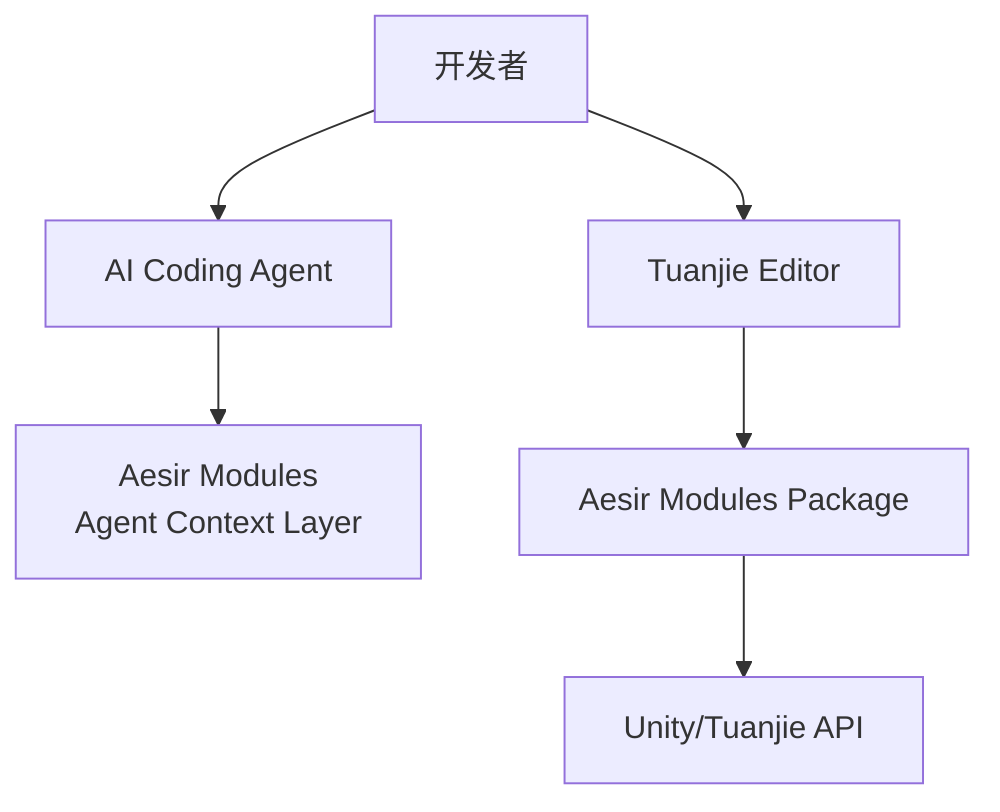
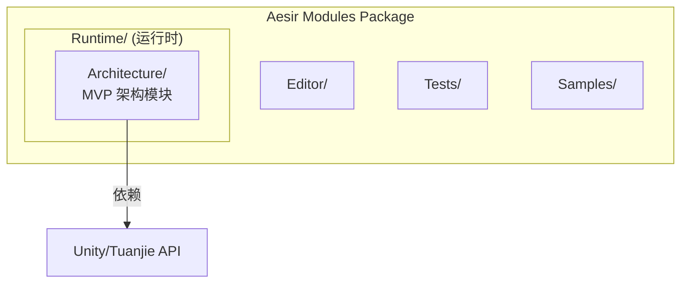
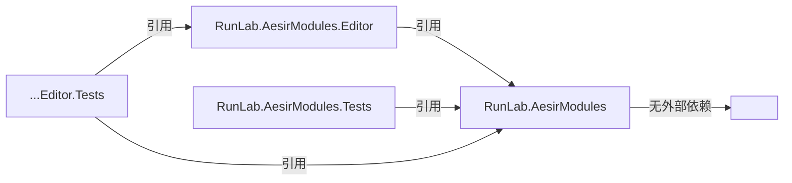
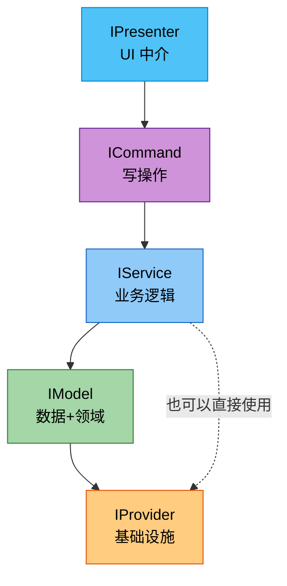
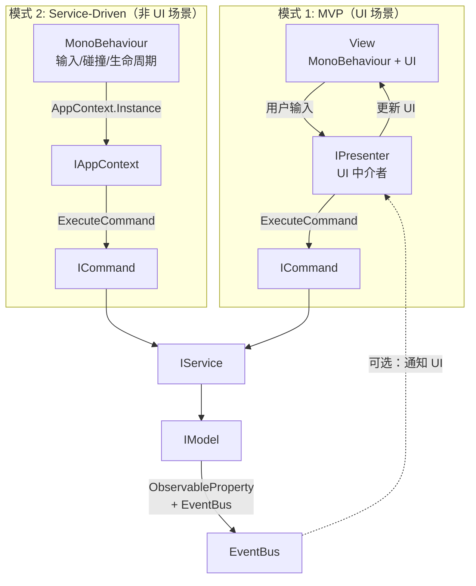
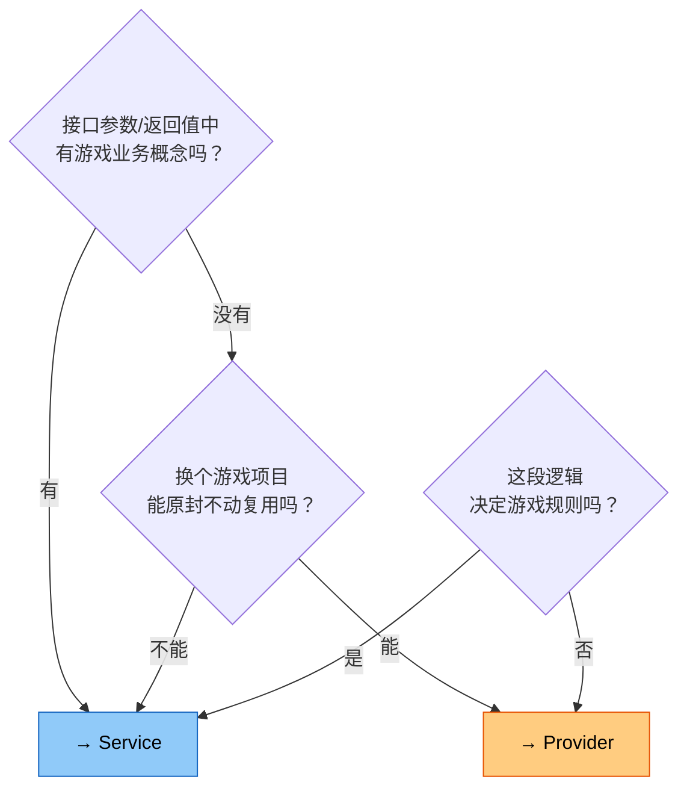
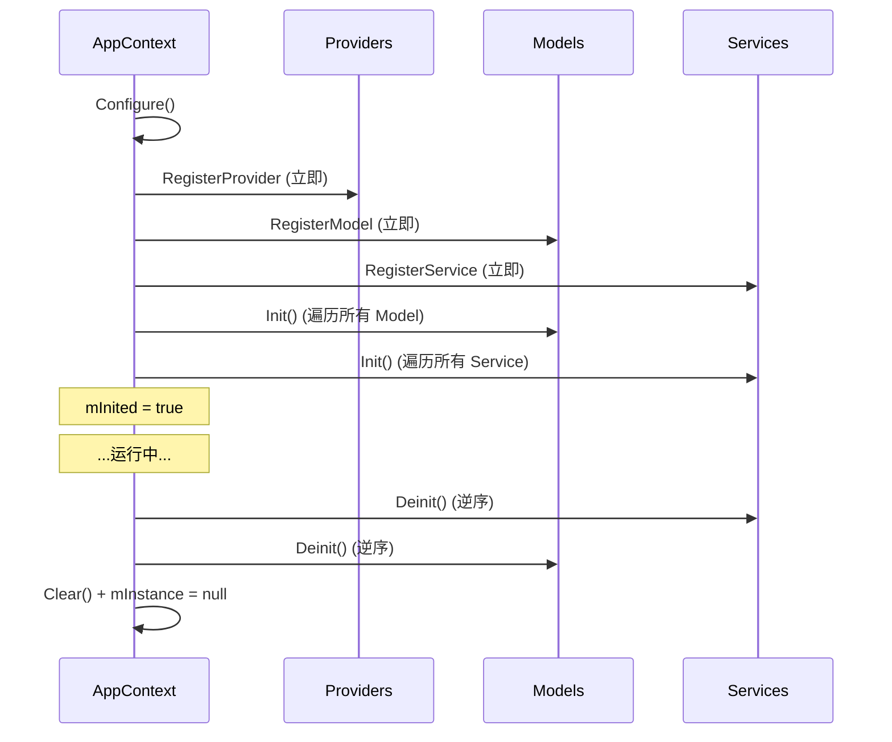

# 🚀 Enhanced Chat Export - Current Session (Enhanced)

*Exported on 2026-05-14T23:44:57.621+08:00*

**📊 Session Information**
- **Session ID**: `6011a827-1d99-47e8-850f-ae375403b908`
- **Project**: `42fb249d516aad5777b5d5a39887ab50ea82e8ff48362efe3f5f4b70d8e9f26b`
- **Started**: 5/14/2026, 11:07:38 PM
- **Last Updated**: 5/14/2026, 11:43:33 PM
- **Duration**: 35m 55s
- **Total Messages**: 83
- **Total Tool Calls**: 194
- **Total Tokens**: 5,621,742

**🤖 Model Usage**
- `codely-core`: 79 responses • 194 tool calls • 5621742 total (5584174 input, 37568 output, 4700736 cached)

---

## 👤 User
*5/14/2026, 11:07:38 PM*

git@github.com:yuumixcode/aesir-modules.git 这是 Aesir Modules 的远程仓库，使用 ssh 链接远程仓库，拉取远程仓库一次，因为远程仓库包含 .gitignore。然后提交最新的修改，并推送初始化。

---

## 🤖 Assistant
*5/14/2026, 11:07:49 PM* • **Model**: codely-core • **Tokens**: 15652 total (15504 input, 148 output, 14208 cached)

### 🔧 Tool Calls

**✅ Shell** (`run_shell_command`)
- **Status**: success
- **Call ID**: `call_df2cd788977b4eb098686610`
- **Timestamp**: 5/14/2026, 11:09:00 PM
- **Arguments**:
  - `command`: cd "/Users/yuumix/Projects/Tuanjie/yuumix-custom-package/Assets/RunLab/Aesir Modules" && git status && echo "---" && git remote -v && echo "---" && git log --oneline -3 2>/dev/null || echo "No commits yet"
  - `description`: Check git status, remotes, and recent commits
- **Result**: Command: cd "/Users/yuumix/Projects/Tuanjie/yuumix-custom-package/Assets/RunLab/Aesir Modules" && git status && echo "---" && git remote -v && echo "---" && git log --oneline -3 2>/dev/null || echo "No commits yet"
  Directory: (root)
  Output:
  On branch main
  nothing to commit, working tree clean
  ---
  origin	git@github.com:yuumixcode/aesir-modules.git (fetch)
  origin	git@github.com:yuumixcode/aesir-modules.git (push)
  ---
  9b5d93e Initial commit: Aesir Modules v0.1.0
  Error: (none)
  Exit Code: 0
  Signal: (none)

### 🧠 Assistant Thoughts

The user wants me to:
1. Add the remote repository using SSH
2. Fetch from the remote to get the .gitignore
3. Commit the latest changes
4. Push to initialize the remote repository

Let me first check the current git status and then proceed step by step.

---

## 🤖 Assistant
*5/14/2026, 11:09:08 PM* • **Model**: codely-core • **Tokens**: 15888 total (15811 input, 77 output, 15616 cached)

远程仓库已经配置好了。让我拉取远程仓库获取 `.gitignore`，然后合并并推送。

### 🔧 Tool Calls

**✅ Shell** (`run_shell_command`)
- **Status**: success
- **Call ID**: `call_23d1f416c4a442e680d89133`
- **Timestamp**: 5/14/2026, 11:09:12 PM
- **Arguments**:
  - `command`: cd "/Users/yuumix/Projects/Tuanjie/yuumix-custom-package/Assets/RunLab/Aesir Modules" && git fetch origin
  - `description`: Fetch from remote to get .gitignore
- **Result**: Command: cd "/Users/yuumix/Projects/Tuanjie/yuumix-custom-package/Assets/RunLab/Aesir Modules" && git fetch origin
  Directory: (root)
  Output:
  From github.com:yuumixcode/aesir-modules
   * [new branch]      main       -> origin/main
  Error: (none)
  Exit Code: 0
  Signal: (none)

---

## 🤖 Assistant
*5/14/2026, 11:09:17 PM* • **Model**: codely-core • **Tokens**: 16026 total (15972 input, 54 output, 15872 cached)

### 🔧 Tool Calls

**✅ Shell** (`run_shell_command`)
- **Status**: success
- **Call ID**: `call_02b426d558d34db5abae6945`
- **Timestamp**: 5/14/2026, 11:09:17 PM
- **Arguments**:
  - `command`: cd "/Users/yuumix/Projects/Tuanjie/yuumix-custom-package/Assets/RunLab/Aesir Modules" && git log --oneline origin/main
  - `description`: Check remote commits
- **Result**: Command: cd "/Users/yuumix/Projects/Tuanjie/yuumix-custom-package/Assets/RunLab/Aesir Modules" && git log --oneline origin/main
  Directory: (root)
  Output:
  7da681b Initial commit
  Error: (none)
  Exit Code: 0
  Signal: (none)

---

## 🤖 Assistant
*5/14/2026, 11:09:19 PM* • **Model**: codely-core • **Tokens**: 16156 total (16098 input, 58 output, 14208 cached)

### 🔧 Tool Calls

**✅ Shell** (`run_shell_command`)
- **Status**: success
- **Call ID**: `call_5ad2fb29bb9a4919a086ec00`
- **Timestamp**: 5/14/2026, 11:09:19 PM
- **Arguments**:
  - `command`: cd "/Users/yuumix/Projects/Tuanjie/yuumix-custom-package/Assets/RunLab/Aesir Modules" && git diff --name-only origin/main..HEAD
  - `description`: Compare local and remote commits
- **Result**: Command: cd "/Users/yuumix/Projects/Tuanjie/yuumix-custom-package/Assets/RunLab/Aesir Modules" && git diff --name-only origin/main..HEAD
  Directory: (root)
  Output:
  .gitignore
  CHANGELOG.md
  CHANGELOG.md.meta
  Documentation~/Aesir Modules.md
  Editor.meta
  Editor/RunLab.AesirModules.Editor.asmdef
  Editor/RunLab.AesirModules.Editor.asmdef.meta
  Help Links.md
  Help Links.md.meta
  LICENSE.md
  LICENSE.md.meta
  README.md
  README.md.meta
  Runtime.meta
  Runtime/RunLab.AesirModules.asmdef
  Runtime/RunLab.AesirModules.asmdef.meta
  Samples.meta
  Samples/HelloWorld.meta
  Tests.meta
  Tests/Editor.meta
  Tests/Editor/RunLab.AesirModules.Editor.Tests.asmdef
  Tests/Editor/RunLab.AesirModules.Editor.Tests.asmdef.meta
  Tests/Runtime.meta
  Tests/Runtime/RunLab.AesirModules.Tests.asmdef
  Tests/Runtime/RunLab.AesirModules.Tests.asmdef.meta
  Third Party Notices.md
  Third Party Notices.md.meta
  package.json
  package.json.meta
  Error: (none)
  Exit Code: 0
  Signal: (none)

---

## 🤖 Assistant
*5/14/2026, 11:09:21 PM* • **Model**: codely-core • **Tokens**: 16473 total (16416 input, 57 output, 16000 cached)

### 🔧 Tool Calls

**✅ Shell** (`run_shell_command`)
- **Status**: success
- **Call ID**: `call_b702bbe68da64d6da94b5f26`
- **Timestamp**: 5/14/2026, 11:09:21 PM
- **Arguments**:
  - `command`: cd "/Users/yuumix/Projects/Tuanjie/yuumix-custom-package/Assets/RunLab/Aesir Modules" && git show origin/main:.gitignore
  - `description`: Check .gitignore from remote
- **Result**: Command: cd "/Users/yuumix/Projects/Tuanjie/yuumix-custom-package/Assets/RunLab/Aesir Modules" && git show origin/main:.gitignore
  Directory: (root)
  Output:
  # This .gitignore file should be placed at the root of your Unity project directory
  #
  # Get latest from https://github.com/github/gitignore/blob/main/Unity.gitignore
  #
  # Recommended: add any editor/OS/tool-specific ignore rules from the Global/ templates as needed.
  # See: https://github.com/github/gitignore/tree/main/Global
  #
  .utmp/
  /[Ll]ibrary/
  /[Tt]emp/
  /[Oo]bj/
  /[Bb]uild/
  /[Bb]uilds/
  /[Ll]ogs/
  /[Uu]ser[Ss]ettings/
  *.log
  
  # By default unity supports Blender asset imports, *.blend1 blender files do not need to be commited to version control.
  *.blend1
  *.blend1.meta
  
  # MemoryCaptures can get excessive in size.
  # They also could contain extremely sensitive data
  /[Mm]emoryCaptures/
  
  # Recordings can get excessive in size
  /[Rr]ecordings/
  
  # Uncomment this line if you wish to ignore the asset store tools plugin
  # /[Aa]ssets/AssetStoreTools*
  
  # Autogenerated Jetbrains Rider plugin
  /[Aa]ssets/Plugins/Editor/JetBrains*
  # Jetbrains Rider personal-layer settings
  *.DotSettings.user
  
  # Visual Studio cache directory
  .vs/
  
  # Gradle cache directory
  .gradle/
  
  # Autogenerated VS/MD/Consulo solution and project files
  ExportedObj/
  .consulo/
  *.csproj
  *.unityproj
  *.sln
  *.slnx
  *.suo
  *.tmp
  *.user
  *.userprefs
  *.pidb
  *.booproj
  *.svd
  *.pdb
  *.mdb
  *.opendb
  *.VC.db
  
  # Unity3D generated meta files
  *.pidb.meta
  *.pdb.meta
  *.mdb.meta
  
  # Unity3D generated file on crash reports
  sysinfo.txt
  
  # Mono auto generated files
  mono_crash.*
  
  # Builds
  *.apk
  *.aab
  *.unitypackage
  *.unitypackage.meta
  *.app
  
  # Crashlytics generated file
  crashlytics-build.properties
  
  # TestRunner generated files
  InitTestScene*.unity*
  
  # Addressables default ignores, before user customizations
  /ServerData
  /[Aa]ssets/StreamingAssets/aa*
  /[Aa]ssets/AddressableAssetsData/link.xml*
  /[Aa]ssets/Addressables_Temp*
  # By default, Addressables content builds will generate addressables_content_state.bin
  # files in platform-specific subfolders, for example:
  # /Assets/AddressableAssetsData/OSX/addressables_content_state.bin
  /[Aa]ssets/AddressableAssetsData/*/*.bin*
  
  # Visual Scripting auto-generated files
  /[Aa]ssets/Unity.VisualScripting.Generated/VisualScripting.Flow/UnitOptions.db
  /[Aa]ssets/Unity.VisualScripting.Generated/VisualScripting.Flow/UnitOptions.db.meta
  /[Aa]ssets/Unity.VisualScripting.Generated/VisualScripting.Core/Property Providers
  /[Aa]ssets/Unity.VisualScripting.Generated/VisualScripting.Core/Property Providers.meta
  
  # Auto-generated scenes by play mode tests
  /[Aa]ssets/[Ii]nit[Tt]est[Ss]cene*.unity*
  
  # Auto-generated cache in Assets folder
  /[Aa]ssets/[Ss]ceneDependencyCache*
  Error: (none)
  Exit Code: 0
  Signal: (none)

---

## 🤖 Assistant
*5/14/2026, 11:09:23 PM* • **Model**: codely-core • **Tokens**: 17345 total (17253 input, 92 output, 14208 cached)

远程有 `.gitignore` 但本地没有。我需要将远程的 `.gitignore` 合并到本地，然后用 rebase 整合历史，最后强制推送。

### 🔧 Tool Calls

**✅ Shell** (`run_shell_command`)
- **Status**: success
- **Call ID**: `call_00bbcc8cba56408180729a6f`
- **Timestamp**: 5/14/2026, 11:09:23 PM
- **Arguments**:
  - `command`: cd "/Users/yuumix/Projects/Tuanjie/yuumix-custom-package/Assets/RunLab/Aesir Modules" && git rebase origin/main
  - `description`: Rebase local commits onto remote main
- **Result**: Command: cd "/Users/yuumix/Projects/Tuanjie/yuumix-custom-package/Assets/RunLab/Aesir Modules" && git rebase origin/main
  Directory: (root)
  Output:
  Rebasing (1/1)
Successfully rebased and updated refs/heads/main.
  Error: (none)
  Exit Code: 0
  Signal: (none)

---

## 🤖 Assistant
*5/14/2026, 11:09:29 PM* • **Model**: codely-core • **Tokens**: 17491 total (17426 input, 65 output, 16448 cached)

### 🔧 Tool Calls

**✅ Shell** (`run_shell_command`)
- **Status**: success
- **Call ID**: `call_20fe1726c45940699f30f3e8`
- **Timestamp**: 5/14/2026, 11:09:29 PM
- **Arguments**:
  - `command`: cd "/Users/yuumix/Projects/Tuanjie/yuumix-custom-package/Assets/RunLab/Aesir Modules" && git log --oneline -5 && echo "---" && git status
  - `description`: Verify rebase result and check status
- **Result**: Command: cd "/Users/yuumix/Projects/Tuanjie/yuumix-custom-package/Assets/RunLab/Aesir Modules" && git log --oneline -5 && echo "---" && git status
  Directory: (root)
  Output:
  9b15894 Initial commit: Aesir Modules v0.1.0
  7da681b Initial commit
  ---
  On branch main
  nothing to commit, working tree clean
  Error: (none)
  Exit Code: 0
  Signal: (none)

---

## 🤖 Assistant
*5/14/2026, 11:09:35 PM* • **Model**: codely-core • **Tokens**: 17690 total (17601 input, 89 output, 17344 cached)

Rebase 成功。本地历史已在远程 `Initial commit`（含 `.gitignore`）之上。现在推送到远程：

### 🔧 Tool Calls

**✅ Shell** (`run_shell_command`)
- **Status**: success
- **Call ID**: `call_241df438a6134030b6a9c598`
- **Timestamp**: 5/14/2026, 11:09:39 PM
- **Arguments**:
  - `command`: cd "/Users/yuumix/Projects/Tuanjie/yuumix-custom-package/Assets/RunLab/Aesir Modules" && git push --force-with-lease origin main
  - `description`: Force push to remote (rebased history)
- **Result**: Command: cd "/Users/yuumix/Projects/Tuanjie/yuumix-custom-package/Assets/RunLab/Aesir Modules" && git push --force-with-lease origin main
  Directory: (root)
  Output:
  To github.com:yuumixcode/aesir-modules.git
     7da681b..9b15894  main -> main
  Error: (none)
  Exit Code: 0
  Signal: (none)

---

## 🤖 Assistant
*5/14/2026, 11:09:45 PM* • **Model**: codely-core • **Tokens**: 17865 total (17786 input, 79 output, 14208 cached)

完成。操作总结：

1. ✅ 从 `git@github.com:yuumixcode/aesir-modules.git` 拉取了远程仓库（含 `.gitignore`）
2. ✅ 将本地提交 rebase 到远程 `Initial commit` 之上，整合了 `.gitignore`
3. ✅ 推送到远程，仓库已初始化完毕

---

## 👤 User
*5/14/2026, 11:14:07 PM*

搜索 yuumix-custom-package 中的 AesirFramework 相关内容。给 Aesir Modules 添加架构模块，按照自定义包标准进行文件分类，架构模块名称是 Architecture。使用 AppContext 作为做架构核心类的命名。然后补充 AI 相关文档，让 Modules 是原生支持 AI 的。

---

## 🤖 Assistant
*5/14/2026, 11:14:15 PM* • **Model**: codely-core • **Tokens**: 18259 total (17862 input, 397 output, 15488 cached)

### 🔧 Tool Calls

**✅ ReadFolder** (`list_directory`)
- **Status**: success
- **Call ID**: `call_9d2def628416432988d36234`
- **Timestamp**: 5/14/2026, 11:14:19 PM
- **Agent**: explore (`explore-komlzj`)
- **Arguments**:
  - `path`: /Users/yuumix/Projects/Tuanjie/yuumix-custom-package/Assets/RunLab/Aesir Modules
- **Result**: Directory listing for /Users/yuumix/Projects/Tuanjie/yuumix-custom-package/Assets/RunLab/Aesir Modules:
  [DIR] Documentation~
  [DIR] Editor
  [DIR] Runtime
  [DIR] Samples
  [DIR] Tests
  .gitignore
  CHANGELOG.md
  CHANGELOG.md.meta
  Editor.meta
  Help Links.md
  Help Links.md.meta
  LICENSE
  LICENSE.md
  LICENSE.md.meta
  package.json
  package.json.meta
  README.md
  README.md.meta
  Runtime.meta
  Samples.meta
  Tests.meta
  Third Party Notices.md
  Third Party Notices.md.meta
  
  (1 git-ignored)

**✅ FindFiles** (`glob`)
- **Status**: success
- **Call ID**: `call_f242aff8b8c84917bd5c86e7`
- **Timestamp**: 5/14/2026, 11:14:19 PM
- **Agent**: explore (`explore-komlzj`)
- **Arguments**:
  - `pattern`: **/*.asmdef
  - `path`: /Users/yuumix/Projects/Tuanjie/yuumix-custom-package/Assets/RunLab/Aesir Modules
- **Result**: Found 4 file(s) matching "**/*.asmdef" within /Users/yuumix/Projects/Tuanjie/yuumix-custom-package/Assets/RunLab/Aesir Modules, sorted by modification time (newest first):
  /Users/yuumix/Projects/Tuanjie/yuumix-custom-package/Assets/RunLab/Aesir Modules/Tests/Runtime/RunLab.AesirModules.Tests.asmdef
  /Users/yuumix/Projects/Tuanjie/yuumix-custom-package/Assets/RunLab/Aesir Modules/Tests/Editor/RunLab.AesirModules.Editor.Tests.asmdef
  /Users/yuumix/Projects/Tuanjie/yuumix-custom-package/Assets/RunLab/Aesir Modules/Runtime/RunLab.AesirModules.asmdef
  /Users/yuumix/Projects/Tuanjie/yuumix-custom-package/Assets/RunLab/Aesir Modules/Editor/RunLab.AesirModules.Editor.asmdef

**✅ FindFiles** (`glob`)
- **Status**: success
- **Call ID**: `call_b88db9ad8a1841109f4ccc9e`
- **Timestamp**: 5/14/2026, 11:14:19 PM
- **Agent**: explore (`explore-komlzj`)
- **Duration**: 1ms
- **Arguments**:
  - `pattern`: **/*.cs
  - `path`: /Users/yuumix/Projects/Tuanjie/yuumix-custom-package/Assets/RunLab/Aesir Modules
- **Result**: No files found matching pattern "**/*.cs" within /Users/yuumix/Projects/Tuanjie/yuumix-custom-package/Assets/RunLab/Aesir Modules

**✅ FindFiles** (`glob`)
- **Status**: success
- **Call ID**: `call_9a92b41b5a3a4853bdfdd074`
- **Timestamp**: 5/14/2026, 11:14:19 PM
- **Agent**: explore (`explore-komlzj`)
- **Arguments**:
  - `pattern`: **/*.md
  - `path`: /Users/yuumix/Projects/Tuanjie/yuumix-custom-package/Assets/RunLab/Aesir Modules
- **Result**: Found 6 file(s) matching "**/*.md" within /Users/yuumix/Projects/Tuanjie/yuumix-custom-package/Assets/RunLab/Aesir Modules, sorted by modification time (newest first):
  /Users/yuumix/Projects/Tuanjie/yuumix-custom-package/Assets/RunLab/Aesir Modules/Third Party Notices.md
  /Users/yuumix/Projects/Tuanjie/yuumix-custom-package/Assets/RunLab/Aesir Modules/Help Links.md
  /Users/yuumix/Projects/Tuanjie/yuumix-custom-package/Assets/RunLab/Aesir Modules/README.md
  /Users/yuumix/Projects/Tuanjie/yuumix-custom-package/Assets/RunLab/Aesir Modules/LICENSE.md
  /Users/yuumix/Projects/Tuanjie/yuumix-custom-package/Assets/RunLab/Aesir Modules/CHANGELOG.md
  /Users/yuumix/Projects/Tuanjie/yuumix-custom-package/Assets/RunLab/Aesir Modules/Documentation~/Aesir Modules.md

**✅ FindFiles** (`glob`)
- **Status**: success
- **Call ID**: `call_a435c2d7c00d4bd19d17de69`
- **Timestamp**: 5/14/2026, 11:14:19 PM
- **Agent**: explore (`explore-komlzj`)
- **Duration**: 5.1s
- **Arguments**:
  - `pattern`: **/*.json
  - `path`: /Users/yuumix/Projects/Tuanjie/yuumix-custom-package/Assets/RunLab/Aesir Modules
- **Result**: Found 1 file(s) matching "**/*.json" within /Users/yuumix/Projects/Tuanjie/yuumix-custom-package/Assets/RunLab/Aesir Modules, sorted by modification time (newest first):
  /Users/yuumix/Projects/Tuanjie/yuumix-custom-package/Assets/RunLab/Aesir Modules/package.json

**✅ ReadFolder** (`list_directory`)
- **Status**: success
- **Call ID**: `call_24f4485280784b38bb088ba1`
- **Timestamp**: 5/14/2026, 11:14:25 PM
- **Agent**: explore (`explore-komlzj`)
- **Duration**: 1ms
- **Arguments**:
  - `path`: /Users/yuumix/Projects/Tuanjie/yuumix-custom-package/Assets/RunLab/Aesir Modules/Runtime
- **Result**: Directory listing for /Users/yuumix/Projects/Tuanjie/yuumix-custom-package/Assets/RunLab/Aesir Modules/Runtime:
  RunLab.AesirModules.asmdef
  RunLab.AesirModules.asmdef.meta

**✅ ReadFolder** (`list_directory`)
- **Status**: success
- **Call ID**: `call_8176df44d3634e9eabf44a56`
- **Timestamp**: 5/14/2026, 11:14:25 PM
- **Agent**: explore (`explore-komlzj`)
- **Arguments**:
  - `path`: /Users/yuumix/Projects/Tuanjie/yuumix-custom-package/Assets/RunLab/Aesir Modules/Editor
- **Result**: Directory listing for /Users/yuumix/Projects/Tuanjie/yuumix-custom-package/Assets/RunLab/Aesir Modules/Editor:
  RunLab.AesirModules.Editor.asmdef
  RunLab.AesirModules.Editor.asmdef.meta

**✅ ReadFolder** (`list_directory`)
- **Status**: success
- **Call ID**: `call_93aad0040bea44c993110fda`
- **Timestamp**: 5/14/2026, 11:14:25 PM
- **Agent**: explore (`explore-komlzj`)
- **Duration**: 1ms
- **Arguments**:
  - `path`: /Users/yuumix/Projects/Tuanjie/yuumix-custom-package/Assets/RunLab/Aesir Modules/Tests
- **Result**: Directory listing for /Users/yuumix/Projects/Tuanjie/yuumix-custom-package/Assets/RunLab/Aesir Modules/Tests:
  [DIR] Editor
  [DIR] Runtime
  Editor.meta
  Runtime.meta

**✅ ReadFolder** (`list_directory`)
- **Status**: success
- **Call ID**: `call_f48ae74565994c2f9cbaafeb`
- **Timestamp**: 5/14/2026, 11:14:25 PM
- **Agent**: explore (`explore-komlzj`)
- **Duration**: 1ms
- **Arguments**:
  - `path`: /Users/yuumix/Projects/Tuanjie/yuumix-custom-package/Assets/RunLab/Aesir Modules/Samples
- **Result**: Directory listing for /Users/yuumix/Projects/Tuanjie/yuumix-custom-package/Assets/RunLab/Aesir Modules/Samples:
  [DIR] HelloWorld
  HelloWorld.meta

**✅ ReadFolder** (`list_directory`)
- **Status**: success
- **Call ID**: `call_c350c862e3fa474b8fddef7f`
- **Timestamp**: 5/14/2026, 11:14:25 PM
- **Agent**: explore (`explore-komlzj`)
- **Arguments**:
  - `path`: /Users/yuumix/Projects/Tuanjie/yuumix-custom-package/Assets/RunLab/Aesir Modules/Documentation~
- **Result**: Directory listing for /Users/yuumix/Projects/Tuanjie/yuumix-custom-package/Assets/RunLab/Aesir Modules/Documentation~:
  Aesir Modules.md

**✅ ReadFile** (`read_file`)
- **Status**: success
- **Call ID**: `call_a600c1f8470641849177e90c`
- **Timestamp**: 5/14/2026, 11:14:25 PM
- **Agent**: explore (`explore-komlzj`)
- **Duration**: 1ms
- **Arguments**:
  - `absolute_path`: /Users/yuumix/Projects/Tuanjie/yuumix-custom-package/Assets/RunLab/Aesir Modules/package.json
- **Result**: {
    "name": "cn.runlab.aesir-modules",
    "displayName": "Aesir Modules",
    "version": "0.1.0",
    "unity": "2022.3",
    "description": "Aesir Inspector 开发功能模块包，提供多样化的开发模块，包括核心架构模块。",
    "keywords": [],
    "category": "Unity",
    "author": {
      "name": "RunLab - Yuumix",
      "email": "",
      "url": ""
    },
    "dependencies": {},
    "repository": {
      "type": "git",
      "url": ""
    },
    "license": "MIT",
    "licensesUrl": "",
    "changelogUrl": "",
    "documentationUrl": "",
    "samples": [
      {
        "displayName": "Hello World",
        "description": "A basic example.",
        "path": "Samples~/HelloWorld"
      }
    ]
  }

**✅ ReadFile** (`read_file`)
- **Status**: success
- **Call ID**: `call_bd68bca30e724d3caf9b7a78`
- **Timestamp**: 5/14/2026, 11:14:25 PM
- **Agent**: explore (`explore-komlzj`)
- **Duration**: 3.1s
- **Arguments**:
  - `absolute_path`: /Users/yuumix/Projects/Tuanjie/yuumix-custom-package/Assets/RunLab/Aesir Modules/documentation~/Aesir Modules.md
- **Result**: # Aesir Modules
  
  Aesir Inspector 开发功能模块包，提供多样化的开发模块，包括核心架构模块。

**✅ ReadFolder** (`list_directory`)
- **Status**: success
- **Call ID**: `call_2b065ee2b81e4797828a8464`
- **Timestamp**: 5/14/2026, 11:14:28 PM
- **Agent**: explore (`explore-komlzj`)
- **Duration**: 1ms
- **Arguments**:
  - `path`: /Users/yuumix/Projects/Tuanjie/yuumix-custom-package/Assets/RunLab/Aesir Modules/Tests/Runtime
- **Result**: Directory listing for /Users/yuumix/Projects/Tuanjie/yuumix-custom-package/Assets/RunLab/Aesir Modules/Tests/Runtime:
  RunLab.AesirModules.Tests.asmdef
  RunLab.AesirModules.Tests.asmdef.meta

**✅ ReadFolder** (`list_directory`)
- **Status**: success
- **Call ID**: `call_dce6f01da6db466b9345e6ee`
- **Timestamp**: 5/14/2026, 11:14:28 PM
- **Agent**: explore (`explore-komlzj`)
- **Duration**: 1ms
- **Arguments**:
  - `path`: /Users/yuumix/Projects/Tuanjie/yuumix-custom-package/Assets/RunLab/Aesir Modules/Tests/Editor
- **Result**: Directory listing for /Users/yuumix/Projects/Tuanjie/yuumix-custom-package/Assets/RunLab/Aesir Modules/Tests/Editor:
  RunLab.AesirModules.Editor.Tests.asmdef
  RunLab.AesirModules.Editor.Tests.asmdef.meta

**✅ ReadFolder** (`list_directory`)
- **Status**: success
- **Call ID**: `call_b2046be2c3434881b4d9efff`
- **Timestamp**: 5/14/2026, 11:14:28 PM
- **Agent**: explore (`explore-komlzj`)
- **Duration**: 2ms
- **Arguments**:
  - `path`: /Users/yuumix/Projects/Tuanjie/yuumix-custom-package/Assets/RunLab/Aesir Modules/Samples/HelloWorld
- **Result**: Directory /Users/yuumix/Projects/Tuanjie/yuumix-custom-package/Assets/RunLab/Aesir Modules/Samples/HelloWorld is empty.

**✅ ReadFile** (`read_file`)
- **Status**: success
- **Call ID**: `call_654c0161283444dfa069e641`
- **Timestamp**: 5/14/2026, 11:14:28 PM
- **Agent**: explore (`explore-komlzj`)
- **Arguments**:
  - `absolute_path`: /Users/yuumix/Projects/Tuanjie/yuumix-custom-package/Assets/RunLab/Aesir Modules/Runtime/RunLab.AesirModules.asmdef
- **Result**: {
    "name": "RunLab.AesirModules",
    "rootNamespace": "RunLab.AesirModules",
    "references": [],
    "includePlatforms": [],
    "excludePlatforms": [],
    "allowUnsafeCode": false,
    "overrideReferences": false,
    "precompiledReferences": [],
    "autoReferenced": true,
    "defineConstraints": [],
    "versionDefines": [],
    "noEngineReferences": false
  }

**✅ ReadFile** (`read_file`)
- **Status**: success
- **Call ID**: `call_85a3ae0218bb4475b4ee61b7`
- **Timestamp**: 5/14/2026, 11:14:28 PM
- **Agent**: explore (`explore-komlzj`)
- **Duration**: 1ms
- **Arguments**:
  - `absolute_path`: /Users/yuumix/Projects/Tuanjie/yuumix-custom-package/Assets/RunLab/Aesir Modules/Editor/RunLab.AesirModules.Editor.asmdef
- **Result**: {
    "name": "RunLab.AesirModules.Editor",
    "rootNamespace": "RunLab.AesirModules.Editor",
    "references": ["RunLab.AesirModules"],
    "includePlatforms": ["Editor"],
    "excludePlatforms": [],
    "allowUnsafeCode": false,
    "overrideReferences": false,
    "precompiledReferences": [],
    "autoReferenced": true,
    "defineConstraints": [],
    "versionDefines": [],
    "noEngineReferences": false
  }

**✅ ReadFile** (`read_file`)
- **Status**: success
- **Call ID**: `call_2d0e10e3118840aa902c08c8`
- **Timestamp**: 5/14/2026, 11:14:28 PM
- **Agent**: explore (`explore-komlzj`)
- **Duration**: 1ms
- **Arguments**:
  - `absolute_path`: /Users/yuumix/Projects/Tuanjie/yuumix-custom-package/Assets/RunLab/Aesir Modules/Tests/Runtime/RunLab.AesirModules.Tests.asmdef
- **Result**: {
    "name": "RunLab.AesirModules.Tests",
    "rootNamespace": "RunLab.AesirModules.Tests",
    "references": ["RunLab.AesirModules", "UnityEngine.TestRunner"],
    "includePlatforms": [],
    "excludePlatforms": [],
    "allowUnsafeCode": false,
    "overrideReferences": true,
    "precompiledReferences": ["nunit.framework.dll"],
    "autoReferenced": false,
    "defineConstraints": ["UNITY_INCLUDE_TESTS"],
    "versionDefines": [],
    "noEngineReferences": false
  }

**✅ ReadFile** (`read_file`)
- **Status**: success
- **Call ID**: `call_3fc91dd6aa8f4807af22d92a`
- **Timestamp**: 5/14/2026, 11:14:28 PM
- **Agent**: explore (`explore-komlzj`)
- **Duration**: 1ms
- **Arguments**:
  - `absolute_path`: /Users/yuumix/Projects/Tuanjie/yuumix-custom-package/Assets/RunLab/Aesir Modules/Tests/Editor/RunLab.AesirModules.Editor.Tests.asmdef
- **Result**: {
    "name": "RunLab.AesirModules.Editor.Tests",
    "rootNamespace": "RunLab.AesirModules.Editor.Tests",
    "references": ["RunLab.AesirModules.Editor", "RunLab.AesirModules", "UnityEngine.TestRunner", "UnityEditor.TestRunner"],
    "includePlatforms": ["Editor"],
    "excludePlatforms": [],
    "allowUnsafeCode": false,
    "overrideReferences": true,
    "precompiledReferences": ["nunit.framework.dll"],
    "autoReferenced": false,
    "defineConstraints": ["UNITY_INCLUDE_TESTS"],
    "versionDefines": [],
    "noEngineReferences": false
  }

**✅ ReadFile** (`read_file`)
- **Status**: success
- **Call ID**: `call_556b7391f52b4da19c054ce0`
- **Timestamp**: 5/14/2026, 11:14:28 PM
- **Agent**: explore (`explore-komlzj`)
- **Duration**: 1ms
- **Arguments**:
  - `absolute_path`: /Users/yuumix/Projects/Tuanjie/yuumix-custom-package/Assets/RunLab/Aesir Modules/README.md
- **Result**: # Aesir Modules
  
  [](LICENSE.md)
  
  Aesir Inspector 开发功能模块包，提供多样化的开发模块，包括核心架构模块。
  
  ## Installation
  
  Open the Package Manager window in Unity, click the `+` button in the top-left corner, and select `Add package from git URL...`. Enter:
  
  ```
  <git-url>
  ```
  
  ## Usage
  
  Brief usage instructions or code examples.
  
  ## License
  
  This project is licensed under the MIT License — see the [LICENSE.md](LICENSE.md) file for details.

**✅ ReadFile** (`read_file`)
- **Status**: success
- **Call ID**: `call_38ab7eff118e4afe82334b5e`
- **Timestamp**: 5/14/2026, 11:14:28 PM
- **Agent**: explore (`explore-komlzj`)
- **Duration**: 7.6s
- **Arguments**:
  - `absolute_path`: /Users/yuumix/Projects/Tuanjie/yuumix-custom-package/Assets/RunLab/Aesir Modules/CHANGELOG.md
- **Result**: # Changelog
  
  All notable changes to this project will be documented in this file.
  
  The format is based on [Keep a Changelog](https://keepachangelog.com/en/1.1.0/),
  and this project adheres to [Semantic Versioning](https://semver.org/spec/v2.0.0.html).
  
  ## [0.1.0] - 2026-05-14
  
  ### Added
  
  - Initial release.

**✅ ReadFile** (`read_file`)
- **Status**: success
- **Call ID**: `call_b2b4381dd33446949bf7d37b`
- **Timestamp**: 5/14/2026, 11:14:35 PM
- **Agent**: explore (`explore-komlzj`)
- **Duration**: 1ms
- **Arguments**:
  - `absolute_path`: /Users/yuumix/Projects/Tuanjie/yuumix-custom-package/Assets/RunLab/Aesir Modules/Help Links.md
- **Result**: # Help Links
  
  ## Unity 国际版 (Unity International)
  
  ### 自定义包创建与开发
  - [Package development workflow](https://docs.unity3d.com/6000.0/Documentation/Manual/CustomPackages.html) — 包开发工作流总览
  - [Name your package](https://docs.unity3d.com/6000.0/Documentation/Manual/cus-naming.html) — 包命名规范
  - [Package layout](https://docs.unity3d.com/6000.0/Documentation/Manual/cus-layout.html) — 包目录布局约定
  - [Package manifest](https://docs.unity3d.com/6000.0/Documentation/Manual/upm-manifestPkg.html) — package.json 字段参考
  - [Versioning (SemVer)](https://docs.unity3d.com/6000.0/Documentation/Manual/upm-semver.html) — 语义化版本控制
  - [Assembly definitions and packages](https://docs.unity3d.com/6000.0/Documentation/Manual/cus-asmdef.html) — 程序集定义与包
  - [Adding tests to packages](https://docs.unity3d.com/6000.0/Documentation/Manual/cus-tests.html) — 为包添加测试
  - [Creating samples](https://docs.unity3d.com/6000.0/Documentation/Manual/cus-samples.html) — 创建示例
  - [Meeting legal requirements](https://docs.unity3d.com/6000.0/Documentation/Manual/cus-legal.html) — 许可与第三方声明
  - [Documenting your package](https://docs.unity3d.com/6000.0/Documentation/Manual/cus-document.html) — 为包编写文档
  - [Sharing your package](https://docs.unity3d.com/6000.0/Documentation/Manual/cus-share.html) — 分享/发布包
  
  ### 依赖与包管理
  - [Embedded dependencies](https://docs.unity3d.com/6000.0/Documentation/Manual/upm-embed.html) — 嵌入式依赖项
  - [Git dependencies](https://docs.unity3d.com/6000.0/Documentation/Manual/upm-git.html) — Git 依赖
  - [Local folder or tarball](https://docs.unity3d.com/6000.0/Documentation/Manual/upm-localpath.html) — 本地路径依赖
  - [Dependencies and resolution](https://docs.unity3d.com/6000.0/Documentation/Manual/upm-dependencies.html) — 依赖解析
  - [Scoped registries](https://docs.unity3d.com/6000.0/Documentation/Manual/upm-scoped.html) — 作用域注册表
  
  ### 发布到 Asset Store
  - [Publishing Asset Store packages](https://docs.unity3d.com/6000.5/Documentation/Manual/asset-store-publishing.html) — 资源包发布总览
  - [Publish a UPM package](https://docs.unity3d.com/6000.3/Documentation/Manual/asset-store-upm.html) — UPM 包发布流程
  - [Introduction to publishing](https://docs.unity.cn/6000.3/Documentation/Manual/asset-store-publishing-introduction.html) — 发布入门指南
  - [Asset Store Tools (GitHub)](https://github.com/Unity-Technologies/com.unity.asset-store-tools) — 资源商店验证上传工具
  
  ---
  
  ## 团结引擎 (Tuanjie Engine)
  
  ### 自定义包创建与开发
  - [创建自定义包](https://docs.unity.cn/cn/tuanjiemanual/Manual/CustomPackages.html) — 包开发工作流总览
  - [为包命名](https://docs.unity.cn/cn/tuanjiemanual/Manual/cus-naming.html) — 包命名规范
  - [包布局](https://docs.unity.cn/cn/tuanjiemanual/Manual/cus-layout.html) — 包目录布局约定
  - [包清单](https://docs.unity.cn/cn/tuanjiemanual/Manual/upm-manifestPkg.html) — package.json 字段参考
  - [版本控制](https://docs.unity.cn/cn/tuanjiemanual/Manual/upm-semver.html) — 语义化版本控制
  - [程序集定义和包](https://docs.unity.cn/cn/tuanjiemanual/Manual/cus-asmdef.html) — 程序集定义与包
  - [向包添加测试](https://docs.unity.cn/cn/tuanjiemanual/Manual/cus-tests.html) — 为包添加测试
  - [为资源包创建示例](https://docs.unity.cn/cn/tuanjiemanual/Manual/cus-samples.html) — 创建示例
  - [符合法律要求](https://docs.unity.cn/cn/tuanjiemanual/Manual/cus-legal.html) — 许可与第三方声明
  - [为您的软件包撰写文档](https://docs.unity.cn/cn/tuanjiemanual/Manual/cus-document.html) — 为包编写文档
  - [共享包](https://docs.unity.cn/cn/tuanjiemanual/Manual/cus-share.html) — 分享/发布包
  
  ### 依赖与包管理
  - [嵌入式依赖项](https://docs.unity.cn/cn/tuanjiemanual/Manual/upm-embed.html) — 嵌入式依赖项
  - [Git 依赖关系](https://docs.unity.cn/cn/tuanjiemanual/Manual/upm-git.html) — Git 依赖
  - [本地文件夹或 tarball 路径](https://docs.unity.cn/cn/tuanjiemanual/Manual/upm-localpath.html) — 本地路径依赖
  - [依赖和解析](https://docs.unity.cn/cn/tuanjiemanual/Manual/upm-dependencies.html) — 依赖解析
  - [作用域注册表](https://docs.unity.cn/cn/tuanjiemanual/Manual/upm-scoped.html) — 作用域注册表
  
  ### 资源商店
  - [Unity 中国资源商店](https://docs.unity.cn/cn/tuanjiemanual/Manual/AssetStore.html) — 资源商店概览
  - [商店资源包](https://docs.unity.cn/cn/tuanjiemanual/Manual/AssetStorePackages.html) — 商店资源包管理

**✅ ReadFile** (`read_file`)
- **Status**: success
- **Call ID**: `call_22afbf79d9f544ffb46549a4`
- **Timestamp**: 5/14/2026, 11:14:35 PM
- **Agent**: explore (`explore-komlzj`)
- **Duration**: 1ms
- **Arguments**:
  - `absolute_path`: /Users/yuumix/Projects/Tuanjie/yuumix-custom-package/Assets/RunLab/Aesir Modules/Third Party Notices.md
- **Result**: This package contains third-party software components governed by the license(s) indicated below:
  
  Component Name: Semver
  
  License Type: "MIT"
  
  [SemVer License](https://github.com/myusername/semver/blob/master/License.txt)

**✅ ReadFile** (`read_file`)
- **Status**: success
- **Call ID**: `call_89045ae643f1458894ae240b`
- **Timestamp**: 5/14/2026, 11:14:35 PM
- **Agent**: explore (`explore-komlzj`)
- **Duration**: 1ms
- **Arguments**:
  - `absolute_path`: /Users/yuumix/Projects/Tuanjie/yuumix-custom-package/Assets/RunLab/Aesir Modules/LICENSE.md
- **Result**: The MIT License
  
  Copyright (c) 2026 RunLab - Yuumix
  
  Permission is hereby granted, free of charge, to any person obtaining a copy
  of this software and associated documentation files (the "Software"), to deal
  in the Software without restriction, including without limitation the rights
  to use, copy, modify, merge, publish, distribute, sublicense, and/or sell
  copies of the Software, and to permit persons to whom the Software is
  furnished to do so, subject to the following conditions:
  
  The above copyright notice and this permission notice shall be included in all
  copies or substantial portions of the Software.
  
  THE SOFTWARE IS PROVIDED "AS IS", WITHOUT WARRANTY OF ANY KIND, EXPRESS OR
  IMPLIED, INCLUDING BUT NOT LIMITED TO THE WARRANTIES OF MERCHANTABILITY,
  FITNESS FOR A PARTICULAR PURPOSE AND NONINFRINGEMENT. IN NO EVENT SHALL THE
  AUTHORS OR COPYRIGHT HOLDERS BE LIABLE FOR ANY CLAIM, DAMAGES OR OTHER
  LIABILITY, WHETHER IN AN ACTION OF CONTRACT, TORT OR OTHERWISE, ARISING FROM,
  OUT OF OR IN CONNECTION WITH THE SOFTWARE OR THE USE OR OTHER DEALINGS IN THE
  SOFTWARE.

**✅ ReadFile** (`read_file`)
- **Status**: success
- **Call ID**: `call_e3f0c6c7f50f4d3a94fae147`
- **Timestamp**: 5/14/2026, 11:14:35 PM
- **Agent**: explore (`explore-komlzj`)
- **Duration**: 3ms
- **Arguments**:
  - `absolute_path`: /Users/yuumix/Projects/Tuanjie/yuumix-custom-package/Assets/RunLab/Aesir Modules/.gitignore
- **Result**: # This .gitignore file should be placed at the root of your Unity project directory
  #
  # Get latest from https://github.com/github/gitignore/blob/main/Unity.gitignore
  #
  # Recommended: add any editor/OS/tool-specific ignore rules from the Global/ templates as needed.
  # See: https://github.com/github/gitignore/tree/main/Global
  #
  .utmp/
  /[Ll]ibrary/
  /[Tt]emp/
  /[Oo]bj/
  /[Bb]uild/
  /[Bb]uilds/
  /[Ll]ogs/
  /[Uu]ser[Ss]ettings/
  *.log
  
  # By default unity supports Blender asset imports, *.blend1 blender files do not need to be commited to version control.
  *.blend1
  *.blend1.meta
  
  # MemoryCaptures can get excessive in size.
  # They also could contain extremely sensitive data
  /[Mm]emoryCaptures/
  
  # Recordings can get excessive in size
  /[Rr]ecordings/
  
  # Uncomment this line if you wish to ignore the asset store tools plugin
  # /[Aa]ssets/AssetStoreTools*
  
  # Autogenerated Jetbrains Rider plugin
  /[Aa]ssets/Plugins/Editor/JetBrains*
  # Jetbrains Rider personal-layer settings
  *.DotSettings.user
  
  # Visual Studio cache directory
  .vs/
  
  # Gradle cache directory
  .gradle/
  
  # Autogenerated VS/MD/Consulo solution and project files
  ExportedObj/
  .consulo/
  *.csproj
  *.unityproj
  *.sln
  *.slnx
  *.suo
  *.tmp
  *.user
  *.userprefs
  *.pidb
  *.booproj
  *.svd
  *.pdb
  *.mdb
  *.opendb
  *.VC.db
  
  # Unity3D generated meta files
  *.pidb.meta
  *.pdb.meta
  *.mdb.meta
  
  # Unity3D generated file on crash reports
  sysinfo.txt
  
  # Mono auto generated files
  mono_crash.*
  
  # Builds
  *.apk
  *.aab
  *.unitypackage
  *.unitypackage.meta
  *.app
  
  # Crashlytics generated file
  crashlytics-build.properties
  
  # TestRunner generated files
  InitTestScene*.unity*
  
  # Addressables default ignores, before user customizations
  /ServerData
  /[Aa]ssets/StreamingAssets/aa*
  /[Aa]ssets/AddressableAssetsData/link.xml*
  /[Aa]ssets/Addressables_Temp*
  # By default, Addressables content builds will generate addressables_content_state.bin
  # files in platform-specific subfolders, for example:
  # /Assets/AddressableAssetsData/OSX/addressables_content_state.bin
  /[Aa]ssets/AddressableAssetsData/*/*.bin*
  
  # Visual Scripting auto-generated files
  /[Aa]ssets/Unity.VisualScripting.Generated/VisualScripting.Flow/UnitOptions.db
  /[Aa]ssets/Unity.VisualScripting.Generated/VisualScripting.Flow/UnitOptions.db.meta
  /[Aa]ssets/Unity.VisualScripting.Generated/VisualScripting.Core/Property Providers
  /[Aa]ssets/Unity.VisualScripting.Generated/VisualScripting.Core/Property Providers.meta
  
  # Auto-generated scenes by play mode tests
  /[Aa]ssets/[Ii]nit[Tt]est[Ss]cene*.unity*
  
  # Auto-generated cache in Assets folder
  /[Aa]ssets/[Ss]ceneDependencyCache*

**✅ FindFiles** (`glob`)
- **Status**: success
- **Call ID**: `call_bc60535f63694873b221d852`
- **Timestamp**: 5/14/2026, 11:14:35 PM
- **Agent**: explore (`explore-komlzj`)
- **Duration**: 2.5s
- **Arguments**:
  - `path`: /Users/yuumix/Projects/Tuanjie/yuumix-custom-package/Assets/RunLab/Aesir Modules
  - `pattern`: **/*
- **Result**: Found 31 file(s) matching "**/*" within /Users/yuumix/Projects/Tuanjie/yuumix-custom-package/Assets/RunLab/Aesir Modules, sorted by modification time (newest first):
  /Users/yuumix/Projects/Tuanjie/yuumix-custom-package/Assets/RunLab/Aesir Modules/LICENSE.meta
  /Users/yuumix/Projects/Tuanjie/yuumix-custom-package/Assets/RunLab/Aesir Modules/Third Party Notices.md
  /Users/yuumix/Projects/Tuanjie/yuumix-custom-package/Assets/RunLab/Aesir Modules/package.json
  /Users/yuumix/Projects/Tuanjie/yuumix-custom-package/Assets/RunLab/Aesir Modules/package.json.meta
  /Users/yuumix/Projects/Tuanjie/yuumix-custom-package/Assets/RunLab/Aesir Modules/Third Party Notices.md.meta
  /Users/yuumix/Projects/Tuanjie/yuumix-custom-package/Assets/RunLab/Aesir Modules/Tests/Runtime/RunLab.AesirModules.Tests.asmdef.meta
  /Users/yuumix/Projects/Tuanjie/yuumix-custom-package/Assets/RunLab/Aesir Modules/Tests/Runtime/RunLab.AesirModules.Tests.asmdef
  /Users/yuumix/Projects/Tuanjie/yuumix-custom-package/Assets/RunLab/Aesir Modules/Tests.meta
  /Users/yuumix/Projects/Tuanjie/yuumix-custom-package/Assets/RunLab/Aesir Modules/Samples.meta
  /Users/yuumix/Projects/Tuanjie/yuumix-custom-package/Assets/RunLab/Aesir Modules/Runtime/RunLab.AesirModules.asmdef.meta
  /Users/yuumix/Projects/Tuanjie/yuumix-custom-package/Assets/RunLab/Aesir Modules/Tests/Runtime.meta
  /Users/yuumix/Projects/Tuanjie/yuumix-custom-package/Assets/RunLab/Aesir Modules/Tests/Editor.meta
  /Users/yuumix/Projects/Tuanjie/yuumix-custom-package/Assets/RunLab/Aesir Modules/Samples/HelloWorld.meta
  /Users/yuumix/Projects/Tuanjie/yuumix-custom-package/Assets/RunLab/Aesir Modules/Tests/Editor/RunLab.AesirModules.Editor.Tests.asmdef
  /Users/yuumix/Projects/Tuanjie/yuumix-custom-package/Assets/RunLab/Aesir Modules/Tests/Editor/RunLab.AesirModules.Editor.Tests.asmdef.meta
  /Users/yuumix/Projects/Tuanjie/yuumix-custom-package/Assets/RunLab/Aesir Modules/Help Links.md
  /Users/yuumix/Projects/Tuanjie/yuumix-custom-package/Assets/RunLab/Aesir Modules/Runtime.meta
  /Users/yuumix/Projects/Tuanjie/yuumix-custom-package/Assets/RunLab/Aesir Modules/README.md.meta
  /Users/yuumix/Projects/Tuanjie/yuumix-custom-package/Assets/RunLab/Aesir Modules/Help Links.md.meta
  /Users/yuumix/Projects/Tuanjie/yuumix-custom-package/Assets/RunLab/Aesir Modules/LICENSE.md.meta
  /Users/yuumix/Projects/Tuanjie/yuumix-custom-package/Assets/RunLab/Aesir Modules/README.md
  /Users/yuumix/Projects/Tuanjie/yuumix-custom-package/Assets/RunLab/Aesir Modules/LICENSE.md
  /Users/yuumix/Projects/Tuanjie/yuumix-custom-package/Assets/RunLab/Aesir Modules/Runtime/RunLab.AesirModules.asmdef
  /Users/yuumix/Projects/Tuanjie/yuumix-custom-package/Assets/RunLab/Aesir Modules/CHANGELOG.md.meta
  /Users/yuumix/Projects/Tuanjie/yuumix-custom-package/Assets/RunLab/Aesir Modules/Editor.meta
  /Users/yuumix/Projects/Tuanjie/yuumix-custom-package/Assets/RunLab/Aesir Modules/CHANGELOG.md
  /Users/yuumix/Projects/Tuanjie/yuumix-custom-package/Assets/RunLab/Aesir Modules/Documentation~/Aesir Modules.md
  /Users/yuumix/Projects/Tuanjie/yuumix-custom-package/Assets/RunLab/Aesir Modules/Editor/RunLab.AesirModules.Editor.asmdef.meta
  /Users/yuumix/Projects/Tuanjie/yuumix-custom-package/Assets/RunLab/Aesir Modules/Editor/RunLab.AesirModules.Editor.asmdef
  /Users/yuumix/Projects/Tuanjie/yuumix-custom-package/Assets/RunLab/Aesir Modules/.gitignore
  /Users/yuumix/Projects/Tuanjie/yuumix-custom-package/Assets/RunLab/Aesir Modules/LICENSE

**✅ ReadFile** (`read_file`)
- **Status**: success
- **Call ID**: `call_3a1a34177e4f4271ad45f68e`
- **Timestamp**: 5/14/2026, 11:14:38 PM
- **Agent**: explore (`explore-komlzj`)
- **Duration**: 1ms
- **Arguments**:
  - `absolute_path`: /Users/yuumix/Projects/Tuanjie/yuumix-custom-package/Assets/RunLab/Aesir Modules/Help Links.md
- **Result**: # Help Links
  
  ## Unity 国际版 (Unity International)
  
  ### 自定义包创建与开发
  - [Package development workflow](https://docs.unity3d.com/6000.0/Documentation/Manual/CustomPackages.html) — 包开发工作流总览
  - [Name your package](https://docs.unity3d.com/6000.0/Documentation/Manual/cus-naming.html) — 包命名规范
  - [Package layout](https://docs.unity3d.com/6000.0/Documentation/Manual/cus-layout.html) — 包目录布局约定
  - [Package manifest](https://docs.unity3d.com/6000.0/Documentation/Manual/upm-manifestPkg.html) — package.json 字段参考
  - [Versioning (SemVer)](https://docs.unity3d.com/6000.0/Documentation/Manual/upm-semver.html) — 语义化版本控制
  - [Assembly definitions and packages](https://docs.unity3d.com/6000.0/Documentation/Manual/cus-asmdef.html) — 程序集定义与包
  - [Adding tests to packages](https://docs.unity3d.com/6000.0/Documentation/Manual/cus-tests.html) — 为包添加测试
  - [Creating samples](https://docs.unity3d.com/6000.0/Documentation/Manual/cus-samples.html) — 创建示例
  - [Meeting legal requirements](https://docs.unity3d.com/6000.0/Documentation/Manual/cus-legal.html) — 许可与第三方声明
  - [Documenting your package](https://docs.unity3d.com/6000.0/Documentation/Manual/cus-document.html) — 为包编写文档
  - [Sharing your package](https://docs.unity3d.com/6000.0/Documentation/Manual/cus-share.html) — 分享/发布包
  
  ### 依赖与包管理
  - [Embedded dependencies](https://docs.unity3d.com/6000.0/Documentation/Manual/upm-embed.html) — 嵌入式依赖项
  - [Git dependencies](https://docs.unity3d.com/6000.0/Documentation/Manual/upm-git.html) — Git 依赖
  - [Local folder or tarball](https://docs.unity3d.com/6000.0/Documentation/Manual/upm-localpath.html) — 本地路径依赖
  - [Dependencies and resolution](https://docs.unity3d.com/6000.0/Documentation/Manual/upm-dependencies.html) — 依赖解析
  - [Scoped registries](https://docs.unity3d.com/6000.0/Documentation/Manual/upm-scoped.html) — 作用域注册表
  
  ### 发布到 Asset Store
  - [Publishing Asset Store packages](https://docs.unity3d.com/6000.5/Documentation/Manual/asset-store-publishing.html) — 资源包发布总览
  - [Publish a UPM package](https://docs.unity3d.com/6000.3/Documentation/Manual/asset-store-upm.html) — UPM 包发布流程
  - [Introduction to publishing](https://docs.unity.cn/6000.3/Documentation/Manual/asset-store-publishing-introduction.html) — 发布入门指南
  - [Asset Store Tools (GitHub)](https://github.com/Unity-Technologies/com.unity.asset-store-tools) — 资源商店验证上传工具
  
  ---
  
  ## 团结引擎 (Tuanjie Engine)
  
  ### 自定义包创建与开发
  - [创建自定义包](https://docs.unity.cn/cn/tuanjiemanual/Manual/CustomPackages.html) — 包开发工作流总览
  - [为包命名](https://docs.unity.cn/cn/tuanjiemanual/Manual/cus-naming.html) — 包命名规范
  - [包布局](https://docs.unity.cn/cn/tuanjiemanual/Manual/cus-layout.html) — 包目录布局约定
  - [包清单](https://docs.unity.cn/cn/tuanjiemanual/Manual/upm-manifestPkg.html) — package.json 字段参考
  - [版本控制](https://docs.unity.cn/cn/tuanjiemanual/Manual/upm-semver.html) — 语义化版本控制
  - [程序集定义和包](https://docs.unity.cn/cn/tuanjiemanual/Manual/cus-asmdef.html) — 程序集定义与包
  - [向包添加测试](https://docs.unity.cn/cn/tuanjiemanual/Manual/cus-tests.html) — 为包添加测试
  - [为资源包创建示例](https://docs.unity.cn/cn/tuanjiemanual/Manual/cus-samples.html) — 创建示例
  - [符合法律要求](https://docs.unity.cn/cn/tuanjiemanual/Manual/cus-legal.html) — 许可与第三方声明
  - [为您的软件包撰写文档](https://docs.unity.cn/cn/tuanjiemanual/Manual/cus-document.html) — 为包编写文档
  - [共享包](https://docs.unity.cn/cn/tuanjiemanual/Manual/cus-share.html) — 分享/发布包
  
  ### 依赖与包管理
  - [嵌入式依赖项](https://docs.unity.cn/cn/tuanjiemanual/Manual/upm-embed.html) — 嵌入式依赖项
  - [Git 依赖关系](https://docs.unity.cn/cn/tuanjiemanual/Manual/upm-git.html) — Git 依赖
  - [本地文件夹或 tarball 路径](https://docs.unity.cn/cn/tuanjiemanual/Manual/upm-localpath.html) — 本地路径依赖
  - [依赖和解析](https://docs.unity.cn/cn/tuanjiemanual/Manual/upm-dependencies.html) — 依赖解析
  - [作用域注册表](https://docs.unity.cn/cn/tuanjiemanual/Manual/upm-scoped.html) — 作用域注册表
  
  ### 资源商店
  - [Unity 中国资源商店](https://docs.unity.cn/cn/tuanjiemanual/Manual/AssetStore.html) — 资源商店概览
  - [商店资源包](https://docs.unity.cn/cn/tuanjiemanual/Manual/AssetStorePackages.html) — 商店资源包管理

**✅ ReadFile** (`read_file`)
- **Status**: success
- **Call ID**: `call_45083c3cd50640f58a132dbb`
- **Timestamp**: 5/14/2026, 11:14:38 PM
- **Agent**: explore (`explore-komlzj`)
- **Duration**: 1ms
- **Arguments**:
  - `absolute_path`: /Users/yuumix/Projects/Tuanjie/yuumix-custom-package/Assets/RunLab/Aesir Modules/LICENSE.md
- **Result**: The MIT License
  
  Copyright (c) 2026 RunLab - Yuumix
  
  Permission is hereby granted, free of charge, to any person obtaining a copy
  of this software and associated documentation files (the "Software"), to deal
  in the Software without restriction, including without limitation the rights
  to use, copy, modify, merge, publish, distribute, sublicense, and/or sell
  copies of the Software, and to permit persons to whom the Software is
  furnished to do so, subject to the following conditions:
  
  The above copyright notice and this permission notice shall be included in all
  copies or substantial portions of the Software.
  
  THE SOFTWARE IS PROVIDED "AS IS", WITHOUT WARRANTY OF ANY KIND, EXPRESS OR
  IMPLIED, INCLUDING BUT NOT LIMITED TO THE WARRANTIES OF MERCHANTABILITY,
  FITNESS FOR A PARTICULAR PURPOSE AND NONINFRINGEMENT. IN NO EVENT SHALL THE
  AUTHORS OR COPYRIGHT HOLDERS BE LIABLE FOR ANY CLAIM, DAMAGES OR OTHER
  LIABILITY, WHETHER IN AN ACTION OF CONTRACT, TORT OR OTHERWISE, ARISING FROM,
  OUT OF OR IN CONNECTION WITH THE SOFTWARE OR THE USE OR OTHER DEALINGS IN THE
  SOFTWARE.

**✅ ReadFile** (`read_file`)
- **Status**: success
- **Call ID**: `call_1ddc32ff16654d308fdd6680`
- **Timestamp**: 5/14/2026, 11:14:38 PM
- **Agent**: explore (`explore-komlzj`)
- **Duration**: 14.3s
- **Arguments**:
  - `absolute_path`: /Users/yuumix/Projects/Tuanjie/yuumix-custom-package/Assets/RunLab/Aesir Modules/Third Party Notices.md
- **Result**: This package contains third-party software components governed by the license(s) indicated below:
  
  Component Name: Semver
  
  License Type: "MIT"
  
  [SemVer License](https://github.com/myusername/semver/blob/master/License.txt)

**✅ complete_task** (`complete_task`)
- **Status**: success
- **Call ID**: `call_14bc9740e85243e790817f0d`
- **Timestamp**: 5/14/2026, 11:14:52 PM
- **Agent**: explore (`explore-komlzj`)
- **Duration**: 1m 23s
- **Arguments**:
  - `status`: success
  - `result`: ## Complete Directory Structure Analysis

The `/Users/yuumix/Projects/Tuanjie/yuumix-custom-package/Assets/RunLab/Aesir Modules` directory has the following complete structure:

```
Aesir Modules/
├── .gitignore
├── Documentation~/
│   └── Aesir Modules.md
├── Editor/
│   └── RunLab.AesirModules.Editor.asmdef
├── Runtime/
│   └── RunLab.AesirModules.asmdef
├── Samples/
│   └── HelloWorld/ (empty directory)
├── Tests/
│   ├── Editor/
│   │   └── RunLab.AesirModules.Editor.Tests.asmdef
│   └── Runtime/
│       └── RunLab.AesirModules.Tests.asmdef
├── CHANGELOG.md
├── Help Links.md
├── LICENSE
├── LICENSE.md
├── package.json
├── README.md
└── Third Party Notices.md
```

## Package Configuration (package.json)

- **Package Name**: `cn.runlab.aesir-modules`
- **Display Name**: "Aesir Modules"
- **Version**: 0.1.0 (Initial release - May 14, 2026)
- **Unity Version**: 2022.3
- **Description**: "Aesir Inspector 开发功能模块包，提供多样化的开发模块，包括核心架构模块" (Aesir Inspector development module package, providing diverse development modules including core architecture modules)
- **Author**: RunLab - Yuumix
- **License**: MIT
- **Dependencies**: None (empty object)
- **Samples**: One sample defined ("Hello World" - A basic example)

## Assembly Definitions (.asmdef files)

All four .asmdef files follow Unity standard structure:

1. **RunLab.AesirModules.asmdef** (Runtime)
   - Name: RunLab.AesirModules
   - RootNamespace: RunLab.AesirModules
   - No references, auto-referenced

2. **RunLab.AesirModules.Editor.asmdef** (Editor)
   - Name: RunLab.AesirModules.Editor
   - RootNamespace: RunLab.AesirModules.Editor
   - References: RunLab.AesirModules
   - Platform: Editor only

3. **RunLab.AesirModules.Tests.asmdef** (Runtime tests)
   - Name: RunLab.AesirModules.Tests
   - RootNamespace: RunLab.AesirModules.Tests
   - References: RunLab.AesirModules, UnityEngine.TestRunner
   - Precompiled: nunit.framework.dll
   - Constraint: UNITY_INCLUDE_TESTS
   - autoReferenced: false

4. **RunLab.AesirModules.Editor.Tests.asmdef** (Editor tests)
   - Name: RunLab.AesirModules.Editor.Tests
   - RootNamespace: RunLab.AesirModules.Editor.Tests
   - References: RunLab.AesirModules.Editor, RunLab.AesirModules, UnityEngine.TestRunner, UnityEditor.TestRunner
   - Precompiled: nunit.framework.dll
   - Constraint: UNITY_INCLUDE_TESTS
   - Platform: Editor only

## C# Code Files

**No C# (.cs) files exist in the package.** This is a skeleton/setup package with the proper structure but no implementation code yet.

## Documentation Files

1. **README.md**: Basic package documentation with MIT badge, description in Chinese, placeholder installation instructions, and usage section template

2. **CHANGELOG.md**: Follows Keep a Changelog format
   - Version 0.1.0 released on 2026-05-14
   - Only entry: "Initial release"

3. **Help Links.md**: Comprehensive list of Unity and Tuanjie Engine documentation links for custom package development (in Chinese), covering:
   - Package creation and development workflow
   - Dependencies and package management
   - Asset Store publishing

4. **Third Party Notices.md**: Mentions component "Semver" with MIT license reference

5. **LICENSE.md**: Standard MIT License (Copyright 2026 RunLab - Yuumix)

6. **Aesir Modules.md**: Brief one-line description: "Aesir Inspector 开发功能模块包，提供多样化的开发模块，包括核心架构模块"

## Naming Conventions

**Naming patterns extracted:**
- **Package name**: Reverse domain notation: `cn.runlab.aesir-modules`
- **Assembly names**: PascalCase with dot notation: `RunLab.AesirModules`, `RunLab.AesirModules.Editor`, `RunLab.AesirModules.Tests`, `RunLab.AesirModules.Editor.Tests`
- **Namespaces**: Match assembly names exactly
- **File naming**: Follows Unity conventions (.asmdef.meta, .md.meta for every asset)

This is a properly structured Unity package template for the Aesir Inspector modules, ready for code implementation but currently contains no C# source files.
  - `next_steps`: None - the exploration is complete. All files have been read and analyzed.
- **Result**: Task completed. Output: Status: success
  
  Result:
  ## Complete Directory Structure Analysis
  
  The `/Users/yuumix/Projects/Tuanjie/yuumix-custom-package/Assets/RunLab/Aesir Modules` directory has the following complete structure:
  
  ```
  Aesir Modules/
  ├── .gitignore
  ├── Documentation~/
  │   └── Aesir Modules.md
  ├── Editor/
  │   └── RunLab.AesirModules.Editor.asmdef
  ├── Runtime/
  │   └── RunLab.AesirModules.asmdef
  ├── Samples/
  │   └── HelloWorld/ (empty directory)
  ├── Tests/
  │   ├── Editor/
  │   │   └── RunLab.AesirModules.Editor.Tests.asmdef
  │   └── Runtime/
  │       └── RunLab.AesirModules.Tests.asmdef
  ├── CHANGELOG.md
  ├── Help Links.md
  ├── LICENSE
  ├── LICENSE.md
  ├── package.json
  ├── README.md
  └── Third Party Notices.md
  ```
  
  ## Package Configuration (package.json)
  
  - **Package Name**: `cn.runlab.aesir-modules`
  - **Display Name**: "Aesir Modules"
  - **Version**: 0.1.0 (Initial release - May 14, 2026)
  - **Unity Version**: 2022.3
  - **Description**: "Aesir Inspector 开发功能模块包，提供多样化的开发模块，包括核心架构模块" (Aesir Inspector development module package, providing diverse development modules including core architecture modules)
  - **Author**: RunLab - Yuumix
  - **License**: MIT
  - **Dependencies**: None (empty object)
  - **Samples**: One sample defined ("Hello World" - A basic example)
  
  ## Assembly Definitions (.asmdef files)
  
  All four .asmdef files follow Unity standard structure:
  
  1. **RunLab.AesirModules.asmdef** (Runtime)
     - Name: RunLab.AesirModules
     - RootNamespace: RunLab.AesirModules
     - No references, auto-referenced
  
  2. **RunLab.AesirModules.Editor.asmdef** (Editor)
     - Name: RunLab.AesirModules.Editor
     - RootNamespace: RunLab.AesirModules.Editor
     - References: RunLab.AesirModules
     - Platform: Editor only
  
  3. **RunLab.AesirModules.Tests.asmdef** (Runtime tests)
     - Name: RunLab.AesirModules.Tests
     - RootNamespace: RunLab.AesirModules.Tests
     - References: RunLab.AesirModules, UnityEngine.TestRunner
     - Precompiled: nunit.framework.dll
     - Constraint: UNITY_INCLUDE_TESTS
     - autoReferenced: false
  
  4. **RunLab.AesirModules.Editor.Tests.asmdef** (Editor tests)
     - Name: RunLab.AesirModules.Editor.Tests
     - RootNamespace: RunLab.AesirModules.Editor.Tests
     - References: RunLab.AesirModules.Editor, RunLab.AesirModules, UnityEngine.TestRunner, UnityEditor.TestRunner
     - Precompiled: nunit.framework.dll
     - Constraint: UNITY_INCLUDE_TESTS
     - Platform: Editor only
  
  ## C# Code Files
  
  **No C# (.cs) files exist in the package.** This is a skeleton/setup package with the proper structure but no implementation code yet.
  
  ## Documentation Files
  
  1. **README.md**: Basic package documentation with MIT badge, description in Chinese, placeholder installation instructions, and usage section template
  
  2. **CHANGELOG.md**: Follows Keep a Changelog format
     - Version 0.1.0 released on 2026-05-14
     - Only entry: "Initial release"
  
  3. **Help Links.md**: Comprehensive list of Unity and Tuanjie Engine documentation links for custom package development (in Chinese), covering:
     - Package creation and development workflow
     - Dependencies and package management
     - Asset Store publishing
  
  4. **Third Party Notices.md**: Mentions component "Semver" with MIT license reference
  
  5. **LICENSE.md**: Standard MIT License (Copyright 2026 RunLab - Yuumix)
  
  6. **Aesir Modules.md**: Brief one-line description: "Aesir Inspector 开发功能模块包，提供多样化的开发模块，包括核心架构模块"
  
  ## Naming Conventions
  
  **Naming patterns extracted:**
  - **Package name**: Reverse domain notation: `cn.runlab.aesir-modules`
  - **Assembly names**: PascalCase with dot notation: `RunLab.AesirModules`, `RunLab.AesirModules.Editor`, `RunLab.AesirModules.Tests`, `RunLab.AesirModules.Editor.Tests`
  - **Namespaces**: Match assembly names exactly
  - **File naming**: Follows Unity conventions (.asmdef.meta, .md.meta for every asset)
  
  This is a properly structured Unity package template for the Aesir Inspector modules, ready for code implementation but currently contains no C# source files.
  
  Next steps:
  None - the exploration is complete. All files have been read and analyzed.

**✅ ReadFolder** (`list_directory`)
- **Status**: success
- **Call ID**: `call_ea347e2b9bf648dd8a642976`
- **Timestamp**: 5/14/2026, 11:16:15 PM
- **Agent**: explore (`explore-6thc1e`)
- **Arguments**:
  - `path`: /Users/yuumix/Projects/Tuanjie/yuumix-custom-package
- **Result**: Directory listing for /Users/yuumix/Projects/Tuanjie/yuumix-custom-package:
  [DIR] .air
  [DIR] .claude
  [DIR] .codebuddy
  [DIR] .codely-cli
  [DIR] .git
  [DIR] .idea
  [DIR] .junie
  [DIR] .workbuddy
  [DIR] Assets
  [DIR] Library
  [DIR] Logs
  [DIR] obj
  [DIR] Packages
  [DIR] ProjectSettings
  [DIR] Temp
  [DIR] UserSettings
  .CLAUDE.md.swp
  .codelyignore
  .com-unity-codely.json
  .DS_Store
  .gitignore
  .gitmodules
  Assembly-CSharp-Editor-firstpass.csproj
  Assembly-CSharp-Editor.csproj
  Assembly-CSharp-firstpass.csproj
  Assembly-CSharp.csproj
  CLAUDE.md
  Cn.Tuanjie.Codely.Editor.csproj
  README.md
  RMC.Mini.Editor.Tests.csproj
  RMC.Mini.Experimental.Runtime.csproj
  RMC.Mini.Runtime.csproj
  RMC.Mini.Runtime.Tests.csproj
  RunLab.AesirInspector.csproj
  RunLab.AesirInspector.Editor.csproj
  RunLab.AesirInspector.Editor.Tests.csproj
  RunLab.AesirInspector.OdinWrapper.csproj
  RunLab.AesirInspector.OdinWrapper.Editor.csproj
  RunLab.AesirInspector.Samples.LoadType.Editor.csproj
  RunLab.AesirInspector.Samples.PluginConfig.csproj
  RunLab.AesirInspector.Samples.PluginConfig.Editor.csproj
  RunLab.AesirInspector.Tests.csproj
  RunLab.AesirModules.csproj
  RunLab.AesirModules.Editor.csproj
  RunLab.AesirModules.Editor.Tests.csproj
  RunLab.AesirModules.Tests.csproj
  Sirenix.OdinInspector.Modules.UnityMathematics.csproj
  Unity.InternalAPIEditorBridge.017.csproj
  UnityTcp.Editor.csproj
  yuumix-custom-package.sln
  yuumix-custom-package.sln.DotSettings.user

**✅ SearchText** (`search_file_content`)
- **Status**: success
- **Call ID**: `call_f214e16ee3b3463888916308`
- **Timestamp**: 5/14/2026, 11:16:15 PM
- **Agent**: explore (`explore-6thc1e`)
- **Duration**: 1ms
- **Arguments**:
  - `pattern`: AesirFramework
  - `path`: /Users/yuumix/Projects/Tuanjie/yuumix-custom-package
  - `maxResults`: 150
- **Result**: Found 54 matches for pattern "AesirFramework" in path "/Users/yuumix/Projects/Tuanjie/yuumix-custom-package":
  ---
  File: Assets/Scripts/Runtime/AesirFramework.cs
  L2:  * AesirFramework v1.0
  ---
  File: Assets/Docs/aesir-doc.md
  L1: # AesirFramework 优化文档
  L48: | QFramework | AesirFramework | 优化理由 |
  L61: | QFramework | AesirFramework | 优化理由 |
  L76: | QFramework | AesirFramework | 优化理由 |
  L86: | QFramework | AesirFramework | 优化理由 |
  L97: | QFramework | AesirFramework | 优化理由 |
  L114:     subgraph "AesirFramework MVP"
  L136:     subgraph "AesirFramework"
  L183:     subgraph "AesirFramework 数据读取"
  L192: 3. **减少概念数量**：QFramework 有 6 个核心概念（Controller、Command、Query、System、Model、Utility），AesirFramework 精简为 5 个（Presenter、Command、Service、Model、Provider）
  L202: 2. **AesirFramework 的简化替代**：直接在 `ModelBase`、`ServiceBase`、`CommandBase` 中提供所需的便捷方法（如 `GetModel<T>()`、`Publish<T>()`）
  L216: AesirFramework 保留了 `Event<T1, T2>` 和 `Event<T1, T2, T3>`，但改用标准命名 `Event` 而非 `EasyEvent`。
  L236: // AesirFramework
  L261: // AesirFramework: 合并为一个
  L282: // AesirFramework
  L298: // AesirFramework: 空值安全
  L308: | 指标 | QFramework | AesirFramework | 减少 |
  L318: | 指标 | QFramework | AesirFramework |
  L343:     subgraph "AesirFramework MVP 架构"
  L383: | 指标 | QFramework | AesirFramework |
  L392: // === QFramework → AesirFramework ===
  L909: 1. **依赖两端**：同时依赖 AesirFramework（实现 IProvider）和第三方库（调用其 API）
  L942:     GameApp → AesirFramework
  L944:     StorageModule → AesirFramework  ← StorageModule 需要 IProvider 接口
  L947:     AesirFramework 定义了 IStorageProvider 接口
  L949:     → StorageModule 必须依赖 AesirFramework
  L951:     但 AesirFramework 的设计原则是零外部依赖
  L952:     → AesirFramework 不能反向依赖 StorageModule
  L954:        · StorageModule 变成了 AesirFramework 的"官方扩展"
  L962:         G1["GameApp"] --> AF1["AesirFramework<br/>(1 文件)"]
  L969:         G2["GameApp"] --> AF2["AesirFramework.Core<br/>(1 文件)"]
  L991: | 版本同步 | AesirFramework 升级时，所有官方模块都要跟着更新和测试 |
  L1015:     StorageModule → AesirFramework（模块依赖框架核心）
  L1046: │  AesirFramework（核心）                              │
  L1064:     subgraph "AesirFramework 核心"
  L1104: 1. **接口在框架，实现在项目** — `IStorageProvider` 留在 AesirFramework 中，`PlayerPrefsStorageProvider` 写在游戏项目里
  L1106: 3. **可复用的部分已经是独立库** — EasySave、FMOD、Addressables 本身就是 UPM/Asset Store 包，AesirFramework 不需要再包装它们
  L1292: ### 9.2 AesirFramework 的 Data-Driven 机制
  L1294: AesirFramework 提供两个核心机制实现数据驱动：
  L1744: AesirFramework 实际上支持两种使用模式，IPresenter 是可选的：
  L2054: ### C.1 AesirFramework 中的 MonoBehaviour 依赖
  L2056: 逐类分析 AesirFramework 中每个类型的 Unity 依赖：
  L2102: 参照 MVCS 框架的 `Runtime_DotNet_Compatible` / `Runtime_Unity_Compatible` 目录拆分思路，AesirFramework 可以通过 **条件编译 + 命名空间** 实现同等效果，同时保持单文件优势：
  L2132: ├── AesirFramework.cs          ← 核心（无 UnityEngine using）
  L2133: └── AesirFramework.Unity.cs    ← Unity 扩展（SubscriptionTrigger 等）
  L2136: `AesirFramework.cs` 不引用 `UnityEngine`，可在任意 .NET 项目中使用。
  L2175: ### C.5 AesirFramework vs MVCS 对比
  L2181:     subgraph "AesirFramework (MVP)"
  L2225: | 维度 | AesirFramework | MVCS | 评价 |
  L2242: #### C.5.3 AesirFramework 的核心优势
  L2316:     Q1 -->|"小型/独立游戏"| Aesir["AesirFramework"]
  L2337: | Jam / 原型 / 小项目 | AesirFramework | 单文件零配置，快速起步 |
  L2338: | UI 密集型游戏（RPG、卡牌） | AesirFramework | MVP + 自动注销 + Unity 官方命名 |
  ---

**✅ SearchText** (`search_file_content`)
- **Status**: success
- **Call ID**: `call_ecfa5313ff0b49a5b53ffabd`
- **Timestamp**: 5/14/2026, 11:16:15 PM
- **Agent**: explore (`explore-6thc1e`)
- **Arguments**:
  - `pattern`: Aesir Framework
  - `path`: /Users/yuumix/Projects/Tuanjie/yuumix-custom-package
  - `maxResults`: 150
- **Result**: No matches found for pattern "Aesir Framework" in path "/Users/yuumix/Projects/Tuanjie/yuumix-custom-package".

**✅ FindFiles** (`glob`)
- **Status**: success
- **Call ID**: `call_ebc2ec4f544b448f93e31d15`
- **Timestamp**: 5/14/2026, 11:16:15 PM
- **Agent**: explore (`explore-6thc1e`)
- **Arguments**:
  - `pattern`: **/*.asmdef
  - `path`: /Users/yuumix/Projects/Tuanjie/yuumix-custom-package
- **Result**: Found 121 file(s) matching "**/*.asmdef" within /Users/yuumix/Projects/Tuanjie/yuumix-custom-package, sorted by modification time (newest first):
  /Users/yuumix/Projects/Tuanjie/yuumix-custom-package/Assets/RunLab/Aesir Modules/Tests/Runtime/RunLab.AesirModules.Tests.asmdef
  /Users/yuumix/Projects/Tuanjie/yuumix-custom-package/Assets/RunLab/Aesir Modules/Tests/Editor/RunLab.AesirModules.Editor.Tests.asmdef
  /Users/yuumix/Projects/Tuanjie/yuumix-custom-package/Assets/RunLab/Aesir Modules/Runtime/RunLab.AesirModules.asmdef
  /Users/yuumix/Projects/Tuanjie/yuumix-custom-package/Assets/RunLab/Aesir Modules/Editor/RunLab.AesirModules.Editor.asmdef
  /Users/yuumix/Projects/Tuanjie/yuumix-custom-package/Assets/MVCS/Runtime_DotNet_Compatible/RMC.Mini.Runtime.asmdef
  /Users/yuumix/Projects/Tuanjie/yuumix-custom-package/Assets/MVCS/Runtime_Unity_Compatible/RMC.Mini.Experimental.Runtime.asmdef
  /Users/yuumix/Projects/Tuanjie/yuumix-custom-package/Assets/MVCS/Tests/Editor/RMC.Mini.Editor.Tests.asmdef
  /Users/yuumix/Projects/Tuanjie/yuumix-custom-package/Assets/MVCS/Tests/Runtime/RMC.Mini.Runtime.Tests.asmdef
  /Users/yuumix/Projects/Tuanjie/yuumix-custom-package/Assets/Plugins/Sirenix/Odin Inspector/Modules/Unity.Mathematics/Sirenix.OdinInspector.Modules.UnityMathematics.asmdef
  /Users/yuumix/Projects/Tuanjie/yuumix-custom-package/Assets/RunLab/Aesir Inspector/Editor/OdinWrapper/RunLab.AesirInspector.OdinWrapper.Editor.asmdef
  /Users/yuumix/Projects/Tuanjie/yuumix-custom-package/Assets/RunLab/Aesir Inspector/Editor/Unity/RunLab.AesirInspector.Editor.asmdef
  /Users/yuumix/Projects/Tuanjie/yuumix-custom-package/Assets/RunLab/Aesir Inspector/Runtime/OdinWrapper/RunLab.AesirInspector.OdinWrapper.asmdef
  /Users/yuumix/Projects/Tuanjie/yuumix-custom-package/Assets/RunLab/Aesir Inspector/Runtime/Unity/RunLab.AesirInspector.asmdef
  /Users/yuumix/Projects/Tuanjie/yuumix-custom-package/Assets/RunLab/Aesir Inspector/Samples~/PluginConfigSolutions/Editor/RunLab.AesirInspector.Samples.PluginConfig.Editor.asmdef
  /Users/yuumix/Projects/Tuanjie/yuumix-custom-package/Assets/RunLab/Aesir Inspector/Samples~/PluginConfigSolutions/Runtime/RunLab.AesirInspector.Samples.PluginConfig.asmdef
  /Users/yuumix/Projects/Tuanjie/yuumix-custom-package/Assets/RunLab/Aesir Inspector/Samples~/RuntimeInitializeLoadType/Editor/RunLab.AesirInspector.Samples.LoadType.Editor.asmdef
  /Users/yuumix/Projects/Tuanjie/yuumix-custom-package/Assets/RunLab/Aesir Inspector/Tests/Editor/RunLab.AesirInspector.Editor.Tests.asmdef
  /Users/yuumix/Projects/Tuanjie/yuumix-custom-package/Assets/RunLab/Aesir Inspector/Tests/Runtime/RunLab.AesirInspector.Tests.asmdef
  /Users/yuumix/Projects/Tuanjie/yuumix-custom-package/Library/PackageCache/com.unity.2d.animation@9.0.3/Editor/Unity.2D.Animation.Editor.asmdef
  /Users/yuumix/Projects/Tuanjie/yuumix-custom-package/Library/PackageCache/com.unity.2d.animation@9.0.3/IK/Editor/Unity.2D.IK.Editor.asmdef
  /Users/yuumix/Projects/Tuanjie/yuumix-custom-package/Library/PackageCache/com.unity.2d.animation@9.0.3/IK/Runtime/Unity.2D.IK.Runtime.asmdef
  /Users/yuumix/Projects/Tuanjie/yuumix-custom-package/Library/PackageCache/com.unity.2d.animation@9.0.3/Runtime/Unity.2D.Animation.Runtime.asmdef
  /Users/yuumix/Projects/Tuanjie/yuumix-custom-package/Library/PackageCache/com.unity.2d.animation@9.0.3/Samples~/AnimationSamples/4 SpriteSwap/Scripts/Editor/Unity.2D.Animation.Samples.Editor.asmdef
  /Users/yuumix/Projects/Tuanjie/yuumix-custom-package/Library/PackageCache/com.unity.2d.animation@9.0.3/Samples~/AnimationSamples/4 SpriteSwap/Scripts/Runtime/Unity.2D.Animation.Samples.Runtime.asmdef
  /Users/yuumix/Projects/Tuanjie/yuumix-custom-package/Library/PackageCache/com.unity.2d.animation@9.0.3/Samples~/AnimationSamples/Scripts/Unity.2D.Animation.Samples.Dependency.asmdef
  /Users/yuumix/Projects/Tuanjie/yuumix-custom-package/Library/PackageCache/com.unity.2d.animation@9.0.3/Tests/Editor/Unity.2D.Animation.EditorTests.asmdef
  /Users/yuumix/Projects/Tuanjie/yuumix-custom-package/Library/PackageCache/com.unity.2d.aseprite@1.0.0/Editor/Common/InternalBridge/InternalBridgeDef.asmdef
  /Users/yuumix/Projects/Tuanjie/yuumix-custom-package/Library/PackageCache/com.unity.2d.aseprite@1.0.0/Editor/Common/Unity.2D.Aseprite.Common.asmdef
  /Users/yuumix/Projects/Tuanjie/yuumix-custom-package/Library/PackageCache/com.unity.2d.aseprite@1.0.0/Editor/Unity.2D.Aseprite.Editor.asmdef
  /Users/yuumix/Projects/Tuanjie/yuumix-custom-package/Library/PackageCache/com.unity.2d.aseprite@1.0.0/Tests/Editor/Unity.2D.Aseprite.EditorTests.asmdef
  /Users/yuumix/Projects/Tuanjie/yuumix-custom-package/Library/PackageCache/com.unity.2d.common@8.0.1/Editor/InternalBridge/InternalBridgeDef.asmdef
  /Users/yuumix/Projects/Tuanjie/yuumix-custom-package/Library/PackageCache/com.unity.2d.common@8.0.1/Editor/Unity.2D.Common.Editor.asmdef
  /Users/yuumix/Projects/Tuanjie/yuumix-custom-package/Library/PackageCache/com.unity.2d.common@8.0.1/Path/Editor/Unity.2D.Common.Path.Editor.asmdef
  /Users/yuumix/Projects/Tuanjie/yuumix-custom-package/Library/PackageCache/com.unity.2d.common@8.0.1/Runtime/InternalBridge/InternalBridgeDef.asmdef
  /Users/yuumix/Projects/Tuanjie/yuumix-custom-package/Library/PackageCache/com.unity.2d.common@8.0.1/Runtime/Unity.2D.Common.Runtime.asmdef
  /Users/yuumix/Projects/Tuanjie/yuumix-custom-package/Library/PackageCache/com.unity.2d.common@8.0.1/Tests/Editor/Unity.2D.Common.EditorTests.asmdef
  /Users/yuumix/Projects/Tuanjie/yuumix-custom-package/Library/PackageCache/com.unity.2d.pixel-perfect@5.0.3/Editor/Unity.2D.PixelPerfect.Editor.asmdef
  /Users/yuumix/Projects/Tuanjie/yuumix-custom-package/Library/PackageCache/com.unity.2d.pixel-perfect@5.0.3/Runtime/Unity.2D.PixelPerfect.asmdef
  /Users/yuumix/Projects/Tuanjie/yuumix-custom-package/Library/PackageCache/com.unity.2d.pixel-perfect@5.0.3/Samples~/Scenes and Extras/Scenes/Rule Tiles/Scripts/Editor/Unity.2D.PixelPerfect.Samples.Editor.asmdef
  /Users/yuumix/Projects/Tuanjie/yuumix-custom-package/Library/PackageCache/com.unity.2d.pixel-perfect@5.0.3/Samples~/Scenes and Extras/Unity.2D.PixelPerfect.Samples.asmdef
  /Users/yuumix/Projects/Tuanjie/yuumix-custom-package/Library/PackageCache/com.unity.2d.pixel-perfect@5.0.3/Tests/Editor/Unity.2D.PixelPerfect.EditorTests.asmdef
  /Users/yuumix/Projects/Tuanjie/yuumix-custom-package/Library/PackageCache/com.unity.2d.psdimporter@8.0.2/Editor/PSDPlugin/PsdPlugin.asmdef
  /Users/yuumix/Projects/Tuanjie/yuumix-custom-package/Library/PackageCache/com.unity.2d.psdimporter@8.0.2/Editor/Unity.2D.Psdimporter.Editor.asmdef
  /Users/yuumix/Projects/Tuanjie/yuumix-custom-package/Library/PackageCache/com.unity.2d.psdimporter@8.0.2/Tests/EditorTests/Unity.2D.Psdimporter.EditorTests.asmdef
  /Users/yuumix/Projects/Tuanjie/yuumix-custom-package/Library/PackageCache/com.unity.2d.sprite@1.0.0/Editor/Unity.2D.Sprite.Editor.asmdef
  /Users/yuumix/Projects/Tuanjie/yuumix-custom-package/Library/PackageCache/com.unity.2d.sprite@1.0.0/Tests/Editor/Unity.2D.Sprite.Package.EditorTests.asmdef
  /Users/yuumix/Projects/Tuanjie/yuumix-custom-package/Library/PackageCache/com.unity.2d.spriteshape@9.0.2/Editor/Unity.2D.SpriteShape.Editor.asmdef
  /Users/yuumix/Projects/Tuanjie/yuumix-custom-package/Library/PackageCache/com.unity.2d.spriteshape@9.0.2/Runtime/Unity.2D.SpriteShape.Runtime.asmdef
  /Users/yuumix/Projects/Tuanjie/yuumix-custom-package/Library/PackageCache/com.unity.2d.spriteshape@9.0.2/Tests/Editor/Unity.2D.SpriteShape.EditorTests.asmdef
  /Users/yuumix/Projects/Tuanjie/yuumix-custom-package/Library/PackageCache/com.unity.2d.tilemap.extras@3.1.0/Editor/Unity.2D.Tilemap.Extras.Editor.asmdef
  /Users/yuumix/Projects/Tuanjie/yuumix-custom-package/Library/PackageCache/com.unity.2d.tilemap.extras@3.1.0/Runtime/Unity.2D.Tilemap.Extras.asmdef
  /Users/yuumix/Projects/Tuanjie/yuumix-custom-package/Library/PackageCache/com.unity.2d.tilemap.extras@3.1.0/Tests/Editor/Unity.2D.Tilemap.Extras.EditorTests.asmdef
  /Users/yuumix/Projects/Tuanjie/yuumix-custom-package/Library/PackageCache/com.unity.2d.tilemap@1.0.0/Editor/Unity.2D.Tilemap.Editor.asmdef
  /Users/yuumix/Projects/Tuanjie/yuumix-custom-package/Library/PackageCache/com.unity.2d.tilemap@1.0.0/Tests/Editor/Unity.2D.Tilemap.Package.EditorTests.asmdef
  /Users/yuumix/Projects/Tuanjie/yuumix-custom-package/Library/PackageCache/com.unity.burst@1.8.4/Editor/Unity.Burst.Editor.asmdef
  /Users/yuumix/Projects/Tuanjie/yuumix-custom-package/Library/PackageCache/com.unity.burst@1.8.4/Runtime/Unity.Burst.asmdef
  /Users/yuumix/Projects/Tuanjie/yuumix-custom-package/Library/PackageCache/com.unity.burst@1.8.4/Tests/Editor/SeparateAssembly/SeparateAssembly.asmdef
  /Users/yuumix/Projects/Tuanjie/yuumix-custom-package/Library/PackageCache/com.unity.burst@1.8.4/Tests/Editor/Unity.Burst.Editor.Tests.asmdef
  /Users/yuumix/Projects/Tuanjie/yuumix-custom-package/Library/PackageCache/com.unity.burst@1.8.4/Tests/OverloadedFunctionPointers/OverloadedFunctionPointers.asmdef
  /Users/yuumix/Projects/Tuanjie/yuumix-custom-package/Library/PackageCache/com.unity.burst@1.8.4/Tests/Runtime/Unity.Burst.Tests.asmdef
  /Users/yuumix/Projects/Tuanjie/yuumix-custom-package/Library/PackageCache/com.unity.burst@1.8.4/Unity.Burst.CodeGen/Unity.Burst.CodeGen.asmdef
  /Users/yuumix/Projects/Tuanjie/yuumix-custom-package/Library/PackageCache/com.unity.collections@1.2.4/DocCodeSamples.Tests/DocCodeSamples.Tests.asmdef
  /Users/yuumix/Projects/Tuanjie/yuumix-custom-package/Library/PackageCache/com.unity.collections@1.2.4/Unity.Collections.BurstCompatibilityGen/Unity.Collections.BurstCompatibilityGen.asmdef
  /Users/yuumix/Projects/Tuanjie/yuumix-custom-package/Library/PackageCache/com.unity.collections@1.2.4/Unity.Collections.LowLevel.ILSupport/source~/Unity.Collections.LowLevel.ILSupport.CodeGen/Unity.Collections.LowLevel.ILSupport.CodeGen.asmdef
  /Users/yuumix/Projects/Tuanjie/yuumix-custom-package/Library/PackageCache/com.unity.collections@1.2.4/Unity.Collections.LowLevel.ILSupport/source~/Unity.Collections.LowLevel.ILSupport/Unity.Collections.LowLevel.ILSupport.asmdef
  /Users/yuumix/Projects/Tuanjie/yuumix-custom-package/Library/PackageCache/com.unity.collections@1.2.4/Unity.Collections.Tests.Playmode/Unity.Collections.Tests.Playmode.asmdef
  /Users/yuumix/Projects/Tuanjie/yuumix-custom-package/Library/PackageCache/com.unity.collections@1.2.4/Unity.Collections.Tests/Unity.Collections.Tests.asmdef
  /Users/yuumix/Projects/Tuanjie/yuumix-custom-package/Library/PackageCache/com.unity.collections@1.2.4/Unity.Collections/Unity.Collections.asmdef
  /Users/yuumix/Projects/Tuanjie/yuumix-custom-package/Library/PackageCache/com.unity.ide.rider@3.0.40/Rider/Editor/com.unity.ide.rider.asmdef
  /Users/yuumix/Projects/Tuanjie/yuumix-custom-package/Library/PackageCache/com.unity.ide.visualstudio@2.0.27/Editor/com.unity.ide.visualstudio.asmdef
  /Users/yuumix/Projects/Tuanjie/yuumix-custom-package/Library/PackageCache/com.unity.mathematics@1.2.6/Tests/Unity.Mathematics.Tests.asmdef
  /Users/yuumix/Projects/Tuanjie/yuumix-custom-package/Library/PackageCache/com.unity.mathematics@1.2.6/Unity.Mathematics.Editor/Unity.Mathematics.Editor.asmdef
  /Users/yuumix/Projects/Tuanjie/yuumix-custom-package/Library/PackageCache/com.unity.mathematics@1.2.6/Unity.Mathematics/Unity.Mathematics.asmdef
  /Users/yuumix/Projects/Tuanjie/yuumix-custom-package/Library/PackageCache/com.unity.render-pipelines.core@14.0.8/Editor/Unity.RenderPipelines.Core.Editor.asmdef
  /Users/yuumix/Projects/Tuanjie/yuumix-custom-package/Library/PackageCache/com.unity.render-pipelines.core@14.0.8/Runtime/Unity.RenderPipelines.Core.Runtime.asmdef
  /Users/yuumix/Projects/Tuanjie/yuumix-custom-package/Library/PackageCache/com.unity.render-pipelines.core@14.0.8/ShaderLibrary/Unity.RenderPipelines.Core.ShaderLibrary.asmdef
  /Users/yuumix/Projects/Tuanjie/yuumix-custom-package/Library/PackageCache/com.unity.render-pipelines.core@14.0.8/Tests/Editor/Unity.RenderPipelines.Core.Editor.Tests.asmdef
  /Users/yuumix/Projects/Tuanjie/yuumix-custom-package/Library/PackageCache/com.unity.render-pipelines.core@14.0.8/Tests/Runtime/Unity.RenderPipelines.Core.Runtime.Tests.asmdef
  /Users/yuumix/Projects/Tuanjie/yuumix-custom-package/Library/PackageCache/com.unity.render-pipelines.universal@14.0.8/Editor/Converter/PPv2/PPv2ToURPConvertersDefinition.asmdef
  /Users/yuumix/Projects/Tuanjie/yuumix-custom-package/Library/PackageCache/com.unity.render-pipelines.universal@14.0.8/Editor/Unity.RenderPipelines.Universal.Editor.asmdef
  /Users/yuumix/Projects/Tuanjie/yuumix-custom-package/Library/PackageCache/com.unity.render-pipelines.universal@14.0.8/Runtime/Unity.RenderPipelines.Universal.Runtime.asmdef
  /Users/yuumix/Projects/Tuanjie/yuumix-custom-package/Library/PackageCache/com.unity.render-pipelines.universal@14.0.8/ShaderLibrary/Unity.RenderPipelines.Universal.ShaderLibrary.asmdef
  /Users/yuumix/Projects/Tuanjie/yuumix-custom-package/Library/PackageCache/com.unity.render-pipelines.universal@14.0.8/Shaders/Unity.RenderPipelines.Universal.Shaders.asmdef
  /Users/yuumix/Projects/Tuanjie/yuumix-custom-package/Library/PackageCache/com.unity.render-pipelines.universal@14.0.8/Tests/Editor/Unity.RenderPipelines.Universal.Editor.Tests.asmdef
  /Users/yuumix/Projects/Tuanjie/yuumix-custom-package/Library/PackageCache/com.unity.render-pipelines.universal@14.0.8/Tests/Runtime/Unity.RenderPipelines.Universal.Runtime.Tests.asmdef
  /Users/yuumix/Projects/Tuanjie/yuumix-custom-package/Library/PackageCache/com.unity.searcher@4.9.2/Editor/Unity.Searcher.Editor.asmdef
  /Users/yuumix/Projects/Tuanjie/yuumix-custom-package/Library/PackageCache/com.unity.searcher@4.9.2/Samples~/Editor/Unity.Searcher.EditorSamples.asmdef
  /Users/yuumix/Projects/Tuanjie/yuumix-custom-package/Library/PackageCache/com.unity.searcher@4.9.2/Samples~/Scripts/Unity.Searcher.ScriptsSamples.asmdef
  /Users/yuumix/Projects/Tuanjie/yuumix-custom-package/Library/PackageCache/com.unity.searcher@4.9.2/Tests/Editor/Unity.Searcher.EditorTests.asmdef
  /Users/yuumix/Projects/Tuanjie/yuumix-custom-package/Library/PackageCache/com.unity.shadergraph@14.0.8/Editor/Unity.ShaderGraph.Editor.asmdef
  /Users/yuumix/Projects/Tuanjie/yuumix-custom-package/Library/PackageCache/com.unity.shadergraph@14.0.8/Editor/Utilities/Unity.ShaderGraph.Utilities.asmdef
  /Users/yuumix/Projects/Tuanjie/yuumix-custom-package/Library/PackageCache/com.unity.shadergraph@14.0.8/ShaderGraphLibrary/Unity.RenderPipelines.ShaderGraph.ShaderGraphLibrary.asmdef
  /Users/yuumix/Projects/Tuanjie/yuumix-custom-package/Library/PackageCache/com.unity.shadergraph@14.0.8/Tests/Editor/Unity.ShaderGraph.Editor.Tests.asmdef
  /Users/yuumix/Projects/Tuanjie/yuumix-custom-package/Library/PackageCache/com.unity.test-framework@1.1.33/UnityEditor.TestRunner/UnityEditor.TestRunner.asmdef
  /Users/yuumix/Projects/Tuanjie/yuumix-custom-package/Library/PackageCache/com.unity.test-framework@1.1.33/UnityEngine.TestRunner/UnityEngine.TestRunner.asmdef
  /Users/yuumix/Projects/Tuanjie/yuumix-custom-package/Library/PackageCache/com.unity.textmeshpro@3.0.6/Scripts/Editor/Unity.TextMeshPro.Editor.asmdef
  /Users/yuumix/Projects/Tuanjie/yuumix-custom-package/Library/PackageCache/com.unity.textmeshpro@3.0.6/Scripts/Runtime/Unity.TextMeshPro.asmdef
  /Users/yuumix/Projects/Tuanjie/yuumix-custom-package/Library/PackageCache/com.unity.textmeshpro@3.0.6/Tests/Editor/Unity.TextMeshPro.Editor.Tests.asmdef
  /Users/yuumix/Projects/Tuanjie/yuumix-custom-package/Library/PackageCache/com.unity.textmeshpro@3.0.6/Tests/Runtime/Unity.TextMeshPro.Tests.asmdef
  /Users/yuumix/Projects/Tuanjie/yuumix-custom-package/Library/PackageCache/com.unity.timeline@1.7.7/DocCodeExamples/DocCodeExamples.asmdef
  /Users/yuumix/Projects/Tuanjie/yuumix-custom-package/Library/PackageCache/com.unity.timeline@1.7.7/Editor/Unity.Timeline.Editor.asmdef
  /Users/yuumix/Projects/Tuanjie/yuumix-custom-package/Library/PackageCache/com.unity.timeline@1.7.7/Runtime/Unity.Timeline.asmdef
  /Users/yuumix/Projects/Tuanjie/yuumix-custom-package/Library/PackageCache/com.unity.timeline@1.7.7/Samples~/Customization/Annotation/Editor/Timeline.Samples.Annotation.Editor.asmdef
  /Users/yuumix/Projects/Tuanjie/yuumix-custom-package/Library/PackageCache/com.unity.timeline@1.7.7/Samples~/Customization/Annotation/Timeline.Samples.Annotation.asmdef
  /Users/yuumix/Projects/Tuanjie/yuumix-custom-package/Library/PackageCache/com.unity.timeline@1.7.7/Samples~/Customization/Text/Editor/Timeline.Samples.Text.Editor.asmdef
  /Users/yuumix/Projects/Tuanjie/yuumix-custom-package/Library/PackageCache/com.unity.timeline@1.7.7/Samples~/Customization/Text/Timeline.Samples.Text.asmdef
  /Users/yuumix/Projects/Tuanjie/yuumix-custom-package/Library/PackageCache/com.unity.timeline@1.7.7/Samples~/Customization/TimeDilation/Timeline.Samples.TimeDilation.asmdef
  /Users/yuumix/Projects/Tuanjie/yuumix-custom-package/Library/PackageCache/com.unity.timeline@1.7.7/Samples~/Customization/Tween/Editor/Timeline.Samples.Tween.Editor.asmdef
  /Users/yuumix/Projects/Tuanjie/yuumix-custom-package/Library/PackageCache/com.unity.timeline@1.7.7/Samples~/Customization/Tween/Timeline.Samples.Tween.asmdef
  /Users/yuumix/Projects/Tuanjie/yuumix-custom-package/Library/PackageCache/com.unity.timeline@1.7.7/Samples~/Customization/Utilities/Editor/Timeline.Samples.Utilities.Editor.asmdef
  /Users/yuumix/Projects/Tuanjie/yuumix-custom-package/Library/PackageCache/com.unity.timeline@1.7.7/Samples~/Customization/Utilities/Timeline.Samples.Utilities.asmdef
  /Users/yuumix/Projects/Tuanjie/yuumix-custom-package/Library/PackageCache/com.unity.timeline@1.7.7/Samples~/Customization/Video/Editor/Timeline.Samples.Video.Editor.asmdef
  /Users/yuumix/Projects/Tuanjie/yuumix-custom-package/Library/PackageCache/com.unity.timeline@1.7.7/Samples~/Customization/Video/Timeline.Samples.Video.asmdef
  /Users/yuumix/Projects/Tuanjie/yuumix-custom-package/Library/PackageCache/com.unity.timeline@1.7.7/Samples~/GameplaySequenceDemo/Info/Scripts/Samples.GameplaySequence.asmdef
  /Users/yuumix/Projects/Tuanjie/yuumix-custom-package/Library/PackageCache/com.unity.ugui@1.0.0/Editor/UnityEditor.UI.asmdef
  /Users/yuumix/Projects/Tuanjie/yuumix-custom-package/Library/PackageCache/com.unity.ugui@1.0.0/Runtime/UnityEngine.UI.asmdef
  /Users/yuumix/Projects/Tuanjie/yuumix-custom-package/Library/PackageCache/com.unity.ugui@1.0.0/Tests/Editor/UnityEditor.UI.EditorTests.asmdef
  /Users/yuumix/Projects/Tuanjie/yuumix-custom-package/Library/PackageCache/com.unity.ugui@1.0.0/Tests/Runtime/UnityEngine.UI.Tests.asmdef
  /Users/yuumix/Projects/Tuanjie/yuumix-custom-package/Packages/cn.tuanjie.codely.bridge/Editor/Bridge/UnityTcp.Editor.asmdef
  /Users/yuumix/Projects/Tuanjie/yuumix-custom-package/Packages/cn.tuanjie.codely.bridge/Editor/Tauri/Cn.Tuanjie.Codely.Editor.asmdef
  /Users/yuumix/Projects/Tuanjie/yuumix-custom-package/Packages/cn.tuanjie.codely.bridge/Editor/Tauri/InternalBridge/Unity.InternalAPIEditorBridge.017.asmdef

**✅ FindFiles** (`glob`)
- **Status**: success
- **Call ID**: `call_71a7cd7eebf74563aaa687df`
- **Timestamp**: 5/14/2026, 11:16:15 PM
- **Agent**: explore (`explore-6thc1e`)
- **Duration**: 11.3s
- **Arguments**:
  - `pattern`: **/package.json
  - `path`: /Users/yuumix/Projects/Tuanjie/yuumix-custom-package
- **Result**: Found 59 file(s) matching "**/package.json" within /Users/yuumix/Projects/Tuanjie/yuumix-custom-package, sorted by modification time (newest first):
  /Users/yuumix/Projects/Tuanjie/yuumix-custom-package/Assets/RunLab/Aesir Modules/package.json
  /Users/yuumix/Projects/Tuanjie/yuumix-custom-package/.codely-cli/extensions/codely-unity-lsp-server/package.json
  /Users/yuumix/Projects/Tuanjie/yuumix-custom-package/Assets/RunLab/Aesir Inspector/package.json
  /Users/yuumix/Projects/Tuanjie/yuumix-custom-package/Library/PackageCache/com.unity.2d.animation@9.0.3/package.json
  /Users/yuumix/Projects/Tuanjie/yuumix-custom-package/Library/PackageCache/com.unity.2d.aseprite@1.0.0/package.json
  /Users/yuumix/Projects/Tuanjie/yuumix-custom-package/Library/PackageCache/com.unity.2d.common@8.0.1/package.json
  /Users/yuumix/Projects/Tuanjie/yuumix-custom-package/Library/PackageCache/com.unity.2d.pixel-perfect@5.0.3/package.json
  /Users/yuumix/Projects/Tuanjie/yuumix-custom-package/Library/PackageCache/com.unity.2d.psdimporter@8.0.2/package.json
  /Users/yuumix/Projects/Tuanjie/yuumix-custom-package/Library/PackageCache/com.unity.2d.sprite@1.0.0/package.json
  /Users/yuumix/Projects/Tuanjie/yuumix-custom-package/Library/PackageCache/com.unity.2d.spriteshape@9.0.2/package.json
  /Users/yuumix/Projects/Tuanjie/yuumix-custom-package/Library/PackageCache/com.unity.2d.tilemap.extras@3.1.0/package.json
  /Users/yuumix/Projects/Tuanjie/yuumix-custom-package/Library/PackageCache/com.unity.2d.tilemap@1.0.0/package.json
  /Users/yuumix/Projects/Tuanjie/yuumix-custom-package/Library/PackageCache/com.unity.burst@1.8.4/package.json
  /Users/yuumix/Projects/Tuanjie/yuumix-custom-package/Library/PackageCache/com.unity.collections@1.2.4/package.json
  /Users/yuumix/Projects/Tuanjie/yuumix-custom-package/Library/PackageCache/com.unity.ext.nunit@1.0.6/package.json
  /Users/yuumix/Projects/Tuanjie/yuumix-custom-package/Library/PackageCache/com.unity.feature.2d@2.0.0/package.json
  /Users/yuumix/Projects/Tuanjie/yuumix-custom-package/Library/PackageCache/com.unity.ide.rider@3.0.40/package.json
  /Users/yuumix/Projects/Tuanjie/yuumix-custom-package/Library/PackageCache/com.unity.ide.visualstudio@2.0.27/package.json
  /Users/yuumix/Projects/Tuanjie/yuumix-custom-package/Library/PackageCache/com.unity.mathematics@1.2.6/package.json
  /Users/yuumix/Projects/Tuanjie/yuumix-custom-package/Library/PackageCache/com.unity.modules.ai@1.0.0/package.json
  /Users/yuumix/Projects/Tuanjie/yuumix-custom-package/Library/PackageCache/com.unity.modules.androidjni@1.0.0/package.json
  /Users/yuumix/Projects/Tuanjie/yuumix-custom-package/Library/PackageCache/com.unity.modules.animation@1.0.0/package.json
  /Users/yuumix/Projects/Tuanjie/yuumix-custom-package/Library/PackageCache/com.unity.modules.assetbundle@1.0.0/package.json
  /Users/yuumix/Projects/Tuanjie/yuumix-custom-package/Library/PackageCache/com.unity.modules.audio@1.0.0/package.json
  /Users/yuumix/Projects/Tuanjie/yuumix-custom-package/Library/PackageCache/com.unity.modules.cloth@1.0.0/package.json
  /Users/yuumix/Projects/Tuanjie/yuumix-custom-package/Library/PackageCache/com.unity.modules.director@1.0.0/package.json
  /Users/yuumix/Projects/Tuanjie/yuumix-custom-package/Library/PackageCache/com.unity.modules.imageconversion@1.0.0/package.json
  /Users/yuumix/Projects/Tuanjie/yuumix-custom-package/Library/PackageCache/com.unity.modules.imgui@1.0.0/package.json
  /Users/yuumix/Projects/Tuanjie/yuumix-custom-package/Library/PackageCache/com.unity.modules.jsonserialize@1.0.0/package.json
  /Users/yuumix/Projects/Tuanjie/yuumix-custom-package/Library/PackageCache/com.unity.modules.particlesystem@1.0.0/package.json
  /Users/yuumix/Projects/Tuanjie/yuumix-custom-package/Library/PackageCache/com.unity.modules.physics@1.0.0/package.json
  /Users/yuumix/Projects/Tuanjie/yuumix-custom-package/Library/PackageCache/com.unity.modules.physics2d@1.0.0/package.json
  /Users/yuumix/Projects/Tuanjie/yuumix-custom-package/Library/PackageCache/com.unity.modules.screencapture@1.0.0/package.json
  /Users/yuumix/Projects/Tuanjie/yuumix-custom-package/Library/PackageCache/com.unity.modules.subsystems@1.0.0/package.json
  /Users/yuumix/Projects/Tuanjie/yuumix-custom-package/Library/PackageCache/com.unity.modules.terrain@1.0.0/package.json
  /Users/yuumix/Projects/Tuanjie/yuumix-custom-package/Library/PackageCache/com.unity.modules.terrainphysics@1.0.0/package.json
  /Users/yuumix/Projects/Tuanjie/yuumix-custom-package/Library/PackageCache/com.unity.modules.tilemap@1.0.0/package.json
  /Users/yuumix/Projects/Tuanjie/yuumix-custom-package/Library/PackageCache/com.unity.modules.ui@1.0.0/package.json
  /Users/yuumix/Projects/Tuanjie/yuumix-custom-package/Library/PackageCache/com.unity.modules.uielements@1.0.0/package.json
  /Users/yuumix/Projects/Tuanjie/yuumix-custom-package/Library/PackageCache/com.unity.modules.unityanalytics@1.0.0/package.json
  /Users/yuumix/Projects/Tuanjie/yuumix-custom-package/Library/PackageCache/com.unity.modules.unitywebrequest@1.0.0/package.json
  /Users/yuumix/Projects/Tuanjie/yuumix-custom-package/Library/PackageCache/com.unity.modules.unitywebrequestassetbundle@1.0.0/package.json
  /Users/yuumix/Projects/Tuanjie/yuumix-custom-package/Library/PackageCache/com.unity.modules.unitywebrequestaudio@1.0.0/package.json
  /Users/yuumix/Projects/Tuanjie/yuumix-custom-package/Library/PackageCache/com.unity.modules.unitywebrequesttexture@1.0.0/package.json
  /Users/yuumix/Projects/Tuanjie/yuumix-custom-package/Library/PackageCache/com.unity.modules.unitywebrequestwww@1.0.0/package.json
  /Users/yuumix/Projects/Tuanjie/yuumix-custom-package/Library/PackageCache/com.unity.modules.vehicles@1.0.0/package.json
  /Users/yuumix/Projects/Tuanjie/yuumix-custom-package/Library/PackageCache/com.unity.modules.video@1.0.0/package.json
  /Users/yuumix/Projects/Tuanjie/yuumix-custom-package/Library/PackageCache/com.unity.modules.vr@1.0.0/package.json
  /Users/yuumix/Projects/Tuanjie/yuumix-custom-package/Library/PackageCache/com.unity.modules.wind@1.0.0/package.json
  /Users/yuumix/Projects/Tuanjie/yuumix-custom-package/Library/PackageCache/com.unity.modules.xr@1.0.0/package.json
  /Users/yuumix/Projects/Tuanjie/yuumix-custom-package/Library/PackageCache/com.unity.render-pipelines.core@14.0.8/package.json
  /Users/yuumix/Projects/Tuanjie/yuumix-custom-package/Library/PackageCache/com.unity.render-pipelines.universal@14.0.8/package.json
  /Users/yuumix/Projects/Tuanjie/yuumix-custom-package/Library/PackageCache/com.unity.searcher@4.9.2/package.json
  /Users/yuumix/Projects/Tuanjie/yuumix-custom-package/Library/PackageCache/com.unity.shadergraph@14.0.8/package.json
  /Users/yuumix/Projects/Tuanjie/yuumix-custom-package/Library/PackageCache/com.unity.test-framework@1.1.33/package.json
  /Users/yuumix/Projects/Tuanjie/yuumix-custom-package/Library/PackageCache/com.unity.textmeshpro@3.0.6/package.json
  /Users/yuumix/Projects/Tuanjie/yuumix-custom-package/Library/PackageCache/com.unity.timeline@1.7.7/package.json
  /Users/yuumix/Projects/Tuanjie/yuumix-custom-package/Library/PackageCache/com.unity.ugui@1.0.0/package.json
  /Users/yuumix/Projects/Tuanjie/yuumix-custom-package/Packages/cn.tuanjie.codely.bridge/package.json

**✅ ReadFile** (`read_file`)
- **Status**: success
- **Call ID**: `call_f7f0280ae57641739d3a3138`
- **Timestamp**: 5/14/2026, 11:16:26 PM
- **Agent**: explore (`explore-6thc1e`)
- **Duration**: 1ms
- **Arguments**:
  - `absolute_path`: /Users/yuumix/Projects/Tuanjie/yuumix-custom-package/Assets/Scripts/Runtime/AesirFramework.cs
- **Result**: [chat-record preview truncated]
  Tool: read_file
  Call ID: call_f7f0280ae57641739d3a3138
  Payload: result
  Original size: 32,028 chars
  Full payload saved to: /Users/yuumix/.codely-cli/tmp/42fb249d516aad5777b5d5a39887ab50ea82e8ff48362efe3f5f4b70d8e9f26b/tool-call-artifacts/6011a827-1d99-47e8-850f-ae375403b908/2026-05-14-23-16-26-730-read_file-call_f7f0280ae57641739d3a3138-result.json
  
  {
    "functionResponse": {
      "id": "call_f7f0280ae57641739d3a3138",
      "name": "read_file",
      "response": {
        "output": "/****************************************************************************\n * AesirFramework v1.0\n *\n * A lightweight MVP architecture framework for Unity,\n * inspired by QFramework and refined with Unity / C# official naming.\n *\n * Key differences from QFramework:\n *   - MVP (Model-View-Presenter) replaces the custom layered architecture\n *   - Unity / C# standard naming: IService, IProvider, *Base suffix,\n *     AddListener/RemoveListener/Invoke (matching UnityEvent & CallbackEventHandler)\n *   - Simplified: no Query, no Rule interfaces, no OrEvent\n *   - ObservableProperty<T> replaces BindableProperty<T>\n *   - EventBus replaces TypeEventSystem\n *   - ISubscription : IDisposable replaces IUnRegister\n *\n * Naming evidence from UnityCsReference:\n *   - UnityEvent: AddListener / RemoveListener / Invoke\n *     (Runtime/Export/UnityEvent/UnityEvent.cs)\n *   - CallbackEventHandler: RegisterCallback / UnregisterCallback\n *     (Modules/UIElements/Core/CallbackEventHandler.cs)\n *   - PersistentCall: RegisterPersistentListener / UnregisterPersistentListener\n *     (Runtime/Export/UnityEvent/UnityEvent.cs)\n *   - Unity NEVER uses \"Subscribe\" / \"Publish\" in its public C# API\n *\n * https://github.com/liangxiegame/QFramework (original inspiration)\n ****************************************************************************/\n\nusing System;\nusing System.Collections.Generic;\nusing System.Linq;\nusing UnityEngine;\nusing UnityEngine.SceneManagement;\n\nnamespace Aesir\n{\n    #region AppContainer\n\n    /// <summary>\n    /// Composition root interface. Provides dependency resolution, event bus,\n    /// and command execution — the single entry point for the entire MVP graph.\n    /// </summary>\n    public interface IAppContainer\n    {\n        void RegisterService<T>(T service) where T : IService;\n        void RegisterModel<T>(T model) where T : IModel;\n        void RegisterProvider<T>(T provider) where T : IProvider;\n\n        T GetService<T>() where T : class, IService;\n        T GetModel<T>() where T : class, IModel;\n        T GetProvider<T>() where T : class, IProvider;\n\n        void ExecuteCommand<T>(T command) where T : ICommand;\n        TResult ExecuteCommand<TResult>(ICommand<TResult> command);\n\n        void Invoke<T>() where T : new();\n        void Invoke<T>(T e);\n\n        ISubscription AddListener<T>(Action<T> onEvent);\n        void RemoveListener<T>(Action<T> onEvent);\n\n        void Deinit();\n    }\n\n    /// <summary>\n    /// Generic singleton composition root. Derive from this to define your\n    /// application's wiring in <see cref=\"Configure\"/>.\n    /// </summary>\n    public abstract class AppContainer<T> : IAppContainer where T : AppContainer<T>, new()\n    {\n        private bool mInited;\n\n        public static Action<T> OnRegisterPatch = _ => { };\n\n        private static T mInstance;\n\n        public static IAppContainer Instance\n        {\n            get\n            {\n                if (mInstance == null) Init();\n                return mInstance;\n            }\n        }\n\n        public static void Init()\n        {\n            if (mInstance != null) return;\n\n            mInstance = new T();\n            mInstance.Configure();\n\n            OnRegisterPatch?.Invoke(mInstance);\n\n            foreach (var model in mInstance.mContainer.GetInstances<IModel>().Where(m => !m.Initialized))\n            {\n                model.Init();\n                model.Initialized = true;\n            }\n\n            foreach (var service in mInstance.mContainer.GetInstances<IService>().Where(s => !s.Initialized))\n            {\n                service.Init();\n                service.Initialized = true;\n            }\n\n            mInstance.mInited = true;\n        }\n\n        protected abstract void Configure();\n\n        publi
  ...[preview truncated]...

**✅ ReadFile** (`read_file`)
- **Status**: success
- **Call ID**: `call_bedf5d52d57245298c2d1757`
- **Timestamp**: 5/14/2026, 11:16:26 PM
- **Agent**: explore (`explore-6thc1e`)
- **Duration**: 3ms
- **Arguments**:
  - `absolute_path`: /Users/yuumix/Projects/Tuanjie/yuumix-custom-package/Assets/Docs/aesir-doc.md
  - `limit`: 100
- **Result**: IMPORTANT: The file content has been truncated.
  Status: Showing lines 1-100 of 2342 total lines.
  Action: If you need more context from this file, read a larger window with a higher 'limit' rather than continuing with the same small page size. Prefer reading the whole file in one call when feasible.
  
  --- FILE CONTENT (truncated) ---
  # AesirFramework 优化文档
  
  > 基于 QFramework → MVP 架构重构的设计思路、原因与结果
  
  ---
  
  ## 目录
  
  1. [优化思路总览](#1-优化思路总览)
  2. [命名优化对照表](#2-命名优化对照表)
  3. [架构层优化详解](#3-架构层优化详解)
  4. [删除的模块及原因](#4-删除的模块及原因)
  5. [新增与改进的设计](#5-新增与改进的设计)
  6. [优化结果](#6-优化结果)
  7. [参考资料](#7-参考资料)
  8. [Service vs Provider 应用场景](#8-service-vs-provider-应用场景)
  9. [Data-Driven 架构](#9-data-driven-架构)
  
  ---
  
  ## 1. 优化思路总览
  
  ### 1.1 核心思路
  
  QFramework 是一个优秀的轻量级架构框架，但它在设计上融合了多种范式（CQS 读写分离 + 分层架构 + 事件驱动），概念密度较高。对于 Unity 开发者而言，MVP（Model-View-Presenter）是更贴合 Unity UI 开发直觉的模式：
  
  - **Unity 官方**在 [Design Patterns 教程](https://learn.unity.com/course/design-patterns/tutorial/build-a-modular-codebase-with-mvc-and-mvp-programming-patterns) 和 e-book *Level up your code with design patterns and SOLID* 中明确推荐 MVP 作为 Unity UI 架构模式
  - Unity 的 UI 框架（UI Toolkit / UGUI）天然充当 View 层，Presenter 作为 Model 与 View 之间的中介
  - MVP 比 QFramework 的自定义分层更符合 Unity 社区的通用语言
  
  **因此优化的核心方向是：以 MVP 为骨架，精简 QFramework 的概念，统一为 C# / .NET / Unity 官方命名风格。**
  
  ### 1.2 优化原则
  
  | 原则 | 说明 |
  |------|------|
  | **MVP 对齐** | 将 QFramework 的 Controller 映射为 Presenter，形成标准 MVP 三元组 |
  | **命名统一** | 所有命名遵循 .NET 基类库（BCL）和 Unity 官方 API 的惯例 |
  | **概念精简** | 移除非 MVP 核心的概念（Query、Rule 接口、OrEvent 等），降低学习成本 |
  | **行为保留** | 保留 QFramework 的核心机制（IoC、类型事件、响应式属性、Command、生命周期自动注销） |
  
  ---
  
  ## 2. 命名优化对照表
  
  ### 2.1 架构层命名
  
  | QFramework | AesirFramework | 优化理由 |
  |---|---|---|
  | `Architecture<T>` | `AppContainer<T>` | "Architecture" 语义过重；"Container" 对齐 .NET DI 容器惯例（如 `ServiceProvider`），`App` 前缀表明是应用级单例 |
  | `IArchitecture` | `IAppContainer` | 与类名一致 |
  | `IController` | `IPresenter` | MVP 标准术语；Unity 官方教程使用 `HealthPresenter` 命名 |
  | `ISystem` / `AbstractSystem` | `IService` / `ServiceBase` | `System` 在 .NET 中指 `System` 命名空间；`IService` 是 .NET 惯用的业务逻辑层命名 |
  | `IModel` / `AbstractModel` | `IModel` / `ModelBase` | 保留 Model（MVP 标准术语）；`*Base` 后缀对齐 .NET BCL 惯例（如 `CollectionBase`、`MarshalByRefObject`） |
  | `ICommand` / `AbstractCommand` | `ICommand` / `CommandBase` | 保留 ICommand（对齐 `System.Windows.Input.ICommand`）；`*Base` 替代 `Abstract*` |
  | `IUtility` | `IProvider` | .NET Provider 模式是标准命名（如 `ConfigurationProvider`、`MembershipProvider`）；"Utility" 在 .NET 中不是正式模式 |
  | `IOCContainer` | `ServiceContainer` | 更准确地描述其职责——服务（依赖）容器 |
  
  ### 2.2 事件系统命名
  
  | QFramework | AesirFramework | 优化理由 |
  |---|---|---|
  | `TypeEventSystem` | `EventBus` | "EventBus" 是业界标准术语（Spring EventBus、MassTransit、Azure EventBus），比自定义的 "TypeEventSystem" 更通用 |
  | `SendEvent<T>()` | `Invoke<T>()` | 对齐 UnityEvent.Invoke()（UnityCsReference: Runtime/Export/UnityEvent/UnityEvent.cs） |
  | `RegisterEvent<T>()` | `AddListener<T>()` | 对齐 UnityEvent.AddListener()（UnityCsReference: Runtime/Export/UnityEvent/UnityEvent.cs） |
  | `UnRegisterEvent<T>()` | `RemoveListener<T>()` | 对齐 UnityEvent.RemoveListener()（UnityCsReference: Runtime/Export/UnityEvent/UnityEvent.cs） |
  | `IUnRegister` | `ISubscription : IDisposable` | "Subscription" 是事件订阅的标准术语；`IDisposable` 对齐 .NET 资源管理惯例 |
  | `IUnRegisterList` | `ISubscriptionCollection` | "Collection" 比 "List" 更语义化（接口不暴露实现） |
  | `CustomUnRegister` | `DelegateSubscription` | 内部实现命名：描述其本质——基于委托的订阅 |
  | `EasyEvent` | `Event` | 去掉 "Easy" 前缀，简洁直接 |
  | `EasyEvents` | `EventCollection` | 语义更准确 |
  | `IOnEvent<T>` | `IEventCallback<T>` | 对齐 Unity 的 EventCallback\<TEventType\>（UI Toolkit: CallbackEventHandler） |
  
  ### 2.3 响应式属性命名
  
  | QFramework | AesirFramework | 优化理由 |
  |---|---|---|
  | `BindableProperty<T>` | `ObservableProperty<T>` | 对齐 .NET `IObservable<T>` 模式命名；"Bindable" 是 WPF 术语，"Observable" 更通用 |
  | `IBindableProperty<T>` | `IObservableProperty<T>` | 同上 |
  | `IReadonlyBindableProperty<T>` | `IReadOnlyObservableProperty<T>` | `IReadOnly*` 对齐 .NET BCL 命名（如 `IReadOnlyList<T>`、`IReadOnlyDictionary<TKey,TValue>`） |
  | `RegisterWithInitValue()` | `AddListenerWithInit()` | 统一 AddListener 术语 + 更简洁 |
  | `SetValueWithoutEvent()` | `SetValueSilently()` | "Silently" 比 "WithoutEvent" 更直观 |
  
  ### 2.4 生命周期扩展命名
  
  | QFramework | AesirFramework | 优化理由 |
  |---|---|---|
  | `UnRegisterWhenGameObjectDestroyed()` | `DisposeWhenDestroyed()` | `Dispose` 对齐 `IDisposable` 语义 |
  | `UnRegisterWhenDisabled()` | `DisposeWhenDisabled()` | 同上 |
  | `UnRegisterWhenCurrentSceneUnloaded()` | `DisposeWhenSceneUnloaded()` | 同上 |
  | `UnRegisterTrigger` | `SubscriptionTrigger` | 描述其角色——订阅触发器 |
  | `UnRegisterOnDestroyTrigger` | `SubscriptionOnDestroyTrigger` | 同上 |
  | `AddToUnregisterList()` | `AddTo()` | 简化，上下文已明确 |
  
  ### 2.5 方法命名
  
  | QFramework | AesirFramework | 优化理由 |
  |---|---|---|
  | `SendCommand()` | `ExecuteCommand()` | `Execute` 对齐 `ICommand.Execute()` 语义；Command 是被执行而非被发送 |
  | `SendQuery()` | （移除） | MVP 中 Presenter 直接读取 Model，不需要 Query 层 |

**✅ ReadFile** (`read_file`)
- **Status**: success
- **Call ID**: `call_d3392548115546fa97cbf3e1`
- **Timestamp**: 5/14/2026, 11:16:26 PM
- **Agent**: explore (`explore-6thc1e`)
- **Duration**: 2ms
- **Arguments**:
  - `absolute_path`: /Users/yuumix/Projects/Tuanjie/yuumix-custom-package/Assets/RunLab/Aesir Modules/package.json
- **Result**: {
    "name": "cn.runlab.aesir-modules",
    "displayName": "Aesir Modules",
    "version": "0.1.0",
    "unity": "2022.3",
    "description": "Aesir Inspector 开发功能模块包，提供多样化的开发模块，包括核心架构模块。",
    "keywords": [],
    "category": "Unity",
    "author": {
      "name": "RunLab - Yuumix",
      "email": "",
      "url": ""
    },
    "dependencies": {},
    "repository": {
      "type": "git",
      "url": ""
    },
    "license": "MIT",
    "licensesUrl": "",
    "changelogUrl": "",
    "documentationUrl": "",
    "samples": [
      {
        "displayName": "Hello World",
        "description": "A basic example.",
        "path": "Samples~/HelloWorld"
      }
    ]
  }

**✅ ReadFile** (`read_file`)
- **Status**: success
- **Call ID**: `call_cf49d3ee196646e78de1ad25`
- **Timestamp**: 5/14/2026, 11:16:26 PM
- **Agent**: explore (`explore-6thc1e`)
- **Duration**: 1ms
- **Arguments**:
  - `absolute_path`: /Users/yuumix/Projects/Tuanjie/yuumix-custom-package/Assets/RunLab/Aesir Modules/Runtime/RunLab.AesirModules.asmdef
- **Result**: {
    "name": "RunLab.AesirModules",
    "rootNamespace": "RunLab.AesirModules",
    "references": [],
    "includePlatforms": [],
    "excludePlatforms": [],
    "allowUnsafeCode": false,
    "overrideReferences": false,
    "precompiledReferences": [],
    "autoReferenced": true,
    "defineConstraints": [],
    "versionDefines": [],
    "noEngineReferences": false
  }

**✅ ReadFile** (`read_file`)
- **Status**: success
- **Call ID**: `call_ed5e2a2faa8745f49d76e772`
- **Timestamp**: 5/14/2026, 11:16:26 PM
- **Agent**: explore (`explore-6thc1e`)
- **Duration**: 7.8s
- **Arguments**:
  - `absolute_path`: /Users/yuumix/Projects/Tuanjie/yuumix-custom-package/Assets/RunLab/Aesir Inspector/package.json
- **Result**: {
    "name": "cn.runlab.aesir-inspector",
    "displayName": "Aesir Inspector",
    "version": "0.4.0-pre.1",
    "unity": "2022.3",
    "description": "提供双语 Inspector UI、安全编辑器工具、脚本文档生成器和代码风格工具。可选集成 Odin Inspector 以获得增强的 Inspector 渲染和样式优化。",
    "keywords": [
      "Odin",
      "Inspector",
      "Editor",
      "Aesir"
    ],
    "category": "Inspector",
    "author": {
      "name": "RunLab-Yuumix",
      "email": "zeriying@gmail.com",
      "url": "https://github.com/yuumixcode"
    },
    "license": "MIT",
    "dependencies": {
      "com.unity.test-framework": "1.1.33"
    },
    "samples": [
      {
        "displayName": "Plugin Config Solutions",
        "description": "ScriptableSingleton 在 Preferences 和 Project 中的使用示例，演示编辑器配置持久化的最佳实践",
        "path": "Samples~/PluginConfigSolutions"
      },
      {
        "displayName": "RuntimeInitializeLoadType",
        "description": "RuntimeInitializeOnLoadMethod 五个初始化时机的执行顺序与最佳实践示例",
        "path": "Samples~/RuntimeInitializeLoadType"
      }
    ]
  }

**✅ SearchText** (`search_file_content`)
- **Status**: success
- **Call ID**: `call_6e136323e873418aaf0fdc6d`
- **Timestamp**: 5/14/2026, 11:16:34 PM
- **Agent**: explore (`explore-6thc1e`)
- **Duration**: 3ms
- **Arguments**:
  - `pattern`: namespace Aesir
  - `path`: /Users/yuumix/Projects/Tuanjie/yuumix-custom-package
  - `maxResults`: 150
- **Result**: Found 2 matches for pattern "namespace Aesir" in path "/Users/yuumix/Projects/Tuanjie/yuumix-custom-package":
  ---
  File: Assets/Scripts/Runtime/AesirFramework.cs
  L34: namespace Aesir
  ---
  File: Assets/Docs/aesir-doc.md
  L2109: namespace Aesir
  ---

**✅ SearchText** (`search_file_content`)
- **Status**: success
- **Call ID**: `call_d6fce502814d474b8b986633`
- **Timestamp**: 5/14/2026, 11:16:34 PM
- **Agent**: explore (`explore-6thc1e`)
- **Duration**: 3ms
- **Arguments**:
  - `pattern`: using Aesir
  - `path`: /Users/yuumix/Projects/Tuanjie/yuumix-custom-package
  - `maxResults`: 150
- **Result**: No matches found for pattern "using Aesir" in path "/Users/yuumix/Projects/Tuanjie/yuumix-custom-package".

**✅ FindFiles** (`glob`)
- **Status**: success
- **Call ID**: `call_0e7182835d2c43329c2f1e34`
- **Timestamp**: 5/14/2026, 11:16:34 PM
- **Agent**: explore (`explore-6thc1e`)
- **Duration**: 3ms
- **Arguments**:
  - `path`: /Users/yuumix/Projects/Tuanjie/yuumix-custom-package/Assets/Scripts
  - `pattern`: **/*.cs
- **Result**: Found 14 file(s) matching "**/*.cs" within /Users/yuumix/Projects/Tuanjie/yuumix-custom-package/Assets/Scripts, sorted by modification time (newest first):
  /Users/yuumix/Projects/Tuanjie/yuumix-custom-package/Assets/Scripts/Editor/PackageExporter/AssetStorePackageConfigSO.cs
  /Users/yuumix/Projects/Tuanjie/yuumix-custom-package/Assets/Scripts/Editor/PackageExporter/AssetStorePackageExporterWindow.cs
  /Users/yuumix/Projects/Tuanjie/yuumix-custom-package/Assets/Scripts/Runtime/AesirFramework.cs
  /Users/yuumix/Projects/Tuanjie/yuumix-custom-package/Assets/Scripts/Runtime/Events/AutoUnregisterExtensions.cs
  /Users/yuumix/Projects/Tuanjie/yuumix-custom-package/Assets/Scripts/Runtime/Events/BetterEvent.cs
  /Users/yuumix/Projects/Tuanjie/yuumix-custom-package/Assets/Scripts/Runtime/Events/EventBinding.cs
  /Users/yuumix/Projects/Tuanjie/yuumix-custom-package/Assets/Scripts/Runtime/Events/EventsDebugger.cs
  /Users/yuumix/Projects/Tuanjie/yuumix-custom-package/Assets/Scripts/Runtime/Events/IEventArgs.cs
  /Users/yuumix/Projects/Tuanjie/yuumix-custom-package/Assets/Scripts/Runtime/Events/IEventBinding.cs
  /Users/yuumix/Projects/Tuanjie/yuumix-custom-package/Assets/Scripts/Runtime/Events/LiteEvent.cs
  /Users/yuumix/Projects/Tuanjie/yuumix-custom-package/Assets/Scripts/Runtime/Events/UnregisterCommand.cs
  /Users/yuumix/Projects/Tuanjie/yuumix-custom-package/Assets/Scripts/Runtime/Events/UnregisterTriggerBase.cs
  /Users/yuumix/Projects/Tuanjie/yuumix-custom-package/Assets/Scripts/Runtime/Events/UnregisterTriggerOnDestroy.cs
  /Users/yuumix/Projects/Tuanjie/yuumix-custom-package/Assets/Scripts/Runtime/Events/UnregisterTriggerOnDisable.cs

**✅ ReadFolder** (`list_directory`)
- **Status**: success
- **Call ID**: `call_e8dbf2afd50148859f1f764b`
- **Timestamp**: 5/14/2026, 11:16:34 PM
- **Agent**: explore (`explore-6thc1e`)
- **Duration**: 3ms
- **Arguments**:
  - `path`: /Users/yuumix/Projects/Tuanjie/yuumix-custom-package/Assets/Scripts
- **Result**: Directory listing for /Users/yuumix/Projects/Tuanjie/yuumix-custom-package/Assets/Scripts:
  [DIR] Editor
  [DIR] Runtime
  .DS_Store
  Editor.meta
  Runtime.meta

**✅ ReadFolder** (`list_directory`)
- **Status**: success
- **Call ID**: `call_ecc25dbbccf4483dae912b93`
- **Timestamp**: 5/14/2026, 11:16:34 PM
- **Agent**: explore (`explore-6thc1e`)
- **Duration**: 6.7s
- **Arguments**:
  - `path`: /Users/yuumix/Projects/Tuanjie/yuumix-custom-package/Assets/RunLab
- **Result**: Directory listing for /Users/yuumix/Projects/Tuanjie/yuumix-custom-package/Assets/RunLab:
  [DIR] Aesir Inspector
  [DIR] Aesir Modules
  .DS_Store
  Aesir Inspector.meta
  Aesir Modules.meta

**✅ ReadFolder** (`list_directory`)
- **Status**: success
- **Call ID**: `call_ac5c6274bf3449e1be56ecd4`
- **Timestamp**: 5/14/2026, 11:16:41 PM
- **Agent**: explore (`explore-6thc1e`)
- **Duration**: 3ms
- **Arguments**:
  - `path`: /Users/yuumix/Projects/Tuanjie/yuumix-custom-package/Assets/RunLab/Aesir Modules
- **Result**: Directory listing for /Users/yuumix/Projects/Tuanjie/yuumix-custom-package/Assets/RunLab/Aesir Modules:
  [DIR] Documentation~
  [DIR] Editor
  [DIR] Runtime
  [DIR] Samples
  [DIR] Tests
  .gitignore
  CHANGELOG.md
  CHANGELOG.md.meta
  Editor.meta
  Help Links.md
  Help Links.md.meta
  LICENSE
  LICENSE.md
  LICENSE.md.meta
  LICENSE.meta
  package.json
  package.json.meta
  README.md
  README.md.meta
  Runtime.meta
  Samples.meta
  Tests.meta
  Third Party Notices.md
  Third Party Notices.md.meta
  
  (1 git-ignored)

**✅ ReadFolder** (`list_directory`)
- **Status**: success
- **Call ID**: `call_0ff9560749934edaad20a56d`
- **Timestamp**: 5/14/2026, 11:16:41 PM
- **Agent**: explore (`explore-6thc1e`)
- **Duration**: 4ms
- **Arguments**:
  - `path`: /Users/yuumix/Projects/Tuanjie/yuumix-custom-package/Assets/RunLab/Aesir Inspector
- **Result**: Directory listing for /Users/yuumix/Projects/Tuanjie/yuumix-custom-package/Assets/RunLab/Aesir Inspector:
  [DIR] .codely-cli
  [DIR] .workbuddy
  [DIR] Docs~
  [DIR] Documentation~
  [DIR] Editor
  [DIR] Runtime
  [DIR] Samples~
  [DIR] Tests
  .DS_Store
  .git
  .gitignore
  AGENTS.md
  AGENTS.md.meta
  CHANGELOG_EN.md
  CHANGELOG_EN.md.meta
  CHANGELOG.md
  CHANGELOG.md.meta
  CODELY.md
  CODELY.md.meta
  Editor.meta
  LICENSE.md
  LICENSE.md.meta
  package.json
  package.json.meta
  README_EN.md
  README_EN.md.meta
  README.md
  README.md.meta
  Runtime.meta
  Tests.meta
  Third Party Notices.md
  Third Party Notices.md.meta

**✅ ReadFile** (`read_file`)
- **Status**: success
- **Call ID**: `call_d1a94623f1e94117aac309f0`
- **Timestamp**: 5/14/2026, 11:16:41 PM
- **Agent**: explore (`explore-6thc1e`)
- **Duration**: 4ms
- **Arguments**:
  - `absolute_path`: /Users/yuumix/Projects/Tuanjie/yuumix-custom-package/Assets/RunLab/Aesir Inspector/Runtime/Unity/RunLab.AesirInspector.asmdef
- **Result**: {
    "name": "RunLab.AesirInspector",
    "rootNamespace": "RunLab.AesirInspector",
    "references": [],
    "includePlatforms": [],
    "excludePlatforms": [],
    "allowUnsafeCode": false,
    "overrideReferences": false,
    "precompiledReferences": [],
    "autoReferenced": true,
    "defineConstraints": [],
    "versionDefines": [],
    "noEngineReferences": false
  }

**✅ ReadFile** (`read_file`)
- **Status**: success
- **Call ID**: `call_67b7edcd59b94396be6c874f`
- **Timestamp**: 5/14/2026, 11:16:41 PM
- **Agent**: explore (`explore-6thc1e`)
- **Duration**: 11.0s
- **Arguments**:
  - `absolute_path`: /Users/yuumix/Projects/Tuanjie/yuumix-custom-package/Assets/RunLab/Aesir Inspector/README.md
- **Result**: # Aesir Inspector
  
  [](LICENSE.md)
  
  `Aesir Inspector` 是一个 Unity 编辑器扩展库，旨在提供双语 Inspector UI、安全编辑器工具集、脚本文档生成器等功能。**可选集成 Odin Inspector** 以获得增强的 Inspector 渲染和样式优化。
  
  > **💡 关于 Odin Inspector 的依赖**：Odin Inspector 是本项目的**可选依赖**。核心功能（Summary 工具、安全编辑器工具、文档生成器运行时等）不依赖 Odin，可在无 Odin 环境下正常编译和运行。安装 Odin Inspector 后会自动添加 `ODIN_INSPECTOR` 编译符号，启用 OdinWrapper 增强程序集，提供双语特性装饰器、Attribute Drawer、Processor 等增强功能。
  
  ## 适用人群
  
  - **编辑器工具开发者**：正在开发自定义 Inspector 工具，需要双语（中/英）UI 显示支持的开发者。
  - **跨国/跨地区协作团队**：团队成员语言背景不同，需要在 Inspector 面板中同时展示中英文信息以降低沟通成本。
  - **Unity 编辑器用户**：希望获得安全编辑器工具、文档生成器、Summary 同步工具等实用功能的开发者，无需安装 Odin Inspector。
  - **Odin Inspector 用户**：已有 Odin Inspector 并希望获得更丰富的属性装饰器与增强 Inspector 体验的开发者。
  - **代码规范倡导者**：希望团队遵循统一的代码风格与注释标准，提升项目可维护性。
  
  ## 安装说明
  
  ### 通过 Git URL 安装
  
  1. 打开 Unity Package Manager 窗口。
  2. 点击左上角的 `+` 按钮，选择 `Add package from git URL...`。
  3. 输入以下地址：
     ```
     https://github.com/yuumixcode/aesir-inspector.git
     ```
  
  ### 通过 manifest.json 安装
  
  在项目的 `Packages/manifest.json` 文件中添加：
  
  ```json
  {
    "dependencies": {
      "cn.runlab.aesir-inspector": "https://github.com/yuumixcode/aesir-inspector.git"
    }
  }
  ```
  
  ### 安装方式检测
  
  Aesir Inspector 会在编辑器加载时自动检测安装方式（UPM / Assets 目录），并通过 `AesirInspectorInstallationChecker` 暴露静态属性：
  
  - `InstallMode`：当前安装方式（`Upm` / `AssetFolder` / `Unknown`）。
  - `IsUpm`：是否通过 UPM 安装。
  - `IsAssetFolder`：是否安装在 Assets 目录中（Asset Store 导入或 Git 子模块）。
  
  ## 环境依赖
  
  - **Unity**: 2022.3.2t3 (Tuanjie) 或更高版本。
  - **Odin Inspector**: 3.3.x 或更高版本（可选依赖；导入后会自动添加 `ODIN_INSPECTOR` 编译符号，启用 OdinWrapper 增强程序集）。
  
  ## 核心功能
  
  > **📌 提示**：标注 ⚡ 的功能需要安装 Odin Inspector。
  
  ### 1. 特性总览 (Attribute Overview Pro) ⚡
  
  以可搜索的树形菜单展示所有已注册的 Odin Inspector 与 Aesir Inspector 特性面板，每个特性提供实时预览与示例代码。
  
  - **分类浏览**：按 Essentials / Buttons / Collections / Groups / Conditionals 等分类浏览特性。
  - **搜索定位**：支持模糊搜索，快速找到目标特性。
  - **实时预览**：选中特性即可在右侧面板查看效果与参数配置。
  - **代码预览**：选中特性即可查看对应的示例源代码，快速了解用法。
  - 通过 `Tools → Aesir → Inspector → Attribute Overview Pro` 菜单打开。
  
  ### 2. 脚本文档生成器 (Script Doc Generator) ⚡
  
  通过反射分析 C# 类型信息，生成结构化的 API 文档，支持增量生成与个性化扩展。
  
  #### 使用场景
  
  当你的团队、开源项目或个人项目需要一份 API 文档时——不仅需要自动生成的类型签名，还需要针对 API 补充个性化说明（使用示例、注意事项、业务上下文等）——Script Doc Generator 正是为此而设计的。它负责生成准确的 API 签名部分，你来补充那部分只有人才写得出的内容，两者互不干扰，增量更新。
  
  #### 核心优势
  
  - **🔒 完全离线**：基于 C# 反射机制运行，无需网络连接、无需外部 API、无需第三方服务。断网环境、内网开发、机密项目——随时随地可用。
  - **⚡ 零等待**：反射分析在毫秒级完成。选中类型，文档即现。没有进度条，没有等待。
  - **🎮 与 Unity 一体**：作为 Editor 原生扩展运行，直接在 Inspector 中操作。无需切换窗口、无需外部工具链——文档就在你编写代码的地方。
  - **✏️ 增量生成**：重新生成文档时，自动保留 `## 额外说明` 标识符之后的手写内容，已有 Front Matter（YAML/TOML 头部）也会保留。自动生成的签名与人工补充的说明互不覆盖。
  - **🤖 AI 友好**：默认生成 Markdown 格式文档，结构清晰、语义明确，可直接用于构建 AI API 问答知识库（RAG、Embedding 等），让 AI 助手精准回答项目 API 相关问题。
  - **🔧 可配置与可扩展**：提供多种配置项与扩展接口，适配不同项目的文档需求（详见下方）。
  
  #### 功能详情
  
  - **类型分析**：支持类、结构体、接口、枚举、委托、Record 等类型的完整签名与特性解析，包含泛型约束、基类继承与接口实现。
  - **字段解析**：覆盖全部 C# 原始类型、集合类型、委托类型、特殊类型（abstract/dynamic/interface/nullable），以及 const/static 默认值、访问修饰符、复合关键字（const/static readonly/readonly）、Unity 内置类型与特性标注。
  - **属性解析**：支持 getter/setter 不对称访问修饰符（如 `public get / private set`）、静态属性、默认值初始化。
  - **方法解析**：支持泛型方法、参数默认值、`params` 可变参数、`async` 异步方法、运算符重载、扩展方法。
  - **继承分析**：识别 virtual/abstract/override 方法与接口实现，追踪继承链来源。
  - **辅助功能**：成员排序（`DerivedMemberDataComparer`）、方法重载标记、构造方法签名生成、事件签名生成。
  
  #### 可配置项
  
  | 配置项 | 说明 |
  |-------|------|
  | 文档输出路径 | 自定义文档生成的目标文件夹，支持拖拽设置 |
  | 按命名空间生成文件夹 | 开启后按类型的命名空间自动创建子目录，如 `RunLab.AesirInspector` → `RunLab/AesirInspector/` |
  | 自定义文档扩展名 | 默认 `.md`，可切换为 `.mdx`、`.txt` 等任意扩展名 |
  | 增量生成标识符 | 开启后自动在文档末尾插入 `## 额外说明` 段落，重新生成时保留该段落之后的手写内容 |
  | 类型来源模式 | 单类型 / 多类型 / 整个程序集，三种粒度按需选择 |
  | TypesCacheSO | 将 Type 列表保存为可复用的资源文件，避免每次重新选择 |
  
  #### 可扩展接口
  
  | 接口 | 说明 |
  |------|------|
  | `DocGeneratorSettingsSO` | 继承此抽象类并实现 `GetGeneratedDoc(ITypeData)` 方法，即可自定义文档的格式与内容。内置了 `CnScriptingAPISettingsSO`（中文 API Markdown 文档生成器）作为参考实现 |
  | `IAnalysisDataFactory` | 替换整个类型分析工厂，自定义成员数据的解析逻辑 |
  | `IAttributeFilter` | 自定义特性过滤器，控制哪些特性出现在生成的文档中 |
  
  #### 单元测试覆盖
  
  Script Doc Generator 目前已包含 **153 个单元测试**，覆盖各数据类型的签名生成功能。测试用例会随着功能迭代持续补充：
  
  | 测试模块 | 测试数 | 说明 |
  |---------|-------|------|
  | **FieldData** · 签名 | 41 | 原始类型、集合类型、委托类型、特殊类型（abstract/dynamic/interface/nullable）的 Signature 生成 |
  | **FieldData** · 默认值 | 32 | const 常量与 static 静态字段的默认值生成，含 decimal 边界情况验证 |
  | **FieldData** · 修饰符 | 10 | 复合关键字（const/static readonly/readonly）与全部 6 种访问修饰符 |
  | **FieldData** · Unity | 7 | Unity 内置类型（GameObject/Transform/Rigidbody 等）与特性标注（SerializeField/Range/ColorUsage/Obsolete） |
  | **PropertyData** | 13 | 静态属性默认值、getter/setter 不对称访问修饰符组合 |
  | **MethodData** · 通用 | 11 | 泛型方法、默认参数、params 可变参数、async 异步方法、静态方法 |
  | **MethodData** · 继承 | 5 | virtual/abstract/override 方法与接口实现的继承分析 |
  | **MethodData** · 运算符 | 8 | 算术运算符重载、隐式/显式类型转换运算符 |
  | **MethodData** · 扩展 | 1 | 扩展方法的签名生成与 `[Ext]` 标记 |
  | **ConstructorData** | 1 | 构造方法签名生成，含基类构造调用 |
  | **EventData** | 6 | Action/Func/Predicate/Comparison 等委托类型事件及静态事件 |
  | **TypeData** | 14 | class/struct/interface/enum/delegate/record/static/sealed/generic 等类型声明，含特性与泛型约束 |
  | **MemberData** · 继承 | 4 | 字段/属性/事件/方法从基类继承的 `IsFromInheritance` 标记 |
  
  ### 3. Summary 工具 (Summary Tool)
  
  通过右键菜单快捷处理 C# 脚本中的 XML `<summary>` 注释与 `[Summary]` 特性之间的双向同步。
  
  #### 使用场景
  
  当你的团队要求公共成员同时具备 XML 文档注释和 `[Summary]` 特性时——手动维护两份内容相同但格式不同的注释既繁琐又容易遗漏。Summary Tool 正是为此而设计的。它从 XML 注释中提取摘要，自动生成对应的 `[Summary]` 特性，确保两者始终保持同步。
  
  #### 核心优势
  
  - **⚡ 右键即用**：在 Project 窗口选中脚本，右键即可执行，无需打开额外窗口。
  - **🔄 三种模式**：同步（Sync）、替换（Replace）、移除（Remove），覆盖日常维护的全部需求。
  - **📦 批量处理**：支持多选脚本同时处理，批量同步或清理。
  - **🧠 智能导入**：处理完成后自动添加 `using RunLab.AesirInspector;`，无需手动补引用。
  - **🏗️ 宏定义感知**：自动识别 `#if` 等预处理指令，确保 `[Summary]` 特性插入在条件编译块内部。
  
  #### 工作原理
  
  `XmlSummaryTool` 的处理流程分为三个阶段：**解析 → 分组 → 输出**。
  
  **1. 解析阶段**：将源代码按行扫描，定位第一个 `///` 注释，将其之前的所有行标记为 **Header**（using、namespace 等），之后的部分进入分组阶段。
  
  **2. 分组阶段**：从第一个 `///` 开始，交替提取 **XML 注释块**（连续的 `///` 行）和 **代码块**（非 `///` 行），生成 `XmlCodePart` 列表。每个 `XmlCodePart` 由 `xml`（注释部分）和 `code`（代码部分）组成。
  
  **3. 输出阶段**：根据选择的模式，对每个 `XmlCodePart` 执行不同的操作：
  
  | 模式 | 输出组合 | 说明 |
  |------|---------|------|
  | **Sync** | `xml` + `前导预处理` + `[Summary]` + `删除首个[Summary]后的code` | 保留 XML 注释，在预处理指令之后添加/更新 `[Summary]`；若已有 `[Summary]` 则替换为 XML 中的内容 |
  | **Replace** | `移除summary后的xml` + `前导预处理` + `[Summary]` + `删除首个[Summary]后的code` | 移除 `<summary>` 标签，用 `[Summary]` 特性替代；已有 `[Summary]` 的内容同步为 XML 中的文本 |
  | **Remove** | `xml` + `前导预处理` + `删除所有[Summary]后的code` | 仅移除所有 `[Summary]` 特性，保留 XML 注释 |
  
  **宏定义感知**：当代码块以 `#if`、`#elif`、`#else` 等预处理指令开头时，`[Summary]` 特性会插入在这些指令之后（即条件编译块内部），而非之前。例如：
  
  ```csharp
  // 输入
  /// <summary>编辑器方法</summary>
  #if UNITY_EDITOR
  [Summary("旧内容")]
  public void Reset() { }
  #endif
  
  // Sync 输出 — [Summary] 在 #if 内部
  /// <summary>编辑器方法</summary>
  #if UNITY_EDITOR
  [Summary("编辑器方法")]
  public void Reset() { }
  #endif
  ```
  
  最后，输出阶段会自动检测 Header 中是否已包含 `using RunLab.AesirInspector;`，若未包含则自动添加。
  
  ### 4. 迷你工具集 (Mini Tools) ⚡
  
  整合常用编辑器小工具，通过 `Tools → Aesir → Inspector → Mini Tools` 菜单打开统一窗口。
  
  | 工具 | 说明 |
  |------|------|
  | **MenuItem Viewer** | 搜集并展示项目中所有 `[MenuItem]` 菜单项信息，支持按程序集过滤、搜索，便于规划菜单结构 |
  | **Syntax Highlighter** | 基于 Odin 内置语法高亮处理器的可视化面板，输入源码即可测试高亮效果并输出富文本标记 |
  | **Quick Create SO** | 在 Project 窗口右键 MonoScript 即可快速生成 ScriptableObject 资源文件，支持多选批量创建 |
  
  ### 5. 扩展包管理器 (Extension Package Manager) ⚡
  
  快捷安装推荐的 Aesir 系列和其他常用开源 Unity Packages，基于 Git URL 方式。
  
  - **一键安装/移除**：卡片式 UI 展示推荐包的安装状态，点击即可安装或移除。
  - **自动检测**：打开窗口时自动检测已安装包的状态，安装/移除后实时刷新。
  - 通过 `Tools → Aesir → Inspector → Extension Package Manager` 菜单打开。
  
  ## 基础设施
  
  ### 6. 双语 UI 特性 (Bilingual Attributes) ⚡
  
  提供了一套完整的双语属性装饰器与 Inspector Control，支持在 Inspector 面板中同时显示中文和英文信息。主要面向以下场景：
  
  - **编辑器工具开发**：当你在开发其他编辑器工具时，希望 Inspector 界面支持中英双语显示，让不同语言背景的用户都能直观理解各项参数与操作。
  - **团队协作**：跨地区、跨语言的团队在共享项目时，双语显示可有效降低沟通成本，避免因语言差异导致的误操作。
  
  可用装饰器与 Control：
  
  - `[BilingualTitle]`, `[BilingualTitleGroup]`
  - `[BilingualBoxGroup]`
  - `[BilingualButton]`
  - `[BilingualInfoBox]`
  - `[BilingualText]`
  - `BilingualDisplayAsStringControl` 双语只读文本显示控件
  - `BilingualHeaderControl` 双语头部信息控件
  - `HorizontalSeparateControl` 水平分隔线控件
  
  ### 7. OdinBridge 桥接层
  
  提供 Odin Inspector 可选集成机制，使核心程序集不依赖 Odin，同时允许 OdinWrapper 程序集在 Odin 可用时提供增强功能：
  
  | 类 | 说明 |
  |----|------|
  | `IOdinBridge` | Odin 可用性查询接口，定义 `IsOdinPresent` 等能力 |
  | `DefaultOdinBridge` | 无 Odin 时的默认桥接实现 |
  | `OdinBridgeLocator` | 运行时自动定位 Odin 桥接，无 Odin 时回退至 `DefaultOdinBridge` |
  | `OdinInspectorBridge` | Odin 可用时提供的编辑器侧增强桥接实现 |
  
  ### 8. 安全编辑器工具 (Safe Editor Utilities)
  
  针对 Unity Editor API 进行了安全封装，确保编辑器专用代码在打包后自动剔除。
  
  | 工具类 | 说明 |
  |-------|------|
  | `ScriptableObjectSafeEditorUtility` | 提供更可靠的 ScriptableObject 资产创建与管理 |
  | `MonoScriptSafeEditorUtility` | 根据脚本名称查找、选择 MonoScript 资源 |
  | `PathUtility` | 路径字符串工具：Unity 路径规范化、子路径提取、路径合并 |
  | `PathSafeEditorUtility` | 确保 Assets 目录下文件夹存在的安全创建工具 |
  | `HierarchySafeEditorUtility` | 获取 GameObject 在 Hierarchy 中的绝对路径 |
  | `HierarchyUtility` | Transform 层级路径操作：完整路径、相对路径、深层子物体查找 |
  | `ProjectSafeEditorUtility` | Ping 并选中项目中任意资源（支持文件夹路径） |
  | `UrlUtility` | 便捷的 URL 打开与外部链接处理 |
  | `ReflectionUtility` | 程序集与命名空间的反射操作工具 |
  | `PredefinedAssemblyUtility` | 预定义程序集类型识别与接口实现类型查找 |
  | `PlayerLoopUtility` | 自定义 Unity PlayerLoop：插入、移除子系统，打印 PlayerLoop 结构 |
  | `RegexUtility` | 正则表达式工具：命名空间/类名规范化、邮箱/URL 校验 |
  | `AesirInspectorLogger` | 统一日志输出，带彩色前缀，编译后自动剔除，双击可跳转调用方；可通过 `AesirInspectorLoggerSettings` 配置日志级别 |
  
  ### 9. 自定义特性 (Custom Attributes)
  
  | 特性 | 说明 |
  |------|------|
  | `[Summary]` | 注释特性，等同于 XML 注释的 `<summary>` 部分，可在运行时通过 `GetSummary()` 获取摘要文本 |
  
  ### 10. 代码风格与规范
  
  本项目将代码风格视为与功能同等重要的组成部分。内置严格的代码编写标准与示例，确保团队协作中的代码一致性与可维护性：
  
  - **风格指南**：详情请参阅 `Runtime/CodeStyle/AESIR_INSPECTOR_CODE_STYLE.cs`。
  - **设计理念**：良好的代码风格不是可选项，而是项目质量的基石。所有贡献者均需遵循本规范。
  
  ## 使用示例
  
  ```csharp
  using RunLab.AesirInspector;
  using Sirenix.OdinInspector;
  using UnityEngine;
  
  public class ExampleMonoBehaviour : MonoBehaviour
  {
      [BilingualTitle("玩家属性", "Player Stats")]
      [SerializeField]
      private int health;
  
      [BilingualButton("重置属性", "Reset Stats")]
      private void ResetStats()
      {
          health = 100;
      }
  }
  ```
  
  ## 许可协议
  
  本项目采用 MIT 协议开源。详情请参阅 [LICENSE.md](LICENSE.md)。

**✅ ReadFolder** (`list_directory`)
- **Status**: success
- **Call ID**: `call_5d0c52efccad48a88ef73de9`
- **Timestamp**: 5/14/2026, 11:16:52 PM
- **Agent**: explore (`explore-6thc1e`)
- **Duration**: 3ms
- **Arguments**:
  - `path`: /Users/yuumix/Projects/Tuanjie/yuumix-custom-package/Assets/RunLab/Aesir Modules
- **Result**: Directory listing for /Users/yuumix/Projects/Tuanjie/yuumix-custom-package/Assets/RunLab/Aesir Modules:
  [DIR] Documentation~
  [DIR] Editor
  [DIR] Runtime
  [DIR] Samples
  [DIR] Tests
  .gitignore
  CHANGELOG.md
  CHANGELOG.md.meta
  Editor.meta
  Help Links.md
  Help Links.md.meta
  LICENSE
  LICENSE.md
  LICENSE.md.meta
  LICENSE.meta
  package.json
  package.json.meta
  README.md
  README.md.meta
  Runtime.meta
  Samples.meta
  Tests.meta
  Third Party Notices.md
  Third Party Notices.md.meta
  
  (1 git-ignored)

**✅ ReadFolder** (`list_directory`)
- **Status**: success
- **Call ID**: `call_f912021fee9c4ed2bbb7e7aa`
- **Timestamp**: 5/14/2026, 11:16:52 PM
- **Agent**: explore (`explore-6thc1e`)
- **Duration**: 4ms
- **Arguments**:
  - `path`: /Users/yuumix/Projects/Tuanjie/yuumix-custom-package/Assets/RunLab/Aesir Modules/Runtime
- **Result**: Directory listing for /Users/yuumix/Projects/Tuanjie/yuumix-custom-package/Assets/RunLab/Aesir Modules/Runtime:
  RunLab.AesirModules.asmdef
  RunLab.AesirModules.asmdef.meta

**✅ FindFiles** (`glob`)
- **Status**: success
- **Call ID**: `call_56dd84d7ef3d4c52b4d642c8`
- **Timestamp**: 5/14/2026, 11:16:52 PM
- **Agent**: explore (`explore-6thc1e`)
- **Duration**: 3ms
- **Arguments**:
  - `path`: /Users/yuumix/Projects/Tuanjie/yuumix-custom-package/Assets/Docs
  - `pattern`: **/*.md
- **Result**: Found 12 file(s) matching "**/*.md" within /Users/yuumix/Projects/Tuanjie/yuumix-custom-package/Assets/Docs, sorted by modification time (newest first):
  /Users/yuumix/Projects/Tuanjie/yuumix-custom-package/Assets/Docs/.workbuddy/memory/2026-04-23.md
  /Users/yuumix/Projects/Tuanjie/yuumix-custom-package/Assets/Docs/.workbuddy/memory/MEMORY.md
  /Users/yuumix/Projects/Tuanjie/yuumix-custom-package/Assets/Docs/aesir-doc.md
  /Users/yuumix/Projects/Tuanjie/yuumix-custom-package/Assets/Docs/Agents/agent-for-aesir-inspector.md
  /Users/yuumix/Projects/Tuanjie/yuumix-custom-package/Assets/Docs/Agents/harness-engineering-guide.md
  /Users/yuumix/Projects/Tuanjie/yuumix-custom-package/Assets/Docs/Integrations/YOGA.md
  /Users/yuumix/Projects/Tuanjie/yuumix-custom-package/Assets/Docs/Integrations/Z_FRAMEWORK.md
  /Users/yuumix/Projects/Tuanjie/yuumix-custom-package/Assets/Docs/Integrations/ZEUS_FRAMEWORK.md
  /Users/yuumix/Projects/Tuanjie/yuumix-custom-package/Assets/Docs/mini-mvcs-doc.md
  /Users/yuumix/Projects/Tuanjie/yuumix-custom-package/Assets/Docs/Odin Inspector/CompositeAttribute.md
  /Users/yuumix/Projects/Tuanjie/yuumix-custom-package/Assets/Docs/Preferences/Plugin_Documentation_Guide.md
  /Users/yuumix/Projects/Tuanjie/yuumix-custom-package/Assets/Docs/qf-doc.md

**✅ FindFiles** (`glob`)
- **Status**: success
- **Call ID**: `call_c7d91c5d5e79458eb27c4fac`
- **Timestamp**: 5/14/2026, 11:16:52 PM
- **Agent**: explore (`explore-6thc1e`)
- **Duration**: 3ms
- **Arguments**:
  - `path`: /Users/yuumix/Projects/Tuanjie/yuumix-custom-package/Assets
  - `pattern`: **/README.md
- **Result**: Found 2 file(s) matching "**/README.md" within /Users/yuumix/Projects/Tuanjie/yuumix-custom-package/Assets, sorted by modification time (newest first):
  /Users/yuumix/Projects/Tuanjie/yuumix-custom-package/Assets/RunLab/Aesir Modules/README.md
  /Users/yuumix/Projects/Tuanjie/yuumix-custom-package/Assets/RunLab/Aesir Inspector/README.md

**✅ SearchText** (`search_file_content`)
- **Status**: success
- **Call ID**: `call_52d8271fbff84546bf5e868d`
- **Timestamp**: 5/14/2026, 11:16:52 PM
- **Agent**: explore (`explore-6thc1e`)
- **Duration**: 10.0s
- **Arguments**:
  - `path`: /Users/yuumix/Projects/Tuanjie/yuumix-custom-package/Assets/Docs
  - `pattern`: AesirFramework
  - `maxResults`: 50
- **Result**: Found 50 matches for pattern "AesirFramework" in path "/Users/yuumix/Projects/Tuanjie/yuumix-custom-package/Assets/Docs" (showing first 50 matches):
  ---
  File: aesir-doc.md
  L1: # AesirFramework 优化文档
  L48: | QFramework | AesirFramework | 优化理由 |
  L61: | QFramework | AesirFramework | 优化理由 |
  L76: | QFramework | AesirFramework | 优化理由 |
  L86: | QFramework | AesirFramework | 优化理由 |
  L97: | QFramework | AesirFramework | 优化理由 |
  L114:     subgraph "AesirFramework MVP"
  L136:     subgraph "AesirFramework"
  L183:     subgraph "AesirFramework 数据读取"
  L192: 3. **减少概念数量**：QFramework 有 6 个核心概念（Controller、Command、Query、System、Model、Utility），AesirFramework 精简为 5 个（Presenter、Command、Service、Model、Provider）
  L202: 2. **AesirFramework 的简化替代**：直接在 `ModelBase`、`ServiceBase`、`CommandBase` 中提供所需的便捷方法（如 `GetModel<T>()`、`Publish<T>()`）
  L216: AesirFramework 保留了 `Event<T1, T2>` 和 `Event<T1, T2, T3>`，但改用标准命名 `Event` 而非 `EasyEvent`。
  L236: // AesirFramework
  L261: // AesirFramework: 合并为一个
  L282: // AesirFramework
  L298: // AesirFramework: 空值安全
  L308: | 指标 | QFramework | AesirFramework | 减少 |
  L318: | 指标 | QFramework | AesirFramework |
  L343:     subgraph "AesirFramework MVP 架构"
  L383: | 指标 | QFramework | AesirFramework |
  L392: // === QFramework → AesirFramework ===
  L909: 1. **依赖两端**：同时依赖 AesirFramework（实现 IProvider）和第三方库（调用其 API）
  L942:     GameApp → AesirFramework
  L944:     StorageModule → AesirFramework  ← StorageModule 需要 IProvider 接口
  L947:     AesirFramework 定义了 IStorageProvider 接口
  L949:     → StorageModule 必须依赖 AesirFramework
  L951:     但 AesirFramework 的设计原则是零外部依赖
  L952:     → AesirFramework 不能反向依赖 StorageModule
  L954:        · StorageModule 变成了 AesirFramework 的"官方扩展"
  L962:         G1["GameApp"] --> AF1["AesirFramework<br/>(1 文件)"]
  L969:         G2["GameApp"] --> AF2["AesirFramework.Core<br/>(1 文件)"]
  L991: | 版本同步 | AesirFramework 升级时，所有官方模块都要跟着更新和测试 |
  L1015:     StorageModule → AesirFramework（模块依赖框架核心）
  L1046: │  AesirFramework（核心）                              │
  L1064:     subgraph "AesirFramework 核心"
  L1104: 1. **接口在框架，实现在项目** — `IStorageProvider` 留在 AesirFramework 中，`PlayerPrefsStorageProvider` 写在游戏项目里
  L1106: 3. **可复用的部分已经是独立库** — EasySave、FMOD、Addressables 本身就是 UPM/Asset Store 包，AesirFramework 不需要再包装它们
  L1292: ### 9.2 AesirFramework 的 Data-Driven 机制
  L1294: AesirFramework 提供两个核心机制实现数据驱动：
  L1744: AesirFramework 实际上支持两种使用模式，IPresenter 是可选的：
  L2054: ### C.1 AesirFramework 中的 MonoBehaviour 依赖
  L2056: 逐类分析 AesirFramework 中每个类型的 Unity 依赖：
  L2102: 参照 MVCS 框架的 `Runtime_DotNet_Compatible` / `Runtime_Unity_Compatible` 目录拆分思路，AesirFramework 可以通过 **条件编译 + 命名空间** 实现同等效果，同时保持单文件优势：
  L2132: ├── AesirFramework.cs          ← 核心（无 UnityEngine using）
  L2133: └── AesirFramework.Unity.cs    ← Unity 扩展（SubscriptionTrigger 等）
  L2136: `AesirFramework.cs` 不引用 `UnityEngine`，可在任意 .NET 项目中使用。
  L2175: ### C.5 AesirFramework vs MVCS 对比
  L2181:     subgraph "AesirFramework (MVP)"
  L2225: | 维度 | AesirFramework | MVCS | 评价 |
  L2242: #### C.5.3 AesirFramework 的核心优势
  ---
  
  WARNING: Results truncated to prevent context overflow. To see more results:
  - Use a more specific pattern to reduce matches
  - Add file filters with the 'include' parameter (e.g., "*.js", "src/**")
  - Specify a narrower 'path' to search in a subdirectory
  - Increase 'maxResults' parameter if you need more matches (current: 50)

**✅ ReadFile** (`read_file`)
- **Status**: success
- **Call ID**: `call_4d2ddc2cc7654afebe89bdc2`
- **Timestamp**: 5/14/2026, 11:17:02 PM
- **Agent**: explore (`explore-6thc1e`)
- **Duration**: 4ms
- **Arguments**:
  - `absolute_path`: /Users/yuumix/Projects/Tuanjie/yuumix-custom-package/Assets/RunLab/Aesir Modules/README.md
- **Result**: # Aesir Modules
  
  [](LICENSE.md)
  
  Aesir Inspector 开发功能模块包，提供多样化的开发模块，包括核心架构模块。
  
  ## Installation
  
  Open the Package Manager window in Unity, click the `+` button in the top-left corner, and select `Add package from git URL...`. Enter:
  
  ```
  <git-url>
  ```
  
  ## Usage
  
  Brief usage instructions or code examples.
  
  ## License
  
  This project is licensed under the MIT License — see the [LICENSE.md](LICENSE.md) file for details.

**✅ ReadFile** (`read_file`)
- **Status**: success
- **Call ID**: `call_e02d5db59fa34da08245bc46`
- **Timestamp**: 5/14/2026, 11:17:02 PM
- **Agent**: explore (`explore-6thc1e`)
- **Duration**: 4ms
- **Arguments**:
  - `absolute_path`: /Users/yuumix/Projects/Tuanjie/yuumix-custom-package/Assets/RunLab/Aesir Inspector/README.md
- **Result**: # Aesir Inspector
  
  [](LICENSE.md)
  
  `Aesir Inspector` 是一个 Unity 编辑器扩展库，旨在提供双语 Inspector UI、安全编辑器工具集、脚本文档生成器等功能。**可选集成 Odin Inspector** 以获得增强的 Inspector 渲染和样式优化。
  
  > **💡 关于 Odin Inspector 的依赖**：Odin Inspector 是本项目的**可选依赖**。核心功能（Summary 工具、安全编辑器工具、文档生成器运行时等）不依赖 Odin，可在无 Odin 环境下正常编译和运行。安装 Odin Inspector 后会自动添加 `ODIN_INSPECTOR` 编译符号，启用 OdinWrapper 增强程序集，提供双语特性装饰器、Attribute Drawer、Processor 等增强功能。
  
  ## 适用人群
  
  - **编辑器工具开发者**：正在开发自定义 Inspector 工具，需要双语（中/英）UI 显示支持的开发者。
  - **跨国/跨地区协作团队**：团队成员语言背景不同，需要在 Inspector 面板中同时展示中英文信息以降低沟通成本。
  - **Unity 编辑器用户**：希望获得安全编辑器工具、文档生成器、Summary 同步工具等实用功能的开发者，无需安装 Odin Inspector。
  - **Odin Inspector 用户**：已有 Odin Inspector 并希望获得更丰富的属性装饰器与增强 Inspector 体验的开发者。
  - **代码规范倡导者**：希望团队遵循统一的代码风格与注释标准，提升项目可维护性。
  
  ## 安装说明
  
  ### 通过 Git URL 安装
  
  1. 打开 Unity Package Manager 窗口。
  2. 点击左上角的 `+` 按钮，选择 `Add package from git URL...`。
  3. 输入以下地址：
     ```
     https://github.com/yuumixcode/aesir-inspector.git
     ```
  
  ### 通过 manifest.json 安装
  
  在项目的 `Packages/manifest.json` 文件中添加：
  
  ```json
  {
    "dependencies": {
      "cn.runlab.aesir-inspector": "https://github.com/yuumixcode/aesir-inspector.git"
    }
  }
  ```
  
  ### 安装方式检测
  
  Aesir Inspector 会在编辑器加载时自动检测安装方式（UPM / Assets 目录），并通过 `AesirInspectorInstallationChecker` 暴露静态属性：
  
  - `InstallMode`：当前安装方式（`Upm` / `AssetFolder` / `Unknown`）。
  - `IsUpm`：是否通过 UPM 安装。
  - `IsAssetFolder`：是否安装在 Assets 目录中（Asset Store 导入或 Git 子模块）。
  
  ## 环境依赖
  
  - **Unity**: 2022.3.2t3 (Tuanjie) 或更高版本。
  - **Odin Inspector**: 3.3.x 或更高版本（可选依赖；导入后会自动添加 `ODIN_INSPECTOR` 编译符号，启用 OdinWrapper 增强程序集）。
  
  ## 核心功能
  
  > **📌 提示**：标注 ⚡ 的功能需要安装 Odin Inspector。
  
  ### 1. 特性总览 (Attribute Overview Pro) ⚡
  
  以可搜索的树形菜单展示所有已注册的 Odin Inspector 与 Aesir Inspector 特性面板，每个特性提供实时预览与示例代码。
  
  - **分类浏览**：按 Essentials / Buttons / Collections / Groups / Conditionals 等分类浏览特性。
  - **搜索定位**：支持模糊搜索，快速找到目标特性。
  - **实时预览**：选中特性即可在右侧面板查看效果与参数配置。
  - **代码预览**：选中特性即可查看对应的示例源代码，快速了解用法。
  - 通过 `Tools → Aesir → Inspector → Attribute Overview Pro` 菜单打开。
  
  ### 2. 脚本文档生成器 (Script Doc Generator) ⚡
  
  通过反射分析 C# 类型信息，生成结构化的 API 文档，支持增量生成与个性化扩展。
  
  #### 使用场景
  
  当你的团队、开源项目或个人项目需要一份 API 文档时——不仅需要自动生成的类型签名，还需要针对 API 补充个性化说明（使用示例、注意事项、业务上下文等）——Script Doc Generator 正是为此而设计的。它负责生成准确的 API 签名部分，你来补充那部分只有人才写得出的内容，两者互不干扰，增量更新。
  
  #### 核心优势
  
  - **🔒 完全离线**：基于 C# 反射机制运行，无需网络连接、无需外部 API、无需第三方服务。断网环境、内网开发、机密项目——随时随地可用。
  - **⚡ 零等待**：反射分析在毫秒级完成。选中类型，文档即现。没有进度条，没有等待。
  - **🎮 与 Unity 一体**：作为 Editor 原生扩展运行，直接在 Inspector 中操作。无需切换窗口、无需外部工具链——文档就在你编写代码的地方。
  - **✏️ 增量生成**：重新生成文档时，自动保留 `## 额外说明` 标识符之后的手写内容，已有 Front Matter（YAML/TOML 头部）也会保留。自动生成的签名与人工补充的说明互不覆盖。
  - **🤖 AI 友好**：默认生成 Markdown 格式文档，结构清晰、语义明确，可直接用于构建 AI API 问答知识库（RAG、Embedding 等），让 AI 助手精准回答项目 API 相关问题。
  - **🔧 可配置与可扩展**：提供多种配置项与扩展接口，适配不同项目的文档需求（详见下方）。
  
  #### 功能详情
  
  - **类型分析**：支持类、结构体、接口、枚举、委托、Record 等类型的完整签名与特性解析，包含泛型约束、基类继承与接口实现。
  - **字段解析**：覆盖全部 C# 原始类型、集合类型、委托类型、特殊类型（abstract/dynamic/interface/nullable），以及 const/static 默认值、访问修饰符、复合关键字（const/static readonly/readonly）、Unity 内置类型与特性标注。
  - **属性解析**：支持 getter/setter 不对称访问修饰符（如 `public get / private set`）、静态属性、默认值初始化。
  - **方法解析**：支持泛型方法、参数默认值、`params` 可变参数、`async` 异步方法、运算符重载、扩展方法。
  - **继承分析**：识别 virtual/abstract/override 方法与接口实现，追踪继承链来源。
  - **辅助功能**：成员排序（`DerivedMemberDataComparer`）、方法重载标记、构造方法签名生成、事件签名生成。
  
  #### 可配置项
  
  | 配置项 | 说明 |
  |-------|------|
  | 文档输出路径 | 自定义文档生成的目标文件夹，支持拖拽设置 |
  | 按命名空间生成文件夹 | 开启后按类型的命名空间自动创建子目录，如 `RunLab.AesirInspector` → `RunLab/AesirInspector/` |
  | 自定义文档扩展名 | 默认 `.md`，可切换为 `.mdx`、`.txt` 等任意扩展名 |
  | 增量生成标识符 | 开启后自动在文档末尾插入 `## 额外说明` 段落，重新生成时保留该段落之后的手写内容 |
  | 类型来源模式 | 单类型 / 多类型 / 整个程序集，三种粒度按需选择 |
  | TypesCacheSO | 将 Type 列表保存为可复用的资源文件，避免每次重新选择 |
  
  #### 可扩展接口
  
  | 接口 | 说明 |
  |------|------|
  | `DocGeneratorSettingsSO` | 继承此抽象类并实现 `GetGeneratedDoc(ITypeData)` 方法，即可自定义文档的格式与内容。内置了 `CnScriptingAPISettingsSO`（中文 API Markdown 文档生成器）作为参考实现 |
  | `IAnalysisDataFactory` | 替换整个类型分析工厂，自定义成员数据的解析逻辑 |
  | `IAttributeFilter` | 自定义特性过滤器，控制哪些特性出现在生成的文档中 |
  
  #### 单元测试覆盖
  
  Script Doc Generator 目前已包含 **153 个单元测试**，覆盖各数据类型的签名生成功能。测试用例会随着功能迭代持续补充：
  
  | 测试模块 | 测试数 | 说明 |
  |---------|-------|------|
  | **FieldData** · 签名 | 41 | 原始类型、集合类型、委托类型、特殊类型（abstract/dynamic/interface/nullable）的 Signature 生成 |
  | **FieldData** · 默认值 | 32 | const 常量与 static 静态字段的默认值生成，含 decimal 边界情况验证 |
  | **FieldData** · 修饰符 | 10 | 复合关键字（const/static readonly/readonly）与全部 6 种访问修饰符 |
  | **FieldData** · Unity | 7 | Unity 内置类型（GameObject/Transform/Rigidbody 等）与特性标注（SerializeField/Range/ColorUsage/Obsolete） |
  | **PropertyData** | 13 | 静态属性默认值、getter/setter 不对称访问修饰符组合 |
  | **MethodData** · 通用 | 11 | 泛型方法、默认参数、params 可变参数、async 异步方法、静态方法 |
  | **MethodData** · 继承 | 5 | virtual/abstract/override 方法与接口实现的继承分析 |
  | **MethodData** · 运算符 | 8 | 算术运算符重载、隐式/显式类型转换运算符 |
  | **MethodData** · 扩展 | 1 | 扩展方法的签名生成与 `[Ext]` 标记 |
  | **ConstructorData** | 1 | 构造方法签名生成，含基类构造调用 |
  | **EventData** | 6 | Action/Func/Predicate/Comparison 等委托类型事件及静态事件 |
  | **TypeData** | 14 | class/struct/interface/enum/delegate/record/static/sealed/generic 等类型声明，含特性与泛型约束 |
  | **MemberData** · 继承 | 4 | 字段/属性/事件/方法从基类继承的 `IsFromInheritance` 标记 |
  
  ### 3. Summary 工具 (Summary Tool)
  
  通过右键菜单快捷处理 C# 脚本中的 XML `<summary>` 注释与 `[Summary]` 特性之间的双向同步。
  
  #### 使用场景
  
  当你的团队要求公共成员同时具备 XML 文档注释和 `[Summary]` 特性时——手动维护两份内容相同但格式不同的注释既繁琐又容易遗漏。Summary Tool 正是为此而设计的。它从 XML 注释中提取摘要，自动生成对应的 `[Summary]` 特性，确保两者始终保持同步。
  
  #### 核心优势
  
  - **⚡ 右键即用**：在 Project 窗口选中脚本，右键即可执行，无需打开额外窗口。
  - **🔄 三种模式**：同步（Sync）、替换（Replace）、移除（Remove），覆盖日常维护的全部需求。
  - **📦 批量处理**：支持多选脚本同时处理，批量同步或清理。
  - **🧠 智能导入**：处理完成后自动添加 `using RunLab.AesirInspector;`，无需手动补引用。
  - **🏗️ 宏定义感知**：自动识别 `#if` 等预处理指令，确保 `[Summary]` 特性插入在条件编译块内部。
  
  #### 工作原理
  
  `XmlSummaryTool` 的处理流程分为三个阶段：**解析 → 分组 → 输出**。
  
  **1. 解析阶段**：将源代码按行扫描，定位第一个 `///` 注释，将其之前的所有行标记为 **Header**（using、namespace 等），之后的部分进入分组阶段。
  
  **2. 分组阶段**：从第一个 `///` 开始，交替提取 **XML 注释块**（连续的 `///` 行）和 **代码块**（非 `///` 行），生成 `XmlCodePart` 列表。每个 `XmlCodePart` 由 `xml`（注释部分）和 `code`（代码部分）组成。
  
  **3. 输出阶段**：根据选择的模式，对每个 `XmlCodePart` 执行不同的操作：
  
  | 模式 | 输出组合 | 说明 |
  |------|---------|------|
  | **Sync** | `xml` + `前导预处理` + `[Summary]` + `删除首个[Summary]后的code` | 保留 XML 注释，在预处理指令之后添加/更新 `[Summary]`；若已有 `[Summary]` 则替换为 XML 中的内容 |
  | **Replace** | `移除summary后的xml` + `前导预处理` + `[Summary]` + `删除首个[Summary]后的code` | 移除 `<summary>` 标签，用 `[Summary]` 特性替代；已有 `[Summary]` 的内容同步为 XML 中的文本 |
  | **Remove** | `xml` + `前导预处理` + `删除所有[Summary]后的code` | 仅移除所有 `[Summary]` 特性，保留 XML 注释 |
  
  **宏定义感知**：当代码块以 `#if`、`#elif`、`#else` 等预处理指令开头时，`[Summary]` 特性会插入在这些指令之后（即条件编译块内部），而非之前。例如：
  
  ```csharp
  // 输入
  /// <summary>编辑器方法</summary>
  #if UNITY_EDITOR
  [Summary("旧内容")]
  public void Reset() { }
  #endif
  
  // Sync 输出 — [Summary] 在 #if 内部
  /// <summary>编辑器方法</summary>
  #if UNITY_EDITOR
  [Summary("编辑器方法")]
  public void Reset() { }
  #endif
  ```
  
  最后，输出阶段会自动检测 Header 中是否已包含 `using RunLab.AesirInspector;`，若未包含则自动添加。
  
  ### 4. 迷你工具集 (Mini Tools) ⚡
  
  整合常用编辑器小工具，通过 `Tools → Aesir → Inspector → Mini Tools` 菜单打开统一窗口。
  
  | 工具 | 说明 |
  |------|------|
  | **MenuItem Viewer** | 搜集并展示项目中所有 `[MenuItem]` 菜单项信息，支持按程序集过滤、搜索，便于规划菜单结构 |
  | **Syntax Highlighter** | 基于 Odin 内置语法高亮处理器的可视化面板，输入源码即可测试高亮效果并输出富文本标记 |
  | **Quick Create SO** | 在 Project 窗口右键 MonoScript 即可快速生成 ScriptableObject 资源文件，支持多选批量创建 |
  
  ### 5. 扩展包管理器 (Extension Package Manager) ⚡
  
  快捷安装推荐的 Aesir 系列和其他常用开源 Unity Packages，基于 Git URL 方式。
  
  - **一键安装/移除**：卡片式 UI 展示推荐包的安装状态，点击即可安装或移除。
  - **自动检测**：打开窗口时自动检测已安装包的状态，安装/移除后实时刷新。
  - 通过 `Tools → Aesir → Inspector → Extension Package Manager` 菜单打开。
  
  ## 基础设施
  
  ### 6. 双语 UI 特性 (Bilingual Attributes) ⚡
  
  提供了一套完整的双语属性装饰器与 Inspector Control，支持在 Inspector 面板中同时显示中文和英文信息。主要面向以下场景：
  
  - **编辑器工具开发**：当你在开发其他编辑器工具时，希望 Inspector 界面支持中英双语显示，让不同语言背景的用户都能直观理解各项参数与操作。
  - **团队协作**：跨地区、跨语言的团队在共享项目时，双语显示可有效降低沟通成本，避免因语言差异导致的误操作。
  
  可用装饰器与 Control：
  
  - `[BilingualTitle]`, `[BilingualTitleGroup]`
  - `[BilingualBoxGroup]`
  - `[BilingualButton]`
  - `[BilingualInfoBox]`
  - `[BilingualText]`
  - `BilingualDisplayAsStringControl` 双语只读文本显示控件
  - `BilingualHeaderControl` 双语头部信息控件
  - `HorizontalSeparateControl` 水平分隔线控件
  
  ### 7. OdinBridge 桥接层
  
  提供 Odin Inspector 可选集成机制，使核心程序集不依赖 Odin，同时允许 OdinWrapper 程序集在 Odin 可用时提供增强功能：
  
  | 类 | 说明 |
  |----|------|
  | `IOdinBridge` | Odin 可用性查询接口，定义 `IsOdinPresent` 等能力 |
  | `DefaultOdinBridge` | 无 Odin 时的默认桥接实现 |
  | `OdinBridgeLocator` | 运行时自动定位 Odin 桥接，无 Odin 时回退至 `DefaultOdinBridge` |
  | `OdinInspectorBridge` | Odin 可用时提供的编辑器侧增强桥接实现 |
  
  ### 8. 安全编辑器工具 (Safe Editor Utilities)
  
  针对 Unity Editor API 进行了安全封装，确保编辑器专用代码在打包后自动剔除。
  
  | 工具类 | 说明 |
  |-------|------|
  | `ScriptableObjectSafeEditorUtility` | 提供更可靠的 ScriptableObject 资产创建与管理 |
  | `MonoScriptSafeEditorUtility` | 根据脚本名称查找、选择 MonoScript 资源 |
  | `PathUtility` | 路径字符串工具：Unity 路径规范化、子路径提取、路径合并 |
  | `PathSafeEditorUtility` | 确保 Assets 目录下文件夹存在的安全创建工具 |
  | `HierarchySafeEditorUtility` | 获取 GameObject 在 Hierarchy 中的绝对路径 |
  | `HierarchyUtility` | Transform 层级路径操作：完整路径、相对路径、深层子物体查找 |
  | `ProjectSafeEditorUtility` | Ping 并选中项目中任意资源（支持文件夹路径） |
  | `UrlUtility` | 便捷的 URL 打开与外部链接处理 |
  | `ReflectionUtility` | 程序集与命名空间的反射操作工具 |
  | `PredefinedAssemblyUtility` | 预定义程序集类型识别与接口实现类型查找 |
  | `PlayerLoopUtility` | 自定义 Unity PlayerLoop：插入、移除子系统，打印 PlayerLoop 结构 |
  | `RegexUtility` | 正则表达式工具：命名空间/类名规范化、邮箱/URL 校验 |
  | `AesirInspectorLogger` | 统一日志输出，带彩色前缀，编译后自动剔除，双击可跳转调用方；可通过 `AesirInspectorLoggerSettings` 配置日志级别 |
  
  ### 9. 自定义特性 (Custom Attributes)
  
  | 特性 | 说明 |
  |------|------|
  | `[Summary]` | 注释特性，等同于 XML 注释的 `<summary>` 部分，可在运行时通过 `GetSummary()` 获取摘要文本 |
  
  ### 10. 代码风格与规范
  
  本项目将代码风格视为与功能同等重要的组成部分。内置严格的代码编写标准与示例，确保团队协作中的代码一致性与可维护性：
  
  - **风格指南**：详情请参阅 `Runtime/CodeStyle/AESIR_INSPECTOR_CODE_STYLE.cs`。
  - **设计理念**：良好的代码风格不是可选项，而是项目质量的基石。所有贡献者均需遵循本规范。
  
  ## 使用示例
  
  ```csharp
  using RunLab.AesirInspector;
  using Sirenix.OdinInspector;
  using UnityEngine;
  
  public class ExampleMonoBehaviour : MonoBehaviour
  {
      [BilingualTitle("玩家属性", "Player Stats")]
      [SerializeField]
      private int health;
  
      [BilingualButton("重置属性", "Reset Stats")]
      private void ResetStats()
      {
          health = 100;
      }
  }
  ```
  
  ## 许可协议
  
  本项目采用 MIT 协议开源。详情请参阅 [LICENSE.md](LICENSE.md)。

**✅ ReadFolder** (`list_directory`)
- **Status**: success
- **Call ID**: `call_de6d2608fbc54f2cb340581f`
- **Timestamp**: 5/14/2026, 11:17:02 PM
- **Agent**: explore (`explore-6thc1e`)
- **Duration**: 10.2s
- **Arguments**:
  - `path`: /Users/yuumix/Projects/Tuanjie/yuumix-custom-package/Packages
- **Result**: Directory listing for /Users/yuumix/Projects/Tuanjie/yuumix-custom-package/Packages:
  [DIR] cn.tuanjie.codely.bridge
  .DS_Store
  manifest.json
  packages-lock.json

**❌ complete_task** (`complete_task`)
- **Status**: error
- **Call ID**: `call_ae3065eedd364472a12e5886`
- **Timestamp**: 5/14/2026, 11:17:12 PM
- **Agent**: explore (`explore-6thc1e`)
- **Duration**: 146ms
- **Arguments**:
  - `status`: success
  - `result`: Search completed. Found AesirFramework at:
- C# source: Assets/Scripts/Runtime/AesirFramework.cs (v1.0, namespace Aesir).
- Documentation: Assets/Docs/aesir-doc.md (Chinese optimization guide).
- Related packages: Aesir Modules and Aesir Inspector (cn.runlab.aesir-modules, cn.runlab.aesir-inspector) in Assets/RunLab/.
- No asmdef or package.json file directly references "AesirFramework" by name. Only the single C# file and the doc mention the term.
- Aesir Modules has runtime asmdef RunLab.AesirModules, but C# search within Assets/RunLab/Aesir Modules/Runtime shows no AesirFramework source currently there.
  - `next_steps`: -none-
- **Result**: 'complete_task' must be the only tool call in its turn.

**✅ ReadFile** (`read_file`)
- **Status**: success
- **Call ID**: `call_60a53f67c2f242958de421d4`
- **Timestamp**: 5/14/2026, 11:17:12 PM
- **Agent**: explore (`explore-6thc1e`)
- **Duration**: 4ms
- **Arguments**:
  - `absolute_path`: /Users/yuumix/Projects/Tuanjie/yuumix-custom-package/Assets/Scripts/Runtime/AesirFramework.cs
- **Result**: [chat-record preview truncated]
  Tool: read_file
  Call ID: call_60a53f67c2f242958de421d4
  Payload: result
  Original size: 32,028 chars
  Full payload saved to: /Users/yuumix/.codely-cli/tmp/42fb249d516aad5777b5d5a39887ab50ea82e8ff48362efe3f5f4b70d8e9f26b/tool-call-artifacts/6011a827-1d99-47e8-850f-ae375403b908/2026-05-14-23-17-12-612-read_file-call_60a53f67c2f242958de421d4-result.json
  
  {
    "functionResponse": {
      "id": "call_60a53f67c2f242958de421d4",
      "name": "read_file",
      "response": {
        "output": "/****************************************************************************\n * AesirFramework v1.0\n *\n * A lightweight MVP architecture framework for Unity,\n * inspired by QFramework and refined with Unity / C# official naming.\n *\n * Key differences from QFramework:\n *   - MVP (Model-View-Presenter) replaces the custom layered architecture\n *   - Unity / C# standard naming: IService, IProvider, *Base suffix,\n *     AddListener/RemoveListener/Invoke (matching UnityEvent & CallbackEventHandler)\n *   - Simplified: no Query, no Rule interfaces, no OrEvent\n *   - ObservableProperty<T> replaces BindableProperty<T>\n *   - EventBus replaces TypeEventSystem\n *   - ISubscription : IDisposable replaces IUnRegister\n *\n * Naming evidence from UnityCsReference:\n *   - UnityEvent: AddListener / RemoveListener / Invoke\n *     (Runtime/Export/UnityEvent/UnityEvent.cs)\n *   - CallbackEventHandler: RegisterCallback / UnregisterCallback\n *     (Modules/UIElements/Core/CallbackEventHandler.cs)\n *   - PersistentCall: RegisterPersistentListener / UnregisterPersistentListener\n *     (Runtime/Export/UnityEvent/UnityEvent.cs)\n *   - Unity NEVER uses \"Subscribe\" / \"Publish\" in its public C# API\n *\n * https://github.com/liangxiegame/QFramework (original inspiration)\n ****************************************************************************/\n\nusing System;\nusing System.Collections.Generic;\nusing System.Linq;\nusing UnityEngine;\nusing UnityEngine.SceneManagement;\n\nnamespace Aesir\n{\n    #region AppContainer\n\n    /// <summary>\n    /// Composition root interface. Provides dependency resolution, event bus,\n    /// and command execution — the single entry point for the entire MVP graph.\n    /// </summary>\n    public interface IAppContainer\n    {\n        void RegisterService<T>(T service) where T : IService;\n        void RegisterModel<T>(T model) where T : IModel;\n        void RegisterProvider<T>(T provider) where T : IProvider;\n\n        T GetService<T>() where T : class, IService;\n        T GetModel<T>() where T : class, IModel;\n        T GetProvider<T>() where T : class, IProvider;\n\n        void ExecuteCommand<T>(T command) where T : ICommand;\n        TResult ExecuteCommand<TResult>(ICommand<TResult> command);\n\n        void Invoke<T>() where T : new();\n        void Invoke<T>(T e);\n\n        ISubscription AddListener<T>(Action<T> onEvent);\n        void RemoveListener<T>(Action<T> onEvent);\n\n        void Deinit();\n    }\n\n    /// <summary>\n    /// Generic singleton composition root. Derive from this to define your\n    /// application's wiring in <see cref=\"Configure\"/>.\n    /// </summary>\n    public abstract class AppContainer<T> : IAppContainer where T : AppContainer<T>, new()\n    {\n        private bool mInited;\n\n        public static Action<T> OnRegisterPatch = _ => { };\n\n        private static T mInstance;\n\n        public static IAppContainer Instance\n        {\n            get\n            {\n                if (mInstance == null) Init();\n                return mInstance;\n            }\n        }\n\n        public static void Init()\n        {\n            if (mInstance != null) return;\n\n            mInstance = new T();\n            mInstance.Configure();\n\n            OnRegisterPatch?.Invoke(mInstance);\n\n            foreach (var model in mInstance.mContainer.GetInstances<IModel>().Where(m => !m.Initialized))\n            {\n                model.Init();\n                model.Initialized = true;\n            }\n\n            foreach (var service in mInstance.mContainer.GetInstances<IService>().Where(s => !s.Initialized))\n            {\n                service.Init();\n                service.Initialized = true;\n            }\n\n            mInstance.mInited = true;\n        }\n\n        protected abstract void Configure();\n\n        publi
  ...[preview truncated]...

**✅ ReadFile** (`read_file`)
- **Status**: success
- **Call ID**: `call_8b5aaa3afe6c4e488bc98016`
- **Timestamp**: 5/14/2026, 11:17:12 PM
- **Agent**: explore (`explore-6thc1e`)
- **Duration**: 5ms
- **Arguments**:
  - `absolute_path`: /Users/yuumix/Projects/Tuanjie/yuumix-custom-package/Assets/Docs/aesir-doc.md
- **Result**: [chat-record preview truncated]
  Tool: read_file
  Call ID: call_8b5aaa3afe6c4e488bc98016
  Payload: result
  Original size: 65,222 chars
  Full payload saved to: /Users/yuumix/.codely-cli/tmp/42fb249d516aad5777b5d5a39887ab50ea82e8ff48362efe3f5f4b70d8e9f26b/tool-call-artifacts/6011a827-1d99-47e8-850f-ae375403b908/2026-05-14-23-17-12-612-read_file-call_8b5aaa3afe6c4e488bc98016-result.json
  
  {
    "functionResponse": {
      "id": "call_8b5aaa3afe6c4e488bc98016",
      "name": "read_file",
      "response": {
        "output": "IMPORTANT: The file content has been truncated.\nStatus: Showing lines 1-2000 of 2342 total lines.\nAction: If you need more context from this file, read a larger window with a higher 'limit' rather than continuing with the same small page size. Prefer reading the whole file in one call when feasible.\n\n--- FILE CONTENT (truncated) ---\n# AesirFramework 优化文档\n\n> 基于 QFramework → MVP 架构重构的设计思路、原因与结果\n\n---\n\n## 目录\n\n1. [优化思路总览](#1-优化思路总览)\n2. [命名优化对照表](#2-命名优化对照表)\n3. [架构层优化详解](#3-架构层优化详解)\n4. [删除的模块及原因](#4-删除的模块及原因)\n5. [新增与改进的设计](#5-新增与改进的设计)\n6. [优化结果](#6-优化结果)\n7. [参考资料](#7-参考资料)\n8. [Service vs Provider 应用场景](#8-service-vs-provider-应用场景)\n9. [Data-Driven 架构](#9-data-driven-架构)\n\n---\n\n## 1. 优化思路总览\n\n### 1.1 核心思路\n\nQFramework 是一个优秀的轻量级架构框架，但它在设计上融合了多种范式（CQS 读写分离 + 分层架构 + 事件驱动），概念密度较高。对于 Unity 开发者而言，MVP（Model-View-Presenter）是更贴合 Unity UI 开发直觉的模式：\n\n- **Unity 官方**在 [Design Patterns 教程](https://learn.unity.com/course/design-patterns/tutorial/build-a-modular-codebase-with-mvc-and-mvp-programming-patterns) 和 e-book *Level up your code with design patterns and SOLID* 中明确推荐 MVP 作为 Unity UI 架构模式\n- Unity 的 UI 框架（UI Toolkit / UGUI）天然充当 View 层，Presenter 作为 Model 与 View 之间的中介\n- MVP 比 QFramework 的自定义分层更符合 Unity 社区的通用语言\n\n**因此优化的核心方向是：以 MVP 为骨架，精简 QFramework 的概念，统一为 C# / .NET / Unity 官方命名风格。**\n\n### 1.2 优化原则\n\n| 原则 | 说明 |\n|------|------|\n| **MVP 对齐** | 将 QFramework 的 Controller 映射为 Presenter，形成标准 MVP 三元组 |\n| **命名统一** | 所有命名遵循 .NET 基类库（BCL）和 Unity 官方 API 的惯例 |\n| **概念精简** | 移除非 MVP 核心的概念（Query、Rule 接口、OrEvent 等），降低学习成本 |\n| **行为保留** | 保留 QFramework 的核心机制（IoC、类型事件、响应式属性、Command、生命周期自动注销） |\n\n---\n\n## 2. 命名优化对照表\n\n### 2.1 架构层命名\n\n| QFramework | AesirFramework | 优化理由 |\n|---|---|---|\n| `Architecture<T>` | `AppContainer<T>` | \"Architecture\" 语义过重；\"Container\" 对齐 .NET DI 容器惯例（如 `ServiceProvider`），`App` 前缀表明是应用级单例 |\n| `IArchitecture` | `IAppContainer` | 与类名一致 |\n| `IController` | `IPresenter` | MVP 标准术语；Unity 官方教程使用 `HealthPresenter` 命名 |\n| `ISystem` / `AbstractSystem` | `IService` / `ServiceBase` | `System` 在 .NET 中指 `System` 命名空间；`IService` 是 .NET 惯用的业务逻辑层命名 |\n| `IModel` / `AbstractModel` | `IModel` / `ModelBase` | 保留 Model（MVP 标准术语）；`*Base` 后缀对齐 .NET BCL 惯例（如 `CollectionBase`、`MarshalByRefObject`） |\n| `ICommand` / `AbstractCommand` | `ICommand` / `CommandBase` | 保留 ICommand（对齐 `System.Windows.Input.ICommand`）；`*Base` 替代 `Abstract*` |\n| `IUtility` | `IProvider` | .NET Provider 模式是标准命名（如 `ConfigurationProvider`、`MembershipProvider`）；\"Utility\" 在 .NET 中不是正式模式 |\n| `IOCContainer` | `ServiceContainer` | 更准确地描述其职责——服务（依赖）容器 |\n\n### 2.2 事件系统命名\n\n| QFramework | AesirFramework | 优化理由 |\n|---|---|---|\n| `TypeEventSystem` | `EventBus` | \"EventBus\" 是业界标准术语（Spring EventBus、MassTransit、Azure EventBus），比自定义的 \"TypeEventSystem\" 更通用 |\n| `SendEvent<T>()` | `Invoke<T>()` | 对齐 UnityEvent.Invoke()（UnityCsReference: Runtime/Export/UnityEvent/UnityEvent.cs） |\n| `RegisterEvent<T>()` | `AddListener<T>()` | 对齐 UnityEvent.AddListener()（UnityCsReference: Runtime/Export/UnityEvent/UnityEvent.cs） |\n| `UnRegisterEvent<T>()` | `RemoveListener<T>()` | 对齐 UnityEvent.RemoveListener()（UnityCsReference: Runtime/Export/UnityEvent/UnityEvent.cs） |\n| `IUnRegister` | `ISubscription : IDisposable` | \"Subscription\" 是事件订阅的标准术语；`IDisposable` 对齐 .NET 资源管理惯例 |\n| `IUnRegisterList` | `ISubscriptionCollection` | \"Collection\" 比 \"List\" 更语义化（接口不暴露实现） |\n| `CustomUnRegister` | `DelegateSubscription` | 内部实现命名：描述其本质——基于委托的订阅 |\n| `EasyEvent` | `Event` | 去掉 \"Easy\" 前缀，简洁直接 |\n| `EasyEvents` | `EventCollection` | 语义更准确 |\n| `IOnEvent<T>` | `IEventCallback<T>` | 对齐 Unity 的 EventCallback\\<TEventType\\>（UI Toolkit: CallbackEventHandler） |\n\n### 2.3 响应式属性命名\n\n| QFramework | AesirFramework | 优化理由 |\n|---|---|---|\n| `BindableProperty<T>` | `ObservableProperty<T>` | 对齐 .NET `IObservable<T>` 模式命名；\"Bindable\" 是 WPF 术语，\"Observabl
  ...[preview truncated]...

**✅ ReadFolder** (`list_directory`)
- **Status**: success
- **Call ID**: `call_6e31dd06d46945fc90c8387c`
- **Timestamp**: 5/14/2026, 11:17:12 PM
- **Agent**: explore (`explore-6thc1e`)
- **Duration**: 4ms
- **Arguments**:
  - `path`: /Users/yuumix/Projects/Tuanjie/yuumix-custom-package/Assets
- **Result**: Directory listing for /Users/yuumix/Projects/Tuanjie/yuumix-custom-package/Assets:
  [DIR] .workbuddy
  [DIR] Docs
  [DIR] Editor Default Resources
  [DIR] MVCS
  [DIR] Plugins
  [DIR] QF
  [DIR] RunLab
  [DIR] Scenes
  [DIR] Scripts
  [DIR] Settings
  .DS_Store
  Docs.meta
  Editor Default Resources.meta
  MVCS.meta
  Plugins.meta
  QF.meta
  RunLab.meta
  Scenes.meta
  Scripts.meta
  Settings.meta
  UniversalRenderPipelineGlobalSettings.asset
  UniversalRenderPipelineGlobalSettings.asset.meta

**✅ ReadFolder** (`list_directory`)
- **Status**: success
- **Call ID**: `call_1c479c92cdbb435588138390`
- **Timestamp**: 5/14/2026, 11:17:12 PM
- **Agent**: explore (`explore-6thc1e`)
- **Duration**: 4ms
- **Arguments**:
  - `path`: /Users/yuumix/Projects/Tuanjie/yuumix-custom-package/Packages
- **Result**: Directory listing for /Users/yuumix/Projects/Tuanjie/yuumix-custom-package/Packages:
  [DIR] cn.tuanjie.codely.bridge
  .DS_Store
  manifest.json
  packages-lock.json

**✅ FindFiles** (`glob`)
- **Status**: success
- **Call ID**: `call_fa9f62650ef84cdd8e71aab4`
- **Timestamp**: 5/14/2026, 11:17:12 PM
- **Agent**: explore (`explore-6thc1e`)
- **Duration**: 5ms
- **Arguments**:
  - `path`: /Users/yuumix/Projects/Tuanjie/yuumix-custom-package
  - `pattern`: **/*.cs
- **Result**: [chat-record preview truncated]
  Tool: glob
  Call ID: call_fa9f62650ef84cdd8e71aab4
  Payload: result
  Original size: 144,160 chars
  Full payload saved to: /Users/yuumix/.codely-cli/tmp/42fb249d516aad5777b5d5a39887ab50ea82e8ff48362efe3f5f4b70d8e9f26b/tool-call-artifacts/6011a827-1d99-47e8-850f-ae375403b908/2026-05-14-23-17-12-613-glob-call_fa9f62650ef84cdd8e71aab4-result.json
  
  {
    "functionResponse": {
      "id": "call_fa9f62650ef84cdd8e71aab4",
      "name": "glob",
      "response": {
        "output": "Found 3942 file(s) matching \"**/*.cs\" within /Users/yuumix/Projects/Tuanjie/yuumix-custom-package (showing first 1000 of 3942), sorted by modification time (newest first):\n/Users/yuumix/Projects/Tuanjie/yuumix-custom-package/.codely-cli/extensions/codely-unity-lsp-server/bundled/CodelyLspTmp__GenSln_9f3a2b81.cs\n/Users/yuumix/Projects/Tuanjie/yuumix-custom-package/Assets/MVCS/Runtime_DotNet_Compatible/RMC/Core/Events/RmcEvent.cs\n/Users/yuumix/Projects/Tuanjie/yuumix-custom-package/Assets/MVCS/Runtime_DotNet_Compatible/RMC/Core/Observables/Observable.cs\n/Users/yuumix/Projects/Tuanjie/yuumix-custom-package/Assets/MVCS/Runtime_DotNet_Compatible/RMC/Mini/Context/BaseContext.cs\n/Users/yuumix/Projects/Tuanjie/yuumix-custom-package/Assets/MVCS/Runtime_DotNet_Compatible/RMC/Mini/Context/Context.cs\n/Users/yuumix/Projects/Tuanjie/yuumix-custom-package/Assets/MVCS/Runtime_DotNet_Compatible/RMC/Mini/Context/IConcern.cs\n/Users/yuumix/Projects/Tuanjie/yuumix-custom-package/Assets/MVCS/Runtime_DotNet_Compatible/RMC/Mini/Context/IContext.cs\n/Users/yuumix/Projects/Tuanjie/yuumix-custom-package/Assets/MVCS/Runtime_DotNet_Compatible/RMC/Mini/Context/IInitializable.cs\n/Users/yuumix/Projects/Tuanjie/yuumix-custom-package/Assets/MVCS/Runtime_DotNet_Compatible/RMC/Mini/Context/IInitializableWithContext.cs\n/Users/yuumix/Projects/Tuanjie/yuumix-custom-package/Assets/MVCS/Runtime_DotNet_Compatible/RMC/Mini/Features/BaseFeature.cs\n/Users/yuumix/Projects/Tuanjie/yuumix-custom-package/Assets/MVCS/Runtime_DotNet_Compatible/RMC/Mini/Features/BaseFeatureBuilder.cs\n/Users/yuumix/Projects/Tuanjie/yuumix-custom-package/Assets/MVCS/Runtime_DotNet_Compatible/RMC/Mini/Features/FeatureBuilder.cs\n/Users/yuumix/Projects/Tuanjie/yuumix-custom-package/Assets/MVCS/Runtime_DotNet_Compatible/RMC/Mini/Features/IFeature.cs\n/Users/yuumix/Projects/Tuanjie/yuumix-custom-package/Assets/MVCS/Runtime_DotNet_Compatible/RMC/Mini/Features/IFeatureBuilder.cs\n/Users/yuumix/Projects/Tuanjie/yuumix-custom-package/Assets/MVCS/Runtime_DotNet_Compatible/RMC/Mini/Locators/Locator.cs\n/Users/yuumix/Projects/Tuanjie/yuumix-custom-package/Assets/MVCS/Runtime_DotNet_Compatible/RMC/Mini/Locators/LocatorOfT.cs\n/Users/yuumix/Projects/Tuanjie/yuumix-custom-package/Assets/MVCS/Runtime_DotNet_Compatible/RMC/Mini/Mvcs/Controller/BaseController.cs\n/Users/yuumix/Projects/Tuanjie/yuumix-custom-package/Assets/MVCS/Runtime_DotNet_Compatible/RMC/Mini/Mvcs/Controller/Commands/BaseCompoundExecutableCommand.cs\n/Users/yuumix/Projects/Tuanjie/yuumix-custom-package/Assets/MVCS/Runtime_DotNet_Compatible/RMC/Mini/Mvcs/Controller/Commands/CommandManager.cs\n/Users/yuumix/Projects/Tuanjie/yuumix-custom-package/Assets/MVCS/Runtime_DotNet_Compatible/RMC/Mini/Mvcs/Controller/Commands/ICommand.cs\n/Users/yuumix/Projects/Tuanjie/yuumix-custom-package/Assets/MVCS/Runtime_DotNet_Compatible/RMC/Mini/Mvcs/Controller/Commands/ICommandManager.cs\n/Users/yuumix/Projects/Tuanjie/yuumix-custom-package/Assets/MVCS/Runtime_DotNet_Compatible/RMC/Mini/Mvcs/Controller/Commands/IExecutableCommand.cs\n/Users/yuumix/Projects/Tuanjie/yuumix-custom-package/Assets/MVCS/Runtime_DotNet_Compatible/RMC/Mini/Mvcs/Controller/Commands/ValueChangedCommand.cs\n/Users/yuumix/Projects/Tuanjie/yuumix-custom-package/Assets/MVCS/Runtime_DotNet_Compatible/RMC/Mini/Mvcs/Controller/Commands/ValueCommand.cs\n/Users/yuumix/Projects/Tuanjie/yuumix-custom-package/Assets/MVCS/Runtime_DotNet_Compatible/RMC/Mini/Mvcs/Controller/DummyController.cs\n/Users/yuumix/Projects/Tuanjie/yuumix-custom-package/Assets/MVCS/Runtime_DotNet_Compatible/RMC/Mini/Mvcs/Controller/IController.cs\n/Users/yuumix/Projects/Tuanjie/yuumix-custom-package/Assets/MVCS/Runtime_DotNet_Compatible/RMC/Mini/Mvcs/Model/BaseModel.cs\n/Users/yuumix/Projects/Tuanjie/yuumix-custom-package/Assets/MVCS/Runtime_DotNet_Compatible/RMC/Mini/Mvcs/Model/DummyModel.cs\n/
  ...[preview truncated]...

**✅ FindFiles** (`glob`)
- **Status**: success
- **Call ID**: `call_e5a3341682c44ac3a58a95b0`
- **Timestamp**: 5/14/2026, 11:17:12 PM
- **Agent**: explore (`explore-6thc1e`)
- **Duration**: 44.6s
- **Arguments**:
  - `path`: /Users/yuumix/Projects/Tuanjie/yuumix-custom-package
  - `pattern`: **/*.asmdef
- **Result**: Found 121 file(s) matching "**/*.asmdef" within /Users/yuumix/Projects/Tuanjie/yuumix-custom-package, sorted by modification time (newest first):
  /Users/yuumix/Projects/Tuanjie/yuumix-custom-package/Assets/RunLab/Aesir Modules/Tests/Runtime/RunLab.AesirModules.Tests.asmdef
  /Users/yuumix/Projects/Tuanjie/yuumix-custom-package/Assets/RunLab/Aesir Modules/Tests/Editor/RunLab.AesirModules.Editor.Tests.asmdef
  /Users/yuumix/Projects/Tuanjie/yuumix-custom-package/Assets/RunLab/Aesir Modules/Runtime/RunLab.AesirModules.asmdef
  /Users/yuumix/Projects/Tuanjie/yuumix-custom-package/Assets/RunLab/Aesir Modules/Editor/RunLab.AesirModules.Editor.asmdef
  /Users/yuumix/Projects/Tuanjie/yuumix-custom-package/Assets/MVCS/Runtime_DotNet_Compatible/RMC.Mini.Runtime.asmdef
  /Users/yuumix/Projects/Tuanjie/yuumix-custom-package/Assets/MVCS/Runtime_Unity_Compatible/RMC.Mini.Experimental.Runtime.asmdef
  /Users/yuumix/Projects/Tuanjie/yuumix-custom-package/Assets/MVCS/Tests/Editor/RMC.Mini.Editor.Tests.asmdef
  /Users/yuumix/Projects/Tuanjie/yuumix-custom-package/Assets/MVCS/Tests/Runtime/RMC.Mini.Runtime.Tests.asmdef
  /Users/yuumix/Projects/Tuanjie/yuumix-custom-package/Assets/Plugins/Sirenix/Odin Inspector/Modules/Unity.Mathematics/Sirenix.OdinInspector.Modules.UnityMathematics.asmdef
  /Users/yuumix/Projects/Tuanjie/yuumix-custom-package/Assets/RunLab/Aesir Inspector/Editor/OdinWrapper/RunLab.AesirInspector.OdinWrapper.Editor.asmdef
  /Users/yuumix/Projects/Tuanjie/yuumix-custom-package/Assets/RunLab/Aesir Inspector/Editor/Unity/RunLab.AesirInspector.Editor.asmdef
  /Users/yuumix/Projects/Tuanjie/yuumix-custom-package/Assets/RunLab/Aesir Inspector/Runtime/OdinWrapper/RunLab.AesirInspector.OdinWrapper.asmdef
  /Users/yuumix/Projects/Tuanjie/yuumix-custom-package/Assets/RunLab/Aesir Inspector/Runtime/Unity/RunLab.AesirInspector.asmdef
  /Users/yuumix/Projects/Tuanjie/yuumix-custom-package/Assets/RunLab/Aesir Inspector/Samples~/PluginConfigSolutions/Editor/RunLab.AesirInspector.Samples.PluginConfig.Editor.asmdef
  /Users/yuumix/Projects/Tuanjie/yuumix-custom-package/Assets/RunLab/Aesir Inspector/Samples~/PluginConfigSolutions/Runtime/RunLab.AesirInspector.Samples.PluginConfig.asmdef
  /Users/yuumix/Projects/Tuanjie/yuumix-custom-package/Assets/RunLab/Aesir Inspector/Samples~/RuntimeInitializeLoadType/Editor/RunLab.AesirInspector.Samples.LoadType.Editor.asmdef
  /Users/yuumix/Projects/Tuanjie/yuumix-custom-package/Assets/RunLab/Aesir Inspector/Tests/Editor/RunLab.AesirInspector.Editor.Tests.asmdef
  /Users/yuumix/Projects/Tuanjie/yuumix-custom-package/Assets/RunLab/Aesir Inspector/Tests/Runtime/RunLab.AesirInspector.Tests.asmdef
  /Users/yuumix/Projects/Tuanjie/yuumix-custom-package/Library/PackageCache/com.unity.2d.animation@9.0.3/Editor/Unity.2D.Animation.Editor.asmdef
  /Users/yuumix/Projects/Tuanjie/yuumix-custom-package/Library/PackageCache/com.unity.2d.animation@9.0.3/IK/Editor/Unity.2D.IK.Editor.asmdef
  /Users/yuumix/Projects/Tuanjie/yuumix-custom-package/Library/PackageCache/com.unity.2d.animation@9.0.3/IK/Runtime/Unity.2D.IK.Runtime.asmdef
  /Users/yuumix/Projects/Tuanjie/yuumix-custom-package/Library/PackageCache/com.unity.2d.animation@9.0.3/Runtime/Unity.2D.Animation.Runtime.asmdef
  /Users/yuumix/Projects/Tuanjie/yuumix-custom-package/Library/PackageCache/com.unity.2d.animation@9.0.3/Samples~/AnimationSamples/4 SpriteSwap/Scripts/Editor/Unity.2D.Animation.Samples.Editor.asmdef
  /Users/yuumix/Projects/Tuanjie/yuumix-custom-package/Library/PackageCache/com.unity.2d.animation@9.0.3/Samples~/AnimationSamples/4 SpriteSwap/Scripts/Runtime/Unity.2D.Animation.Samples.Runtime.asmdef
  /Users/yuumix/Projects/Tuanjie/yuumix-custom-package/Library/PackageCache/com.unity.2d.animation@9.0.3/Samples~/AnimationSamples/Scripts/Unity.2D.Animation.Samples.Dependency.asmdef
  /Users/yuumix/Projects/Tuanjie/yuumix-custom-package/Library/PackageCache/com.unity.2d.animation@9.0.3/Tests/Editor/Unity.2D.Animation.EditorTests.asmdef
  /Users/yuumix/Projects/Tuanjie/yuumix-custom-package/Library/PackageCache/com.unity.2d.aseprite@1.0.0/Editor/Common/InternalBridge/InternalBridgeDef.asmdef
  /Users/yuumix/Projects/Tuanjie/yuumix-custom-package/Library/PackageCache/com.unity.2d.aseprite@1.0.0/Editor/Common/Unity.2D.Aseprite.Common.asmdef
  /Users/yuumix/Projects/Tuanjie/yuumix-custom-package/Library/PackageCache/com.unity.2d.aseprite@1.0.0/Editor/Unity.2D.Aseprite.Editor.asmdef
  /Users/yuumix/Projects/Tuanjie/yuumix-custom-package/Library/PackageCache/com.unity.2d.aseprite@1.0.0/Tests/Editor/Unity.2D.Aseprite.EditorTests.asmdef
  /Users/yuumix/Projects/Tuanjie/yuumix-custom-package/Library/PackageCache/com.unity.2d.common@8.0.1/Editor/InternalBridge/InternalBridgeDef.asmdef
  /Users/yuumix/Projects/Tuanjie/yuumix-custom-package/Library/PackageCache/com.unity.2d.common@8.0.1/Editor/Unity.2D.Common.Editor.asmdef
  /Users/yuumix/Projects/Tuanjie/yuumix-custom-package/Library/PackageCache/com.unity.2d.common@8.0.1/Path/Editor/Unity.2D.Common.Path.Editor.asmdef
  /Users/yuumix/Projects/Tuanjie/yuumix-custom-package/Library/PackageCache/com.unity.2d.common@8.0.1/Runtime/InternalBridge/InternalBridgeDef.asmdef
  /Users/yuumix/Projects/Tuanjie/yuumix-custom-package/Library/PackageCache/com.unity.2d.common@8.0.1/Runtime/Unity.2D.Common.Runtime.asmdef
  /Users/yuumix/Projects/Tuanjie/yuumix-custom-package/Library/PackageCache/com.unity.2d.common@8.0.1/Tests/Editor/Unity.2D.Common.EditorTests.asmdef
  /Users/yuumix/Projects/Tuanjie/yuumix-custom-package/Library/PackageCache/com.unity.2d.pixel-perfect@5.0.3/Editor/Unity.2D.PixelPerfect.Editor.asmdef
  /Users/yuumix/Projects/Tuanjie/yuumix-custom-package/Library/PackageCache/com.unity.2d.pixel-perfect@5.0.3/Runtime/Unity.2D.PixelPerfect.asmdef
  /Users/yuumix/Projects/Tuanjie/yuumix-custom-package/Library/PackageCache/com.unity.2d.pixel-perfect@5.0.3/Samples~/Scenes and Extras/Scenes/Rule Tiles/Scripts/Editor/Unity.2D.PixelPerfect.Samples.Editor.asmdef
  /Users/yuumix/Projects/Tuanjie/yuumix-custom-package/Library/PackageCache/com.unity.2d.pixel-perfect@5.0.3/Samples~/Scenes and Extras/Unity.2D.PixelPerfect.Samples.asmdef
  /Users/yuumix/Projects/Tuanjie/yuumix-custom-package/Library/PackageCache/com.unity.2d.pixel-perfect@5.0.3/Tests/Editor/Unity.2D.PixelPerfect.EditorTests.asmdef
  /Users/yuumix/Projects/Tuanjie/yuumix-custom-package/Library/PackageCache/com.unity.2d.psdimporter@8.0.2/Editor/PSDPlugin/PsdPlugin.asmdef
  /Users/yuumix/Projects/Tuanjie/yuumix-custom-package/Library/PackageCache/com.unity.2d.psdimporter@8.0.2/Editor/Unity.2D.Psdimporter.Editor.asmdef
  /Users/yuumix/Projects/Tuanjie/yuumix-custom-package/Library/PackageCache/com.unity.2d.psdimporter@8.0.2/Tests/EditorTests/Unity.2D.Psdimporter.EditorTests.asmdef
  /Users/yuumix/Projects/Tuanjie/yuumix-custom-package/Library/PackageCache/com.unity.2d.sprite@1.0.0/Editor/Unity.2D.Sprite.Editor.asmdef
  /Users/yuumix/Projects/Tuanjie/yuumix-custom-package/Library/PackageCache/com.unity.2d.sprite@1.0.0/Tests/Editor/Unity.2D.Sprite.Package.EditorTests.asmdef
  /Users/yuumix/Projects/Tuanjie/yuumix-custom-package/Library/PackageCache/com.unity.2d.spriteshape@9.0.2/Editor/Unity.2D.SpriteShape.Editor.asmdef
  /Users/yuumix/Projects/Tuanjie/yuumix-custom-package/Library/PackageCache/com.unity.2d.spriteshape@9.0.2/Runtime/Unity.2D.SpriteShape.Runtime.asmdef
  /Users/yuumix/Projects/Tuanjie/yuumix-custom-package/Library/PackageCache/com.unity.2d.spriteshape@9.0.2/Tests/Editor/Unity.2D.SpriteShape.EditorTests.asmdef
  /Users/yuumix/Projects/Tuanjie/yuumix-custom-package/Library/PackageCache/com.unity.2d.tilemap.extras@3.1.0/Editor/Unity.2D.Tilemap.Extras.Editor.asmdef
  /Users/yuumix/Projects/Tuanjie/yuumix-custom-package/Library/PackageCache/com.unity.2d.tilemap.extras@3.1.0/Runtime/Unity.2D.Tilemap.Extras.asmdef
  /Users/yuumix/Projects/Tuanjie/yuumix-custom-package/Library/PackageCache/com.unity.2d.tilemap.extras@3.1.0/Tests/Editor/Unity.2D.Tilemap.Extras.EditorTests.asmdef
  /Users/yuumix/Projects/Tuanjie/yuumix-custom-package/Library/PackageCache/com.unity.2d.tilemap@1.0.0/Editor/Unity.2D.Tilemap.Editor.asmdef
  /Users/yuumix/Projects/Tuanjie/yuumix-custom-package/Library/PackageCache/com.unity.2d.tilemap@1.0.0/Tests/Editor/Unity.2D.Tilemap.Package.EditorTests.asmdef
  /Users/yuumix/Projects/Tuanjie/yuumix-custom-package/Library/PackageCache/com.unity.burst@1.8.4/Editor/Unity.Burst.Editor.asmdef
  /Users/yuumix/Projects/Tuanjie/yuumix-custom-package/Library/PackageCache/com.unity.burst@1.8.4/Runtime/Unity.Burst.asmdef
  /Users/yuumix/Projects/Tuanjie/yuumix-custom-package/Library/PackageCache/com.unity.burst@1.8.4/Tests/Editor/SeparateAssembly/SeparateAssembly.asmdef
  /Users/yuumix/Projects/Tuanjie/yuumix-custom-package/Library/PackageCache/com.unity.burst@1.8.4/Tests/Editor/Unity.Burst.Editor.Tests.asmdef
  /Users/yuumix/Projects/Tuanjie/yuumix-custom-package/Library/PackageCache/com.unity.burst@1.8.4/Tests/OverloadedFunctionPointers/OverloadedFunctionPointers.asmdef
  /Users/yuumix/Projects/Tuanjie/yuumix-custom-package/Library/PackageCache/com.unity.burst@1.8.4/Tests/Runtime/Unity.Burst.Tests.asmdef
  /Users/yuumix/Projects/Tuanjie/yuumix-custom-package/Library/PackageCache/com.unity.burst@1.8.4/Unity.Burst.CodeGen/Unity.Burst.CodeGen.asmdef
  /Users/yuumix/Projects/Tuanjie/yuumix-custom-package/Library/PackageCache/com.unity.collections@1.2.4/DocCodeSamples.Tests/DocCodeSamples.Tests.asmdef
  /Users/yuumix/Projects/Tuanjie/yuumix-custom-package/Library/PackageCache/com.unity.collections@1.2.4/Unity.Collections.BurstCompatibilityGen/Unity.Collections.BurstCompatibilityGen.asmdef
  /Users/yuumix/Projects/Tuanjie/yuumix-custom-package/Library/PackageCache/com.unity.collections@1.2.4/Unity.Collections.LowLevel.ILSupport/source~/Unity.Collections.LowLevel.ILSupport.CodeGen/Unity.Collections.LowLevel.ILSupport.CodeGen.asmdef
  /Users/yuumix/Projects/Tuanjie/yuumix-custom-package/Library/PackageCache/com.unity.collections@1.2.4/Unity.Collections.LowLevel.ILSupport/source~/Unity.Collections.LowLevel.ILSupport/Unity.Collections.LowLevel.ILSupport.asmdef
  /Users/yuumix/Projects/Tuanjie/yuumix-custom-package/Library/PackageCache/com.unity.collections@1.2.4/Unity.Collections.Tests.Playmode/Unity.Collections.Tests.Playmode.asmdef
  /Users/yuumix/Projects/Tuanjie/yuumix-custom-package/Library/PackageCache/com.unity.collections@1.2.4/Unity.Collections.Tests/Unity.Collections.Tests.asmdef
  /Users/yuumix/Projects/Tuanjie/yuumix-custom-package/Library/PackageCache/com.unity.collections@1.2.4/Unity.Collections/Unity.Collections.asmdef
  /Users/yuumix/Projects/Tuanjie/yuumix-custom-package/Library/PackageCache/com.unity.ide.rider@3.0.40/Rider/Editor/com.unity.ide.rider.asmdef
  /Users/yuumix/Projects/Tuanjie/yuumix-custom-package/Library/PackageCache/com.unity.ide.visualstudio@2.0.27/Editor/com.unity.ide.visualstudio.asmdef
  /Users/yuumix/Projects/Tuanjie/yuumix-custom-package/Library/PackageCache/com.unity.mathematics@1.2.6/Tests/Unity.Mathematics.Tests.asmdef
  /Users/yuumix/Projects/Tuanjie/yuumix-custom-package/Library/PackageCache/com.unity.mathematics@1.2.6/Unity.Mathematics.Editor/Unity.Mathematics.Editor.asmdef
  /Users/yuumix/Projects/Tuanjie/yuumix-custom-package/Library/PackageCache/com.unity.mathematics@1.2.6/Unity.Mathematics/Unity.Mathematics.asmdef
  /Users/yuumix/Projects/Tuanjie/yuumix-custom-package/Library/PackageCache/com.unity.render-pipelines.core@14.0.8/Editor/Unity.RenderPipelines.Core.Editor.asmdef
  /Users/yuumix/Projects/Tuanjie/yuumix-custom-package/Library/PackageCache/com.unity.render-pipelines.core@14.0.8/Runtime/Unity.RenderPipelines.Core.Runtime.asmdef
  /Users/yuumix/Projects/Tuanjie/yuumix-custom-package/Library/PackageCache/com.unity.render-pipelines.core@14.0.8/ShaderLibrary/Unity.RenderPipelines.Core.ShaderLibrary.asmdef
  /Users/yuumix/Projects/Tuanjie/yuumix-custom-package/Library/PackageCache/com.unity.render-pipelines.core@14.0.8/Tests/Editor/Unity.RenderPipelines.Core.Editor.Tests.asmdef
  /Users/yuumix/Projects/Tuanjie/yuumix-custom-package/Library/PackageCache/com.unity.render-pipelines.core@14.0.8/Tests/Runtime/Unity.RenderPipelines.Core.Runtime.Tests.asmdef
  /Users/yuumix/Projects/Tuanjie/yuumix-custom-package/Library/PackageCache/com.unity.render-pipelines.universal@14.0.8/Editor/Converter/PPv2/PPv2ToURPConvertersDefinition.asmdef
  /Users/yuumix/Projects/Tuanjie/yuumix-custom-package/Library/PackageCache/com.unity.render-pipelines.universal@14.0.8/Editor/Unity.RenderPipelines.Universal.Editor.asmdef
  /Users/yuumix/Projects/Tuanjie/yuumix-custom-package/Library/PackageCache/com.unity.render-pipelines.universal@14.0.8/Runtime/Unity.RenderPipelines.Universal.Runtime.asmdef
  /Users/yuumix/Projects/Tuanjie/yuumix-custom-package/Library/PackageCache/com.unity.render-pipelines.universal@14.0.8/ShaderLibrary/Unity.RenderPipelines.Universal.ShaderLibrary.asmdef
  /Users/yuumix/Projects/Tuanjie/yuumix-custom-package/Library/PackageCache/com.unity.render-pipelines.universal@14.0.8/Shaders/Unity.RenderPipelines.Universal.Shaders.asmdef
  /Users/yuumix/Projects/Tuanjie/yuumix-custom-package/Library/PackageCache/com.unity.render-pipelines.universal@14.0.8/Tests/Editor/Unity.RenderPipelines.Universal.Editor.Tests.asmdef
  /Users/yuumix/Projects/Tuanjie/yuumix-custom-package/Library/PackageCache/com.unity.render-pipelines.universal@14.0.8/Tests/Runtime/Unity.RenderPipelines.Universal.Runtime.Tests.asmdef
  /Users/yuumix/Projects/Tuanjie/yuumix-custom-package/Library/PackageCache/com.unity.searcher@4.9.2/Editor/Unity.Searcher.Editor.asmdef
  /Users/yuumix/Projects/Tuanjie/yuumix-custom-package/Library/PackageCache/com.unity.searcher@4.9.2/Samples~/Editor/Unity.Searcher.EditorSamples.asmdef
  /Users/yuumix/Projects/Tuanjie/yuumix-custom-package/Library/PackageCache/com.unity.searcher@4.9.2/Samples~/Scripts/Unity.Searcher.ScriptsSamples.asmdef
  /Users/yuumix/Projects/Tuanjie/yuumix-custom-package/Library/PackageCache/com.unity.searcher@4.9.2/Tests/Editor/Unity.Searcher.EditorTests.asmdef
  /Users/yuumix/Projects/Tuanjie/yuumix-custom-package/Library/PackageCache/com.unity.shadergraph@14.0.8/Editor/Unity.ShaderGraph.Editor.asmdef
  /Users/yuumix/Projects/Tuanjie/yuumix-custom-package/Library/PackageCache/com.unity.shadergraph@14.0.8/Editor/Utilities/Unity.ShaderGraph.Utilities.asmdef
  /Users/yuumix/Projects/Tuanjie/yuumix-custom-package/Library/PackageCache/com.unity.shadergraph@14.0.8/ShaderGraphLibrary/Unity.RenderPipelines.ShaderGraph.ShaderGraphLibrary.asmdef
  /Users/yuumix/Projects/Tuanjie/yuumix-custom-package/Library/PackageCache/com.unity.shadergraph@14.0.8/Tests/Editor/Unity.ShaderGraph.Editor.Tests.asmdef
  /Users/yuumix/Projects/Tuanjie/yuumix-custom-package/Library/PackageCache/com.unity.test-framework@1.1.33/UnityEditor.TestRunner/UnityEditor.TestRunner.asmdef
  /Users/yuumix/Projects/Tuanjie/yuumix-custom-package/Library/PackageCache/com.unity.test-framework@1.1.33/UnityEngine.TestRunner/UnityEngine.TestRunner.asmdef
  /Users/yuumix/Projects/Tuanjie/yuumix-custom-package/Library/PackageCache/com.unity.textmeshpro@3.0.6/Scripts/Editor/Unity.TextMeshPro.Editor.asmdef
  /Users/yuumix/Projects/Tuanjie/yuumix-custom-package/Library/PackageCache/com.unity.textmeshpro@3.0.6/Scripts/Runtime/Unity.TextMeshPro.asmdef
  /Users/yuumix/Projects/Tuanjie/yuumix-custom-package/Library/PackageCache/com.unity.textmeshpro@3.0.6/Tests/Editor/Unity.TextMeshPro.Editor.Tests.asmdef
  /Users/yuumix/Projects/Tuanjie/yuumix-custom-package/Library/PackageCache/com.unity.textmeshpro@3.0.6/Tests/Runtime/Unity.TextMeshPro.Tests.asmdef
  /Users/yuumix/Projects/Tuanjie/yuumix-custom-package/Library/PackageCache/com.unity.timeline@1.7.7/DocCodeExamples/DocCodeExamples.asmdef
  /Users/yuumix/Projects/Tuanjie/yuumix-custom-package/Library/PackageCache/com.unity.timeline@1.7.7/Editor/Unity.Timeline.Editor.asmdef
  /Users/yuumix/Projects/Tuanjie/yuumix-custom-package/Library/PackageCache/com.unity.timeline@1.7.7/Runtime/Unity.Timeline.asmdef
  /Users/yuumix/Projects/Tuanjie/yuumix-custom-package/Library/PackageCache/com.unity.timeline@1.7.7/Samples~/Customization/Annotation/Editor/Timeline.Samples.Annotation.Editor.asmdef
  /Users/yuumix/Projects/Tuanjie/yuumix-custom-package/Library/PackageCache/com.unity.timeline@1.7.7/Samples~/Customization/Annotation/Timeline.Samples.Annotation.asmdef
  /Users/yuumix/Projects/Tuanjie/yuumix-custom-package/Library/PackageCache/com.unity.timeline@1.7.7/Samples~/Customization/Text/Editor/Timeline.Samples.Text.Editor.asmdef
  /Users/yuumix/Projects/Tuanjie/yuumix-custom-package/Library/PackageCache/com.unity.timeline@1.7.7/Samples~/Customization/Text/Timeline.Samples.Text.asmdef
  /Users/yuumix/Projects/Tuanjie/yuumix-custom-package/Library/PackageCache/com.unity.timeline@1.7.7/Samples~/Customization/TimeDilation/Timeline.Samples.TimeDilation.asmdef
  /Users/yuumix/Projects/Tuanjie/yuumix-custom-package/Library/PackageCache/com.unity.timeline@1.7.7/Samples~/Customization/Tween/Editor/Timeline.Samples.Tween.Editor.asmdef
  /Users/yuumix/Projects/Tuanjie/yuumix-custom-package/Library/PackageCache/com.unity.timeline@1.7.7/Samples~/Customization/Tween/Timeline.Samples.Tween.asmdef
  /Users/yuumix/Projects/Tuanjie/yuumix-custom-package/Library/PackageCache/com.unity.timeline@1.7.7/Samples~/Customization/Utilities/Editor/Timeline.Samples.Utilities.Editor.asmdef
  /Users/yuumix/Projects/Tuanjie/yuumix-custom-package/Library/PackageCache/com.unity.timeline@1.7.7/Samples~/Customization/Utilities/Timeline.Samples.Utilities.asmdef
  /Users/yuumix/Projects/Tuanjie/yuumix-custom-package/Library/PackageCache/com.unity.timeline@1.7.7/Samples~/Customization/Video/Editor/Timeline.Samples.Video.Editor.asmdef
  /Users/yuumix/Projects/Tuanjie/yuumix-custom-package/Library/PackageCache/com.unity.timeline@1.7.7/Samples~/Customization/Video/Timeline.Samples.Video.asmdef
  /Users/yuumix/Projects/Tuanjie/yuumix-custom-package/Library/PackageCache/com.unity.timeline@1.7.7/Samples~/GameplaySequenceDemo/Info/Scripts/Samples.GameplaySequence.asmdef
  /Users/yuumix/Projects/Tuanjie/yuumix-custom-package/Library/PackageCache/com.unity.ugui@1.0.0/Editor/UnityEditor.UI.asmdef
  /Users/yuumix/Projects/Tuanjie/yuumix-custom-package/Library/PackageCache/com.unity.ugui@1.0.0/Runtime/UnityEngine.UI.asmdef
  /Users/yuumix/Projects/Tuanjie/yuumix-custom-package/Library/PackageCache/com.unity.ugui@1.0.0/Tests/Editor/UnityEditor.UI.EditorTests.asmdef
  /Users/yuumix/Projects/Tuanjie/yuumix-custom-package/Library/PackageCache/com.unity.ugui@1.0.0/Tests/Runtime/UnityEngine.UI.Tests.asmdef
  /Users/yuumix/Projects/Tuanjie/yuumix-custom-package/Packages/cn.tuanjie.codely.bridge/Editor/Bridge/UnityTcp.Editor.asmdef
  /Users/yuumix/Projects/Tuanjie/yuumix-custom-package/Packages/cn.tuanjie.codely.bridge/Editor/Tauri/Cn.Tuanjie.Codely.Editor.asmdef
  /Users/yuumix/Projects/Tuanjie/yuumix-custom-package/Packages/cn.tuanjie.codely.bridge/Editor/Tauri/InternalBridge/Unity.InternalAPIEditorBridge.017.asmdef

**✅ complete_task** (`complete_task`)
- **Status**: success
- **Call ID**: `call_fdf7397cbd0b4d729dd9827f`
- **Timestamp**: 5/14/2026, 11:17:57 PM
- **Agent**: explore (`explore-6thc1e`)
- **Duration**: 4ms
- **Arguments**:
  - `status`: success
  - `result`: ## Comprehensive Search Results: AesirFramework in yuumix-custom-package

I've completed a thorough search of the `/Users/yuumix/Projects/Tuanjie/yuumix-custom-package` directory for anything related to "AesirFramework" or "Aesir Framework". Here are the findings:

---

### 1. **Core Framework Implementation**

**Location**: `Assets/Scripts/Runtime/AesirFramework.cs`
- **Version**: v1.0 (single-file architecture)
- **Namespace**: `Aesir`
- **Type Structure**: Full MVP (Model-View-Presenter) framework with:
  - `IAppContainer<T>` (composition root)
  - `IPresenter` (UI mediator layer)
  - `IModel` / `ModelBase` (data layer)
  - `IService` / `ServiceBase` (business logic layer)
  - `IProvider` (infrastructure layer)
  - `ICommand` / `CommandBase<T>` (write operations)
  - `EventBus` (type-based event system)
  - `ObservableProperty<T>` (reactive properties)
  - `ISubscription` (disposable event handlers)

**Framework Design**: Refactored from QFramework with these key changes:
- Removed Query layer (5 instead of 6 core concepts)
- Renamed `IController` → `IPresenter` (MVP standard)
- Renamed `ISystem` → `IService` (.NET naming)
- Renamed `IUtility` → `IProvider` (Provider pattern)
- Changed event naming: `SendEvent` → `Invoke`, `RegisterEvent` → `AddListener`, `UnRegisterEvent` → `RemoveListener`
- Replaced `IUnRegister` → `ISubscription : IDisposable`
- Renamed `BindableProperty` → `ObservableProperty`

---

### 2. **Comprehensive Documentation**

**Location**: `Assets/Docs/aesir-doc.md`
- **Size**: 2,342 lines in Chinese
- **Content**: Detailed optimization guide explaining:
  - Refactoring rationale from QFramework to AesirFramework
  - Naming optimization comparison tables
  - Architecture layer optimization details
  - Deleted modules and reasons (Query layer, Rule interfaces, OrEvent)
  - New design improvements (ISubscription, IContainerAccess)
  - Service vs Provider application scenarios
  - Complete Data-Driven architecture explanation
  - 50+ comparison tables and Mermaid diagrams
  - Evidence from UnityCsReference for naming decisions

---

### 3. **Related Packages**

**Aesir Modules Package**
- **Location**: `Assets/RunLab/Aesir Modules/`
- **Package Name**: `cn.runlab.aesir-modules`
- **Version**: 0.1.0
- **ASMDEF**: `RunLab.AesirModules` (Runtime/Editor/S Tests)
- **Note**: Runtime folder currently empty - no AesirFramework integration yet

**Aesir Inspector Package**
- **Location**: `Assets/RunLab/Aesir Inspector/`
- **Package Name**: `cn.runlab.aesir-inspector`
- **Version**: 0.4.0-pre.1
- **ASMDEF**: `RunLab.AesirInspector` (multiple assemblies)
- **Purpose**: Bilingual Inspector UI, safe editor tools, script doc generator
- **Odin Integration**: Optional OdinInspector dependency via `ODIN_INSPECTOR` define

---

### 4. **ASMDEF Files Analysis**

Total found: 121 asmdef files
- **No asmdef files** mention "AesirFramework" explicitly
- Aesir-related asmdefs:
  - `RunLab.AesirModules.asmdef` (4 files for Modules package)
  - `RunLab.AesirInspector.asmdef` (8 files for Inspector package)
- Both packages are Unity packages but neither currently references the AesirFramework.cs file

---

### 5. **C# Files Using AesirFramework**

**Active Usage**: NONE found
- Searched for `using Aesir` across all C# files - **zero matches**
- Searched for `namespace Aesir` - only found in `AesirFramework.cs` itself
- The framework exists but is **not yet integrated** into the project's codebase

---

### 6. **Project Structure**

```
/Users/yuumix/Projects/Tuanjie/yuumix-custom-package/
├── Assets/
│   ├── Scripts/
│   │   ├── Runtime/
│   │   │   └── AesirFramework.cs  ← Core framework (single file, 700+ lines)
│   │   ├── Runtime/Events/        ← Related event system (9 .cs files)
│   │   └── Editor/                ← Tooling for framework
│   ├── Docs/
│   │   └── aesir-doc.md          ← 2,342-line documentation
│   ├── RunLab/
│   │   ├── Aesir Modules/        ←cn.runlab.aesir-modules package
│   │   │   ├── Runtime/          ←  (currently empty)
│   │   │   ├── Editor/
│   │   │   ├── Tests/
│   │   │   ├── Samples/
│   │   │   └── Documentation~/
│   │   └── Aesir Inspector/      ← cn.runlab.aesir-inspector package
│   │       ├── Runtime/Unity/
│   │       ├── Editor/
│   │       ├── Tests/
│   │       └── Samples~/
│   ├── MVCS/                     ← RMC.Mini framework (separate)
│   ├── QF/                       ← Original QFramework
│   └── Plugins/
└── Packages/
    └── cn.tuanjie.codely.bridge/
```

---

### 7. **Key Findings Summary**

| Aspect | Finding |
|--------|---------|
| **Framework Files** | 1 main file (AesirFramework.cs) + 9 event utility files |
| **Documentation** | Comprehensive 2,342-line Chinese guide |
| **Package Integration** | Two Aesir-branded packages exist but don't use the framework yet |
| **Active Usage** | None - framework appears to be in early development/experimental phase |
| **ASMDEF References** | No direct references to AesirFramework in any asmdef files |
| **Namespace** | `Aesir` (single namespace for entire framework) |
| **Design Pattern** | MVP with IoC container, event bus, reactive properties, command pattern |

---

### 8. **Conclusion**

AesirFramework is a **well-documented, single-file MVP architecture framework** that refactors QFramework with Unity and .NET standard naming. Despite comprehensive documentation and two related branded packages (Aesir Modules and Aesir Inspector), the framework is **not actively integrated** into the project's codebase - no C# files currently reference the `Aesir` namespace or implement the framework's interfaces. This suggests it may be in early development, experimental, or planned for future integration.
  - `next_steps`: none
- **Result**: Task completed. Output: Status: success
  
  Result:
  ## Comprehensive Search Results: AesirFramework in yuumix-custom-package
  
  I've completed a thorough search of the `/Users/yuumix/Projects/Tuanjie/yuumix-custom-package` directory for anything related to "AesirFramework" or "Aesir Framework". Here are the findings:
  
  ---
  
  ### 1. **Core Framework Implementation**
  
  **Location**: `Assets/Scripts/Runtime/AesirFramework.cs`
  - **Version**: v1.0 (single-file architecture)
  - **Namespace**: `Aesir`
  - **Type Structure**: Full MVP (Model-View-Presenter) framework with:
    - `IAppContainer<T>` (composition root)
    - `IPresenter` (UI mediator layer)
    - `IModel` / `ModelBase` (data layer)
    - `IService` / `ServiceBase` (business logic layer)
    - `IProvider` (infrastructure layer)
    - `ICommand` / `CommandBase<T>` (write operations)
    - `EventBus` (type-based event system)
    - `ObservableProperty<T>` (reactive properties)
    - `ISubscription` (disposable event handlers)
  
  **Framework Design**: Refactored from QFramework with these key changes:
  - Removed Query layer (5 instead of 6 core concepts)
  - Renamed `IController` → `IPresenter` (MVP standard)
  - Renamed `ISystem` → `IService` (.NET naming)
  - Renamed `IUtility` → `IProvider` (Provider pattern)
  - Changed event naming: `SendEvent` → `Invoke`, `RegisterEvent` → `AddListener`, `UnRegisterEvent` → `RemoveListener`
  - Replaced `IUnRegister` → `ISubscription : IDisposable`
  - Renamed `BindableProperty` → `ObservableProperty`
  
  ---
  
  ### 2. **Comprehensive Documentation**
  
  **Location**: `Assets/Docs/aesir-doc.md`
  - **Size**: 2,342 lines in Chinese
  - **Content**: Detailed optimization guide explaining:
    - Refactoring rationale from QFramework to AesirFramework
    - Naming optimization comparison tables
    - Architecture layer optimization details
    - Deleted modules and reasons (Query layer, Rule interfaces, OrEvent)
    - New design improvements (ISubscription, IContainerAccess)
    - Service vs Provider application scenarios
    - Complete Data-Driven architecture explanation
    - 50+ comparison tables and Mermaid diagrams
    - Evidence from UnityCsReference for naming decisions
  
  ---
  
  ### 3. **Related Packages**
  
  **Aesir Modules Package**
  - **Location**: `Assets/RunLab/Aesir Modules/`
  - **Package Name**: `cn.runlab.aesir-modules`
  - **Version**: 0.1.0
  - **ASMDEF**: `RunLab.AesirModules` (Runtime/Editor/S Tests)
  - **Note**: Runtime folder currently empty - no AesirFramework integration yet
  
  **Aesir Inspector Package**
  - **Location**: `Assets/RunLab/Aesir Inspector/`
  - **Package Name**: `cn.runlab.aesir-inspector`
  - **Version**: 0.4.0-pre.1
  - **ASMDEF**: `RunLab.AesirInspector` (multiple assemblies)
  - **Purpose**: Bilingual Inspector UI, safe editor tools, script doc generator
  - **Odin Integration**: Optional OdinInspector dependency via `ODIN_INSPECTOR` define
  
  ---
  
  ### 4. **ASMDEF Files Analysis**
  
  Total found: 121 asmdef files
  - **No asmdef files** mention "AesirFramework" explicitly
  - Aesir-related asmdefs:
    - `RunLab.AesirModules.asmdef` (4 files for Modules package)
    - `RunLab.AesirInspector.asmdef` (8 files for Inspector package)
  - Both packages are Unity packages but neither currently references the AesirFramework.cs file
  
  ---
  
  ### 5. **C# Files Using AesirFramework**
  
  **Active Usage**: NONE found
  - Searched for `using Aesir` across all C# files - **zero matches**
  - Searched for `namespace Aesir` - only found in `AesirFramework.cs` itself
  - The framework exists but is **not yet integrated** into the project's codebase
  
  ---
  
  ### 6. **Project Structure**
  
  ```
  /Users/yuumix/Projects/Tuanjie/yuumix-custom-package/
  ├── Assets/
  │   ├── Scripts/
  │   │   ├── Runtime/
  │   │   │   └── AesirFramework.cs  ← Core framework (single file, 700+ lines)
  │   │   ├── Runtime/Events/        ← Related event system (9 .cs files)
  │   │   └── Editor/                ← Tooling for framework
  │   ├── Docs/
  │   │   └── aesir-doc.md          ← 2,342-line documentation
  │   ├── RunLab/
  │   │   ├── Aesir Modules/        ←cn.runlab.aesir-modules package
  │   │   │   ├── Runtime/          ←  (currently empty)
  │   │   │   ├── Editor/
  │   │   │   ├── Tests/
  │   │   │   ├── Samples/
  │   │   │   └── Documentation~/
  │   │   └── Aesir Inspector/      ← cn.runlab.aesir-inspector package
  │   │       ├── Runtime/Unity/
  │   │       ├── Editor/
  │   │       ├── Tests/
  │   │       └── Samples~/
  │   ├── MVCS/                     ← RMC.Mini framework (separate)
  │   ├── QF/                       ← Original QFramework
  │   └── Plugins/
  └── Packages/
      └── cn.tuanjie.codely.bridge/
  ```
  
  ---
  
  ### 7. **Key Findings Summary**
  
  | Aspect | Finding |
  |--------|---------|
  | **Framework Files** | 1 main file (AesirFramework.cs) + 9 event utility files |
  | **Documentation** | Comprehensive 2,342-line Chinese guide |
  | **Package Integration** | Two Aesir-branded packages exist but don't use the framework yet |
  | **Active Usage** | None - framework appears to be in early development/experimental phase |
  | **ASMDEF References** | No direct references to AesirFramework in any asmdef files |
  | **Namespace** | `Aesir` (single namespace for entire framework) |
  | **Design Pattern** | MVP with IoC container, event bus, reactive properties, command pattern |
  
  ---
  
  ### 8. **Conclusion**
  
  AesirFramework is a **well-documented, single-file MVP architecture framework** that refactors QFramework with Unity and .NET standard naming. Despite comprehensive documentation and two related branded packages (Aesir Modules and Aesir Inspector), the framework is **not actively integrated** into the project's codebase - no C# files currently reference the `Aesir` namespace or implement the framework's interfaces. This suggests it may be in early development, experimental, or planned for future integration.
  
  Next steps:
  none

**✅ Task** (`task`)
- **Status**: success
- **Call ID**: `call_f660389dfddf406d873cec73`
- **Timestamp**: 5/14/2026, 11:17:57 PM
- **Arguments**:
  - `subagent_name`: explore
  - `description`: Search AesirFramework in codebase
  - `prompt`: Search the entire /Users/yuumix/Projects/Tuanjie/yuumix-custom-package directory for anything related to "AesirFramework" or "Aesir Framework". Look for:
1. Any C# files (.cs) mentioning AesirFramework
2. Any asmdef files related to AesirFramework
3. Any package.json mentioning AesirFramework
4. Any documentation mentioning AesirFramework
5. Folder structures and namespaces

Be very thorough - check all subdirectories. Also look at the overall project structure to understand how packages are organized.
- **Result**: ## Comprehensive Search Results: AesirFramework in yuumix-custom-package
  
  I've completed a thorough search of the `/Users/yuumix/Projects/Tuanjie/yuumix-custom-package` directory for anything related to "AesirFramework" or "Aesir Framework". Here are the findings:
  
  ---
  
  ### 1. **Core Framework Implementation**
  
  **Location**: `Assets/Scripts/Runtime/AesirFramework.cs`
  - **Version**: v1.0 (single-file architecture)
  - **Namespace**: `Aesir`
  - **Type Structure**: Full MVP (Model-View-Presenter) framework with:
    - `IAppContainer<T>` (composition root)
    - `IPresenter` (UI mediator layer)
    - `IModel` / `ModelBase` (data layer)
    - `IService` / `ServiceBase` (business logic layer)
    - `IProvider` (infrastructure layer)
    - `ICommand` / `CommandBase<T>` (write operations)
    - `EventBus` (type-based event system)
    - `ObservableProperty<T>` (reactive properties)
    - `ISubscription` (disposable event handlers)
  
  **Framework Design**: Refactored from QFramework with these key changes:
  - Removed Query layer (5 instead of 6 core concepts)
  - Renamed `IController` → `IPresenter` (MVP standard)
  - Renamed `ISystem` → `IService` (.NET naming)
  - Renamed `IUtility` → `IProvider` (Provider pattern)
  - Changed event naming: `SendEvent` → `Invoke`, `RegisterEvent` → `AddListener`, `UnRegisterEvent` → `RemoveListener`
  - Replaced `IUnRegister` → `ISubscription : IDisposable`
  - Renamed `BindableProperty` → `ObservableProperty`
  
  ---
  
  ### 2. **Comprehensive Documentation**
  
  **Location**: `Assets/Docs/aesir-doc.md`
  - **Size**: 2,342 lines in Chinese
  - **Content**: Detailed optimization guide explaining:
    - Refactoring rationale from QFramework to AesirFramework
    - Naming optimization comparison tables
    - Architecture layer optimization details
    - Deleted modules and reasons (Query layer, Rule interfaces, OrEvent)
    - New design improvements (ISubscription, IContainerAccess)
    - Service vs Provider application scenarios
    - Complete Data-Driven architecture explanation
    - 50+ comparison tables and Mermaid diagrams
    - Evidence from UnityCsReference for naming decisions
  
  ---
  
  ### 3. **Related Packages**
  
  **Aesir Modules Package**
  - **Location**: `Assets/RunLab/Aesir Modules/`
  - **Package Name**: `cn.runlab.aesir-modules`
  - **Version**: 0.1.0
  - **ASMDEF**: `RunLab.AesirModules` (Runtime/Editor/S Tests)
  - **Note**: Runtime folder currently empty - no AesirFramework integration yet
  
  **Aesir Inspector Package**
  - **Location**: `Assets/RunLab/Aesir Inspector/`
  - **Package Name**: `cn.runlab.aesir-inspector`
  - **Version**: 0.4.0-pre.1
  - **ASMDEF**: `RunLab.AesirInspector` (multiple assemblies)
  - **Purpose**: Bilingual Inspector UI, safe editor tools, script doc generator
  - **Odin Integration**: Optional OdinInspector dependency via `ODIN_INSPECTOR` define
  
  ---
  
  ### 4. **ASMDEF Files Analysis**
  
  Total found: 121 asmdef files
  - **No asmdef files** mention "AesirFramework" explicitly
  - Aesir-related asmdefs:
    - `RunLab.AesirModules.asmdef` (4 files for Modules package)
    - `RunLab.AesirInspector.asmdef` (8 files for Inspector package)
  - Both packages are Unity packages but neither currently references the AesirFramework.cs file
  
  ---
  
  ### 5. **C# Files Using AesirFramework**
  
  **Active Usage**: NONE found
  - Searched for `using Aesir` across all C# files - **zero matches**
  - Searched for `namespace Aesir` - only found in `AesirFramework.cs` itself
  - The framework exists but is **not yet integrated** into the project's codebase
  
  ---
  
  ### 6. **Project Structure**
  
  ```
  /Users/yuumix/Projects/Tuanjie/yuumix-custom-package/
  ├── Assets/
  │   ├── Scripts/
  │   │   ├── Runtime/
  │   │   │   └── AesirFramework.cs  ← Core framework (single file, 700+ lines)
  │   │   ├── Runtime/Events/        ← Related event system (9 .cs files)
  │   │   └── Editor/                ← Tooling for framework
  │   ├── Docs/
  │   │   └── aesir-doc.md          ← 2,342-line documentation
  │   ├── RunLab/
  │   │   ├── Aesir Modules/        ←cn.runlab.aesir-modules package
  │   │   │   ├── Runtime/          ←  (currently empty)
  │   │   │   ├── Editor/
  │   │   │   ├── Tests/
  │   │   │   ├── Samples/
  │   │   │   └── Documentation~/
  │   │   └── Aesir Inspector/      ← cn.runlab.aesir-inspector package
  │   │       ├── Runtime/Unity/
  │   │       ├── Editor/
  │   │       ├── Tests/
  │   │       └── Samples~/
  │   ├── MVCS/                     ← RMC.Mini framework (separate)
  │   ├── QF/                       ← Original QFramework
  │   └── Plugins/
  └── Packages/
      └── cn.tuanjie.codely.bridge/
  ```
  
  ---
  
  ### 7. **Key Findings Summary**
  
  | Aspect | Finding |
  |--------|---------|
  | **Framework Files** | 1 main file (AesirFramework.cs) + 9 event utility files |
  | **Documentation** | Comprehensive 2,342-line Chinese guide |
  | **Package Integration** | Two Aesir-branded packages exist but don't use the framework yet |
  | **Active Usage** | None - framework appears to be in early development/experimental phase |
  | **ASMDEF References** | No direct references to AesirFramework in any asmdef files |
  | **Namespace** | `Aesir` (single namespace for entire framework) |
  | **Design Pattern** | MVP with IoC container, event bus, reactive properties, command pattern |
  
  ---
  
  ### 8. **Conclusion**
  
  AesirFramework is a **well-documented, single-file MVP architecture framework** that refactors QFramework with Unity and .NET standard naming. Despite comprehensive documentation and two related branded packages (Aesir Modules and Aesir Inspector), the framework is **not actively integrated** into the project's codebase - no C# files currently reference the `Aesir` namespace or implement the framework's interfaces. This suggests it may be in early development, experimental, or planned for future integration.

**✅ Task** (`task`)
- **Status**: success
- **Call ID**: `call_d943bb28e5af458896a9a70c`
- **Timestamp**: 5/14/2026, 11:17:57 PM
- **Arguments**:
  - `subagent_name`: explore
  - `description`: Explore Aesir Modules structure
  - `prompt`: Thoroughly explore the /Users/yuumix/Projects/Tuanjie/yuumix-custom-package/Assets/RunLab/Aesir Modules directory. I need to understand:
1. The complete directory structure (all files and folders)
2. The content of package.json
3. The content of all .asmdef files
4. The content of any C# files (.cs)
5. The content of README.md, CHANGELOG.md, and any documentation files
6. The naming conventions used (namespace, assembly names, file naming)
7. The content of Documentation~/Aesir Modules.md

Be very thorough - read every significant file.
- **Result**: ## Complete Directory Structure Analysis
  
  The `/Users/yuumix/Projects/Tuanjie/yuumix-custom-package/Assets/RunLab/Aesir Modules` directory has the following complete structure:
  
  ```
  Aesir Modules/
  ├── .gitignore
  ├── Documentation~/
  │   └── Aesir Modules.md
  ├── Editor/
  │   └── RunLab.AesirModules.Editor.asmdef
  ├── Runtime/
  │   └── RunLab.AesirModules.asmdef
  ├── Samples/
  │   └── HelloWorld/ (empty directory)
  ├── Tests/
  │   ├── Editor/
  │   │   └── RunLab.AesirModules.Editor.Tests.asmdef
  │   └── Runtime/
  │       └── RunLab.AesirModules.Tests.asmdef
  ├── CHANGELOG.md
  ├── Help Links.md
  ├── LICENSE
  ├── LICENSE.md
  ├── package.json
  ├── README.md
  └── Third Party Notices.md
  ```
  
  ## Package Configuration (package.json)
  
  - **Package Name**: `cn.runlab.aesir-modules`
  - **Display Name**: "Aesir Modules"
  - **Version**: 0.1.0 (Initial release - May 14, 2026)
  - **Unity Version**: 2022.3
  - **Description**: "Aesir Inspector 开发功能模块包，提供多样化的开发模块，包括核心架构模块" (Aesir Inspector development module package, providing diverse development modules including core architecture modules)
  - **Author**: RunLab - Yuumix
  - **License**: MIT
  - **Dependencies**: None (empty object)
  - **Samples**: One sample defined ("Hello World" - A basic example)
  
  ## Assembly Definitions (.asmdef files)
  
  All four .asmdef files follow Unity standard structure:
  
  1. **RunLab.AesirModules.asmdef** (Runtime)
     - Name: RunLab.AesirModules
     - RootNamespace: RunLab.AesirModules
     - No references, auto-referenced
  
  2. **RunLab.AesirModules.Editor.asmdef** (Editor)
     - Name: RunLab.AesirModules.Editor
     - RootNamespace: RunLab.AesirModules.Editor
     - References: RunLab.AesirModules
     - Platform: Editor only
  
  3. **RunLab.AesirModules.Tests.asmdef** (Runtime tests)
     - Name: RunLab.AesirModules.Tests
     - RootNamespace: RunLab.AesirModules.Tests
     - References: RunLab.AesirModules, UnityEngine.TestRunner
     - Precompiled: nunit.framework.dll
     - Constraint: UNITY_INCLUDE_TESTS
     - autoReferenced: false
  
  4. **RunLab.AesirModules.Editor.Tests.asmdef** (Editor tests)
     - Name: RunLab.AesirModules.Editor.Tests
     - RootNamespace: RunLab.AesirModules.Editor.Tests
     - References: RunLab.AesirModules.Editor, RunLab.AesirModules, UnityEngine.TestRunner, UnityEditor.TestRunner
     - Precompiled: nunit.framework.dll
     - Constraint: UNITY_INCLUDE_TESTS
     - Platform: Editor only
  
  ## C# Code Files
  
  **No C# (.cs) files exist in the package.** This is a skeleton/setup package with the proper structure but no implementation code yet.
  
  ## Documentation Files
  
  1. **README.md**: Basic package documentation with MIT badge, description in Chinese, placeholder installation instructions, and usage section template
  
  2. **CHANGELOG.md**: Follows Keep a Changelog format
     - Version 0.1.0 released on 2026-05-14
     - Only entry: "Initial release"
  
  3. **Help Links.md**: Comprehensive list of Unity and Tuanjie Engine documentation links for custom package development (in Chinese), covering:
     - Package creation and development workflow
     - Dependencies and package management
     - Asset Store publishing
  
  4. **Third Party Notices.md**: Mentions component "Semver" with MIT license reference
  
  5. **LICENSE.md**: Standard MIT License (Copyright 2026 RunLab - Yuumix)
  
  6. **Aesir Modules.md**: Brief one-line description: "Aesir Inspector 开发功能模块包，提供多样化的开发模块，包括核心架构模块"
  
  ## Naming Conventions
  
  **Naming patterns extracted:**
  - **Package name**: Reverse domain notation: `cn.runlab.aesir-modules`
  - **Assembly names**: PascalCase with dot notation: `RunLab.AesirModules`, `RunLab.AesirModules.Editor`, `RunLab.AesirModules.Tests`, `RunLab.AesirModules.Editor.Tests`
  - **Namespaces**: Match assembly names exactly
  - **File naming**: Follows Unity conventions (.asmdef.meta, .md.meta for every asset)
  
  This is a properly structured Unity package template for the Aesir Inspector modules, ready for code implementation but currently contains no C# source files.

### 🧠 Assistant Thoughts

The user wants me to:
1. Search for AesirFramework related content in yuumix-custom-package
2. Add an Architecture module to Aesir Modules with proper file classification
3. Use AppContext as the core architecture class name
4. Add AI-related documentation to make Modules natively AI-supportive

Let me start by exploring the codebase to understand the structure and find AesirFramework references.

---

## 🤖 Assistant
*5/14/2026, 11:17:58 PM* • **Model**: codely-core • **Tokens**: 21706 total (21637 input, 69 output, 15104 cached)

### 🔧 Tool Calls

**✅ ReadFile** (`read_file`)
- **Status**: success
- **Call ID**: `call_0189770d5d3b4fe388e02246`
- **Timestamp**: 5/14/2026, 11:17:58 PM
- **Arguments**:
  - `absolute_path`: /Users/yuumix/Projects/Tuanjie/yuumix-custom-package/Assets/Scripts/Runtime/AesirFramework.cs
- **Result**: [chat-record preview truncated]
  Tool: read_file
  Call ID: call_0189770d5d3b4fe388e02246
  Payload: result
  Original size: 32,028 chars
  Full payload saved to: /Users/yuumix/.codely-cli/tmp/42fb249d516aad5777b5d5a39887ab50ea82e8ff48362efe3f5f4b70d8e9f26b/tool-call-artifacts/6011a827-1d99-47e8-850f-ae375403b908/2026-05-14-23-17-58-951-read_file-call_0189770d5d3b4fe388e02246-result.json
  
  {
    "functionResponse": {
      "id": "call_0189770d5d3b4fe388e02246",
      "name": "read_file",
      "response": {
        "output": "/****************************************************************************\n * AesirFramework v1.0\n *\n * A lightweight MVP architecture framework for Unity,\n * inspired by QFramework and refined with Unity / C# official naming.\n *\n * Key differences from QFramework:\n *   - MVP (Model-View-Presenter) replaces the custom layered architecture\n *   - Unity / C# standard naming: IService, IProvider, *Base suffix,\n *     AddListener/RemoveListener/Invoke (matching UnityEvent & CallbackEventHandler)\n *   - Simplified: no Query, no Rule interfaces, no OrEvent\n *   - ObservableProperty<T> replaces BindableProperty<T>\n *   - EventBus replaces TypeEventSystem\n *   - ISubscription : IDisposable replaces IUnRegister\n *\n * Naming evidence from UnityCsReference:\n *   - UnityEvent: AddListener / RemoveListener / Invoke\n *     (Runtime/Export/UnityEvent/UnityEvent.cs)\n *   - CallbackEventHandler: RegisterCallback / UnregisterCallback\n *     (Modules/UIElements/Core/CallbackEventHandler.cs)\n *   - PersistentCall: RegisterPersistentListener / UnregisterPersistentListener\n *     (Runtime/Export/UnityEvent/UnityEvent.cs)\n *   - Unity NEVER uses \"Subscribe\" / \"Publish\" in its public C# API\n *\n * https://github.com/liangxiegame/QFramework (original inspiration)\n ****************************************************************************/\n\nusing System;\nusing System.Collections.Generic;\nusing System.Linq;\nusing UnityEngine;\nusing UnityEngine.SceneManagement;\n\nnamespace Aesir\n{\n    #region AppContainer\n\n    /// <summary>\n    /// Composition root interface. Provides dependency resolution, event bus,\n    /// and command execution — the single entry point for the entire MVP graph.\n    /// </summary>\n    public interface IAppContainer\n    {\n        void RegisterService<T>(T service) where T : IService;\n        void RegisterModel<T>(T model) where T : IModel;\n        void RegisterProvider<T>(T provider) where T : IProvider;\n\n        T GetService<T>() where T : class, IService;\n        T GetModel<T>() where T : class, IModel;\n        T GetProvider<T>() where T : class, IProvider;\n\n        void ExecuteCommand<T>(T command) where T : ICommand;\n        TResult ExecuteCommand<TResult>(ICommand<TResult> command);\n\n        void Invoke<T>() where T : new();\n        void Invoke<T>(T e);\n\n        ISubscription AddListener<T>(Action<T> onEvent);\n        void RemoveListener<T>(Action<T> onEvent);\n\n        void Deinit();\n    }\n\n    /// <summary>\n    /// Generic singleton composition root. Derive from this to define your\n    /// application's wiring in <see cref=\"Configure\"/>.\n    /// </summary>\n    public abstract class AppContainer<T> : IAppContainer where T : AppContainer<T>, new()\n    {\n        private bool mInited;\n\n        public static Action<T> OnRegisterPatch = _ => { };\n\n        private static T mInstance;\n\n        public static IAppContainer Instance\n        {\n            get\n            {\n                if (mInstance == null) Init();\n                return mInstance;\n            }\n        }\n\n        public static void Init()\n        {\n            if (mInstance != null) return;\n\n            mInstance = new T();\n            mInstance.Configure();\n\n            OnRegisterPatch?.Invoke(mInstance);\n\n            foreach (var model in mInstance.mContainer.GetInstances<IModel>().Where(m => !m.Initialized))\n            {\n                model.Init();\n                model.Initialized = true;\n            }\n\n            foreach (var service in mInstance.mContainer.GetInstances<IService>().Where(s => !s.Initialized))\n            {\n                service.Init();\n                service.Initialized = true;\n            }\n\n            mInstance.mInited = true;\n        }\n\n        protected abstract void Configure();\n\n        publi
  ...[preview truncated]...

**✅ ReadFile** (`read_file`)
- **Status**: success
- **Call ID**: `call_755a2f38aac7416e854e5582`
- **Timestamp**: 5/14/2026, 11:17:58 PM
- **Arguments**:
  - `absolute_path`: /Users/yuumix/Projects/Tuanjie/yuumix-custom-package/Assets/Docs/aesir-doc.md
- **Result**: [chat-record preview truncated]
  Tool: read_file
  Call ID: call_755a2f38aac7416e854e5582
  Payload: result
  Original size: 65,222 chars
  Full payload saved to: /Users/yuumix/.codely-cli/tmp/42fb249d516aad5777b5d5a39887ab50ea82e8ff48362efe3f5f4b70d8e9f26b/tool-call-artifacts/6011a827-1d99-47e8-850f-ae375403b908/2026-05-14-23-17-58-952-read_file-call_755a2f38aac7416e854e5582-result.json
  
  {
    "functionResponse": {
      "id": "call_755a2f38aac7416e854e5582",
      "name": "read_file",
      "response": {
        "output": "IMPORTANT: The file content has been truncated.\nStatus: Showing lines 1-2000 of 2342 total lines.\nAction: If you need more context from this file, read a larger window with a higher 'limit' rather than continuing with the same small page size. Prefer reading the whole file in one call when feasible.\n\n--- FILE CONTENT (truncated) ---\n# AesirFramework 优化文档\n\n> 基于 QFramework → MVP 架构重构的设计思路、原因与结果\n\n---\n\n## 目录\n\n1. [优化思路总览](#1-优化思路总览)\n2. [命名优化对照表](#2-命名优化对照表)\n3. [架构层优化详解](#3-架构层优化详解)\n4. [删除的模块及原因](#4-删除的模块及原因)\n5. [新增与改进的设计](#5-新增与改进的设计)\n6. [优化结果](#6-优化结果)\n7. [参考资料](#7-参考资料)\n8. [Service vs Provider 应用场景](#8-service-vs-provider-应用场景)\n9. [Data-Driven 架构](#9-data-driven-架构)\n\n---\n\n## 1. 优化思路总览\n\n### 1.1 核心思路\n\nQFramework 是一个优秀的轻量级架构框架，但它在设计上融合了多种范式（CQS 读写分离 + 分层架构 + 事件驱动），概念密度较高。对于 Unity 开发者而言，MVP（Model-View-Presenter）是更贴合 Unity UI 开发直觉的模式：\n\n- **Unity 官方**在 [Design Patterns 教程](https://learn.unity.com/course/design-patterns/tutorial/build-a-modular-codebase-with-mvc-and-mvp-programming-patterns) 和 e-book *Level up your code with design patterns and SOLID* 中明确推荐 MVP 作为 Unity UI 架构模式\n- Unity 的 UI 框架（UI Toolkit / UGUI）天然充当 View 层，Presenter 作为 Model 与 View 之间的中介\n- MVP 比 QFramework 的自定义分层更符合 Unity 社区的通用语言\n\n**因此优化的核心方向是：以 MVP 为骨架，精简 QFramework 的概念，统一为 C# / .NET / Unity 官方命名风格。**\n\n### 1.2 优化原则\n\n| 原则 | 说明 |\n|------|------|\n| **MVP 对齐** | 将 QFramework 的 Controller 映射为 Presenter，形成标准 MVP 三元组 |\n| **命名统一** | 所有命名遵循 .NET 基类库（BCL）和 Unity 官方 API 的惯例 |\n| **概念精简** | 移除非 MVP 核心的概念（Query、Rule 接口、OrEvent 等），降低学习成本 |\n| **行为保留** | 保留 QFramework 的核心机制（IoC、类型事件、响应式属性、Command、生命周期自动注销） |\n\n---\n\n## 2. 命名优化对照表\n\n### 2.1 架构层命名\n\n| QFramework | AesirFramework | 优化理由 |\n|---|---|---|\n| `Architecture<T>` | `AppContainer<T>` | \"Architecture\" 语义过重；\"Container\" 对齐 .NET DI 容器惯例（如 `ServiceProvider`），`App` 前缀表明是应用级单例 |\n| `IArchitecture` | `IAppContainer` | 与类名一致 |\n| `IController` | `IPresenter` | MVP 标准术语；Unity 官方教程使用 `HealthPresenter` 命名 |\n| `ISystem` / `AbstractSystem` | `IService` / `ServiceBase` | `System` 在 .NET 中指 `System` 命名空间；`IService` 是 .NET 惯用的业务逻辑层命名 |\n| `IModel` / `AbstractModel` | `IModel` / `ModelBase` | 保留 Model（MVP 标准术语）；`*Base` 后缀对齐 .NET BCL 惯例（如 `CollectionBase`、`MarshalByRefObject`） |\n| `ICommand` / `AbstractCommand` | `ICommand` / `CommandBase` | 保留 ICommand（对齐 `System.Windows.Input.ICommand`）；`*Base` 替代 `Abstract*` |\n| `IUtility` | `IProvider` | .NET Provider 模式是标准命名（如 `ConfigurationProvider`、`MembershipProvider`）；\"Utility\" 在 .NET 中不是正式模式 |\n| `IOCContainer` | `ServiceContainer` | 更准确地描述其职责——服务（依赖）容器 |\n\n### 2.2 事件系统命名\n\n| QFramework | AesirFramework | 优化理由 |\n|---|---|---|\n| `TypeEventSystem` | `EventBus` | \"EventBus\" 是业界标准术语（Spring EventBus、MassTransit、Azure EventBus），比自定义的 \"TypeEventSystem\" 更通用 |\n| `SendEvent<T>()` | `Invoke<T>()` | 对齐 UnityEvent.Invoke()（UnityCsReference: Runtime/Export/UnityEvent/UnityEvent.cs） |\n| `RegisterEvent<T>()` | `AddListener<T>()` | 对齐 UnityEvent.AddListener()（UnityCsReference: Runtime/Export/UnityEvent/UnityEvent.cs） |\n| `UnRegisterEvent<T>()` | `RemoveListener<T>()` | 对齐 UnityEvent.RemoveListener()（UnityCsReference: Runtime/Export/UnityEvent/UnityEvent.cs） |\n| `IUnRegister` | `ISubscription : IDisposable` | \"Subscription\" 是事件订阅的标准术语；`IDisposable` 对齐 .NET 资源管理惯例 |\n| `IUnRegisterList` | `ISubscriptionCollection` | \"Collection\" 比 \"List\" 更语义化（接口不暴露实现） |\n| `CustomUnRegister` | `DelegateSubscription` | 内部实现命名：描述其本质——基于委托的订阅 |\n| `EasyEvent` | `Event` | 去掉 \"Easy\" 前缀，简洁直接 |\n| `EasyEvents` | `EventCollection` | 语义更准确 |\n| `IOnEvent<T>` | `IEventCallback<T>` | 对齐 Unity 的 EventCallback\\<TEventType\\>（UI Toolkit: CallbackEventHandler） |\n\n### 2.3 响应式属性命名\n\n| QFramework | AesirFramework | 优化理由 |\n|---|---|---|\n| `BindableProperty<T>` | `ObservableProperty<T>` | 对齐 .NET `IObservable<T>` 模式命名；\"Bindable\" 是 WPF 术语，\"Observabl
  ...[preview truncated]...

---

## 🤖 Assistant
*5/14/2026, 11:18:18 PM* • **Model**: codely-core • **Tokens**: 50024 total (48656 input, 1368 output, 15104 cached)

### 🔧 Tool Calls

**✅ Sequential Thinking** (`sequential_thinking`)
- **Status**: success
- **Call ID**: `call_42f23ddbf5494fa5bac7d635`
- **Timestamp**: 5/14/2026, 11:18:18 PM
- **Arguments**:
  - `thought`: Now I have a thorough understanding of:

1. **AesirFramework** - The existing MVP framework in `Assets/Scripts/Runtime/AesirFramework.cs` with namespace `Aesir`, core class `AppContainer<T>`, and the full MVP pattern (IPresenter, IModel, IService, IProvider, ICommand, EventBus, ObservableProperty)

2. **Aesir Modules** - The UPM package at `Assets/RunLab/Aesir Modules/` with package name `cn.runlab.aesir-modules`, currently a skeleton with no C# code. Uses namespace `RunLab.AesirModules`.

3. **The user's request**:
   - Add an Architecture module to Aesir Modules
   - Name the core architecture class `AppContext` (user explicitly says "使用 AppContext 作为做架构核心类的命名")
   - Follow custom package standards for file classification
   - The module name is "Architecture"
   - Add AI-related documentation to make Modules natively AI-supportive

Let me think about this carefully:

**AppContext vs AppContainer**: The user wants `AppContext` as the core class name. In the existing AesirFramework, the core class is `AppContainer<T>`. The user is asking me to create an Architecture module within Aesir Modules that uses `AppContext` as the naming. This makes sense because:
- `AppContext` is a common .NET pattern (like `ApplicationContext`, `HttpContext`, `SynchronizationContext`)
- "Context" carries the meaning of "execution environment" which is what the container provides
- It's a rename/refinement of `AppContainer<T>` → `AppContext<T>`

**Architecture Module Structure**:
Following the package's naming convention (`RunLab.AesirModules`), the Architecture module should be organized within the Runtime folder. Since Aesir Modules is a multi-module package, the Architecture module should have its own subfolder.

**AI Documentation**: The user wants the Modules to be "natively AI-supportive". This means documenting how AI agents (like coding assistants) can understand, use, and generate code with the framework. This is a modern pattern where frameworks include AI-readable documentation.

Let me plan the file structure:

```
Aesir Modules/
├── Runtime/
│   ├── Architecture/
│   │   ├── AppContext.cs          - Core context class (renamed from AppContainer)
│   │   ├── IPresenter.cs          - Presenter interface
│   │   ├── IModel.cs              - Model interface  
│   │   ├── IService.cs            - Service interface
│   │   ├── IProvider.cs           - Provider interface
│   │   ├── ICommand.cs            - Command interfaces
│   │   ├── IContainerAccess.cs    - Container access interface
│   │   ├── IInitializable.cs      - Lifecycle interface
│   │   ├── ServiceContainer.cs    - IoC container
│   │   ├── EventBus.cs            - Event bus system
│   │   ├── ISubscription.cs       - Subscription interfaces
│   │   ├── ObservableProperty.cs  - Reactive properties
│   │   ├── Event.cs               - Event classes
│   │   ├── IEventCallback.cs      - Event callback interface
│   │   ├── PresenterExtensions.cs - Presenter extension methods
│   │   └── SubscriptionExtensions.cs - Subscription lifecycle extensions
│   └── RunLab.AesirModules.asmdef
├── Tests/
│   ├── Runtime/
│   │   ├── Architecture/
│   │   │   └── AppContextTests.cs
│   │   └── RunLab.AesirModules.Tests.asmdef
│   └── Editor/
├── Editor/
├── Documentation~/
│   ├── Aesir Modules.md
│   └── AI/                        - AI-related documentation
│       ├── ARCHITECTURE.md        - AI-readable architecture guide
│       └── CONVENTIONS.md         - AI-readable coding conventions
├── Samples/
├── CHANGELOG.md
├── README.md
├── package.json
└── ...
```

Wait, let me reconsider the namespace. The existing package uses `RunLab.AesirModules` as the root namespace. For the Architecture module, I should use a sub-namespace like `RunLab.AesirModules.Architecture`.

Actually, looking at the existing AesirFramework, it uses namespace `Aesir`. For the Architecture module within the Aesir Modules package, I think the namespace should follow the package convention: `RunLab.AesirModules.Architecture`.

But wait - the user says "使用 AppContext 作为做架构核心类的命名". This suggests renaming `AppContainer` to `AppContext`. Let me think about what makes sense:

The original AesirFramework uses `AppContainer<T>` as the generic singleton composition root. The user wants this to be `AppContext<T>` instead. The term "Context" is actually better because:
- In .NET, "Context" patterns are common (HttpContext, ApplicationContext, SynchronizationContext)
- It conveys the idea of an execution context/environment better than "Container"
- It's shorter and more recognizable

Now for the "AI support" aspect - I think the user wants:
1. AI-friendly documentation that helps AI coding assistants understand the framework
2. Perhaps structured metadata or prompts that AI can consume
3. Documentation patterns that make the framework "self-documenting" for AI

Let me plan this more concretely. I need to be in Plan Mode and create a plan file.

Let me think about the file structure more carefully. The existing AesirFramework is a single file with namespace `Aesir`. For the Architecture module in Aesir Modules:

1. The namespace should be `RunLab.AesirModules.Architecture` to follow the package convention
2. The core class should be `AppContext<T>` (user's requirement)
3. Files should be split by responsibility (not a single monolithic file)
4. AI documentation should be added

Key design decisions:
- `AppContext<T>` replaces `AppContainer<T>` - same functionality, better naming
- Split the single-file framework into multiple files for better organization
- Keep all the same interfaces and patterns (MVP, EventBus, ObservableProperty, etc.)
- Add AI documentation

Let me create a comprehensive plan.
  - `next_thought_needed`: true
  - `thought_number`: 1
  - `total_thoughts`: 5
- **Result**: 💭 Thought 1/5
  
  Now I have a thorough understanding of:
  
  1. **AesirFramework** - The existing MVP framework in `Assets/Scripts/Runtime/AesirFramework.cs` with namespace `Aesir`, core class `AppContainer<T>`, and the full MVP pattern (IPresenter, IModel, IService, IProvider, ICommand, EventBus, ObservableProperty)
  
  2. **Aesir Modules** - The UPM package at `Assets/RunLab/Aesir Modules/` with package name `cn.runlab.aesir-modules`, currently a skeleton with no C# code. Uses namespace `RunLab.AesirModules`.
  
  3. **The user's request**:
     - Add an Architecture module to Aesir Modules
     - Name the core architecture class `AppContext` (user explicitly says "使用 AppContext 作为做架构核心类的命名")
     - Follow custom package standards for file classification
     - The module name is "Architecture"
     - Add AI-related documentation to make Modules natively AI-supportive
  
  Let me think about this carefully:
  
  **AppContext vs AppContainer**: The user wants `AppContext` as the core class name. In the existing AesirFramework, the core class is `AppContainer<T>`. The user is asking me to create an Architecture module within Aesir Modules that uses `AppContext` as the naming. This makes sense because:
  - `AppContext` is a common .NET pattern (like `ApplicationContext`, `HttpContext`, `SynchronizationContext`)
  - "Context" carries the meaning of "execution environment" which is what the container provides
  - It's a rename/refinement of `AppContainer<T>` → `AppContext<T>`
  
  **Architecture Module Structure**:
  Following the package's naming convention (`RunLab.AesirModules`), the Architecture module should be organized within the Runtime folder. Since Aesir Modules is a multi-module package, the Architecture module should have its own subfolder.
  
  **AI Documentation**: The user wants the Modules to be "natively AI-supportive". This means documenting how AI agents (like coding assistants) can understand, use, and generate code with the framework. This is a modern pattern where frameworks include AI-readable documentation.
  
  Let me plan the file structure:
  
  ```
  Aesir Modules/
  ├── Runtime/
  │   ├── Architecture/
  │   │   ├── AppContext.cs          - Core context class (renamed from AppContainer)
  │   │   ├── IPresenter.cs          - Presenter interface
  │   │   ├── IModel.cs              - Model interface  
  │   │   ├── IService.cs            - Service interface
  │   │   ├── IProvider.cs           - Provider interface
  │   │   ├── ICommand.cs            - Command interfaces
  │   │   ├── IContainerAccess.cs    - Container access interface
  │   │   ├── IInitializable.cs      - Lifecycle interface
  │   │   ├── ServiceContainer.cs    - IoC container
  │   │   ├── EventBus.cs            - Event bus system
  │   │   ├── ISubscription.cs       - Subscription interfaces
  │   │   ├── ObservableProperty.cs  - Reactive properties
  │   │   ├── Event.cs               - Event classes
  │   │   ├── IEventCallback.cs      - Event callback interface
  │   │   ├── PresenterExtensions.cs - Presenter extension methods
  │   │   └── SubscriptionExtensions.cs - Subscription lifecycle extensions
  │   └── RunLab.AesirModules.asmdef
  ├── Tests/
  │   ├── Runtime/
  │   │   ├── Architecture/
  │   │   │   └── AppContextTests.cs
  │   │   └── RunLab.AesirModules.Tests.asmdef
  │   └── Editor/
  ├── Editor/
  ├── Documentation~/
  │   ├── Aesir Modules.md
  │   └── AI/                        - AI-related documentation
  │       ├── ARCHITECTURE.md        - AI-readable architecture guide
  │       └── CONVENTIONS.md         - AI-readable coding conventions
  ├── Samples/
  ├── CHANGELOG.md
  ├── README.md
  ├── package.json
  └── ...
  ```
  
  Wait, let me reconsider the namespace. The existing package uses `RunLab.AesirModules` as the root namespace. For the Architecture module, I should use a sub-namespace like `RunLab.AesirModules.Architecture`.
  
  Actually, looking at the existing AesirFramework, it uses namespace `Aesir`. For the Architecture module within the Aesir Modules package, I think the namespace should follow the package convention: `RunLab.AesirModules.Architecture`.
  
  But wait - the user says "使用 AppContext 作为做架构核心类的命名". This suggests renaming `AppContainer` to `AppContext`. Let me think about what makes sense:
  
  The original AesirFramework uses `AppContainer<T>` as the generic singleton composition root. The user wants this to be `AppContext<T>` instead. The term "Context" is actually better because:
  - In .NET, "Context" patterns are common (HttpContext, ApplicationContext, SynchronizationContext)
  - It conveys the idea of an execution context/environment better than "Container"
  - It's shorter and more recognizable
  
  Now for the "AI support" aspect - I think the user wants:
  1. AI-friendly documentation that helps AI coding assistants understand the framework
  2. Perhaps structured metadata or prompts that AI can consume
  3. Documentation patterns that make the framework "self-documenting" for AI
  
  Let me plan this more concretely. I need to be in Plan Mode and create a plan file.
  
  Let me think about the file structure more carefully. The existing AesirFramework is a single file with namespace `Aesir`. For the Architecture module in Aesir Modules:
  
  1. The namespace should be `RunLab.AesirModules.Architecture` to follow the package convention
  2. The core class should be `AppContext<T>` (user's requirement)
  3. Files should be split by responsibility (not a single monolithic file)
  4. AI documentation should be added
  
  Key design decisions:
  - `AppContext<T>` replaces `AppContainer<T>` - same functionality, better naming
  - Split the single-file framework into multiple files for better organization
  - Keep all the same interfaces and patterns (MVP, EventBus, ObservableProperty, etc.)
  - Add AI documentation
  
  Let me create a comprehensive plan.

---

## 🤖 Assistant
*5/14/2026, 11:18:38 PM* • **Model**: codely-core • **Tokens**: 52440 total (51366 input, 1074 output, 15104 cached)

### 🔧 Tool Calls

**✅ Sequential Thinking** (`sequential_thinking`)
- **Status**: success
- **Call ID**: `call_363e2a2efc224f20b059830c`
- **Timestamp**: 5/14/2026, 11:18:38 PM
- **Arguments**:
  - `next_thought_needed`: true
  - `thought`: Let me think about the naming carefully. The user said "使用 AppContext 作为做架构核心类的命名" - so `AppContext` is the core class name.

In .NET:
- `AppContext` is actually an existing System class (`System.AppContext`) that provides global app data
- But in the context of this framework, `AppContext<T>` as a generic singleton makes it distinct
- More importantly, "Context" aligns with the concept of an execution context where all dependencies live

The rename from `AppContainer` → `AppContext` makes sense:
- `IAppContainer` → `IAppContext`
- `AppContainer<T>` → `AppContext<T>`
- The concept of "container" is too implementation-focused (IoC container), while "context" describes the purpose better (the application context where everything lives)

For the namespace, I should use `RunLab.AesirModules.Architecture` to match the package convention with `RunLab.AesirModules` as root namespace, and `Architecture` as the module sub-namespace.

Now let me think about the AI documentation. "原生支持 AI" means:
1. AI agents should be able to understand and generate code using the Architecture module
2. The documentation should include AI-friendly structured information
3. Perhaps include an AI prompt or instruction file that tells AI assistants how to use the framework
4. Include examples and patterns that AI can easily reference

For AI-native documentation, I should create:
1. A structured AI context file (like `.ai/` or `AI.md`) that provides the framework overview
2. Code examples with clear patterns
3. Type hierarchy documentation
4. Common usage patterns

Let me also think about what files to create for the Architecture module. I need to split the AesirFramework.cs single file into multiple files, organized by responsibility:

```
Runtime/Architecture/
├── Core/
│   ├── IAppContext.cs         - Core context interface
│   ├── AppContext.cs           - Core context implementation  
│   ├── IContainerAccess.cs     - Container access interface
│   └── IInitializable.cs      - Lifecycle interface
├── MVP/
│   ├── IPresenter.cs          - Presenter interface
│   ├── PresenterExtensions.cs - Presenter extension methods
│   ├── IModel.cs              - Model interface + ModelBase
│   ├── IService.cs            - Service interface + ServiceBase
│   └── IProvider.cs           - Provider interface
├── Command/
│   ├── ICommand.cs            - Command interfaces + base classes
├── Event/
│   ├── EventBus.cs            - Event bus
│   ├── Event.cs               - Event classes
│   ├── ISubscription.cs       - Subscription interfaces
│   ├── IEventCallback.cs      - Event callback interface
│   └── SubscriptionExtensions.cs - Subscription lifecycle
├── Reactive/
│   └── ObservableProperty.cs  - Reactive properties
└── IoC/
    └── ServiceContainer.cs    - IoC container
```

Hmm, that's a lot of subdirectories. For a Unity package, maybe flatter is better. Let me simplify:

```
Runtime/Architecture/
├── AppContext.cs              - Core context (IAppContext + AppContext<T>)
├── IPresenter.cs              - Presenter interface + extensions
├── IModel.cs                  - Model interface + ModelBase
├── IService.cs                - Service interface + ServiceBase
├── IProvider.cs               - Provider interface
├── ICommand.cs                - Command interfaces + base classes
├── IContainerAccess.cs        - Container access + IInitializable
├── ServiceContainer.cs        - IoC container
├── EventBus.cs                - Event bus
├── ISubscription.cs           - Subscription interfaces + DelegateSubscription
├── ObservableProperty.cs     - Reactive properties
├── Event.cs                   - Event + Event<T> + EventCollection
├── IEventCallback.cs          - Event callback interface
└── SubscriptionExtensions.cs  - Unity lifecycle triggers + extensions
```

This is cleaner and more manageable. Each file is focused on one concept.

For the AI documentation, I'll create:
```
Documentation~/
├── Aesir Modules.md           - Updated main doc
└── AI/
    └── ARCHITECTURE.md        - AI-friendly architecture guide
```

And at the root level:
```
AI.md                         - AI context file (like .cursorrules / .github/copilot-instructions)
```

Actually, for Unity packages, the standard approach for AI would be to put it in the Documentation~ folder. Let me think about this...

The modern approach for "AI-native" packages is to include:
1. A structured `AI.md` or similar file at the root that AI tools can discover
2. Well-documented XML doc comments in the code
3. Pattern examples in documentation

Let me create the plan now.
  - `thought_number`: 2
  - `total_thoughts`: 5
- **Result**: 💭 Thought 2/5
  
  Let me think about the naming carefully. The user said "使用 AppContext 作为做架构核心类的命名" - so `AppContext` is the core class name.
  
  In .NET:
  - `AppContext` is actually an existing System class (`System.AppContext`) that provides global app data
  - But in the context of this framework, `AppContext<T>` as a generic singleton makes it distinct
  - More importantly, "Context" aligns with the concept of an execution context where all dependencies live
  
  The rename from `AppContainer` → `AppContext` makes sense:
  - `IAppContainer` → `IAppContext`
  - `AppContainer<T>` → `AppContext<T>`
  - The concept of "container" is too implementation-focused (IoC container), while "context" describes the purpose better (the application context where everything lives)
  
  For the namespace, I should use `RunLab.AesirModules.Architecture` to match the package convention with `RunLab.AesirModules` as root namespace, and `Architecture` as the module sub-namespace.
  
  Now let me think about the AI documentation. "原生支持 AI" means:
  1. AI agents should be able to understand and generate code using the Architecture module
  2. The documentation should include AI-friendly structured information
  3. Perhaps include an AI prompt or instruction file that tells AI assistants how to use the framework
  4. Include examples and patterns that AI can easily reference
  
  For AI-native documentation, I should create:
  1. A structured AI context file (like `.ai/` or `AI.md`) that provides the framework overview
  2. Code examples with clear patterns
  3. Type hierarchy documentation
  4. Common usage patterns
  
  Let me also think about what files to create for the Architecture module. I need to split the AesirFramework.cs single file into multiple files, organized by responsibility:
  
  ```
  Runtime/Architecture/
  ├── Core/
  │   ├── IAppContext.cs         - Core context interface
  │   ├── AppContext.cs           - Core context implementation  
  │   ├── IContainerAccess.cs     - Container access interface
  │   └── IInitializable.cs      - Lifecycle interface
  ├── MVP/
  │   ├── IPresenter.cs          - Presenter interface
  │   ├── PresenterExtensions.cs - Presenter extension methods
  │   ├── IModel.cs              - Model interface + ModelBase
  │   ├── IService.cs            - Service interface + ServiceBase
  │   └── IProvider.cs           - Provider interface
  ├── Command/
  │   ├── ICommand.cs            - Command interfaces + base classes
  ├── Event/
  │   ├── EventBus.cs            - Event bus
  │   ├── Event.cs               - Event classes
  │   ├── ISubscription.cs       - Subscription interfaces
  │   ├── IEventCallback.cs      - Event callback interface
  │   └── SubscriptionExtensions.cs - Subscription lifecycle
  ├── Reactive/
  │   └── ObservableProperty.cs  - Reactive properties
  └── IoC/
      └── ServiceContainer.cs    - IoC container
  ```
  
  Hmm, that's a lot of subdirectories. For a Unity package, maybe flatter is better. Let me simplify:
  
  ```
  Runtime/Architecture/
  ├── AppContext.cs              - Core context (IAppContext + AppContext<T>)
  ├── IPresenter.cs              - Presenter interface + extensions
  ├── IModel.cs                  - Model interface + ModelBase
  ├── IService.cs                - Service interface + ServiceBase
  ├── IProvider.cs               - Provider interface
  ├── ICommand.cs                - Command interfaces + base classes
  ├── IContainerAccess.cs        - Container access + IInitializable
  ├── ServiceContainer.cs        - IoC container
  ├── EventBus.cs                - Event bus
  ├── ISubscription.cs           - Subscription interfaces + DelegateSubscription
  ├── ObservableProperty.cs     - Reactive properties
  ├── Event.cs                   - Event + Event<T> + EventCollection
  ├── IEventCallback.cs          - Event callback interface
  └── SubscriptionExtensions.cs  - Unity lifecycle triggers + extensions
  ```
  
  This is cleaner and more manageable. Each file is focused on one concept.
  
  For the AI documentation, I'll create:
  ```
  Documentation~/
  ├── Aesir Modules.md           - Updated main doc
  └── AI/
      └── ARCHITECTURE.md        - AI-friendly architecture guide
  ```
  
  And at the root level:
  ```
  AI.md                         - AI context file (like .cursorrules / .github/copilot-instructions)
  ```
  
  Actually, for Unity packages, the standard approach for AI would be to put it in the Documentation~ folder. Let me think about this...
  
  The modern approach for "AI-native" packages is to include:
  1. A structured `AI.md` or similar file at the root that AI tools can discover
  2. Well-documented XML doc comments in the code
  3. Pattern examples in documentation
  
  Let me create the plan now.

---

## 🤖 Assistant
*5/14/2026, 11:18:47 PM* • **Model**: codely-core • **Tokens**: 53947 total (53488 input, 459 output, 21696 cached)

### 🔧 Tool Calls

**✅ Sequential Thinking** (`sequential_thinking`)
- **Status**: success
- **Call ID**: `call_a8646cd357984d3fa3f7c08e`
- **Timestamp**: 5/14/2026, 11:18:47 PM
- **Arguments**:
  - `next_thought_needed`: true
  - `thought`: Let me finalize the plan. Key decisions:

1. **Namespace**: `RunLab.AesirModules.Architecture` - follows the package convention
2. **Core class**: `AppContext<T>` with interface `IAppContext`
3. **File organization**: Flat structure within `Runtime/Architecture/` - each file = one concept
4. **AI documentation**: Create structured AI context files

For the AI-native approach, I'll create:
- `AI.md` at the package root - the main AI context file that tools can discover
- `Documentation~/AI/ARCHITECTURE.md` - detailed AI-friendly architecture reference

The AI.md file should contain:
- Framework overview in structured format
- Type hierarchy
- Usage patterns
- Code generation templates
- Common mistakes to avoid

This is similar to how modern tools like Cursor (.cursorrules) and Copilot (.github/copilot-instructions.md) work, but specific to this package.

Let me also think about the naming refinement from AppContainer → AppContext:
- `IAppContainer` → `IAppContext`
- `AppContainer<T>` → `AppContext<T>` 
- All internal references to "Container" in method names can stay (RegisterService, GetModel, etc.) since they're about the IoC pattern
- The `Configure()` method name stays
- `mContainer` field can become `mContext` or stay as is (it's a ServiceContainer, not the AppContext itself)

Actually, let me be more careful. In the original code:
- `IAppContainer` is the interface
- `AppContainer<T>` is the implementation  
- `IContainerAccess.Container` property returns `IAppContainer`

With the rename:
- `IAppContext` is the interface
- `AppContext<T>` is the implementation
- `IContainerAccess.Context` property returns `IAppContext`
- The internal `ServiceContainer` stays as is (it's a separate concern)

This is a clean rename. Let me now create the plan file.
  - `thought_number`: 3
  - `total_thoughts`: 5
- **Result**: 💭 Thought 3/5
  
  Let me finalize the plan. Key decisions:
  
  1. **Namespace**: `RunLab.AesirModules.Architecture` - follows the package convention
  2. **Core class**: `AppContext<T>` with interface `IAppContext`
  3. **File organization**: Flat structure within `Runtime/Architecture/` - each file = one concept
  4. **AI documentation**: Create structured AI context files
  
  For the AI-native approach, I'll create:
  - `AI.md` at the package root - the main AI context file that tools can discover
  - `Documentation~/AI/ARCHITECTURE.md` - detailed AI-friendly architecture reference
  
  The AI.md file should contain:
  - Framework overview in structured format
  - Type hierarchy
  - Usage patterns
  - Code generation templates
  - Common mistakes to avoid
  
  This is similar to how modern tools like Cursor (.cursorrules) and Copilot (.github/copilot-instructions.md) work, but specific to this package.
  
  Let me also think about the naming refinement from AppContainer → AppContext:
  - `IAppContainer` → `IAppContext`
  - `AppContainer<T>` → `AppContext<T>` 
  - All internal references to "Container" in method names can stay (RegisterService, GetModel, etc.) since they're about the IoC pattern
  - The `Configure()` method name stays
  - `mContainer` field can become `mContext` or stay as is (it's a ServiceContainer, not the AppContext itself)
  
  Actually, let me be more careful. In the original code:
  - `IAppContainer` is the interface
  - `AppContainer<T>` is the implementation  
  - `IContainerAccess.Container` property returns `IAppContainer`
  
  With the rename:
  - `IAppContext` is the interface
  - `AppContext<T>` is the implementation
  - `IContainerAccess.Context` property returns `IAppContext`
  - The internal `ServiceContainer` stays as is (it's a separate concern)
  
  This is a clean rename. Let me now create the plan file.

---

## 🤖 Assistant
*5/14/2026, 11:19:02 PM* • **Model**: codely-core • **Tokens**: 55571 total (54380 input, 1191 output, 49984 cached)

### 🔧 Tool Calls

**✅ Sequential Thinking** (`sequential_thinking`)
- **Status**: success
- **Call ID**: `call_8abbec44af8b46aebff0c569`
- **Timestamp**: 5/14/2026, 11:19:02 PM
- **Arguments**:
  - `next_thought_needed`: true
  - `thought`: Now let me think about what the complete implementation plan should look like, step by step:

**Step 1: Create Architecture module C# files**

Files to create in `Runtime/Architecture/`:
1. `IAppContext.cs` - The core interface (renamed from IAppContainer)
2. `AppContext.cs` - The core singleton implementation (renamed from AppContainer<T>)
3. `IContainerAccess.cs` - IContainerAccess + IInitializable interfaces
4. `IPresenter.cs` - IPresenter interface + PresenterExtensions
5. `IModel.cs` - IModel interface + ModelBase
6. `IService.cs` - IService interface + ServiceBase
7. `IProvider.cs` - IProvider interface
8. `ICommand.cs` - ICommand + ICommand<TResult> + CommandBase + CommandBase<TResult>
9. `ServiceContainer.cs` - ServiceContainer (IoC container)
10. `EventBus.cs` - EventBus class
11. `ISubscription.cs` - ISubscription + ISubscriptionCollection + DelegateSubscription
12. `ObservableProperty.cs` - ObservableProperty<T> + interfaces + auto-register
13. `Event.cs` - Event + Event<T1,T2,T3> + EventCollection + IEvent
14. `IEventCallback.cs` - IEventCallback<T> + extensions
15. `SubscriptionExtensions.cs` - Unity lifecycle triggers + extension methods

**Step 2: Create test files**

In `Tests/Runtime/Architecture/`:
1. `AppContextTests.cs` - Tests for core AppContext functionality

**Step 3: Create AI documentation**

1. `AI.md` - Root-level AI context file
2. `Documentation~/AI/ARCHITECTURE.md` - Detailed architecture reference for AI

**Step 4: Update existing documentation**

1. `README.md` - Update to reflect the Architecture module
2. `Documentation~/Aesir Modules.md` - Update main documentation
3. `package.json` - Update description if needed
4. `CHANGELOG.md` - Add entry for v0.2.0

**Step 5: Verify**

1. Ensure all files compile (check for syntax)
2. Ensure .meta files are handled (Unity will generate these, but we don't need to create them manually)
3. Verify the asmdef references are correct

Now, regarding the namespace question: Should I use `RunLab.AesirModules.Architecture` or keep `Aesir`?

The original AesirFramework uses `namespace Aesir`. But the Aesir Modules package uses `RunLab.AesirModules` as its root namespace. Since this is the Architecture module within the Aesir Modules package, the namespace should logically be `RunLab.AesirModules.Architecture`.

However, there's a practical consideration: if someone was using the old `Aesir` namespace with `AppContainer<T>`, and we now put `AppContext<T>` in `RunLab.AesirModules.Architecture`, they'd need to change their imports. But since the Aesir Modules package is new (no C# code yet), this isn't a migration concern.

I'll go with `RunLab.AesirModules.Architecture` as the namespace.

Let me also consider the `IContainerAccess` interface. In the original:
```csharp
public interface IContainerAccess
{
    IAppContainer Container { get; }
    void SetContainer(IAppContainer container);
}
```

With the rename to AppContext:
```csharp
public interface IContainerAccess
{
    IAppContext Context { get; }
    void SetContext(IAppContext context);
}
```

Actually, should I rename `IContainerAccess` to `IContextAccess`? The user didn't specifically ask for that, and `IContainerAccess` still makes sense semantically (it's accessing the dependency container). But for consistency with the AppContext rename...

Let me keep `IContainerAccess` as is. The "Container" in `IContainerAccess` refers to the IoC container concept, not the AppContext class. And `IContainerAccess` is a more descriptive name for what it does - providing access to the dependency container. The property could be renamed though:

```csharp
public interface IContainerAccess
{
    IAppContext Context { get; }
    void SetContext(IAppContext context);
}
```

Wait, but then PresenterExtensions would use `self.Context` instead of `self.Container`. Let me check the original code again...

In the original:
```csharp
public static T GetModel<T>(this IPresenter self) where T : class, IModel =>
    self.Container.GetModel<T>();
```

With the rename, this becomes:
```csharp
public static T GetModel<T>(this IPresenter self) where T : class, IModel =>
    self.Context.GetModel<T>();
```

This reads better actually! `self.Context.GetModel<T>()` is more natural than `self.Container.GetModel<T>()`.

OK, final decisions:
- `IAppContainer` → `IAppContext`
- `AppContainer<T>` → `AppContext<T>`  
- `IContainerAccess.Container` → `IContainerAccess.Context`
- `IContainerAccess.SetContainer()` → `IContainerAccess.SetContext()`
- `PresenterExtensions` uses `.Context` instead of `.Container`
- All `mContainer` fields in base classes become `mContext`

This is a comprehensive but consistent rename. Let me write the plan now.
  - `thought_number`: 4
  - `total_thoughts`: 5
- **Result**: 💭 Thought 4/5
  
  Now let me think about what the complete implementation plan should look like, step by step:
  
  **Step 1: Create Architecture module C# files**
  
  Files to create in `Runtime/Architecture/`:
  1. `IAppContext.cs` - The core interface (renamed from IAppContainer)
  2. `AppContext.cs` - The core singleton implementation (renamed from AppContainer<T>)
  3. `IContainerAccess.cs` - IContainerAccess + IInitializable interfaces
  4. `IPresenter.cs` - IPresenter interface + PresenterExtensions
  5. `IModel.cs` - IModel interface + ModelBase
  6. `IService.cs` - IService interface + ServiceBase
  7. `IProvider.cs` - IProvider interface
  8. `ICommand.cs` - ICommand + ICommand<TResult> + CommandBase + CommandBase<TResult>
  9. `ServiceContainer.cs` - ServiceContainer (IoC container)
  10. `EventBus.cs` - EventBus class
  11. `ISubscription.cs` - ISubscription + ISubscriptionCollection + DelegateSubscription
  12. `ObservableProperty.cs` - ObservableProperty<T> + interfaces + auto-register
  13. `Event.cs` - Event + Event<T1,T2,T3> + EventCollection + IEvent
  14. `IEventCallback.cs` - IEventCallback<T> + extensions
  15. `SubscriptionExtensions.cs` - Unity lifecycle triggers + extension methods
  
  **Step 2: Create test files**
  
  In `Tests/Runtime/Architecture/`:
  1. `AppContextTests.cs` - Tests for core AppContext functionality
  
  **Step 3: Create AI documentation**
  
  1. `AI.md` - Root-level AI context file
  2. `Documentation~/AI/ARCHITECTURE.md` - Detailed architecture reference for AI
  
  **Step 4: Update existing documentation**
  
  1. `README.md` - Update to reflect the Architecture module
  2. `Documentation~/Aesir Modules.md` - Update main documentation
  3. `package.json` - Update description if needed
  4. `CHANGELOG.md` - Add entry for v0.2.0
  
  **Step 5: Verify**
  
  1. Ensure all files compile (check for syntax)
  2. Ensure .meta files are handled (Unity will generate these, but we don't need to create them manually)
  3. Verify the asmdef references are correct
  
  Now, regarding the namespace question: Should I use `RunLab.AesirModules.Architecture` or keep `Aesir`?
  
  The original AesirFramework uses `namespace Aesir`. But the Aesir Modules package uses `RunLab.AesirModules` as its root namespace. Since this is the Architecture module within the Aesir Modules package, the namespace should logically be `RunLab.AesirModules.Architecture`.
  
  However, there's a practical consideration: if someone was using the old `Aesir` namespace with `AppContainer<T>`, and we now put `AppContext<T>` in `RunLab.AesirModules.Architecture`, they'd need to change their imports. But since the Aesir Modules package is new (no C# code yet), this isn't a migration concern.
  
  I'll go with `RunLab.AesirModules.Architecture` as the namespace.
  
  Let me also consider the `IContainerAccess` interface. In the original:
  ```csharp
  public interface IContainerAccess
  {
      IAppContainer Container { get; }
      void SetContainer(IAppContainer container);
  }
  ```
  
  With the rename to AppContext:
  ```csharp
  public interface IContainerAccess
  {
      IAppContext Context { get; }
      void SetContext(IAppContext context);
  }
  ```
  
  Actually, should I rename `IContainerAccess` to `IContextAccess`? The user didn't specifically ask for that, and `IContainerAccess` still makes sense semantically (it's accessing the dependency container). But for consistency with the AppContext rename...
  
  Let me keep `IContainerAccess` as is. The "Container" in `IContainerAccess` refers to the IoC container concept, not the AppContext class. And `IContainerAccess` is a more descriptive name for what it does - providing access to the dependency container. The property could be renamed though:
  
  ```csharp
  public interface IContainerAccess
  {
      IAppContext Context { get; }
      void SetContext(IAppContext context);
  }
  ```
  
  Wait, but then PresenterExtensions would use `self.Context` instead of `self.Container`. Let me check the original code again...
  
  In the original:
  ```csharp
  public static T GetModel<T>(this IPresenter self) where T : class, IModel =>
      self.Container.GetModel<T>();
  ```
  
  With the rename, this becomes:
  ```csharp
  public static T GetModel<T>(this IPresenter self) where T : class, IModel =>
      self.Context.GetModel<T>();
  ```
  
  This reads better actually! `self.Context.GetModel<T>()` is more natural than `self.Container.GetModel<T>()`.
  
  OK, final decisions:
  - `IAppContainer` → `IAppContext`
  - `AppContainer<T>` → `AppContext<T>`  
  - `IContainerAccess.Container` → `IContainerAccess.Context`
  - `IContainerAccess.SetContainer()` → `IContainerAccess.SetContext()`
  - `PresenterExtensions` uses `.Context` instead of `.Container`
  - All `mContainer` fields in base classes become `mContext`
  
  This is a comprehensive but consistent rename. Let me write the plan now.

---

## 🤖 Assistant
*5/14/2026, 11:19:07 PM* • **Model**: codely-core • **Tokens**: 57036 total (56736 input, 300 output, 52416 cached)

### 🔧 Tool Calls

**✅ Sequential Thinking** (`sequential_thinking`)
- **Status**: success
- **Call ID**: `call_956fc04366da4fed8966248f`
- **Timestamp**: 5/14/2026, 11:19:07 PM
- **Arguments**:
  - `next_thought_needed`: false
  - `thought`: Let me finalize and write the plan. I have all the information I need. The plan should cover:

1. Architecture module C# files (15 files)
2. AI documentation (2 files)
3. Updated existing documentation (4 files)
4. Test file (1 file)

Total: ~22 files to create/update.

Key naming changes from AesirFramework → Architecture module:
- `IAppContainer` → `IAppContext`
- `AppContainer<T>` → `AppContext<T>`
- `IContainerAccess.Container` → `IContainerAccess.Context`
- `IContainerAccess.SetContainer()` → `IContainerAccess.SetContext()`
- `namespace Aesir` → `namespace RunLab.AesirModules.Architecture`

All other names (IPresenter, IModel, IService, IProvider, ICommand, EventBus, ObservableProperty, ISubscription, etc.) remain the same.

For the AI documentation, I'll create:
1. `AI.md` at package root - Structured AI context file
2. `Documentation~/AI/ARCHITECTURE.md` - Detailed AI-readable architecture reference

The AI.md will follow patterns similar to `.cursorrules` / `.github/copilot-instructions.md` but be package-specific.

Now let me write the plan file.
  - `thought_number`: 5
  - `total_thoughts`: 5
- **Result**: 💭 Thought 5/5
  
  Let me finalize and write the plan. I have all the information I need. The plan should cover:
  
  1. Architecture module C# files (15 files)
  2. AI documentation (2 files)
  3. Updated existing documentation (4 files)
  4. Test file (1 file)
  
  Total: ~22 files to create/update.
  
  Key naming changes from AesirFramework → Architecture module:
  - `IAppContainer` → `IAppContext`
  - `AppContainer<T>` → `AppContext<T>`
  - `IContainerAccess.Container` → `IContainerAccess.Context`
  - `IContainerAccess.SetContainer()` → `IContainerAccess.SetContext()`
  - `namespace Aesir` → `namespace RunLab.AesirModules.Architecture`
  
  All other names (IPresenter, IModel, IService, IProvider, ICommand, EventBus, ObservableProperty, ISubscription, etc.) remain the same.
  
  For the AI documentation, I'll create:
  1. `AI.md` at package root - Structured AI context file
  2. `Documentation~/AI/ARCHITECTURE.md` - Detailed AI-readable architecture reference
  
  The AI.md will follow patterns similar to `.cursorrules` / `.github/copilot-instructions.md` but be package-specific.
  
  Now let me write the plan file.

---

## 🤖 Assistant
*5/14/2026, 11:19:26 PM* • **Model**: codely-core • **Tokens**: 58992 total (57310 input, 1682 output, 55552 cached)

现在让我来写计划文件。

### 🔧 Tool Calls

**✅ WriteFile** (`write_file`)
- **Status**: success
- **Call ID**: `call_d7e9ccc390524847904846a3`
- **Timestamp**: 5/14/2026, 11:19:26 PM
- **Arguments**:
  - `file_path`: /Users/yuumix/.codely-cli/tmp/42fb249d516aad5777b5d5a39887ab50ea82e8ff48362efe3f5f4b70d8e9f26b/plans/6011a827-1d99-47e8-850f-ae375403b908.md
  - `content`: # Plan: Aesir Modules — Architecture Module + AI 文档

## 概述

在 `cn.runlab.aesir-modules` 包中添加 Architecture 模块，将 AesirFramework 的核心架构代码迁移至包内，核心类从 `AppContainer<T>` 重命名为 `AppContext<T>`，按职责拆分为独立文件，并补充 AI 原生支持文档。

## 命名变更

| AesirFramework (原) | Architecture Module (新) | 说明 |
|---------------------|------------------------|------|
| `namespace Aesir` | `namespace RunLab.AesirModules.Architecture` | 跟随包命名规范 |
| `IAppContainer` | `IAppContext` | 核心接口重命名 |
| `AppContainer<T>` | `AppContext<T>` | 核心类重命名 |
| `IContainerAccess.Container` | `IContainerAccess.Context` | 属性重命名 |
| `IContainerAccess.SetContainer()` | `IContainerAccess.SetContext()` | 方法重命名 |
| 其余类型 | 不变 | IPresenter, IModel, IService, IProvider, ICommand, EventBus 等保持不变 |

## Step 1: 创建 Architecture 模块 C# 文件

目录: `Runtime/Architecture/`，命名空间: `RunLab.AesirModules.Architecture`

### 文件清单 (15 个文件)

| # | 文件名 | 内容 |
|---|--------|------|
| 1 | `IAppContext.cs` | `IAppContext` 接口 — 组合根接口，提供依赖解析、事件总线、命令执行 |
| 2 | `AppContext.cs` | `AppContext<T>` 抽象类 — 泛型单例组合根实现 |
| 3 | `IContainerAccess.cs` | `IContainerAccess` + `IInitializable` — 容器访问 + 生命周期接口 |
| 4 | `IPresenter.cs` | `IPresenter` 接口 + `PresenterExtensions` 静态扩展类 |
| 5 | `IModel.cs` | `IModel` 接口 + `ModelBase` 抽象类 |
| 6 | `IService.cs` | `IService` 接口 + `ServiceBase` 抽象类 |
| 7 | `IProvider.cs` | `IProvider` 接口 |
| 8 | `ICommand.cs` | `ICommand` + `ICommand<TResult>` + `CommandBase` + `CommandBase<TResult>` |
| 9 | `ServiceContainer.cs` | `ServiceContainer` — 最小 IoC 容器 |
| 10 | `EventBus.cs` | `EventBus` — 类型事件总线 |
| 11 | `ISubscription.cs` | `ISubscription` + `ISubscriptionCollection` + `DelegateSubscription` + `SubscriptionCollectionExtensions` |
| 12 | `ObservableProperty.cs` | `IObservableProperty<T>` + `IReadOnlyObservableProperty<T>` + `ObservableProperty<T>` + `ObservablePropertyComparerAutoRegister` |
| 13 | `Event.cs` | `IEvent` + `Event` + `Event<T1,T2>` + `Event<T1,T2,T3>` + `EventCollection` |
| 14 | `IEventCallback.cs` | `IEventCallback<T>` + `EventCallbackExtensions` |
| 15 | `SubscriptionExtensions.cs` | `SubscriptionTrigger` + `SubscriptionOnDestroyTrigger` + `SubscriptionOnDisableTrigger` + `SubscriptionOnSceneUnloadedTrigger` + `SubscriptionExtensions` |

### 关键实现细节

- `AppContext<T>` 中 `mContainer` 字段重命名为 `mContext`（指 ServiceContainer，避免与类名混淆）
- 所有 `Container` 属性/方法改为 `Context`/`SetContext()`
- 保留 `#if UNITY_5_6_OR_NEWER` 条件编译
- 保留 `ObservablePropertyComparerAutoRegister` 的 `[RuntimeInitializeOnLoadMethod]`
- 保留 `SubscriptionOnSceneUnloadedTrigger` 的 `DontDestroyOnLoad`

## Step 2: 创建测试文件

目录: `Tests/Runtime/Architecture/`

| 文件名 | 内容 |
|--------|------|
| `AppContextTests.cs` | AppContext 初始化、注册/获取、事件总线、命令执行、Deinit 等核心测试 |

## Step 3: 创建 AI 文档

### 3.1 `AI.md` (包根目录)

AI 工具可发现的上下文文件，包含：
- 框架概述（MVP 架构、核心类型）
- 类型层次结构
- 命名规范速查
- 代码生成模板（创建 Model/Service/Command/Presenter 的标准代码）
- 常见错误与最佳实践
- Service vs Provider 决策流程

### 3.2 `Documentation~/AI/ARCHITECTURE.md`

详细的 AI 可读架构参考，包含：
- 完整的类型签名参考
- 数据流图（Mermaid）
- 依赖层级规则
- MVP 双模式（UI 场景 vs Service-Driven）
- 完整代码示例

## Step 4: 更新现有文档

| 文件 | 变更 |
|------|------|
| `README.md` | 添加 Architecture 模块描述、AI 原生支持说明 |
| `CHANGELOG.md` | 添加 v0.2.0 条目 |
| `package.json` | version → 0.2.0，更新 description |
| `Documentation~/Aesir Modules.md` | 更新为完整的模块文档 |

## Step 5: 验证

1. 检查所有 C# 文件语法一致性（命名空间、类型引用）
2. 确认 asmdef 无需修改（Architecture 文件在同一 Runtime asmdef 下）
3. 确认 .meta 文件由 Unity 自动生成

## 文件总览

```
Aesir Modules/
├── Runtime/
│   ├── Architecture/
│   │   ├── IAppContext.cs
│   │   ├── AppContext.cs
│   │   ├── IContainerAccess.cs
│   │   ├── IPresenter.cs
│   │   ├── IModel.cs
│   │   ├── IService.cs
│   │   ├── IProvider.cs
│   │   ├── ICommand.cs
│   │   ├── ServiceContainer.cs
│   │   ├── EventBus.cs
│   │   ├── ISubscription.cs
│   │   ├── ObservableProperty.cs
│   │   ├── Event.cs
│   │   ├── IEventCallback.cs
│   │   └── SubscriptionExtensions.cs
│   └── RunLab.AesirModules.asmdef (已存在)
├── Tests/
│   └── Runtime/
│       ├── Architecture/
│       │   └── AppContextTests.cs
│       └── RunLab.AesirModules.Tests.asmdef (已存在)
├── Documentation~/
│   ├── Aesir Modules.md (更新)
│   └── AI/
│       └── ARCHITECTURE.md (新建)
├── AI.md (新建)
├── CHANGELOG.md (更新)
├── README.md (更新)
└── package.json (更新)
```

- **Result**: Successfully overwrote file: /Users/yuumix/.codely-cli/tmp/42fb249d516aad5777b5d5a39887ab50ea82e8ff48362efe3f5f4b70d8e9f26b/plans/6011a827-1d99-47e8-850f-ae375403b908.md.

---

## 🤖 Assistant
*5/14/2026, 11:19:29 PM* • **Model**: codely-core • **Tokens**: 59263 total (59089 input, 174 output, 53888 cached)

计划已写入。核心要点：

1. **Architecture 模块** — 将 AesirFramework 的单文件架构拆分为 15 个职责清晰的文件，放入 `Runtime/Architecture/`
2. **核心重命名** — `AppContainer<T>` → `AppContext<T>`，`IAppContainer` → `IAppContext`，`Container` 属性 → `Context`
3. **命名空间** — `RunLab.AesirModules.Architecture`
4. **AI 原生支持** — 创建 `AI.md`（包根目录）+ `Documentation~/AI/ARCHITECTURE.md`，提供类型层次、代码模板、决策流程等结构化信息
5. **文档更新** — README、CHANGELOG、package.json、主文档同步更新

### 🔧 Tool Calls

**✅ Exit Plan Mode** (`exit_plan_mode`)
- **Status**: success
- **Call ID**: `call_9f2aebfc430441ef90a30f0f`
- **Timestamp**: 5/14/2026, 11:22:52 PM
- **Arguments**:
  - (none)
- **Result**: Plan was not approved. Ask the user for specific feedback on how to improve the plan, or revise the plan based on any feedback provided.

---

## 🤖 Assistant
*5/14/2026, 11:22:57 PM* • **Model**: codely-core • **Tokens**: 59346 total (59295 input, 51 output, 15104 cached)

### 🔧 Tool Calls

**✅ Ask User** (`ask_user`)
- **Status**: success
- **Call ID**: `call_8d8d7657018a4baab3ec9024`
- **Timestamp**: 5/14/2026, 11:25:05 PM
- **Arguments**:
  - `questions`: [
  {
    "question": "计划未获批准，请问需要调整哪些部分？",
    "header": "反馈",
    "type": "text",
    "placeholder": "描述需要修改的内容..."
  }
]
- **Result**: {"answers":{"0":"读取 同项目的 Aesir Inspector 模块的 AI 辅助文档设计，参考 Aesir Inspector 的适配 AI 的设计，修改计划。"}}

---

## 🤖 Assistant
*5/14/2026, 11:25:11 PM* • **Model**: codely-core • **Tokens**: 59566 total (59387 input, 179 output, 58944 cached)

### 🔧 Tool Calls

**✅ FindFiles** (`glob`)
- **Status**: success
- **Call ID**: `call_2aabd680f63741558a721f12`
- **Timestamp**: 5/14/2026, 11:25:19 PM
- **Agent**: explore (`explore-c2srqo`)
- **Arguments**:
  - `pattern`: **/AI.md
  - `path`: /Users/yuumix/Projects/Tuanjie/yuumix-custom-package/Assets/RunLab/Aesir Inspector
- **Result**: No files found matching pattern "**/AI.md" within /Users/yuumix/Projects/Tuanjie/yuumix-custom-package/Assets/RunLab/Aesir Inspector

**✅ FindFiles** (`glob`)
- **Status**: success
- **Call ID**: `call_476b48db1f174ab0918d0de1`
- **Timestamp**: 5/14/2026, 11:25:19 PM
- **Agent**: explore (`explore-c2srqo`)
- **Duration**: 1ms
- **Arguments**:
  - `pattern`: **/.cursorrules
  - `path`: /Users/yuumix/Projects/Tuanjie/yuumix-custom-package/Assets/RunLab/Aesir Inspector
- **Result**: No files found matching pattern "**/.cursorrules" within /Users/yuumix/Projects/Tuanjie/yuumix-custom-package/Assets/RunLab/Aesir Inspector

**✅ FindFiles** (`glob`)
- **Status**: success
- **Call ID**: `call_2d5dc9a59fe84f4bbe701d84`
- **Timestamp**: 5/14/2026, 11:25:19 PM
- **Agent**: explore (`explore-c2srqo`)
- **Arguments**:
  - `pattern`: **/copilot-instructions*
  - `path`: /Users/yuumix/Projects/Tuanjie/yuumix-custom-package/Assets/RunLab/Aesir Inspector
- **Result**: No files found matching pattern "**/copilot-instructions*" within /Users/yuumix/Projects/Tuanjie/yuumix-custom-package/Assets/RunLab/Aesir Inspector

**✅ FindFiles** (`glob`)
- **Status**: success
- **Call ID**: `call_870bb9927a5b4043bd0e37d9`
- **Timestamp**: 5/14/2026, 11:25:19 PM
- **Agent**: explore (`explore-c2srqo`)
- **Arguments**:
  - `pattern`: **/AI.*
  - `path`: /Users/yuumix/Projects/Tuanjie/yuumix-custom-package/Assets/RunLab/Aesir Inspector
- **Result**: No files found matching pattern "**/AI.*" within /Users/yuumix/Projects/Tuanjie/yuumix-custom-package/Assets/RunLab/Aesir Inspector

**✅ ReadFolder** (`list_directory`)
- **Status**: success
- **Call ID**: `call_fd8fd656d7204898ae2fb5f6`
- **Timestamp**: 5/14/2026, 11:25:19 PM
- **Agent**: explore (`explore-c2srqo`)
- **Duration**: 1ms
- **Arguments**:
  - `path`: /Users/yuumix/Projects/Tuanjie/yuumix-custom-package/Assets/RunLab/Aesir Inspector
- **Result**: Directory listing for /Users/yuumix/Projects/Tuanjie/yuumix-custom-package/Assets/RunLab/Aesir Inspector:
  [DIR] .codely-cli
  [DIR] .workbuddy
  [DIR] Docs~
  [DIR] Documentation~
  [DIR] Editor
  [DIR] Runtime
  [DIR] Samples~
  [DIR] Tests
  .DS_Store
  .git
  .gitignore
  AGENTS.md
  AGENTS.md.meta
  CHANGELOG_EN.md
  CHANGELOG_EN.md.meta
  CHANGELOG.md
  CHANGELOG.md.meta
  CODELY.md
  CODELY.md.meta
  Editor.meta
  LICENSE.md
  LICENSE.md.meta
  package.json
  package.json.meta
  README_EN.md
  README_EN.md.meta
  README.md
  README.md.meta
  Runtime.meta
  Tests.meta
  Third Party Notices.md
  Third Party Notices.md.meta

**✅ ReadFile** (`read_file`)
- **Status**: success
- **Call ID**: `call_fd971e3364ea49e6b1b77152`
- **Timestamp**: 5/14/2026, 11:25:19 PM
- **Agent**: explore (`explore-c2srqo`)
- **Arguments**:
  - `absolute_path`: /Users/yuumix/Projects/Tuanjie/yuumix-custom-package/Assets/RunLab/Aesir Modules/package.json
- **Result**: {
    "name": "cn.runlab.aesir-modules",
    "displayName": "Aesir Modules",
    "version": "0.1.0",
    "unity": "2022.3",
    "description": "Aesir Inspector 开发功能模块包，提供多样化的开发模块，包括核心架构模块。",
    "keywords": [],
    "category": "Unity",
    "author": {
      "name": "RunLab - Yuumix",
      "email": "",
      "url": ""
    },
    "dependencies": {},
    "repository": {
      "type": "git",
      "url": ""
    },
    "license": "MIT",
    "licensesUrl": "",
    "changelogUrl": "",
    "documentationUrl": "",
    "samples": [
      {
        "displayName": "Hello World",
        "description": "A basic example.",
        "path": "Samples~/HelloWorld"
      }
    ]
  }

**✅ ReadFile** (`read_file`)
- **Status**: success
- **Call ID**: `call_a3789e399b064a7eaa03e1eb`
- **Timestamp**: 5/14/2026, 11:25:19 PM
- **Agent**: explore (`explore-c2srqo`)
- **Duration**: 6.9s
- **Arguments**:
  - `absolute_path`: /Users/yuumix/Projects/Tuanjie/yuumix-custom-package/Assets/RunLab/Aesir Modules/README.md
- **Result**: # Aesir Modules
  
  [](LICENSE.md)
  
  Aesir Inspector 开发功能模块包，提供多样化的开发模块，包括核心架构模块。
  
  ## Installation
  
  Open the Package Manager window in Unity, click the `+` button in the top-left corner, and select `Add package from git URL...`. Enter:
  
  ```
  <git-url>
  ```
  
  ## Usage
  
  Brief usage instructions or code examples.
  
  ## License
  
  This project is licensed under the MIT License — see the [LICENSE.md](LICENSE.md) file for details.

**✅ ReadFile** (`read_file`)
- **Status**: success
- **Call ID**: `call_352e8a78eaf84423b69d5e75`
- **Timestamp**: 5/14/2026, 11:25:26 PM
- **Agent**: explore (`explore-c2srqo`)
- **Duration**: 1ms
- **Arguments**:
  - `absolute_path`: /Users/yuumix/Projects/Tuanjie/yuumix-custom-package/Assets/RunLab/Aesir Inspector/package.json
- **Result**: {
    "name": "cn.runlab.aesir-inspector",
    "displayName": "Aesir Inspector",
    "version": "0.4.0-pre.1",
    "unity": "2022.3",
    "description": "提供双语 Inspector UI、安全编辑器工具、脚本文档生成器和代码风格工具。可选集成 Odin Inspector 以获得增强的 Inspector 渲染和样式优化。",
    "keywords": [
      "Odin",
      "Inspector",
      "Editor",
      "Aesir"
    ],
    "category": "Inspector",
    "author": {
      "name": "RunLab-Yuumix",
      "email": "zeriying@gmail.com",
      "url": "https://github.com/yuumixcode"
    },
    "license": "MIT",
    "dependencies": {
      "com.unity.test-framework": "1.1.33"
    },
    "samples": [
      {
        "displayName": "Plugin Config Solutions",
        "description": "ScriptableSingleton 在 Preferences 和 Project 中的使用示例，演示编辑器配置持久化的最佳实践",
        "path": "Samples~/PluginConfigSolutions"
      },
      {
        "displayName": "RuntimeInitializeLoadType",
        "description": "RuntimeInitializeOnLoadMethod 五个初始化时机的执行顺序与最佳实践示例",
        "path": "Samples~/RuntimeInitializeLoadType"
      }
    ]
  }

**✅ ReadFile** (`read_file`)
- **Status**: success
- **Call ID**: `call_92a0188eed98432babb6f129`
- **Timestamp**: 5/14/2026, 11:25:26 PM
- **Agent**: explore (`explore-c2srqo`)
- **Duration**: 1ms
- **Arguments**:
  - `absolute_path`: /Users/yuumix/Projects/Tuanjie/yuumix-custom-package/Assets/RunLab/Aesir Inspector/README.md
- **Result**: # Aesir Inspector
  
  [](LICENSE.md)
  
  `Aesir Inspector` 是一个 Unity 编辑器扩展库，旨在提供双语 Inspector UI、安全编辑器工具集、脚本文档生成器等功能。**可选集成 Odin Inspector** 以获得增强的 Inspector 渲染和样式优化。
  
  > **💡 关于 Odin Inspector 的依赖**：Odin Inspector 是本项目的**可选依赖**。核心功能（Summary 工具、安全编辑器工具、文档生成器运行时等）不依赖 Odin，可在无 Odin 环境下正常编译和运行。安装 Odin Inspector 后会自动添加 `ODIN_INSPECTOR` 编译符号，启用 OdinWrapper 增强程序集，提供双语特性装饰器、Attribute Drawer、Processor 等增强功能。
  
  ## 适用人群
  
  - **编辑器工具开发者**：正在开发自定义 Inspector 工具，需要双语（中/英）UI 显示支持的开发者。
  - **跨国/跨地区协作团队**：团队成员语言背景不同，需要在 Inspector 面板中同时展示中英文信息以降低沟通成本。
  - **Unity 编辑器用户**：希望获得安全编辑器工具、文档生成器、Summary 同步工具等实用功能的开发者，无需安装 Odin Inspector。
  - **Odin Inspector 用户**：已有 Odin Inspector 并希望获得更丰富的属性装饰器与增强 Inspector 体验的开发者。
  - **代码规范倡导者**：希望团队遵循统一的代码风格与注释标准，提升项目可维护性。
  
  ## 安装说明
  
  ### 通过 Git URL 安装
  
  1. 打开 Unity Package Manager 窗口。
  2. 点击左上角的 `+` 按钮，选择 `Add package from git URL...`。
  3. 输入以下地址：
     ```
     https://github.com/yuumixcode/aesir-inspector.git
     ```
  
  ### 通过 manifest.json 安装
  
  在项目的 `Packages/manifest.json` 文件中添加：
  
  ```json
  {
    "dependencies": {
      "cn.runlab.aesir-inspector": "https://github.com/yuumixcode/aesir-inspector.git"
    }
  }
  ```
  
  ### 安装方式检测
  
  Aesir Inspector 会在编辑器加载时自动检测安装方式（UPM / Assets 目录），并通过 `AesirInspectorInstallationChecker` 暴露静态属性：
  
  - `InstallMode`：当前安装方式（`Upm` / `AssetFolder` / `Unknown`）。
  - `IsUpm`：是否通过 UPM 安装。
  - `IsAssetFolder`：是否安装在 Assets 目录中（Asset Store 导入或 Git 子模块）。
  
  ## 环境依赖
  
  - **Unity**: 2022.3.2t3 (Tuanjie) 或更高版本。
  - **Odin Inspector**: 3.3.x 或更高版本（可选依赖；导入后会自动添加 `ODIN_INSPECTOR` 编译符号，启用 OdinWrapper 增强程序集）。
  
  ## 核心功能
  
  > **📌 提示**：标注 ⚡ 的功能需要安装 Odin Inspector。
  
  ### 1. 特性总览 (Attribute Overview Pro) ⚡
  
  以可搜索的树形菜单展示所有已注册的 Odin Inspector 与 Aesir Inspector 特性面板，每个特性提供实时预览与示例代码。
  
  - **分类浏览**：按 Essentials / Buttons / Collections / Groups / Conditionals 等分类浏览特性。
  - **搜索定位**：支持模糊搜索，快速找到目标特性。
  - **实时预览**：选中特性即可在右侧面板查看效果与参数配置。
  - **代码预览**：选中特性即可查看对应的示例源代码，快速了解用法。
  - 通过 `Tools → Aesir → Inspector → Attribute Overview Pro` 菜单打开。
  
  ### 2. 脚本文档生成器 (Script Doc Generator) ⚡
  
  通过反射分析 C# 类型信息，生成结构化的 API 文档，支持增量生成与个性化扩展。
  
  #### 使用场景
  
  当你的团队、开源项目或个人项目需要一份 API 文档时——不仅需要自动生成的类型签名，还需要针对 API 补充个性化说明（使用示例、注意事项、业务上下文等）——Script Doc Generator 正是为此而设计的。它负责生成准确的 API 签名部分，你来补充那部分只有人才写得出的内容，两者互不干扰，增量更新。
  
  #### 核心优势
  
  - **🔒 完全离线**：基于 C# 反射机制运行，无需网络连接、无需外部 API、无需第三方服务。断网环境、内网开发、机密项目——随时随地可用。
  - **⚡ 零等待**：反射分析在毫秒级完成。选中类型，文档即现。没有进度条，没有等待。
  - **🎮 与 Unity 一体**：作为 Editor 原生扩展运行，直接在 Inspector 中操作。无需切换窗口、无需外部工具链——文档就在你编写代码的地方。
  - **✏️ 增量生成**：重新生成文档时，自动保留 `## 额外说明` 标识符之后的手写内容，已有 Front Matter（YAML/TOML 头部）也会保留。自动生成的签名与人工补充的说明互不覆盖。
  - **🤖 AI 友好**：默认生成 Markdown 格式文档，结构清晰、语义明确，可直接用于构建 AI API 问答知识库（RAG、Embedding 等），让 AI 助手精准回答项目 API 相关问题。
  - **🔧 可配置与可扩展**：提供多种配置项与扩展接口，适配不同项目的文档需求（详见下方）。
  
  #### 功能详情
  
  - **类型分析**：支持类、结构体、接口、枚举、委托、Record 等类型的完整签名与特性解析，包含泛型约束、基类继承与接口实现。
  - **字段解析**：覆盖全部 C# 原始类型、集合类型、委托类型、特殊类型（abstract/dynamic/interface/nullable），以及 const/static 默认值、访问修饰符、复合关键字（const/static readonly/readonly）、Unity 内置类型与特性标注。
  - **属性解析**：支持 getter/setter 不对称访问修饰符（如 `public get / private set`）、静态属性、默认值初始化。
  - **方法解析**：支持泛型方法、参数默认值、`params` 可变参数、`async` 异步方法、运算符重载、扩展方法。
  - **继承分析**：识别 virtual/abstract/override 方法与接口实现，追踪继承链来源。
  - **辅助功能**：成员排序（`DerivedMemberDataComparer`）、方法重载标记、构造方法签名生成、事件签名生成。
  
  #### 可配置项
  
  | 配置项 | 说明 |
  |-------|------|
  | 文档输出路径 | 自定义文档生成的目标文件夹，支持拖拽设置 |
  | 按命名空间生成文件夹 | 开启后按类型的命名空间自动创建子目录，如 `RunLab.AesirInspector` → `RunLab/AesirInspector/` |
  | 自定义文档扩展名 | 默认 `.md`，可切换为 `.mdx`、`.txt` 等任意扩展名 |
  | 增量生成标识符 | 开启后自动在文档末尾插入 `## 额外说明` 段落，重新生成时保留该段落之后的手写内容 |
  | 类型来源模式 | 单类型 / 多类型 / 整个程序集，三种粒度按需选择 |
  | TypesCacheSO | 将 Type 列表保存为可复用的资源文件，避免每次重新选择 |
  
  #### 可扩展接口
  
  | 接口 | 说明 |
  |------|------|
  | `DocGeneratorSettingsSO` | 继承此抽象类并实现 `GetGeneratedDoc(ITypeData)` 方法，即可自定义文档的格式与内容。内置了 `CnScriptingAPISettingsSO`（中文 API Markdown 文档生成器）作为参考实现 |
  | `IAnalysisDataFactory` | 替换整个类型分析工厂，自定义成员数据的解析逻辑 |
  | `IAttributeFilter` | 自定义特性过滤器，控制哪些特性出现在生成的文档中 |
  
  #### 单元测试覆盖
  
  Script Doc Generator 目前已包含 **153 个单元测试**，覆盖各数据类型的签名生成功能。测试用例会随着功能迭代持续补充：
  
  | 测试模块 | 测试数 | 说明 |
  |---------|-------|------|
  | **FieldData** · 签名 | 41 | 原始类型、集合类型、委托类型、特殊类型（abstract/dynamic/interface/nullable）的 Signature 生成 |
  | **FieldData** · 默认值 | 32 | const 常量与 static 静态字段的默认值生成，含 decimal 边界情况验证 |
  | **FieldData** · 修饰符 | 10 | 复合关键字（const/static readonly/readonly）与全部 6 种访问修饰符 |
  | **FieldData** · Unity | 7 | Unity 内置类型（GameObject/Transform/Rigidbody 等）与特性标注（SerializeField/Range/ColorUsage/Obsolete） |
  | **PropertyData** | 13 | 静态属性默认值、getter/setter 不对称访问修饰符组合 |
  | **MethodData** · 通用 | 11 | 泛型方法、默认参数、params 可变参数、async 异步方法、静态方法 |
  | **MethodData** · 继承 | 5 | virtual/abstract/override 方法与接口实现的继承分析 |
  | **MethodData** · 运算符 | 8 | 算术运算符重载、隐式/显式类型转换运算符 |
  | **MethodData** · 扩展 | 1 | 扩展方法的签名生成与 `[Ext]` 标记 |
  | **ConstructorData** | 1 | 构造方法签名生成，含基类构造调用 |
  | **EventData** | 6 | Action/Func/Predicate/Comparison 等委托类型事件及静态事件 |
  | **TypeData** | 14 | class/struct/interface/enum/delegate/record/static/sealed/generic 等类型声明，含特性与泛型约束 |
  | **MemberData** · 继承 | 4 | 字段/属性/事件/方法从基类继承的 `IsFromInheritance` 标记 |
  
  ### 3. Summary 工具 (Summary Tool)
  
  通过右键菜单快捷处理 C# 脚本中的 XML `<summary>` 注释与 `[Summary]` 特性之间的双向同步。
  
  #### 使用场景
  
  当你的团队要求公共成员同时具备 XML 文档注释和 `[Summary]` 特性时——手动维护两份内容相同但格式不同的注释既繁琐又容易遗漏。Summary Tool 正是为此而设计的。它从 XML 注释中提取摘要，自动生成对应的 `[Summary]` 特性，确保两者始终保持同步。
  
  #### 核心优势
  
  - **⚡ 右键即用**：在 Project 窗口选中脚本，右键即可执行，无需打开额外窗口。
  - **🔄 三种模式**：同步（Sync）、替换（Replace）、移除（Remove），覆盖日常维护的全部需求。
  - **📦 批量处理**：支持多选脚本同时处理，批量同步或清理。
  - **🧠 智能导入**：处理完成后自动添加 `using RunLab.AesirInspector;`，无需手动补引用。
  - **🏗️ 宏定义感知**：自动识别 `#if` 等预处理指令，确保 `[Summary]` 特性插入在条件编译块内部。
  
  #### 工作原理
  
  `XmlSummaryTool` 的处理流程分为三个阶段：**解析 → 分组 → 输出**。
  
  **1. 解析阶段**：将源代码按行扫描，定位第一个 `///` 注释，将其之前的所有行标记为 **Header**（using、namespace 等），之后的部分进入分组阶段。
  
  **2. 分组阶段**：从第一个 `///` 开始，交替提取 **XML 注释块**（连续的 `///` 行）和 **代码块**（非 `///` 行），生成 `XmlCodePart` 列表。每个 `XmlCodePart` 由 `xml`（注释部分）和 `code`（代码部分）组成。
  
  **3. 输出阶段**：根据选择的模式，对每个 `XmlCodePart` 执行不同的操作：
  
  | 模式 | 输出组合 | 说明 |
  |------|---------|------|
  | **Sync** | `xml` + `前导预处理` + `[Summary]` + `删除首个[Summary]后的code` | 保留 XML 注释，在预处理指令之后添加/更新 `[Summary]`；若已有 `[Summary]` 则替换为 XML 中的内容 |
  | **Replace** | `移除summary后的xml` + `前导预处理` + `[Summary]` + `删除首个[Summary]后的code` | 移除 `<summary>` 标签，用 `[Summary]` 特性替代；已有 `[Summary]` 的内容同步为 XML 中的文本 |
  | **Remove** | `xml` + `前导预处理` + `删除所有[Summary]后的code` | 仅移除所有 `[Summary]` 特性，保留 XML 注释 |
  
  **宏定义感知**：当代码块以 `#if`、`#elif`、`#else` 等预处理指令开头时，`[Summary]` 特性会插入在这些指令之后（即条件编译块内部），而非之前。例如：
  
  ```csharp
  // 输入
  /// <summary>编辑器方法</summary>
  #if UNITY_EDITOR
  [Summary("旧内容")]
  public void Reset() { }
  #endif
  
  // Sync 输出 — [Summary] 在 #if 内部
  /// <summary>编辑器方法</summary>
  #if UNITY_EDITOR
  [Summary("编辑器方法")]
  public void Reset() { }
  #endif
  ```
  
  最后，输出阶段会自动检测 Header 中是否已包含 `using RunLab.AesirInspector;`，若未包含则自动添加。
  
  ### 4. 迷你工具集 (Mini Tools) ⚡
  
  整合常用编辑器小工具，通过 `Tools → Aesir → Inspector → Mini Tools` 菜单打开统一窗口。
  
  | 工具 | 说明 |
  |------|------|
  | **MenuItem Viewer** | 搜集并展示项目中所有 `[MenuItem]` 菜单项信息，支持按程序集过滤、搜索，便于规划菜单结构 |
  | **Syntax Highlighter** | 基于 Odin 内置语法高亮处理器的可视化面板，输入源码即可测试高亮效果并输出富文本标记 |
  | **Quick Create SO** | 在 Project 窗口右键 MonoScript 即可快速生成 ScriptableObject 资源文件，支持多选批量创建 |
  
  ### 5. 扩展包管理器 (Extension Package Manager) ⚡
  
  快捷安装推荐的 Aesir 系列和其他常用开源 Unity Packages，基于 Git URL 方式。
  
  - **一键安装/移除**：卡片式 UI 展示推荐包的安装状态，点击即可安装或移除。
  - **自动检测**：打开窗口时自动检测已安装包的状态，安装/移除后实时刷新。
  - 通过 `Tools → Aesir → Inspector → Extension Package Manager` 菜单打开。
  
  ## 基础设施
  
  ### 6. 双语 UI 特性 (Bilingual Attributes) ⚡
  
  提供了一套完整的双语属性装饰器与 Inspector Control，支持在 Inspector 面板中同时显示中文和英文信息。主要面向以下场景：
  
  - **编辑器工具开发**：当你在开发其他编辑器工具时，希望 Inspector 界面支持中英双语显示，让不同语言背景的用户都能直观理解各项参数与操作。
  - **团队协作**：跨地区、跨语言的团队在共享项目时，双语显示可有效降低沟通成本，避免因语言差异导致的误操作。
  
  可用装饰器与 Control：
  
  - `[BilingualTitle]`, `[BilingualTitleGroup]`
  - `[BilingualBoxGroup]`
  - `[BilingualButton]`
  - `[BilingualInfoBox]`
  - `[BilingualText]`
  - `BilingualDisplayAsStringControl` 双语只读文本显示控件
  - `BilingualHeaderControl` 双语头部信息控件
  - `HorizontalSeparateControl` 水平分隔线控件
  
  ### 7. OdinBridge 桥接层
  
  提供 Odin Inspector 可选集成机制，使核心程序集不依赖 Odin，同时允许 OdinWrapper 程序集在 Odin 可用时提供增强功能：
  
  | 类 | 说明 |
  |----|------|
  | `IOdinBridge` | Odin 可用性查询接口，定义 `IsOdinPresent` 等能力 |
  | `DefaultOdinBridge` | 无 Odin 时的默认桥接实现 |
  | `OdinBridgeLocator` | 运行时自动定位 Odin 桥接，无 Odin 时回退至 `DefaultOdinBridge` |
  | `OdinInspectorBridge` | Odin 可用时提供的编辑器侧增强桥接实现 |
  
  ### 8. 安全编辑器工具 (Safe Editor Utilities)
  
  针对 Unity Editor API 进行了安全封装，确保编辑器专用代码在打包后自动剔除。
  
  | 工具类 | 说明 |
  |-------|------|
  | `ScriptableObjectSafeEditorUtility` | 提供更可靠的 ScriptableObject 资产创建与管理 |
  | `MonoScriptSafeEditorUtility` | 根据脚本名称查找、选择 MonoScript 资源 |
  | `PathUtility` | 路径字符串工具：Unity 路径规范化、子路径提取、路径合并 |
  | `PathSafeEditorUtility` | 确保 Assets 目录下文件夹存在的安全创建工具 |
  | `HierarchySafeEditorUtility` | 获取 GameObject 在 Hierarchy 中的绝对路径 |
  | `HierarchyUtility` | Transform 层级路径操作：完整路径、相对路径、深层子物体查找 |
  | `ProjectSafeEditorUtility` | Ping 并选中项目中任意资源（支持文件夹路径） |
  | `UrlUtility` | 便捷的 URL 打开与外部链接处理 |
  | `ReflectionUtility` | 程序集与命名空间的反射操作工具 |
  | `PredefinedAssemblyUtility` | 预定义程序集类型识别与接口实现类型查找 |
  | `PlayerLoopUtility` | 自定义 Unity PlayerLoop：插入、移除子系统，打印 PlayerLoop 结构 |
  | `RegexUtility` | 正则表达式工具：命名空间/类名规范化、邮箱/URL 校验 |
  | `AesirInspectorLogger` | 统一日志输出，带彩色前缀，编译后自动剔除，双击可跳转调用方；可通过 `AesirInspectorLoggerSettings` 配置日志级别 |
  
  ### 9. 自定义特性 (Custom Attributes)
  
  | 特性 | 说明 |
  |------|------|
  | `[Summary]` | 注释特性，等同于 XML 注释的 `<summary>` 部分，可在运行时通过 `GetSummary()` 获取摘要文本 |
  
  ### 10. 代码风格与规范
  
  本项目将代码风格视为与功能同等重要的组成部分。内置严格的代码编写标准与示例，确保团队协作中的代码一致性与可维护性：
  
  - **风格指南**：详情请参阅 `Runtime/CodeStyle/AESIR_INSPECTOR_CODE_STYLE.cs`。
  - **设计理念**：良好的代码风格不是可选项，而是项目质量的基石。所有贡献者均需遵循本规范。
  
  ## 使用示例
  
  ```csharp
  using RunLab.AesirInspector;
  using Sirenix.OdinInspector;
  using UnityEngine;
  
  public class ExampleMonoBehaviour : MonoBehaviour
  {
      [BilingualTitle("玩家属性", "Player Stats")]
      [SerializeField]
      private int health;
  
      [BilingualButton("重置属性", "Reset Stats")]
      private void ResetStats()
      {
          health = 100;
      }
  }
  ```
  
  ## 许可协议
  
  本项目采用 MIT 协议开源。详情请参阅 [LICENSE.md](LICENSE.md)。

**✅ ReadFile** (`read_file`)
- **Status**: success
- **Call ID**: `call_55bd4b51cc894e16bfdeb208`
- **Timestamp**: 5/14/2026, 11:25:26 PM
- **Agent**: explore (`explore-c2srqo`)
- **Arguments**:
  - `absolute_path`: /Users/yuumix/Projects/Tuanjie/yuumix-custom-package/Assets/RunLab/Aesir Inspector/AGENTS.md
- **Result**: # Aesir Inspector — Agent Context
  
  ## Project Identity
  
  - **Package**: `cn.runlab.aesir-inspector` | **Version**: 0.4.0-pre.1
  - **Engine**: Tuanjie (Unity 2022.3 fork)
  - **Language**: C# | .NET Standard 2.1
  - **License**: MIT
  
  ## Commands
  
  - **Test**: Unity Test Runner → Edit Mode / Play Mode (no CLI)
  - **Build**: Tuanjie Editor → Build (no CLI build)
  - **Doc Generate**: `Aesir Inspector → Script Doc Generator` context menu
  
  ## Project Structure
  
  ```
  Aesir Inspector/
  ├── Runtime/
  │   ├── Unity/             # Core runtime (RunLab.AesirInspector)
  │   └── OdinWrapper/       # Odin runtime (RunLab.AesirInspector.OdinWrapper, ODIN_INSPECTOR)
  ├── Editor/
  │   ├── Unity/             # Core editor (RunLab.AesirInspector.Editor)
  │   └── OdinWrapper/       # Odin editor (RunLab.AesirInspector.OdinWrapper.Editor, ODIN_INSPECTOR)
  ├── Tests/Editor/          # Edit-mode tests
  ├── Tests/Runtime/         # Runtime tests
  ├── Samples~/              # Package Manager samples
  ├── Documentation~/        # Unity user docs
  └── Docs~/                 # AI agent deep context (Cold Memory)
  ```
  
  ## Key Rules
  
  - **严禁**对 `UnityEngine.Object` 派生类使用 `?.` 或 `??`
  - 私有方法对应公开方法时，增加 `Internal_` 前缀
  - `#if UNITY_EDITOR` 包裹编辑器专用代码
  - Odin 依赖代码**必须**放在 `OdinWrapper/` 子目录
  - 核心程序集**不允许**直接引用 Odin API — 通过 `IOdinBridge` 桥接
  - 公共类型**必须同时**具备 `/// <summary>` 和 `[Summary("...")]`
  - 版本号需在 `package.json` 和 `AesirInspectorVersion.cs` 两处同步
  
  ## Deep Context
  
  For architecture, conventions, and task guides:
  
  - Architecture & C4 model → `Docs~/ARCHITECTURE.md`
  - Code style & naming → `Docs~/CONVENTIONS.md`
  - Module API docs → `Docs~/MODULES.md`
  - Design decisions → `Docs~/ADR/`
  - Task-specific guides → `Docs~/SKILLS/`

**✅ ReadFile** (`read_file`)
- **Status**: success
- **Call ID**: `call_532a8090c2784d548216cb9b`
- **Timestamp**: 5/14/2026, 11:25:26 PM
- **Agent**: explore (`explore-c2srqo`)
- **Duration**: 1ms
- **Arguments**:
  - `absolute_path`: /Users/yuumix/Projects/Tuanjie/yuumix-custom-package/Assets/RunLab/Aesir Inspector/CODELY.md
- **Result**: # Aesir Inspector — Project Context
  
  ## Project Overview
  
  Aesir Inspector (`cn.runlab.aesir-inspector`) 是一个 Unity/Tuanjie 编辑器扩展库，提供双语 Inspector UI、安全编辑器工具集、脚本文档生成器、XML Summary 同步工具等功能。**可选集成 Odin Inspector** 以获得增强的 Inspector 渲染和样式优化。当前版本 **0.4.0-pre.1**，MIT 协议开源。
  
  - **构建版本**: Unity 2022.3 或更高版本
  - **核心依赖**: 无硬依赖（核心程序集不依赖 Odin Inspector）
  - **可选依赖**: Odin Inspector（导入后自动启用 OdinWrapper 增强程序集）
  - **仓库**: https://github.com/yuumixcode/aesir-inspector
  
  ## Package Identity
  
  | Field        | Value                       |
  |--------------|-----------------------------|
  | Package Name | `cn.runlab.aesir-inspector` |
  | Display Name | Aesir Inspector             |
  | Version      | 0.4.0-pre.1                 |
  | Category     | Inspector                   |
  | License      | MIT                         |
  
  ## Assembly Definitions
  
  本项目使用 6 个程序集，采用**核心 + OdinWrapper 分离架构**：
  
  | Asmdef                                      | Namespace                                   | Platforms   | References                                  | defineConstraints        |
  |---------------------------------------------|---------------------------------------------|-------------|---------------------------------------------|--------------------------|
  | `RunLab.AesirInspector`                     | `RunLab.AesirInspector`                     | Any         | (none)                                      | (none)                   |
  | `RunLab.AesirInspector.Editor`              | `RunLab.AesirInspector.Editor`              | Editor only | Runtime                                     | (none)                   |
  | `RunLab.AesirInspector.OdinWrapper`         | `RunLab.AesirInspector.OdinWrapper`         | Any         | Runtime                                     | `ODIN_INSPECTOR`         |
  | `RunLab.AesirInspector.OdinWrapper.Editor`  | `RunLab.AesirInspector.OdinWrapper.Editor`  | Editor only | Runtime + Editor + OdinWrapper Runtime      | `ODIN_INSPECTOR`         |
  | `RunLab.AesirInspector.Tests`               | `RunLab.AesirInspector.Tests`               | Any         | Runtime                                     | `UNITY_INCLUDE_TESTS`    |
  | `RunLab.AesirInspector.Editor.Tests`        | `RunLab.AesirInspector.Editor.Tests`        | Editor only | Runtime + Editor                            | `UNITY_INCLUDE_TESTS`    |
  
  **架构说明**：
  - `RunLab.AesirInspector`（核心运行时）和 `RunLab.AesirInspector.Editor`（核心编辑器）**不含** `ODIN_INSPECTOR` 编译约束，无 Odin 时正常编译
  - `RunLab.AesirInspector.OdinWrapper` / `.OdinWrapper.Editor` 设有 `ODIN_INSPECTOR` 约束，仅在安装 Odin Inspector 后参与编译
  - 测试程序集移除了 `ODIN_INSPECTOR` 约束，确保无 Odin 环境下测试可运行
  
  ## Directory Structure
  
  ```
  Aesir Inspector/
  ├── Runtime/                               # 标准运行时根目录
  │   ├── Unity/                             # 核心基础层 (RunLab.AesirInspector)
  │   │   ├── Attributes/                    # 自定义特性 ([Summary])
  │   │   ├── Bilingualism/                  # 双语数据与语言设置
  │   │   ├── CodeStyle/                     # 代码风格示例
  │   │   ├── Core/                          # 核心类 (Version, Paths, WebLinks, IAesirInspectorReset)
  │   │   ├── InspectorControls/             # Inspector Control 实现
  │   │   ├── Logger/                        # 日志系统
  │   │   ├── OdinBridge/                    # Odin 桥接层 (IOdinBridge, DefaultOdinBridge, OdinBridgeLocator)
  │   │   ├── ScriptDocGenerator/            # 文档生成器运行时模型
  │   │   └── Utilities/                     # 安全编辑器工具类
  │   └── OdinWrapper/                       # Odin 包装层 (RunLab.AesirInspector.OdinWrapper, ODIN_INSPECTOR)
  │       ├── Attributes/                    # 双语特性
  │       └── OdinCodeHighlighter.cs
  ├── Editor/                                # 标准编辑器根目录
  │   ├── Unity/                             # 核心基础层 (RunLab.AesirInspector.Editor)
  │   │   ├── Core/                          # 编辑器核心 (安装检测、菜单管理)
  │   │   ├── MiniTools/                     # QuickCreateSO
  │   │   └── SummaryTool/                   # XML Summary 同步工具
  │   └── OdinWrapper/                       # Odin 包装层 (RunLab.AesirInspector.OdinWrapper.Editor, ODIN_INSPECTOR)
  │       ├── AttributeOverviewPro/          # 特性总览窗口
  │       ├── AttributeProcessors/           # OdinAttributeProcessor 实现
  │       ├── Bridge/                        # OdinInspectorBridge 编辑器侧桥接
  │       ├── Drawers/                       # Odin AttributeDrawer 实现
  │       ├── ExtensionManager/              # 扩展包管理器
  │       ├── MiniTools/                     # 迷你工具集
  │       ├── ScriptDocGenerator/            # 文档生成器编辑器逻辑
  │       └── Windows/                       # Getting Started, Preferences 窗口
  ├── Tests/
  │   ├── Editor/                            # Edit-Mode 测试
  │   └── Runtime/                           # Runtime 测试
  ├── Samples~/                              # 包管理器示例（Unity 忽略 tilde 目录）
  │   ├── PluginConfigSolutions/             # ScriptableSingleton 配置示例
  │   └── RuntimeInitializeLoadType/         # 初始化时机示例
  ├── Documentation~/                        # Unity 标准用户文档
  ├── Docs~/                                 # AI Agent 冷记忆层
  │   ├── ARCHITECTURE.md                    # 系统架构 & C4 模型
  │   ├── CONVENTIONS.md                     # 代码风格完整规范
  │   ├── MODULES.md                         # 模块级 API 文档
  │   ├── ADR/                               # 架构决策记录
  │   └── SKILLS/                            # 任务专项技能指南
  ├── AGENTS.md                              # AI Agent 通用入口 (Hot Memory)
  ├── package.json
  ├── README.md / README_EN.md
  ├── CHANGELOG.md / CHANGELOG_EN.md
  ├── LICENSE.md
  └── Third Party Notices.md
  ```
  
  ## Core Features (Modules)
  
  | # | Module                    | Location                                                    | Description                                                                        |
  |---|---------------------------|-------------------------------------------------------------|------------------------------------------------------------------------------------|
  | 1 | Code Style & Standards    | `Runtime/Unity/CodeStyle/`                                  | 代码风格规范与示例，详见 `AESIR_INSPECTOR_CODE_STYLE.cs`                                   |
  | 2 | Bilingualism              | `Runtime/Unity/Bilingualism/`, `Runtime/OdinWrapper/Attributes/`, `Editor/OdinWrapper/Drawers/`, `Editor/OdinWrapper/AttributeProcessors/` | 双语数据、特性、Drawer、Processor，支持中英双语 Inspector 显示                                |
  | 3 | OdinBridge                | `Runtime/Unity/OdinBridge/`, `Editor/OdinWrapper/Bridge/`   | Odin 可选集成桥接层，无 Odin 时自动回退默认实现                                                |
  | 4 | Inspector Controls        | `Runtime/Unity/InspectorControls/`                         | Inspector 控件实现 (BilingualDisplayAsStringControl, BilingualHeaderControl, HorizontalSeparateControl) |
  | 5 | Custom Attributes         | `Runtime/Unity/Attributes/`                                | `[Summary]` (运行时可读注释)                                                            |
  | 6 | Script Doc Generator      | `Runtime/Unity/ScriptDocGenerator/`, `Editor/OdinWrapper/ScriptDocGenerator/` | 反射生成 API 文档，增量更新，AI 友好 Markdown 输出                                           |
  | 7 | Summary Tool              | `Editor/Unity/SummaryTool/`                                 | 右键菜单 XML `<summary>` ↔ `[Summary]` 双向同步 (Sync/Replace/Remove)                   |
  | 8 | Mini Tools                | `Editor/Unity/MiniTools/`, `Editor/OdinWrapper/MiniTools/` | QuickCreate SO (核心), MenuItem Viewer & Syntax Highlighter (OdinWrapper)           |
  | 9 | Attribute Overview Pro    | `Editor/OdinWrapper/AttributeOverviewPro/`                  | 可搜索树形菜单展示 Odin/Aesir 特性，实时预览                                                    |
  | 10 | Extension Package Manager | `Editor/OdinWrapper/ExtensionManager/`                      | 一键安装/移除推荐包 (Git URL)                                                            |
  
  ## OdinBridge Architecture
  
  OdinBridge 是 Odin Inspector 可选集成的核心机制，使核心程序集不依赖 Odin，同时允许 OdinWrapper 程序集在 Odin 可用时提供增强功能：
  
  ```
  ┌─────────────────────────────────────────────┐
  │ Runtime/Unity (RunLab.AesirInspector)       │
  │                                              │
  │  IOdinBridge ←── OdinBridgeLocator ──────┐  │
  │       │                                  │  │
  │  DefaultOdinBridge (无 Odin 时使用)      │  │
  └──────────────────────────────────────────┼──┘
                                             │
  ┌──────────────────────────────────────────┼──┐
  │ Editor/OdinWrapper (ODIN_INSPECTOR)      │  │
  │                                          │  │
  │  OdinInspectorBridge ────────────────────┘  │  (implements IOdinBridge)
  │  OdinAttributeProcessors                    │
  │  Odin Drawers                               │
  └─────────────────────────────────────────────┘
  ```
  
  - `IOdinBridge`：定义 Odin 可用性查询接口
  - `DefaultOdinBridge`：无 Odin 时的默认实现
  - `OdinBridgeLocator`：运行时自动定位 Odin 桥接实现，无 Odin 时回退至 `DefaultOdinBridge`
  - `OdinInspectorBridge`：Odin 可用时提供的编辑器侧增强桥接
  
  ## Development Conventions
  
  ### 代码风格
  
  - **Unity Null 检查**: 严禁对 `UnityEngine.Object` 派生类使用 `?.` 或 `??`
  - **私有方法**: 逻辑上对应公开方法的私有方法，增加 `Internal_` 前缀
  - **条件编译**: `#if UNITY_EDITOR` 包裹编辑器专用代码
  - **详尽规范**: 参见 `Runtime/Unity/CodeStyle/AESIR_INSPECTOR_CODE_STYLE.cs`
  
  ### Odin Inspector 集成规范
  
  1. Odin 依赖代码**必须**放在 `OdinWrapper/` 子目录下，核心程序集（`Runtime/Unity/`、`Editor/Unity/`）不允许直接引用 Odin API
  2. 需要在运行时查询 Odin 可用性时，通过 `OdinBridgeLocator` 获取 `IOdinBridge` 实例
  3. OdinAttributeProcessor 放在 `Editor/OdinWrapper/AttributeProcessors/` 目录
  4. OdinAttributeDrawer 放在 `Editor/OdinWrapper/Drawers/` 目录
  5. Processor 需访问私有成员时，定义为目标的嵌套类（internal 修饰符）
  6. OdinAttributeProcessor 继承类**无需** XML 注释和 `[Summary]`
  
  ### 程序集依赖规则
  
  - `RunLab.AesirInspector` → 无外部依赖
  - `RunLab.AesirInspector.Editor` → Runtime
  - `RunLab.AesirInspector.OdinWrapper` → Runtime（`ODIN_INSPECTOR` 约束）
  - `RunLab.AesirInspector.OdinWrapper.Editor` → Runtime + Editor + OdinWrapper Runtime（`ODIN_INSPECTOR` 约束）
  
  ## Menu Paths
  
  所有菜单入口统一由 `AesirInspectorMenuItems` 管理：
  
  - `Aesir Inspector → Getting Started` — 欢迎窗口
  - `Aesir Inspector → Attribute Overview Pro` — 特性总览
  - `Aesir Inspector → Mini Tools` — 迷你工具集
  - `Aesir Inspector → Extension Package Manager` — 扩展包管理器
  - `Assets 上下文菜单` — Quick Create SO, Summary Tool, Script Doc Generator
  
  ## Installation Modes
  
  `AesirInspectorInstallationChecker` 自动检测安装方式：
  
  | Mode          | Property        | Description                                 |
  |---------------|-----------------|---------------------------------------------|
  | `Upm`         | `IsUpm`         | Package Manager / Git URL 安装                |
  | `AssetFolder` | `IsAssetFolder` | Assets 目录直接放置 (Asset Store / Git submodule) |
  
  ## Testing
  
  - **Framework**: NUnit (Unity Test Framework)
  - **Edit-Mode Tests**: `Tests/Editor/` — ScriptDocGenerator + SummaryTool
  - **Runtime Tests**: `Tests/Runtime/` — UnityEngine.Object 运算符重载
  - **运行方式**: Unity Test Runner → Edit Mode / Play Mode
  - 测试程序集无 `ODIN_INSPECTOR` 约束，确保无 Odin 环境下可运行
  
  ## Key Utility Classes
  
  ### Runtime/Unity/Utilities/
  
  | Class                                             | Purpose                  |
  |---------------------------------------------------|--------------------------|
  | `ScriptableObjectSafeEditorUtility`               | SO 资产创建与管理               |
  | `MonoScriptSafeEditorUtility`                     | 按名称查找/选择 MonoScript      |
  | `PathUtility` / `PathSafeEditorUtility`           | 路径规范化、子路径、安全创建目录         |
  | `HierarchyUtility` / `HierarchySafeEditorUtility`  | Transform/Hierarchy 路径操作 |
  | `ProjectSafeEditorUtility`                        | Ping 并选中项目资源             |
  | `UrlUtility`                                      | URL 打开与外部链接              |
  | `ReflectionUtility`                               | 程序集/命名空间反射               |
  | `PredefinedAssemblyUtility`                       | 预定义程序集识别                 |
  | `PlayerLoopUtility`                               | PlayerLoop 子系统增删         |
  | `RegexUtility`                                    | 命名空间/类名规范化、邮箱/URL 校验     |
  
  ### Runtime/Unity/Logger/
  
  | Class                          | Purpose                                              |
  |--------------------------------|------------------------------------------------------|
  | `AesirInspectorLogger`         | 统一日志（彩色前缀、编译剔除、双击跳转）                               |
  | `AesirInspectorLoggerSettings` | 日志级别配置（enableInfoLog / enableWarningLog）            |
  
  ### Runtime/Unity/OdinBridge/
  
  | Class                | Purpose                                    |
  |----------------------|--------------------------------------------|
  | `IOdinBridge`        | Odin 可用性查询接口                            |
  | `DefaultOdinBridge`  | 无 Odin 时的默认桥接实现                        |
  | `OdinBridgeLocator`  | 自动定位 Odin 桥接，无 Odin 时回退 DefaultOdinBridge |
  
  ## Samples
  
  | Sample                    | Path                                          | Description                       |
  |---------------------------|-----------------------------------------------|-----------------------------------|
  | Plugin Config Solutions   | `Samples~/PluginConfigSolutions/`            | ScriptableSingleton 配置持久化示例     |
  | RuntimeInitializeLoadType | `Samples~/RuntimeInitializeLoadType/`          | 5 个初始化时机的执行顺序示例             |
  
  ## Version Control
  
  `Library/`、`Temp/`、`obj/`、`Build/` 应在项目级 `.gitignore` 中排除。
  
  ## Important Notes
  
  - **核心程序集不依赖 Odin Inspector** — `RunLab.AesirInspector` 和 `RunLab.AesirInspector.Editor` 可在无 Odin 环境下正常编译和运行。
  - **OdinWrapper 程序集需要 `ODIN_INSPECTOR` 编译符号** — 安装 Odin Inspector 后自动启用，提供双语特性、Drawer、Processor 等增强功能。
  - 版本号需在 `package.json` 和 `AesirInspectorVersion.cs` 两处同步维护。
  - 本项目运行在 Tuanjie 引擎（Unity 2022.3 分支），场景文件扩展名为 `.scene`。
  - **AI Agent 文档体系** — `AGENTS.md` 为 Hot Memory 入口，`Docs~/` 为 Cold Memory 冷记忆层，详见 `Docs~/ARCHITECTURE.md`。

**✅ ReadFolder** (`list_directory`)
- **Status**: success
- **Call ID**: `call_a3841c49b6a14feebd19fa93`
- **Timestamp**: 5/14/2026, 11:25:26 PM
- **Agent**: explore (`explore-c2srqo`)
- **Arguments**:
  - `path`: /Users/yuumix/Projects/Tuanjie/yuumix-custom-package/Assets/RunLab/Aesir Inspector/Documentation~
- **Result**: Directory listing for /Users/yuumix/Projects/Tuanjie/yuumix-custom-package/Assets/RunLab/Aesir Inspector/Documentation~:
  aesir-inspector.md

**✅ ReadFolder** (`list_directory`)
- **Status**: success
- **Call ID**: `call_e949b11ec8e64e5bae043de0`
- **Timestamp**: 5/14/2026, 11:25:26 PM
- **Agent**: explore (`explore-c2srqo`)
- **Duration**: 1ms
- **Arguments**:
  - `path`: /Users/yuumix/Projects/Tuanjie/yuumix-custom-package/Assets/RunLab/Aesir Inspector/Docs~
- **Result**: Directory listing for /Users/yuumix/Projects/Tuanjie/yuumix-custom-package/Assets/RunLab/Aesir Inspector/Docs~:
  [DIR] ADR
  [DIR] SKILLS
  .DS_Store
  ARCHITECTURE.md
  CONVENTIONS.md
  MODULES.md

**✅ Shell** (`run_shell_command`)
- **Status**: success
- **Call ID**: `call_7db68c9c8504499fbf919554`
- **Timestamp**: 5/14/2026, 11:25:26 PM
- **Agent**: explore (`explore-c2srqo`)
- **Duration**: 6.2s
- **Arguments**:
  - `command`: find "/Users/yuumix/Projects/Tuanjie/yuumix-custom-package/Assets/RunLab/Aesir Inspector" -type f -name "*.md" | head -30
  - `description`: Find all markdown files in Aesir Inspector directory
- **Result**: Command: find "/Users/yuumix/Projects/Tuanjie/yuumix-custom-package/Assets/RunLab/Aesir Inspector" -type f -name "*.md" | head -30
  Directory: (root)
  Output:
  /Users/yuumix/Projects/Tuanjie/yuumix-custom-package/Assets/RunLab/Aesir Inspector/CHANGELOG_EN.md
  /Users/yuumix/Projects/Tuanjie/yuumix-custom-package/Assets/RunLab/Aesir Inspector/LICENSE.md
  /Users/yuumix/Projects/Tuanjie/yuumix-custom-package/Assets/RunLab/Aesir Inspector/.codely-cli/skills/custom-package-creator/SKILL.md
  /Users/yuumix/Projects/Tuanjie/yuumix-custom-package/Assets/RunLab/Aesir Inspector/.codely-cli/auto-saves/chat-export-auto-save-2026-04-24-22-41-02-728.md
  /Users/yuumix/Projects/Tuanjie/yuumix-custom-package/Assets/RunLab/Aesir Inspector/.codely-cli/auto-saves/chat-export-auto-save-2026-04-25-15-44-21-554.md
  /Users/yuumix/Projects/Tuanjie/yuumix-custom-package/Assets/RunLab/Aesir Inspector/.codely-cli/auto-saves/chat-export-auto-save-2026-04-25-19-53-23-529.md
  /Users/yuumix/Projects/Tuanjie/yuumix-custom-package/Assets/RunLab/Aesir Inspector/.codely-cli/auto-saves/chat-export-auto-save-2026-04-25-20-46-39-920.md
  /Users/yuumix/Projects/Tuanjie/yuumix-custom-package/Assets/RunLab/Aesir Inspector/.codely-cli/auto-saves/chat-export-auto-save-2026-04-29-19-25-32-682.md
  /Users/yuumix/Projects/Tuanjie/yuumix-custom-package/Assets/RunLab/Aesir Inspector/.codely-cli/auto-saves/chat-export-auto-save-2026-05-06-19-28-11-935.md
  /Users/yuumix/Projects/Tuanjie/yuumix-custom-package/Assets/RunLab/Aesir Inspector/.codely-cli/auto-saves/chat-export-auto-save-2026-04-25-18-03-21-218.md
  /Users/yuumix/Projects/Tuanjie/yuumix-custom-package/Assets/RunLab/Aesir Inspector/.codely-cli/auto-saves/chat-export-auto-save-2026-04-23-17-43-07-285.md
  /Users/yuumix/Projects/Tuanjie/yuumix-custom-package/Assets/RunLab/Aesir Inspector/.codely-cli/auto-saves/chat-export-auto-save-2026-04-24-22-31-48-507.md
  /Users/yuumix/Projects/Tuanjie/yuumix-custom-package/Assets/RunLab/Aesir Inspector/.codely-cli/auto-saves/chat-export-auto-save-2026-04-25-16-47-31-749.md
  /Users/yuumix/Projects/Tuanjie/yuumix-custom-package/Assets/RunLab/Aesir Inspector/.codely-cli/auto-saves/chat-export-auto-save-2026-04-25-02-00-17-748.md
  /Users/yuumix/Projects/Tuanjie/yuumix-custom-package/Assets/RunLab/Aesir Inspector/.codely-cli/auto-saves/chat-export-auto-save-2026-04-27-23-06-13-746.md
  /Users/yuumix/Projects/Tuanjie/yuumix-custom-package/Assets/RunLab/Aesir Inspector/.codely-cli/auto-saves/chat-export-auto-save-2026-04-28-14-58-36-057.md
  /Users/yuumix/Projects/Tuanjie/yuumix-custom-package/Assets/RunLab/Aesir Inspector/.codely-cli/auto-saves/chat-export-auto-save-2026-04-24-22-35-03-055.md
  /Users/yuumix/Projects/Tuanjie/yuumix-custom-package/Assets/RunLab/Aesir Inspector/.codely-cli/auto-saves/chat-export-auto-save-2026-04-25-19-58-58-905.md
  /Users/yuumix/Projects/Tuanjie/yuumix-custom-package/Assets/RunLab/Aesir Inspector/.codely-cli/auto-saves/chat-export-auto-save-2026-04-25-20-32-15-153.md
  /Users/yuumix/Projects/Tuanjie/yuumix-custom-package/Assets/RunLab/Aesir Inspector/.codely-cli/auto-saves/chat-export-auto-save-2026-04-24-22-58-58-289.md
  /Users/yuumix/Projects/Tuanjie/yuumix-custom-package/Assets/RunLab/Aesir Inspector/CHANGELOG.md
  /Users/yuumix/Projects/Tuanjie/yuumix-custom-package/Assets/RunLab/Aesir Inspector/CODELY.md
  /Users/yuumix/Projects/Tuanjie/yuumix-custom-package/Assets/RunLab/Aesir Inspector/Docs~/ADR/002-bilingual-attribute-design.md
  /Users/yuumix/Projects/Tuanjie/yuumix-custom-package/Assets/RunLab/Aesir Inspector/Docs~/ADR/003-assembly-separation.md
  /Users/yuumix/Projects/Tuanjie/yuumix-custom-package/Assets/RunLab/Aesir Inspector/Docs~/ADR/004-safe-editor-utilities.md
  /Users/yuumix/Projects/Tuanjie/yuumix-custom-package/Assets/RunLab/Aesir Inspector/Docs~/ADR/001-odin-bridge-pattern.md
  /Users/yuumix/Projects/Tuanjie/yuumix-custom-package/Assets/RunLab/Aesir Inspector/Docs~/ARCHITECTURE.md
  /Users/yuumix/Projects/Tuanjie/yuumix-custom-package/Assets/RunLab/Aesir Inspector/Docs~/CONVENTIONS.md
  /Users/yuumix/Projects/Tuanjie/yuumix-custom-package/Assets/RunLab/Aesir Inspector/Docs~/MODULES.md
  /Users/yuumix/Projects/Tuanjie/yuumix-custom-package/Assets/RunLab/Aesir Inspector/Docs~/SKILLS/add-new-bilingual-attribute.md
  Error: (none)
  Exit Code: 0
  Signal: (none)

**✅ ReadFolder** (`list_directory`)
- **Status**: success
- **Call ID**: `call_42d36dcf9aab4ecaa4cb6086`
- **Timestamp**: 5/14/2026, 11:25:32 PM
- **Agent**: explore (`explore-c2srqo`)
- **Duration**: 1ms
- **Arguments**:
  - `path`: /Users/yuumix/Projects/Tuanjie/yuumix-custom-package/Assets/RunLab/Aesir Inspector/Docs~/ADR
- **Result**: Directory listing for /Users/yuumix/Projects/Tuanjie/yuumix-custom-package/Assets/RunLab/Aesir Inspector/Docs~/ADR:
  001-odin-bridge-pattern.md
  002-bilingual-attribute-design.md
  003-assembly-separation.md
  004-safe-editor-utilities.md

**✅ ReadFolder** (`list_directory`)
- **Status**: success
- **Call ID**: `call_66d0a0e184204084b06ee872`
- **Timestamp**: 5/14/2026, 11:25:32 PM
- **Agent**: explore (`explore-c2srqo`)
- **Duration**: 2ms
- **Arguments**:
  - `path`: /Users/yuumix/Projects/Tuanjie/yuumix-custom-package/Assets/RunLab/Aesir Inspector/Docs~/SKILLS
- **Result**: Directory listing for /Users/yuumix/Projects/Tuanjie/yuumix-custom-package/Assets/RunLab/Aesir Inspector/Docs~/SKILLS:
  add-new-bilingual-attribute.md
  add-new-inspector-control.md
  add-new-odin-drawer.md
  add-new-odin-processor.md
  add-new-utility.md

**✅ ReadFile** (`read_file`)
- **Status**: success
- **Call ID**: `call_fb99bc34b8db4fb8bbaa41a5`
- **Timestamp**: 5/14/2026, 11:25:32 PM
- **Agent**: explore (`explore-c2srqo`)
- **Duration**: 2ms
- **Arguments**:
  - `absolute_path`: /Users/yuumix/Projects/Tuanjie/yuumix-custom-package/Assets/RunLab/Aesir Inspector/Documentation~/aesir-inspector.md
- **Result**: # Aesir Inspector
  
  Aesir Inspector 是一个 Unity/Tuanjie 编辑器扩展库，提供双语 Inspector UI、安全编辑器工具集、脚本文档生成器、XML Summary 同步工具等功能。可选集成 Odin Inspector 以获得增强的 Inspector 渲染和样式优化。
  
  ## 安装
  
  ### 通过 Package Manager (推荐)
  
  1. 打开 Package Manager
  2. 点击 `+` → `Add package from git URL...`
  3. 输入：`https://github.com/yuumixcode/aesir-inspector.git`
  
  ### 通过 Assets 目录
  
  将 `Aesir Inspector` 文件夹放置到 `Assets/` 目录下任意位置。
  
  ## 快速开始
  
  安装后，通过菜单栏 `Aesir Inspector` 访问所有功能：
  
  | 菜单 | 功能 |
  |------|------|
  | Getting Started | 欢迎窗口 |
  | Attribute Overview Pro | 特性总览（需 Odin Inspector） |
  | Mini Tools | 迷你工具集 |
  | Extension Package Manager | 扩展包管理器（需 Odin Inspector） |
  
  ## 核心功能
  
  ### 双语 Inspector
  
  支持中英双语 Inspector 显示，通过 `AesirInspectorLanguageSettingsSO` 切换语言。提供双语 Odin 特性（如 `[BilingualTitle]`、`[BilingualBoxGroup]`、`[BilingualButton]`）。
  
  ### 安全编辑器工具
  
  所有 Runtime 工具类使用 `SafeEditorUtility` 模式，确保构建时自动剔除 Editor 代码。
  
  ### Script Doc Generator
  
  反射生成 API 文档，增量更新，AI 友好 Markdown 输出。支持自定义文档格式策略。
  
  ### Summary Tool
  
  右键菜单 XML `<summary>` ↔ `[Summary]` 双向同步，保持代码注释与 XML 文档一致。
  
  ### Odin Inspector 集成
  
  安装 Odin Inspector 后自动启用增强功能：双语特性、Drawer、AttributeProcessor、Attribute Overview Pro、扩展包管理器等。
  
  ## 程序集
  
  | 程序集 | 说明 | Odin 依赖 |
  |--------|------|-----------|
  | RunLab.AesirInspector | 核心运行时 | 无 |
  | RunLab.AesirInspector.Editor | 核心编辑器 | 无 |
  | RunLab.AesirInspector.OdinWrapper | Odin 运行时 | 需要 |
  | RunLab.AesirInspector.OdinWrapper.Editor | Odin 编辑器 | 需要 |
  
  ## 系统要求
  
  - Unity 2022.3 或 Tuanjie 引擎
  - 可选：Odin Inspector
  
  ## 许可证
  
  MIT License — 详见 [LICENSE.md](../LICENSE.md)

**✅ ReadFile** (`read_file`)
- **Status**: success
- **Call ID**: `call_f2b5617147fd46b09bd8d657`
- **Timestamp**: 5/14/2026, 11:25:32 PM
- **Agent**: explore (`explore-c2srqo`)
- **Duration**: 2ms
- **Arguments**:
  - `absolute_path`: /Users/yuumix/Projects/Tuanjie/yuumix-custom-package/Assets/RunLab/Aesir Inspector/Docs~/ARCHITECTURE.md
- **Result**: # Architecture
  
  > Aesir Inspector 系统架构文档。基于 C4 模型，面向 AI Agent 设计。
  
  ## C1 — System Context
  
  ```mermaid
  graph TB
      Dev[开发者] --> AICode[AI Coding Agent]
      AICode --> AI[Aesir Inspector<br/>Agent Context Layer]
      Dev --> Editor[Tuanjie Editor]
      Editor --> PKG[Aesir Inspector Package]
      PKG --> Odin[Odin Inspector<br/>Optional Dependency]
      PKG --> Unity[Unity/Tuanjie API]
  ```
  
  **外部系统**：
  
  | 系统 | 关系 | 说明 |
  |------|------|------|
  | Tuanjie Editor | 运行平台 | Unity 2022.3 分支，场景文件 `.scene` |
  | Odin Inspector | 可选依赖 | 安装后自动启用 OdinWrapper 程序集 |
  | AI Coding Agents | 消费者 | 读取 AGENTS.md + Docs~/ 获取项目上下文 |
  
  ## C2 — Container
  
  ```mermaid
  graph TB
      subgraph "Aesir Inspector Package"
          subgraph Runtime["Runtime/ (运行时)"]
              RTCore["Unity/<br/>核心运行时"]
              RTOdin["OdinWrapper/<br/>Odin 运行时"]
          end
          subgraph Editor["Editor/ (编辑器)"]
              EdCore["Unity/<br/>核心编辑器"]
              EdOdin["OdinWrapper/<br/>Odin 编辑器"]
          end
          Tests["Tests/"]
          Samples["Samples~/"]
      end
  
      RTCore -->|"引用"| RTOdin
      RTOdin -->|"ODIN_INSPECTOR 约束"| Odin
      EdCore -->|"引用"| RTCore
      EdOdin -->|"引用"| RTCore
      EdOdin -->|"引用"| EdCore
      EdOdin -->|"引用"| RTOdin
      EdOdin -->|"ODIN_INSPECTOR 约束"| Odin
  ```
  
  **程序集依赖图**：
  
  ```mermaid
  graph LR
      RT[RunLab.AesirInspector] -->|"无依赖"| None[ ]
      ED[RunLab.AesirInspector.Editor] -->|引用| RT
      OW[RunLab.AesirInspector.OdinWrapper] -->|引用| RT
      OWE[...OdinWrapper.Editor] -->|引用| RT
      OWE -->|引用| ED
      OWE -->|引用| OW
      OW -.->|ODIN_INSPECTOR| Odin
      OWE -.->|ODIN_INSPECTOR| Odin
  ```
  
  ## C3 — Component
  
  ### Runtime/Unity/ 核心运行时
  
  | 组件 | 目录 | 职责 |
  |------|------|------|
  | Attributes | `Attributes/` | 自定义特性 (`[Summary]`) |
  | Bilingualism | `Bilingualism/` | 双语数据与语言设置 |
  | CodeStyle | `CodeStyle/` | 代码风格示例文件 |
  | Core | `Core/` | 版本、路径、Web 链接、重置接口 |
  | InspectorControls | `InspectorControls/` | Inspector 控件实现 |
  | Logger | `Logger/` | 统一日志系统 |
  | OdinBridge | `OdinBridge/` | Odin 可用性查询桥接 |
  | ScriptDocGenerator | `ScriptDocGenerator/` | 文档生成器数据模型 |
  | Utilities | `Utilities/` | 安全编辑器工具集 |
  
  ### Editor/Unity/ 核心编辑器
  
  | 组件 | 目录 | 职责 |
  |------|------|------|
  | Core | `Core/` | 安装检测、菜单管理 |
  | MiniTools | `MiniTools/` | QuickCreate SO 等迷你工具 |
  | SummaryTool | `SummaryTool/` | XML Summary ↔ `[Summary]` 双向同步 |
  
  ### Runtime/OdinWrapper/ Odin 运行时
  
  | 组件 | 目录 | 职责 |
  |------|------|------|
  | Attributes | `Attributes/` | 双语 Odin 特性 |
  | OdinCodeHighlighter | `OdinCodeHighlighter.cs` | 代码语法高亮 |
  
  ### Editor/OdinWrapper/ Odin 编辑器
  
  | 组件 | 目录 | 职责 |
  |------|------|------|
  | AttributeOverviewPro | `AttributeOverviewPro/` | 特性总览窗口 |
  | AttributeProcessors | `AttributeProcessors/` | Odin 动态特性注入 |
  | Bridge | `Bridge/` | OdinInspectorBridge 实现 |
  | Drawers | `Drawers/` | 双语 Drawer 实现 |
  | ExtensionManager | `ExtensionManager/` | 扩展包管理器 |
  | MiniTools | `MiniTools/` | MenuItem Viewer, Syntax Highlighter |
  | ScriptDocGenerator | `ScriptDocGenerator/` | 文档生成器编辑器逻辑 |
  | Windows | `Windows/` | Getting Started, Preferences 窗口 |
  
  ## OdinBridge 数据流
  
  ```mermaid
  sequenceDiagram
      participant Code as 核心代码
      participant Locator as OdinBridgeLocator
      participant Default as DefaultOdinBridge
      participant OdinBridge as OdinInspectorBridge
  
      Code->>Locator: OdinBridgeLocator.Bridge
      Locator->>Locator: 搜索 IOdinBridge 实现
  
      alt Odin 已安装
          Locator->>OdinBridge: 返回 OdinInspectorBridge 实例
          OdinBridge-->>Code: IsOdinInstalled = true
      else Odin 未安装
          Locator->>Default: 返回 DefaultOdinBridge 实例
          Default-->>Code: IsOdinInstalled = false
      end
  ```
  
  ## 双语系统数据流
  
  ```mermaid
  sequenceDiagram
      participant SO as LanguageSettingsSO
      participant Data as BilingualData
      participant Attr as 双语 Attribute
      participant Drawer as 双语 Drawer
      participant UI as Inspector UI
  
      SO->>Data: 当前语言 (zh/en)
      Attr->>Data: 读取标签文本
      Attr->>Drawer: 特性参数
      Drawer->>UI: 渲染当前语言标签
      SO->>Drawer: OnLanguageChanged 事件
      Drawer->>UI: 重绘 UI
  ```

**✅ ReadFile** (`read_file`)
- **Status**: success
- **Call ID**: `call_dae974174a7841049ff048c2`
- **Timestamp**: 5/14/2026, 11:25:32 PM
- **Agent**: explore (`explore-c2srqo`)
- **Duration**: 2ms
- **Arguments**:
  - `absolute_path`: /Users/yuumix/Projects/Tuanjie/yuumix-custom-package/Assets/RunLab/Aesir Inspector/Docs~/CONVENTIONS.md
- **Result**: # Conventions
  
  > Aesir Inspector 代码风格与命名规范。本文件为 AI Agent 提供完整的编码约定参考。
  
  ---
  
  ## 命名
  
  | 标识符 | 规则 | 示例 |
  |---|---|---|
  | 类、接口、方法 | `PascalCase`，接口 `I` 前缀 | `PlayerManager`, `IDamageable` |
  | 私有非序列化字段 | `_camelCase` | `_health` |
  | 序列化字段 `[SerializeField]` | `camelCase`（无下划线） | `moveSpeed` |
  | 常量 / 静态只读 | `PascalCase` | `MaxScore` |
  
  ## 枚举
  
  - 普通：含 `None = 0`，显式赋值（防插入导致序列化错乱）。
    ```csharp
    public enum State { None = 0, Idle = 1, Run = 2, Jump = 3 }
    ```
  - Flags：必须 `[Flags]`，值为 `1 << n`，复合用 `|`。
    ```csharp
    [Flags] public enum Modes { None = 0, A = 1 << 0, B = 1 << 1, AB = A | B }
    ```
  
  ## Unity 禁忌
  
  - **严禁**对 `UnityEngine.Object` 派生类使用 `?.` / `??`（绕过 Unity 生命周期检查，会导致逻辑错误）。
  - **严禁**在 `Update` 中调用 `GetComponent`、`Find`、字符串拼接、LINQ。
  
  ## 事件
  
  | 角色 | 命名 | 示例 |
  |---|---|---|
  | 事件 | 无 `On` 前缀 | `DoorOpened` |
  | 订阅方法 | `On` + 事件名 | `OnDoorOpened` |
  | 多订阅方法 | `On` + 事件名 + 动作描述 | `OnDoorOpenedUpdateUI` |
  | 触发方法 | `Raise` + 事件名 | `RaiseDoorOpened` |
  
  ## 注释
  
  - 公共类型（类、结构体、枚举、接口）**必须同时**具备 `/// <summary>` 和 `[Summary("...")]`。
  - 公共方法、属性、事件：注释可选，仅在用途不直观时添加。
  - XML 仅保留 `<summary>`，移除 `<param>` / `<returns>`。
  - 公共构造函数例外：无需注释。
  
  ## 方法
  
  - 对应公开方法的私有实现加 `Internal_` 前缀。
  
  ## Odin Inspector 使用规范
  
  > 仅适用于 Aesir Inspector 核心代码及 Aesir 系列脚本。
  
  - 优先用 Odin Attribute 构建 UI，优先用 OdinAttributeProcessor 动态注入特性。
  - Processor：`internal` 修饰，与对应 Attribute 或被处理类定义在**同一脚本文件**中，无需 XML / `[Summary]`。
  - Processor 访问私有成员：需 `nameof` 引用时，定义为**嵌套类**（仍 `internal`）。
  - Drawer：继承 `OdinAttributeDrawer` 的类独立存于 `Drawers` 文件夹。
  - 桥梁工具：`OdinInspectorSafeEditorUtility.cs` 保留 Odin Inspector 宏定义约束。
  
  ## Utility 类命名
  
  | 类别 | 命名规则 | 示例 |
  |---|---|---|
  | Runtime | `XxxUtility` | `PathUtility`, `RegexUtility` |
  | Editor 安全封装 | `XxxSafeEditorUtility` | `HierarchySafeEditorUtility` |
  | Editor-Only 编辑器工具 | `XxxEditorUtility` | `PackageManagerEditorUtility` |
  
  ## Editor 安全封装
  
  Runtime 程序集需要调用 Editor 功能时，通过 `SafeEditorUtility` 模式：
  
  - **不要求**整个类用 `#if UNITY_EDITOR` 包裹；运行时保留空方法实现。
  - 返回值为 `void` 的公共方法**必须**添加 `[Conditional("UNITY_EDITOR")]`。
  - 有返回值的公共方法在运行时返回默认值，不抛出警告或错误。
  - Odin 相关操作通过 `OdinInspectorSafeEditorUtility` 桥梁调用。
  
  ```csharp
  public static class ProjectSafeEditorUtility
  {
      [Conditional("UNITY_EDITOR")]
      public static void PingObject(Object target) { /* Editor 实现 */ }
  
      public static bool TryGetAssetPath(Object target, out string path)
      {
  #if UNITY_EDITOR
          // Editor 实现...
  #else
          path = default;
          return false;
  #endif
      }
  }
  ```
  
  ## AttributeOverviewPro 特定规则
  
  ### Data-Panel-Example 三件套
  
  新增 Odin 特性介绍页面，**必须同时创建三个文件**：
  
  | 层 | 目录 | 命名 | 职责 |
  |---|---|---|---|
  | 数据 | `Data/` | `{AttributeName}AttributeData.cs` | 纯数据，`internal`，无需 `[Summary]` |
  | 面板 | `AttributePanels/` | `{AttributeName}AttributePanelSO.cs` | 仅绑定数据，**禁止**添加 GUI 代码 |
  | 案例 | `UsageExamples/` | `{AttributeName}ExampleSO.cs` | 必须标注 `[AesirExample]` |
  
  ### 隐藏条件属性命名
  
  - 集合为空：`{FieldName}IsEmpty`，如 `UsageTipIsEmpty`
  - 对象为空：`{Target}IsNull`，如 `CurrentExampleIsNull`
  
  ### 双语标签命名
  
  - 私有：`_camelCase` + `Label` 后缀，如 `_usageTipsLabel`
  - 公共：`PascalCase` + `Label` 后缀，如 `ResolverTypeLabel`
  
  ### 事件订阅规范
  
  ```csharp
  // 先 - 再 +，防止重复
  AesirInspectorLanguageSettingsSO.OnLanguageChanged -= Internal_OnLanguageChanged;
  AesirInspectorLanguageSettingsSO.OnLanguageChanged += Internal_OnLanguageChanged;
  
  // OnDestroy 中取消
  AesirInspectorLanguageSettingsSO.OnLanguageChanged -= Internal_OnLanguageChanged;
  ```

**✅ ReadFile** (`read_file`)
- **Status**: success
- **Call ID**: `call_6cc895a4b1e944a7ada85c5d`
- **Timestamp**: 5/14/2026, 11:25:32 PM
- **Agent**: explore (`explore-c2srqo`)
- **Duration**: 5.8s
- **Arguments**:
  - `absolute_path`: /Users/yuumix/Projects/Tuanjie/yuumix-custom-package/Assets/RunLab/Aesir Inspector/Docs~/MODULES.md
- **Result**: # Modules
  
  > Aesir Inspector 模块级文档。每个模块的职责、关键类型和 API 签名。
  
  ---
  
  ## Runtime/Unity/ — 核心运行时
  
  ### Attributes
  
  **目录**: `Runtime/Unity/Attributes/`
  
  | 类型 | 职责 |
  |------|------|
  | `SummaryAttribute` | 运行时可读注释特性，与 XML `<summary>` 双向同步 |
  
  ### Bilingualism
  
  **目录**: `Runtime/Unity/Bilingualism/`
  
  | 类型 | 职责 |
  |------|------|
  | `BilingualData` | 中英双语数据容器，`zh` / `en` 字段 |
  | `AesirInspectorLanguageSettingsSO` | 语言设置 ScriptableObject，提供 `OnLanguageChanged` 事件 |
  
  ### Core
  
  **目录**: `Runtime/Unity/Core/`
  
  | 类型 | 职责 |
  |------|------|
  | `AesirInspectorVersion` | 版本号常量，需与 `package.json` 同步 |
  | `AesirInspectorPaths` | 编辑器资源路径常量 |
  | `AesirInspectorWebLinks` | 外部链接常量 |
  | `IAesirInspectorReset` | 重置接口，所有 SO 面板和案例必须实现 |
  
  ### InspectorControls
  
  **目录**: `Runtime/Unity/InspectorControls/`
  
  | 类型 | 职责 |
  |------|------|
  | `BilingualDisplayAsStringControl` | 双语只读显示控件 |
  | `BilingualHeaderControl` | 双语标题头控件 |
  | `HorizontalSeparateControl` | 水平分隔线控件 |
  
  ### Logger
  
  **目录**: `Runtime/Unity/Logger/`
  
  | 类型 | 职责 |
  |------|------|
  | `AesirInspectorLogger` | 统一日志（彩色前缀、编译剔除、双击跳转） |
  | `AesirInspectorLoggerSettings` | 日志级别配置 |
  
  ### OdinBridge
  
  **目录**: `Runtime/Unity/OdinBridge/`
  
  | 类型 | 职责 |
  |------|------|
  | `IOdinBridge` | Odin 可用性查询接口 |
  | `DefaultOdinBridge` | 无 Odin 时的默认实现 |
  | `OdinBridgeLocator` | 运行时自动定位 Odin 桥接实现 |
  
  ### ScriptDocGenerator (数据模型)
  
  **目录**: `Runtime/Unity/ScriptDocGenerator/`
  
  | 类型 | 职责 |
  |------|------|
  | `ITypeData` | 类型数据接口 |
  | `MemberData` | 成员数据基类 |
  | `FieldData` | 字段数据 |
  | `PropertyData` | 属性数据 |
  | `MethodData` | 方法数据 |
  | `ConstructorData` | 构造函数数据 |
  | `EventData` | 事件数据 |
  | `ParameterData` | 参数数据 |
  | `TypeData` | 完整类型信息 |
  
  ### Utilities
  
  **目录**: `Runtime/Unity/Utilities/`
  
  | 类型 | 职责 |
  |------|------|
  | `ScriptableObjectSafeEditorUtility` | SO 资产创建与管理（单例模式） |
  | `MonoScriptSafeEditorUtility` | 按名称查找/选择 MonoScript |
  | `PathUtility` / `PathSafeEditorUtility` | 路径规范化、安全创建目录 |
  | `HierarchyUtility` / `HierarchySafeEditorUtility` | Transform/Hierarchy 路径操作 |
  | `ProjectSafeEditorUtility` | Ping 并选中项目资源 |
  | `UrlUtility` | URL 打开与外部链接 |
  | `ReflectionUtility` | 程序集/命名空间反射 |
  | `PredefinedAssemblyUtility` | 预定义程序集识别 |
  | `PlayerLoopUtility` | PlayerLoop 子系统增删 |
  | `RegexUtility` | 命名空间/类名规范化、邮箱/URL 校验 |
  
  ---
  
  ## Editor/Unity/ — 核心编辑器
  
  ### Core
  
  **目录**: `Editor/Unity/Core/`
  
  | 类型 | 职责 |
  |------|------|
  | `AesirInspectorInstallationChecker` | 检测安装方式（UPM / AssetFolder） |
  | `AesirInspectorMenuItems` | 所有菜单路径常量 |
  
  ### MiniTools
  
  **目录**: `Editor/Unity/MiniTools/`
  
  | 类型 | 职责 |
  |------|------|
  | `QuickCreateSOMenuItem` | Quick Create SO 右键菜单 |
  
  ### SummaryTool
  
  **目录**: `Editor/Unity/SummaryTool/`
  
  | 类型 | 职责 |
  |------|------|
  | `XmlSummaryTool` | XML `<summary>` ↔ `[Summary]` 双向同步核心逻辑 |
  | `XmlCodePart` | XML 代码解析工具 |
  | `SummaryToolMenuItems` | 右键菜单入口 |
  
  ---
  
  ## Runtime/OdinWrapper/ — Odin 运行时
  
  ### Attributes
  
  **目录**: `Runtime/OdinWrapper/Attributes/`
  
  | 类型 | 职责 |
  |------|------|
  | `BilingualTitleAttribute` | 双语标题 |
  | `BilingualBoxGroupAttribute` | 双语分组 |
  | `BilingualButtonAttribute` | 双语按钮 |
  | （共 6 个双语特性） | — |
  
  ### OdinCodeHighlighter
  
  **目录**: `Runtime/OdinWrapper/OdinCodeHighlighter.cs`
  
  语法高亮器运行时数据。
  
  ---
  
  ## Editor/OdinWrapper/ — Odin 编辑器
  
  ### AttributeOverviewPro
  
  **目录**: `Editor/OdinWrapper/AttributeOverviewPro/`
  
  可搜索树形菜单展示 Odin/Aesir 特性，实时预览。核心架构：Data-Panel-Example 三件套。
  
  ### AttributeProcessors
  
  **目录**: `Editor/OdinWrapper/AttributeProcessors/`
  
  OdinAttributeProcessor 实现，动态注入特性到面板类。
  
  ### Bridge
  
  **目录**: `Editor/OdinWrapper/Bridge/`
  
  | 类型 | 职责 |
  |------|------|
  | `OdinInspectorBridge` | `IOdinBridge` 的 Odin 增强实现 |
  
  ### Drawers
  
  **目录**: `Editor/OdinWrapper/Drawers/`
  
  双语 OdinAttributeDrawer 实现（6 个 Drawer）。
  
  ### ExtensionManager
  
  **目录**: `Editor/OdinWrapper/ExtensionManager/`
  
  一键安装/移除推荐包（Git URL）。
  
  ### MiniTools
  
  **目录**: `Editor/OdinWrapper/MiniTools/`
  
  | 功能 | 职责 |
  |------|------|
  | MenuItem Viewer | 菜单项浏览器 |
  | Syntax Highlighter | 代码语法高亮 |
  
  ### ScriptDocGenerator
  
  **目录**: `Editor/OdinWrapper/ScriptDocGenerator/`
  
  文档生成器编辑器逻辑（面板、窗口、控制器、菜单）。
  
  ### Windows
  
  **目录**: `Editor/OdinWrapper/Windows/`
  
  | 类型 | 职责 |
  |------|------|
  | Getting Started | 欢迎窗口 |
  | Preferences | 偏好设置窗口 |

**✅ ReadFile** (`read_file`)
- **Status**: success
- **Call ID**: `call_75a9df4228f24eea8e92bb05`
- **Timestamp**: 5/14/2026, 11:25:38 PM
- **Agent**: explore (`explore-c2srqo`)
- **Duration**: 4ms
- **Arguments**:
  - `absolute_path`: /Users/yuumix/Projects/Tuanjie/yuumix-custom-package/Assets/RunLab/Aesir Inspector/Docs~/ADR/001-odin-bridge-pattern.md
- **Result**: # ADR-001: OdinBridge 分离模式
  
  ## Status
  
  Accepted
  
  ## Context
  
  Aesir Inspector 需要在 Odin Inspector 可用时提供增强功能（双语特性、Drawer、Processor 等），但在无 Odin 环境下也必须正常编译和运行。核心程序集不能直接引用 Odin API，否则会在无 Odin 的项目中导致编译失败。
  
  ## Decision
  
  采用 OdinBridge 分离模式：
  
  1. 核心运行时程序集 (`RunLab.AesirInspector`) 定义 `IOdinBridge` 接口
  2. 无 Odin 时，`DefaultOdinBridge` 提供默认实现
  3. 有 Odin 时，`OdinInspectorBridge`（在 OdinWrapper 编辑器程序集中）提供增强实现
  4. `OdinBridgeLocator` 在运行时自动定位可用实现
  
  核心代码通过 `IOdinBridge` 接口查询 Odin 可用性，不直接引用任何 Odin 类型。
  
  ## Consequences
  
  - **优点**: 核心程序集零 Odin 依赖，无 Odin 时正常编译运行
  - **优点**: OdinWrapper 程序集通过 `ODIN_INSPECTOR` 编译约束自动启用/禁用
  - **缺点**: 新增一层间接调用，运行时查询有微小开销
  - **缺点**: 需要维护两套实现的接口一致性

**✅ ReadFile** (`read_file`)
- **Status**: success
- **Call ID**: `call_811afc5aa3154278ac7b831f`
- **Timestamp**: 5/14/2026, 11:25:38 PM
- **Agent**: explore (`explore-c2srqo`)
- **Duration**: 2ms
- **Arguments**:
  - `absolute_path`: /Users/yuumix/Projects/Tuanjie/yuumix-custom-package/Assets/RunLab/Aesir Inspector/Docs~/ADR/002-bilingual-attribute-design.md
- **Result**: # ADR-002: 双语 Attribute + Drawer 分离设计
  
  ## Status
  
  Accepted
  
  ## Context
  
  Aesir Inspector 需要支持中英双语的 Inspector UI 显示。Odin Inspector 提供了强大的 Attribute + Drawer 机制。双语特性需要在 Attribute 中定义中英两套文本，在 Drawer 中根据当前语言设置选择渲染。
  
  ## Decision
  
  采用 Attribute + Drawer 分离模式：
  
  1. **Attribute**（在 `Runtime/OdinWrapper/Attributes/`）：定义中英双语文本参数，如 `[BilingualTitle("标题", "Title")]`
  2. **Drawer**（在 `Editor/OdinWrapper/Drawers/`）：继承 `OdinAttributeDrawer<TAttribute>`，读取 `AesirInspectorLanguageSettingsSO` 当前语言，渲染对应文本
  3. **Processor**（在 `Editor/OdinWrapper/AttributeProcessors/`）：对不支持双语参数的 Odin 内置特性进行动态注入
  
  Attribute 只承载数据，Drawer 负责渲染逻辑，Processor 负责动态注入。
  
  ## Consequences
  
  - **优点**: 数据与渲染分离，符合 Unity Editor 扩展惯例
  - **优点**: 新增双语特性只需创建 Attribute + Drawer 两个文件
  - **缺点**: 每个双语特性需要三个文件（Attribute + Drawer + 可能的 Processor）

**✅ ReadFile** (`read_file`)
- **Status**: success
- **Call ID**: `call_6d5776b914b941579076d8e4`
- **Timestamp**: 5/14/2026, 11:25:38 PM
- **Agent**: explore (`explore-c2srqo`)
- **Duration**: 2ms
- **Arguments**:
  - `absolute_path`: /Users/yuumix/Projects/Tuanjie/yuumix-custom-package/Assets/RunLab/Aesir Inspector/Docs~/ADR/003-assembly-separation.md
- **Result**: # ADR-003: 核心/包装层程序集分离
  
  ## Status
  
  Accepted
  
  ## Context
  
  Aesir Inspector 包含两类代码：
  1. **核心代码**：不依赖 Odin Inspector，在所有环境下运行
  2. **包装代码**：依赖 Odin Inspector，仅在安装 Odin 后运行
  
  如果将所有代码放在一个程序集中，核心代码将无法在无 Odin 环境下编译。
  
  ## Decision
  
  将代码分为 4 个程序集，按目录和编译约束分离：
  
  | 程序集 | 目录 | Odin 约束 |
  |--------|------|-----------|
  | `RunLab.AesirInspector` | `Runtime/Unity/` | 无 |
  | `RunLab.AesirInspector.Editor` | `Editor/Unity/` | 无 |
  | `RunLab.AesirInspector.OdinWrapper` | `Runtime/OdinWrapper/` | `ODIN_INSPECTOR` |
  | `RunLab.AesirInspector.OdinWrapper.Editor` | `Editor/OdinWrapper/` | `ODIN_INSPECTOR` |
  
  依赖关系：核心 Editor → 核心 Runtime；OdinWrapper Editor → 核心 Runtime + 核心 Editor + OdinWrapper Runtime。
  
  ## Consequences
  
  - **优点**: 核心程序集零 Odin 依赖，任何环境可编译
  - **优点**: OdinWrapper 程序集通过编译约束自动启用/禁用
  - **缺点**: 4 个程序集增加了构建复杂度
  - **缺点**: 跨程序集的 internal 可见性需要 `InternalsVisibleTo` 或嵌套类方案

**✅ ReadFile** (`read_file`)
- **Status**: success
- **Call ID**: `call_b39c8ae01a2c4515b9932b6c`
- **Timestamp**: 5/14/2026, 11:25:38 PM
- **Agent**: explore (`explore-c2srqo`)
- **Duration**: 4ms
- **Arguments**:
  - `absolute_path`: /Users/yuumix/Projects/Tuanjie/yuumix-custom-package/Assets/RunLab/Aesir Inspector/Docs~/ADR/004-safe-editor-utilities.md
- **Result**: # ADR-004: SafeEditorUtility 模式
  
  ## Status
  
  Accepted
  
  ## Context
  
  Runtime 程序集需要调用某些 Editor 功能（如 `AssetDatabase`、`EditorGUI`），但直接引用 Editor API 会导致运行时编译失败。`#if UNITY_EDITOR` 条件编译可以解决问题，但对于工具类方法，需要更优雅的模式。
  
  ## Decision
  
  采用 `SafeEditorUtility` 模式：
  
  1. Runtime 工具类命名为 `XxxSafeEditorUtility`，放置在 `Runtime/Unity/Utilities/`
  2. `void` 返回值的公共方法使用 `[Conditional("UNITY_EDITOR")]`，构建时自动剔除
  3. 有返回值的公共方法使用 `#if UNITY_EDITOR` 内部实现，运行时返回默认值
  4. 日志统一使用 `AesirInspectorLogger`，不直接 `Debug.LogWarning`
  5. Odin 相关操作通过 `OdinInspectorSafeEditorUtility` 桥梁调用
  
  ```csharp
  // void 方法：构建剔除
  [Conditional("UNITY_EDITOR")]
  public static void PingObject(Object target) { /* Editor 实现 */ }
  
  // 有返回值方法：双实现
  public static bool TryGetAssetPath(Object target, out string path)
  {
  #if UNITY_EDITOR
      path = AssetDatabase.GetAssetPath(target);
      return !string.IsNullOrEmpty(path);
  #else
      path = default;
      return false;
  #endif
  }
  ```
  
  ## Consequences
  
  - **优点**: Runtime 程序集可安全调用 Editor 功能
  - **优点**: 构建时自动剔除无用代码，零运行时开销
  - **缺点**: 方法签名需同时满足 Runtime 和 Editor 两种约束
  - **缺点**: 有返回值的方法需要维护两套实现

**✅ ReadFile** (`read_file`)
- **Status**: success
- **Call ID**: `call_90b0085efc094d888a51f0ee`
- **Timestamp**: 5/14/2026, 11:25:38 PM
- **Agent**: explore (`explore-c2srqo`)
- **Duration**: 3ms
- **Arguments**:
  - `absolute_path`: /Users/yuumix/Projects/Tuanjie/yuumix-custom-package/Assets/RunLab/Aesir Inspector/Docs~/SKILLS/add-new-bilingual-attribute.md
- **Result**: # Skill: 添加新的双语 Attribute
  
  > 当需要新增一个支持中英双语的 Odin Inspector 特性时，按此指南操作。
  
  ## 前置条件
  
  - 确认目标 Odin 内置特性（如 `[Title]`、`[BoxGroup]`、`[Button]`）
  - 确认该特性需要哪些双语参数
  
  ## 步骤
  
  ### 1. 创建 Attribute
  
  **文件**: `Runtime/OdinWrapper/Attributes/{Name}Attribute.cs`
  
  ```csharp
  namespace RunLab.AesirInspector.OdinWrapper
  {
      /// <summary>
      /// 双语 {Purpose} 特性。
      /// </summary>
      [Summary("双语 {Purpose} 特性。")]
      [DontApplyToListElements]
      public class Bilingual{Name}Attribute : Attribute
      {
          public string ZhText { get; }
          public string EnText { get; }
  
          public Bilingual{Name}Attribute(string zhText, string enText)
          {
              ZhText = zhText;
              EnText = enText;
          }
      }
  }
  ```
  
  - 命名规则：`Bilingual{OdinOriginalName}Attribute`
  - 必须 `[DontApplyToListElements]`（除非需要应用在列表元素上）
  - 公共类型必须有 `/// <summary>` + `[Summary]`
  
  ### 2. 创建 Drawer
  
  **文件**: `Editor/OdinWrapper/Drawers/Bilingual{Name}AttributeDrawer.cs`
  
  ```csharp
  namespace RunLab.AesirInspector.OdinWrapper.Editor
  {
      public class Bilingual{Name}AttributeDrawer : OdinAttributeDrawer<Bilingual{Name}Attribute>
      {
          protected override void DrawPropertyLayout(GUIContent label)
          {
              var isZh = AesirInspectorLanguageSettingsSO.CurrentLanguage == Language.Zh;
              var text = isZh ? Attribute.ZhText : Attribute.EnText;
              // 调用 Odin 原生特性逻辑...
          }
      }
  }
  ```
  
  - 读取 `AesirInspectorLanguageSettingsSO.CurrentLanguage` 确定当前语言
  - Drawer 类无需 XML / `[Summary]`
  
  ### 3. 如需 Processor
  
  **文件**: 与被处理类同一脚本文件（嵌套类）
  
  ```csharp
  internal sealed class Bilingual{Name}AttributeProcessor : OdinAttributeProcessor<Bilingual{Name}Attribute>
  {
      public override void ProcessChildMemberAttributes(InspectorProperty parentProperty, MemberInfo member, List<Attribute> attributes)
      {
          // 动态注入 Odin 特性
      }
  }
  ```
  
  - Processor 必须 `internal sealed`，与目标类同文件
  - 无需 XML / `[Summary]`
  
  ### 4. 注册到 AttributeOverviewPro
  
  如果特性需要在 AttributeOverviewPro 中展示，还需创建 Data-Panel-Example 三件套。参见 `Docs~/SKILLS/add-new-odin-drawer.md`。
  
  ## 验证
  
  1. 在无 Odin 环境下编译，确认核心程序集无报错
  2. 在有 Odin 环境下编译，确认 OdinWrapper 程序集正常
  3. 在 Inspector 中测试特性，切换中英文验证双语显示

**✅ ReadFile** (`read_file`)
- **Status**: success
- **Call ID**: `call_433710b3b2f84714b9bf1b58`
- **Timestamp**: 5/14/2026, 11:25:38 PM
- **Agent**: explore (`explore-c2srqo`)
- **Duration**: 9.5s
- **Arguments**:
  - `absolute_path`: /Users/yuumix/Projects/Tuanjie/yuumix-custom-package/Assets/RunLab/Aesir Inspector/Docs~/SKILLS/add-new-inspector-control.md
- **Result**: # Skill: 添加新的 InspectorControl
  
  > 当需要新增一个自定义 Inspector 控件时，按此指南操作。
  
  ## 步骤
  
  ### 1. 创建控件文件
  
  **文件**: `Runtime/Unity/InspectorControls/{Name}Control.cs`
  
  ```csharp
  namespace RunLab.AesirInspector
  {
      /// <summary>
      /// {Description}。
      /// </summary>
      [Summary("{Description}。")]
      public class {Name}Control
      {
          // 控件实现...
      }
  }
  ```
  
  ### 2. 规范
  
  - 命名：`{Purpose}Control`，如 `BilingualHeaderControl`
  - 放置于 `Runtime/Unity/InspectorControls/` 目录
  - 公共类型必须有 `/// <summary>` + `[Summary]`
  - 如有 Editor 功能需求，通过 `SafeEditorUtility` 模式桥接
  
  ### 3. 双语支持
  
  如需双语标签，使用 `BilingualData`：
  
  ```csharp
  static readonly BilingualData Label = new BilingualData("中文标签", "English Label");
  ```
  
  读取当前语言：
  
  ```csharp
  var text = AesirInspectorLanguageSettingsSO.CurrentLanguage == Language.Zh
      ? Label.Zh : Label.En;
  ```
  
  ## 验证
  
  1. 无 Odin 环境下编译通过
  2. 有 Odin 环境下编译通过
  3. Inspector 中控件渲染正常

**✅ ReadFile** (`read_file`)
- **Status**: success
- **Call ID**: `call_8b88eda3950c47ff88d20f60`
- **Timestamp**: 5/14/2026, 11:25:47 PM
- **Agent**: explore (`explore-c2srqo`)
- **Duration**: 2ms
- **Arguments**:
  - `absolute_path`: /Users/yuumix/Projects/Tuanjie/yuumix-custom-package/Assets/RunLab/Aesir Inspector/Docs~/ADR/001-odin-bridge-pattern.md
- **Result**: # ADR-001: OdinBridge 分离模式
  
  ## Status
  
  Accepted
  
  ## Context
  
  Aesir Inspector 需要在 Odin Inspector 可用时提供增强功能（双语特性、Drawer、Processor 等），但在无 Odin 环境下也必须正常编译和运行。核心程序集不能直接引用 Odin API，否则会在无 Odin 的项目中导致编译失败。
  
  ## Decision
  
  采用 OdinBridge 分离模式：
  
  1. 核心运行时程序集 (`RunLab.AesirInspector`) 定义 `IOdinBridge` 接口
  2. 无 Odin 时，`DefaultOdinBridge` 提供默认实现
  3. 有 Odin 时，`OdinInspectorBridge`（在 OdinWrapper 编辑器程序集中）提供增强实现
  4. `OdinBridgeLocator` 在运行时自动定位可用实现
  
  核心代码通过 `IOdinBridge` 接口查询 Odin 可用性，不直接引用任何 Odin 类型。
  
  ## Consequences
  
  - **优点**: 核心程序集零 Odin 依赖，无 Odin 时正常编译运行
  - **优点**: OdinWrapper 程序集通过 `ODIN_INSPECTOR` 编译约束自动启用/禁用
  - **缺点**: 新增一层间接调用，运行时查询有微小开销
  - **缺点**: 需要维护两套实现的接口一致性

**✅ ReadFile** (`read_file`)
- **Status**: success
- **Call ID**: `call_be2e59053ae54cbf991c5f81`
- **Timestamp**: 5/14/2026, 11:25:47 PM
- **Agent**: explore (`explore-c2srqo`)
- **Duration**: 3ms
- **Arguments**:
  - `absolute_path`: /Users/yuumix/Projects/Tuanjie/yuumix-custom-package/Assets/RunLab/Aesir Inspector/Docs~/ADR/002-bilingual-attribute-design.md
- **Result**: # ADR-002: 双语 Attribute + Drawer 分离设计
  
  ## Status
  
  Accepted
  
  ## Context
  
  Aesir Inspector 需要支持中英双语的 Inspector UI 显示。Odin Inspector 提供了强大的 Attribute + Drawer 机制。双语特性需要在 Attribute 中定义中英两套文本，在 Drawer 中根据当前语言设置选择渲染。
  
  ## Decision
  
  采用 Attribute + Drawer 分离模式：
  
  1. **Attribute**（在 `Runtime/OdinWrapper/Attributes/`）：定义中英双语文本参数，如 `[BilingualTitle("标题", "Title")]`
  2. **Drawer**（在 `Editor/OdinWrapper/Drawers/`）：继承 `OdinAttributeDrawer<TAttribute>`，读取 `AesirInspectorLanguageSettingsSO` 当前语言，渲染对应文本
  3. **Processor**（在 `Editor/OdinWrapper/AttributeProcessors/`）：对不支持双语参数的 Odin 内置特性进行动态注入
  
  Attribute 只承载数据，Drawer 负责渲染逻辑，Processor 负责动态注入。
  
  ## Consequences
  
  - **优点**: 数据与渲染分离，符合 Unity Editor 扩展惯例
  - **优点**: 新增双语特性只需创建 Attribute + Drawer 两个文件
  - **缺点**: 每个双语特性需要三个文件（Attribute + Drawer + 可能的 Processor）

**✅ ReadFile** (`read_file`)
- **Status**: success
- **Call ID**: `call_93faa5396412423b9e62682f`
- **Timestamp**: 5/14/2026, 11:25:47 PM
- **Agent**: explore (`explore-c2srqo`)
- **Duration**: 2ms
- **Arguments**:
  - `absolute_path`: /Users/yuumix/Projects/Tuanjie/yuumix-custom-package/Assets/RunLab/Aesir Inspector/Docs~/ADR/003-assembly-separation.md
- **Result**: # ADR-003: 核心/包装层程序集分离
  
  ## Status
  
  Accepted
  
  ## Context
  
  Aesir Inspector 包含两类代码：
  1. **核心代码**：不依赖 Odin Inspector，在所有环境下运行
  2. **包装代码**：依赖 Odin Inspector，仅在安装 Odin 后运行
  
  如果将所有代码放在一个程序集中，核心代码将无法在无 Odin 环境下编译。
  
  ## Decision
  
  将代码分为 4 个程序集，按目录和编译约束分离：
  
  | 程序集 | 目录 | Odin 约束 |
  |--------|------|-----------|
  | `RunLab.AesirInspector` | `Runtime/Unity/` | 无 |
  | `RunLab.AesirInspector.Editor` | `Editor/Unity/` | 无 |
  | `RunLab.AesirInspector.OdinWrapper` | `Runtime/OdinWrapper/` | `ODIN_INSPECTOR` |
  | `RunLab.AesirInspector.OdinWrapper.Editor` | `Editor/OdinWrapper/` | `ODIN_INSPECTOR` |
  
  依赖关系：核心 Editor → 核心 Runtime；OdinWrapper Editor → 核心 Runtime + 核心 Editor + OdinWrapper Runtime。
  
  ## Consequences
  
  - **优点**: 核心程序集零 Odin 依赖，任何环境可编译
  - **优点**: OdinWrapper 程序集通过编译约束自动启用/禁用
  - **缺点**: 4 个程序集增加了构建复杂度
  - **缺点**: 跨程序集的 internal 可见性需要 `InternalsVisibleTo` 或嵌套类方案

**✅ ReadFile** (`read_file`)
- **Status**: success
- **Call ID**: `call_0ab2cbff92b54b41a968111f`
- **Timestamp**: 5/14/2026, 11:25:47 PM
- **Agent**: explore (`explore-c2srqo`)
- **Duration**: 5.2s
- **Arguments**:
  - `absolute_path`: /Users/yuumix/Projects/Tuanjie/yuumix-custom-package/Assets/RunLab/Aesir Inspector/Docs~/ADR/004-safe-editor-utilities.md
- **Result**: # ADR-004: SafeEditorUtility 模式
  
  ## Status
  
  Accepted
  
  ## Context
  
  Runtime 程序集需要调用某些 Editor 功能（如 `AssetDatabase`、`EditorGUI`），但直接引用 Editor API 会导致运行时编译失败。`#if UNITY_EDITOR` 条件编译可以解决问题，但对于工具类方法，需要更优雅的模式。
  
  ## Decision
  
  采用 `SafeEditorUtility` 模式：
  
  1. Runtime 工具类命名为 `XxxSafeEditorUtility`，放置在 `Runtime/Unity/Utilities/`
  2. `void` 返回值的公共方法使用 `[Conditional("UNITY_EDITOR")]`，构建时自动剔除
  3. 有返回值的公共方法使用 `#if UNITY_EDITOR` 内部实现，运行时返回默认值
  4. 日志统一使用 `AesirInspectorLogger`，不直接 `Debug.LogWarning`
  5. Odin 相关操作通过 `OdinInspectorSafeEditorUtility` 桥梁调用
  
  ```csharp
  // void 方法：构建剔除
  [Conditional("UNITY_EDITOR")]
  public static void PingObject(Object target) { /* Editor 实现 */ }
  
  // 有返回值方法：双实现
  public static bool TryGetAssetPath(Object target, out string path)
  {
  #if UNITY_EDITOR
      path = AssetDatabase.GetAssetPath(target);
      return !string.IsNullOrEmpty(path);
  #else
      path = default;
      return false;
  #endif
  }
  ```
  
  ## Consequences
  
  - **优点**: Runtime 程序集可安全调用 Editor 功能
  - **优点**: 构建时自动剔除无用代码，零运行时开销
  - **缺点**: 方法签名需同时满足 Runtime 和 Editor 两种约束
  - **缺点**: 有返回值的方法需要维护两套实现

**✅ ReadFile** (`read_file`)
- **Status**: success
- **Call ID**: `call_d016a5765c224a2da1d04396`
- **Timestamp**: 5/14/2026, 11:25:52 PM
- **Agent**: explore (`explore-c2srqo`)
- **Duration**: 4ms
- **Arguments**:
  - `absolute_path`: /Users/yuumix/Projects/Tuanjie/yuumix-custom-package/Assets/RunLab/Aesir Inspector/Docs~/SKILLS/add-new-bilingual-attribute.md
- **Result**: # Skill: 添加新的双语 Attribute
  
  > 当需要新增一个支持中英双语的 Odin Inspector 特性时，按此指南操作。
  
  ## 前置条件
  
  - 确认目标 Odin 内置特性（如 `[Title]`、`[BoxGroup]`、`[Button]`）
  - 确认该特性需要哪些双语参数
  
  ## 步骤
  
  ### 1. 创建 Attribute
  
  **文件**: `Runtime/OdinWrapper/Attributes/{Name}Attribute.cs`
  
  ```csharp
  namespace RunLab.AesirInspector.OdinWrapper
  {
      /// <summary>
      /// 双语 {Purpose} 特性。
      /// </summary>
      [Summary("双语 {Purpose} 特性。")]
      [DontApplyToListElements]
      public class Bilingual{Name}Attribute : Attribute
      {
          public string ZhText { get; }
          public string EnText { get; }
  
          public Bilingual{Name}Attribute(string zhText, string enText)
          {
              ZhText = zhText;
              EnText = enText;
          }
      }
  }
  ```
  
  - 命名规则：`Bilingual{OdinOriginalName}Attribute`
  - 必须 `[DontApplyToListElements]`（除非需要应用在列表元素上）
  - 公共类型必须有 `/// <summary>` + `[Summary]`
  
  ### 2. 创建 Drawer
  
  **文件**: `Editor/OdinWrapper/Drawers/Bilingual{Name}AttributeDrawer.cs`
  
  ```csharp
  namespace RunLab.AesirInspector.OdinWrapper.Editor
  {
      public class Bilingual{Name}AttributeDrawer : OdinAttributeDrawer<Bilingual{Name}Attribute>
      {
          protected override void DrawPropertyLayout(GUIContent label)
          {
              var isZh = AesirInspectorLanguageSettingsSO.CurrentLanguage == Language.Zh;
              var text = isZh ? Attribute.ZhText : Attribute.EnText;
              // 调用 Odin 原生特性逻辑...
          }
      }
  }
  ```
  
  - 读取 `AesirInspectorLanguageSettingsSO.CurrentLanguage` 确定当前语言
  - Drawer 类无需 XML / `[Summary]`
  
  ### 3. 如需 Processor
  
  **文件**: 与被处理类同一脚本文件（嵌套类）
  
  ```csharp
  internal sealed class Bilingual{Name}AttributeProcessor : OdinAttributeProcessor<Bilingual{Name}Attribute>
  {
      public override void ProcessChildMemberAttributes(InspectorProperty parentProperty, MemberInfo member, List<Attribute> attributes)
      {
          // 动态注入 Odin 特性
      }
  }
  ```
  
  - Processor 必须 `internal sealed`，与目标类同文件
  - 无需 XML / `[Summary]`
  
  ### 4. 注册到 AttributeOverviewPro
  
  如果特性需要在 AttributeOverviewPro 中展示，还需创建 Data-Panel-Example 三件套。参见 `Docs~/SKILLS/add-new-odin-drawer.md`。
  
  ## 验证
  
  1. 在无 Odin 环境下编译，确认核心程序集无报错
  2. 在有 Odin 环境下编译，确认 OdinWrapper 程序集正常
  3. 在 Inspector 中测试特性，切换中英文验证双语显示

**✅ ReadFile** (`read_file`)
- **Status**: success
- **Call ID**: `call_82bcc776e54544a6b5cb8dd1`
- **Timestamp**: 5/14/2026, 11:25:52 PM
- **Agent**: explore (`explore-c2srqo`)
- **Duration**: 3ms
- **Arguments**:
  - `absolute_path`: /Users/yuumix/Projects/Tuanjie/yuumix-custom-package/Assets/RunLab/Aesir Inspector/Docs~/SKILLS/add-new-inspector-control.md
- **Result**: # Skill: 添加新的 InspectorControl
  
  > 当需要新增一个自定义 Inspector 控件时，按此指南操作。
  
  ## 步骤
  
  ### 1. 创建控件文件
  
  **文件**: `Runtime/Unity/InspectorControls/{Name}Control.cs`
  
  ```csharp
  namespace RunLab.AesirInspector
  {
      /// <summary>
      /// {Description}。
      /// </summary>
      [Summary("{Description}。")]
      public class {Name}Control
      {
          // 控件实现...
      }
  }
  ```
  
  ### 2. 规范
  
  - 命名：`{Purpose}Control`，如 `BilingualHeaderControl`
  - 放置于 `Runtime/Unity/InspectorControls/` 目录
  - 公共类型必须有 `/// <summary>` + `[Summary]`
  - 如有 Editor 功能需求，通过 `SafeEditorUtility` 模式桥接
  
  ### 3. 双语支持
  
  如需双语标签，使用 `BilingualData`：
  
  ```csharp
  static readonly BilingualData Label = new BilingualData("中文标签", "English Label");
  ```
  
  读取当前语言：
  
  ```csharp
  var text = AesirInspectorLanguageSettingsSO.CurrentLanguage == Language.Zh
      ? Label.Zh : Label.En;
  ```
  
  ## 验证
  
  1. 无 Odin 环境下编译通过
  2. 有 Odin 环境下编译通过
  3. Inspector 中控件渲染正常

**✅ ReadFile** (`read_file`)
- **Status**: success
- **Call ID**: `call_9ee38c9ab7ab4b75b82612fb`
- **Timestamp**: 5/14/2026, 11:25:52 PM
- **Agent**: explore (`explore-c2srqo`)
- **Duration**: 4.9s
- **Arguments**:
  - `absolute_path`: /Users/yuumix/Projects/Tuanjie/yuumix-custom-package/Assets/RunLab/Aesir Inspector/Docs~/SKILLS/add-new-odin-drawer.md
- **Result**: # Skill: 添加新的 Odin Drawer
  
  > 当需要新增一个 Odin AttributeDrawer 时，按此指南操作。
  
  ## 步骤
  
  ### 1. 创建 Drawer 文件
  
  **文件**: `Editor/OdinWrapper/Drawers/{Name}Drawer.cs`
  
  ```csharp
  namespace RunLab.AesirInspector.OdinWrapper.Editor
  {
      public class {Name}Drawer : OdinAttributeDrawer<{TargetAttribute}>
      {
          protected override void DrawPropertyLayout(GUIContent label)
          {
              // Drawer 实现
          }
      }
  }
  ```
  
  ### 2. Drawer 规范
  
  - 继承 `OdinAttributeDrawer<TAttribute>` 或 `OdinAttributeDrawer<TAttribute, TValue>`
  - 命名：`{Purpose}Drawer`，如 `BilingualTitleDrawer`
  - 放置于 `Editor/OdinWrapper/Drawers/` 目录
  - 无需 XML / `[Summary]`
  
  ### 3. 双语支持
  
  如需双语支持，通过 `AesirInspectorLanguageSettingsSO` 获取当前语言：
  
  ```csharp
  var isZh = AesirInspectorLanguageSettingsSO.CurrentLanguage == Language.Zh;
  ```
  
  订阅语言变更事件实现动态切换：
  
  ```csharp
  AesirInspectorLanguageSettingsSO.OnLanguageChanged -= Internal_OnLanguageChanged;
  AesirInspectorLanguageSettingsSO.OnLanguageChanged += Internal_OnLanguageChanged;
  ```
  
  ## 验证
  
  1. 编译通过（有 Odin 环境）
  2. 在 Inspector 中测试 Drawer 渲染效果

**✅ ReadFile** (`read_file`)
- **Status**: success
- **Call ID**: `call_94da042154da4d35a1e64036`
- **Timestamp**: 5/14/2026, 11:25:57 PM
- **Agent**: explore (`explore-c2srqo`)
- **Duration**: 4ms
- **Arguments**:
  - `absolute_path`: /Users/yuumix/Projects/Tuanjie/yuumix-custom-package/Assets/RunLab/Aesir Inspector/Docs~/SKILLS/add-new-odin-processor.md
- **Result**: # Skill: 添加新的 OdinAttributeProcessor
  
  > 当需要通过 OdinAttributeProcessor 动态注入特性时，按此指南操作。
  
  ## 步骤
  
  ### 1. 确定放置位置
  
  Processor 必须 `internal sealed`，与被处理类定义在**同一脚本文件**中：
  
  ```csharp
  // MyPanelSO.cs 中
  public class MyPanelSO : AbstractAttributePanelSO
  {
      // 面板类实现...
  }
  
  internal sealed class MyPanelSOProcessor : OdinAttributeProcessor<MyPanelSO>
  {
      public override void ProcessChildMemberAttributes(
          InspectorProperty parentProperty, MemberInfo member, List<Attribute> attributes)
      {
          // 动态注入特性
      }
  }
  ```
  
  ### 2. Processor 规范
  
  - 必须 `internal sealed`
  - 与被处理类**同文件**定义
  - 无需 XML / `[Summary]`
  - 如需 `nameof` 引用私有成员，定义为**嵌套类**（仍 `internal`）
  
  ### 3. 常用注入模式
  
  **注入 `[OnInspectorInit]`**：
  ```csharp
  attributes.Add(new OnInspectorInitAttribute("@$property.Parent.Update()"));
  ```
  
  **注入 `[HideIf]`**：
  ```csharp
  attributes.Add(new HideIfAttribute("FieldNameIsEmpty"));
  ```
  
  **注入 `[PropertyOrder]`**：
  ```csharp
  attributes.Add(new PropertyOrderAttribute(-100));
  ```
  
  ### 4. 隐藏条件属性命名
  
  - 集合为空：`{FieldName}IsEmpty`
  - 对象为空：`{Target}IsNull`
  
  ## 验证
  
  1. 编译通过
  2. 在 Inspector 中确认特性被正确注入
  3. 条件显隐逻辑正常

**✅ ReadFile** (`read_file`)
- **Status**: success
- **Call ID**: `call_f46a98c3b99142f981b7f3a5`
- **Timestamp**: 5/14/2026, 11:25:57 PM
- **Agent**: explore (`explore-c2srqo`)
- **Duration**: 19.2s
- **Arguments**:
  - `absolute_path`: /Users/yuumix/Projects/Tuanjie/yuumix-custom-package/Assets/RunLab/Aesir Inspector/Docs~/SKILLS/add-new-utility.md
- **Result**: # Skill: 添加新的 Utility 类
  
  > 当需要新增一个工具类时，按此指南操作。
  
  ## 步骤
  
  ### 1. 确定类型和命名
  
  | 类别 | 命名规则 | 目录 | 示例 |
  |------|----------|------|------|
  | Runtime 工具 | `XxxUtility` | `Runtime/Unity/Utilities/` | `PathUtility`, `RegexUtility` |
  | Editor 安全封装 | `XxxSafeEditorUtility` | `Runtime/Unity/Utilities/` | `HierarchySafeEditorUtility` |
  | Editor-Only 工具 | `XxxEditorUtility` | `Editor/Unity/` | `PackageManagerEditorUtility` |
  
  ### 2. 创建文件
  
  **Runtime 工具**：
  ```csharp
  namespace RunLab.AesirInspector
  {
      /// <summary>
      /// {Description}。
      /// </summary>
      [Summary("{Description}。")]
      public static class XxxUtility
      {
          public static return_type MethodName(params) { /* ... */ }
          private static return_type Internal_MethodName(params) { /* ... */ }
      }
  }
  ```
  
  **Editor 安全封装**：
  ```csharp
  namespace RunLab.AesirInspector
  {
      /// <summary>
      /// {Description}。
      /// </summary>
      [Summary("{Description}。")]
      public static class XxxSafeEditorUtility
      {
          [Conditional("UNITY_EDITOR")]
          public static void VoidMethod(params) { /* Editor 实现 */ }
  
          public static bool TryMethod(params, out result)
          {
  #if UNITY_EDITOR
              // Editor 实现
  #else
              result = default;
              return false;
  #endif
          }
      }
  }
  ```
  
  ### 3. 规范
  
  - 必须 `public static class`
  - 私有方法加 `Internal_` 前缀
  - 公共类型必须有 `/// <summary>` + `[Summary]`
  - 日志使用 `AesirInspectorLogger`
  - Odin 相关操作通过 `OdinInspectorSafeEditorUtility` 桥接
  
  ## 验证
  
  1. 无 Odin 环境下编译通过
  2. 构建后无运行时错误（`[Conditional]` 方法被剔除）

**✅ complete_task** (`complete_task`)
- **Status**: success
- **Call ID**: `call_4cb189a1fc844fda8702ce8c`
- **Timestamp**: 5/14/2026, 11:26:16 PM
- **Agent**: explore (`explore-c2srqo`)
- **Duration**: 3ms
- **Arguments**:
  - `status`: success
  - `result`: ## AI Documentation Files Found and Read

I successfully identified and read ALL AI-related documentation files in the Aesir Inspector directory. This project has a well-structured AI Agent context system rather than traditional AI config files.

### Primary AI Documentation (All Read)

**Hot Memory Layer:**
1. **AGENTS.md** - AI Agent generic entry point
   - Project identity, commands, structure
   - Key rules for AI agents (Unity null checks, Odin separation, code standards)
   - Points to deep context in Docs~/

2. **CODELY.md** - Codely project context
   - Complete project overview and architecture
   - Assembly definitions (6 asmdef files with Odin bridge pattern)
   - Development conventions, testing, utility classes

**Cold Memory Layer (Docs~/):**
3. **ARCHITECTURE.md** - System architecture with C4 model
   - C1/C2/C3 component diagrams showing program separation
   - OdinBridge data flow and bilingual system flow
   - Complete container/component breakdown

4. **CONVENTIONS.md** - Complete coding conventions
   - Naming rules (PascalCase, _camelCase, etc.)
   - Unity-specific禁忌 (no ?. on UnityEngine.Object)
   - Events, comments, Odin Inspector usage standards

5. **MODULES.md** - Module-level API documentation
   - All 10 core modules with key types
   - Runtime/Unity/ and Editor/Unity/ breakdowns
   - OdinWrapper components catalog

**Architecture Decision Records (ADR/):**
6. **001-odin-bridge-pattern.md** - OdinBridge separation pattern
7. **002-bilingual-attribute-design.md** - Bilingual Attribute + Drawer design
8. **003-assembly-separation.md** - Core/Wrapper assembly separation
9. **004-safe-editor-utilities.md** - SafeEditorUtility pattern

**Task-Specific Skill Guides (SKILLS/):**
10. **add-new-bilingual-attribute.md** - Guide for creating bilingual attributes
11. **add-new-inspector-control.md** - Guide for Inspector controls
12. **add-new-odin-drawer.md** - Guide for Odin AttributeDrawers
13. **add-new-odin-processor.md** - Guide for OdinAttributeProcessors
14. **add-new-utility.md** - Guide for utility classes

### Additional Context Files Read
- **package.json** - Package metadata (cn.runlab.aesir-inspector v0.4.0-pre.1)
- **README.md** - Complete feature documentation for users
- **Documentation~/aesir-inspector.md** - Unity standard user documentation

### No Traditional AI Config Files Found
- ❌ No AI.md or AI.* files
- ❌ No .cursorrules files
- ❌ No copilot-instructions files
- ❌ No .ai/ directories

### AI-Related Features Identified
1. **Script Doc Generator** is "AI-friendly" with structured Markdown for RAG/Embedding
2. **Incremental generation** preserves hand-written content for AI-assisted workflows
3. **Documentation format** optimized for AI knowledge base construction
4. **AGENTS.md + Docs~/** explicitly designed as a two-layer AI Agent memory system (Hot/Cold)

### Directory Structure Summary
```
Aesir Inspector/
├── AGENTS.md                          ← Hot Memory (AI entry point)
├── CODELY.md                          ← Project context for AI
├── Docs~/                             ← Cold Memory (AI deep context)
│   ├── ARCHITECTURE.md                ← System architecture & C4
│   ├── CONVENTIONS.md                 ← Code style & rules
│   ├── MODULES.md                     ← Module API docs
│   ├── ADR/                           ← Architecture decisions (4 files)
│   └── SKILLS/                        ← Task guides for AI (5 files)
└── Documentation~/                    ← Unity user docs
    └── aesir-inspector.md
```

All 14 AI-related documentation files have been fully read and analyzed.
  - `next_steps`: none
- **Result**: Task completed. Output: Status: success
  
  Result:
  ## AI Documentation Files Found and Read
  
  I successfully identified and read ALL AI-related documentation files in the Aesir Inspector directory. This project has a well-structured AI Agent context system rather than traditional AI config files.
  
  ### Primary AI Documentation (All Read)
  
  **Hot Memory Layer:**
  1. **AGENTS.md** - AI Agent generic entry point
     - Project identity, commands, structure
     - Key rules for AI agents (Unity null checks, Odin separation, code standards)
     - Points to deep context in Docs~/
  
  2. **CODELY.md** - Codely project context
     - Complete project overview and architecture
     - Assembly definitions (6 asmdef files with Odin bridge pattern)
     - Development conventions, testing, utility classes
  
  **Cold Memory Layer (Docs~/):**
  3. **ARCHITECTURE.md** - System architecture with C4 model
     - C1/C2/C3 component diagrams showing program separation
     - OdinBridge data flow and bilingual system flow
     - Complete container/component breakdown
  
  4. **CONVENTIONS.md** - Complete coding conventions
     - Naming rules (PascalCase, _camelCase, etc.)
     - Unity-specific禁忌 (no ?. on UnityEngine.Object)
     - Events, comments, Odin Inspector usage standards
  
  5. **MODULES.md** - Module-level API documentation
     - All 10 core modules with key types
     - Runtime/Unity/ and Editor/Unity/ breakdowns
     - OdinWrapper components catalog
  
  **Architecture Decision Records (ADR/):**
  6. **001-odin-bridge-pattern.md** - OdinBridge separation pattern
  7. **002-bilingual-attribute-design.md** - Bilingual Attribute + Drawer design
  8. **003-assembly-separation.md** - Core/Wrapper assembly separation
  9. **004-safe-editor-utilities.md** - SafeEditorUtility pattern
  
  **Task-Specific Skill Guides (SKILLS/):**
  10. **add-new-bilingual-attribute.md** - Guide for creating bilingual attributes
  11. **add-new-inspector-control.md** - Guide for Inspector controls
  12. **add-new-odin-drawer.md** - Guide for Odin AttributeDrawers
  13. **add-new-odin-processor.md** - Guide for OdinAttributeProcessors
  14. **add-new-utility.md** - Guide for utility classes
  
  ### Additional Context Files Read
  - **package.json** - Package metadata (cn.runlab.aesir-inspector v0.4.0-pre.1)
  - **README.md** - Complete feature documentation for users
  - **Documentation~/aesir-inspector.md** - Unity standard user documentation
  
  ### No Traditional AI Config Files Found
  - ❌ No AI.md or AI.* files
  - ❌ No .cursorrules files
  - ❌ No copilot-instructions files
  - ❌ No .ai/ directories
  
  ### AI-Related Features Identified
  1. **Script Doc Generator** is "AI-friendly" with structured Markdown for RAG/Embedding
  2. **Incremental generation** preserves hand-written content for AI-assisted workflows
  3. **Documentation format** optimized for AI knowledge base construction
  4. **AGENTS.md + Docs~/** explicitly designed as a two-layer AI Agent memory system (Hot/Cold)
  
  ### Directory Structure Summary
  ```
  Aesir Inspector/
  ├── AGENTS.md                          ← Hot Memory (AI entry point)
  ├── CODELY.md                          ← Project context for AI
  ├── Docs~/                             ← Cold Memory (AI deep context)
  │   ├── ARCHITECTURE.md                ← System architecture & C4
  │   ├── CONVENTIONS.md                 ← Code style & rules
  │   ├── MODULES.md                     ← Module API docs
  │   ├── ADR/                           ← Architecture decisions (4 files)
  │   └── SKILLS/                        ← Task guides for AI (5 files)
  └── Documentation~/                    ← Unity user docs
      └── aesir-inspector.md
  ```
  
  All 14 AI-related documentation files have been fully read and analyzed.
  
  Next steps:
  none

**✅ Task** (`task`)
- **Status**: success
- **Call ID**: `call_71d64df4d0054f4385e13e94`
- **Timestamp**: 5/14/2026, 11:26:16 PM
- **Arguments**:
  - `description`: Explore Aesir Inspector AI docs
  - `prompt`: Thoroughly explore the /Users/yuumix/Projects/Tuanjie/yuumix-custom-package/Assets/RunLab/Aesir Inspector directory. I need to find and read ALL AI-related documentation files. Look for:

1. Any files named AI.md, AI.*, .cursorrules, copilot-instructions, or similar AI context files
2. Any directory named AI/, .ai/, or similar
3. Any documentation that mentions "AI", "LLM", "assistant", "copilot", "cursor" or similar
4. The complete directory structure of Documentation~/ and any similar folders
5. Read the FULL content of any AI documentation files found

Also read the package.json and README.md for context.
  - `subagent_name`: explore
- **Result**: ## AI Documentation Files Found and Read
  
  I successfully identified and read ALL AI-related documentation files in the Aesir Inspector directory. This project has a well-structured AI Agent context system rather than traditional AI config files.
  
  ### Primary AI Documentation (All Read)
  
  **Hot Memory Layer:**
  1. **AGENTS.md** - AI Agent generic entry point
     - Project identity, commands, structure
     - Key rules for AI agents (Unity null checks, Odin separation, code standards)
     - Points to deep context in Docs~/
  
  2. **CODELY.md** - Codely project context
     - Complete project overview and architecture
     - Assembly definitions (6 asmdef files with Odin bridge pattern)
     - Development conventions, testing, utility classes
  
  **Cold Memory Layer (Docs~/):**
  3. **ARCHITECTURE.md** - System architecture with C4 model
     - C1/C2/C3 component diagrams showing program separation
     - OdinBridge data flow and bilingual system flow
     - Complete container/component breakdown
  
  4. **CONVENTIONS.md** - Complete coding conventions
     - Naming rules (PascalCase, _camelCase, etc.)
     - Unity-specific禁忌 (no ?. on UnityEngine.Object)
     - Events, comments, Odin Inspector usage standards
  
  5. **MODULES.md** - Module-level API documentation
     - All 10 core modules with key types
     - Runtime/Unity/ and Editor/Unity/ breakdowns
     - OdinWrapper components catalog
  
  **Architecture Decision Records (ADR/):**
  6. **001-odin-bridge-pattern.md** - OdinBridge separation pattern
  7. **002-bilingual-attribute-design.md** - Bilingual Attribute + Drawer design
  8. **003-assembly-separation.md** - Core/Wrapper assembly separation
  9. **004-safe-editor-utilities.md** - SafeEditorUtility pattern
  
  **Task-Specific Skill Guides (SKILLS/):**
  10. **add-new-bilingual-attribute.md** - Guide for creating bilingual attributes
  11. **add-new-inspector-control.md** - Guide for Inspector controls
  12. **add-new-odin-drawer.md** - Guide for Odin AttributeDrawers
  13. **add-new-odin-processor.md** - Guide for OdinAttributeProcessors
  14. **add-new-utility.md** - Guide for utility classes
  
  ### Additional Context Files Read
  - **package.json** - Package metadata (cn.runlab.aesir-inspector v0.4.0-pre.1)
  - **README.md** - Complete feature documentation for users
  - **Documentation~/aesir-inspector.md** - Unity standard user documentation
  
  ### No Traditional AI Config Files Found
  - ❌ No AI.md or AI.* files
  - ❌ No .cursorrules files
  - ❌ No copilot-instructions files
  - ❌ No .ai/ directories
  
  ### AI-Related Features Identified
  1. **Script Doc Generator** is "AI-friendly" with structured Markdown for RAG/Embedding
  2. **Incremental generation** preserves hand-written content for AI-assisted workflows
  3. **Documentation format** optimized for AI knowledge base construction
  4. **AGENTS.md + Docs~/** explicitly designed as a two-layer AI Agent memory system (Hot/Cold)
  
  ### Directory Structure Summary
  ```
  Aesir Inspector/
  ├── AGENTS.md                          ← Hot Memory (AI entry point)
  ├── CODELY.md                          ← Project context for AI
  ├── Docs~/                             ← Cold Memory (AI deep context)
  │   ├── ARCHITECTURE.md                ← System architecture & C4
  │   ├── CONVENTIONS.md                 ← Code style & rules
  │   ├── MODULES.md                     ← Module API docs
  │   ├── ADR/                           ← Architecture decisions (4 files)
  │   └── SKILLS/                        ← Task guides for AI (5 files)
  └── Documentation~/                    ← Unity user docs
      └── aesir-inspector.md
  ```
  
  All 14 AI-related documentation files have been fully read and analyzed.

---

## 🤖 Assistant
*5/14/2026, 11:26:18 PM* • **Model**: codely-core • **Tokens**: 60494 total (60418 input, 76 output, 59200 cached)

### 🔧 Tool Calls

**✅ ReadFile** (`read_file`)
- **Status**: success
- **Call ID**: `call_53d0cb69190d49afb41633a3`
- **Timestamp**: 5/14/2026, 11:26:18 PM
- **Arguments**:
  - `absolute_path`: /Users/yuumix/Projects/Tuanjie/yuumix-custom-package/Assets/RunLab/Aesir Inspector/AGENTS.md
- **Result**: # Aesir Inspector — Agent Context
  
  ## Project Identity
  
  - **Package**: `cn.runlab.aesir-inspector` | **Version**: 0.4.0-pre.1
  - **Engine**: Tuanjie (Unity 2022.3 fork)
  - **Language**: C# | .NET Standard 2.1
  - **License**: MIT
  
  ## Commands
  
  - **Test**: Unity Test Runner → Edit Mode / Play Mode (no CLI)
  - **Build**: Tuanjie Editor → Build (no CLI build)
  - **Doc Generate**: `Aesir Inspector → Script Doc Generator` context menu
  
  ## Project Structure
  
  ```
  Aesir Inspector/
  ├── Runtime/
  │   ├── Unity/             # Core runtime (RunLab.AesirInspector)
  │   └── OdinWrapper/       # Odin runtime (RunLab.AesirInspector.OdinWrapper, ODIN_INSPECTOR)
  ├── Editor/
  │   ├── Unity/             # Core editor (RunLab.AesirInspector.Editor)
  │   └── OdinWrapper/       # Odin editor (RunLab.AesirInspector.OdinWrapper.Editor, ODIN_INSPECTOR)
  ├── Tests/Editor/          # Edit-mode tests
  ├── Tests/Runtime/         # Runtime tests
  ├── Samples~/              # Package Manager samples
  ├── Documentation~/        # Unity user docs
  └── Docs~/                 # AI agent deep context (Cold Memory)
  ```
  
  ## Key Rules
  
  - **严禁**对 `UnityEngine.Object` 派生类使用 `?.` 或 `??`
  - 私有方法对应公开方法时，增加 `Internal_` 前缀
  - `#if UNITY_EDITOR` 包裹编辑器专用代码
  - Odin 依赖代码**必须**放在 `OdinWrapper/` 子目录
  - 核心程序集**不允许**直接引用 Odin API — 通过 `IOdinBridge` 桥接
  - 公共类型**必须同时**具备 `/// <summary>` 和 `[Summary("...")]`
  - 版本号需在 `package.json` 和 `AesirInspectorVersion.cs` 两处同步
  
  ## Deep Context
  
  For architecture, conventions, and task guides:
  
  - Architecture & C4 model → `Docs~/ARCHITECTURE.md`
  - Code style & naming → `Docs~/CONVENTIONS.md`
  - Module API docs → `Docs~/MODULES.md`
  - Design decisions → `Docs~/ADR/`
  - Task-specific guides → `Docs~/SKILLS/`

**✅ ReadFile** (`read_file`)
- **Status**: success
- **Call ID**: `call_b624f356fa914589a280c856`
- **Timestamp**: 5/14/2026, 11:26:18 PM
- **Arguments**:
  - `absolute_path`: /Users/yuumix/Projects/Tuanjie/yuumix-custom-package/Assets/RunLab/Aesir Inspector/CODELY.md
- **Result**: # Aesir Inspector — Project Context
  
  ## Project Overview
  
  Aesir Inspector (`cn.runlab.aesir-inspector`) 是一个 Unity/Tuanjie 编辑器扩展库，提供双语 Inspector UI、安全编辑器工具集、脚本文档生成器、XML Summary 同步工具等功能。**可选集成 Odin Inspector** 以获得增强的 Inspector 渲染和样式优化。当前版本 **0.4.0-pre.1**，MIT 协议开源。
  
  - **构建版本**: Unity 2022.3 或更高版本
  - **核心依赖**: 无硬依赖（核心程序集不依赖 Odin Inspector）
  - **可选依赖**: Odin Inspector（导入后自动启用 OdinWrapper 增强程序集）
  - **仓库**: https://github.com/yuumixcode/aesir-inspector
  
  ## Package Identity
  
  | Field        | Value                       |
  |--------------|-----------------------------|
  | Package Name | `cn.runlab.aesir-inspector` |
  | Display Name | Aesir Inspector             |
  | Version      | 0.4.0-pre.1                 |
  | Category     | Inspector                   |
  | License      | MIT                         |
  
  ## Assembly Definitions
  
  本项目使用 6 个程序集，采用**核心 + OdinWrapper 分离架构**：
  
  | Asmdef                                      | Namespace                                   | Platforms   | References                                  | defineConstraints        |
  |---------------------------------------------|---------------------------------------------|-------------|---------------------------------------------|--------------------------|
  | `RunLab.AesirInspector`                     | `RunLab.AesirInspector`                     | Any         | (none)                                      | (none)                   |
  | `RunLab.AesirInspector.Editor`              | `RunLab.AesirInspector.Editor`              | Editor only | Runtime                                     | (none)                   |
  | `RunLab.AesirInspector.OdinWrapper`         | `RunLab.AesirInspector.OdinWrapper`         | Any         | Runtime                                     | `ODIN_INSPECTOR`         |
  | `RunLab.AesirInspector.OdinWrapper.Editor`  | `RunLab.AesirInspector.OdinWrapper.Editor`  | Editor only | Runtime + Editor + OdinWrapper Runtime      | `ODIN_INSPECTOR`         |
  | `RunLab.AesirInspector.Tests`               | `RunLab.AesirInspector.Tests`               | Any         | Runtime                                     | `UNITY_INCLUDE_TESTS`    |
  | `RunLab.AesirInspector.Editor.Tests`        | `RunLab.AesirInspector.Editor.Tests`        | Editor only | Runtime + Editor                            | `UNITY_INCLUDE_TESTS`    |
  
  **架构说明**：
  - `RunLab.AesirInspector`（核心运行时）和 `RunLab.AesirInspector.Editor`（核心编辑器）**不含** `ODIN_INSPECTOR` 编译约束，无 Odin 时正常编译
  - `RunLab.AesirInspector.OdinWrapper` / `.OdinWrapper.Editor` 设有 `ODIN_INSPECTOR` 约束，仅在安装 Odin Inspector 后参与编译
  - 测试程序集移除了 `ODIN_INSPECTOR` 约束，确保无 Odin 环境下测试可运行
  
  ## Directory Structure
  
  ```
  Aesir Inspector/
  ├── Runtime/                               # 标准运行时根目录
  │   ├── Unity/                             # 核心基础层 (RunLab.AesirInspector)
  │   │   ├── Attributes/                    # 自定义特性 ([Summary])
  │   │   ├── Bilingualism/                  # 双语数据与语言设置
  │   │   ├── CodeStyle/                     # 代码风格示例
  │   │   ├── Core/                          # 核心类 (Version, Paths, WebLinks, IAesirInspectorReset)
  │   │   ├── InspectorControls/             # Inspector Control 实现
  │   │   ├── Logger/                        # 日志系统
  │   │   ├── OdinBridge/                    # Odin 桥接层 (IOdinBridge, DefaultOdinBridge, OdinBridgeLocator)
  │   │   ├── ScriptDocGenerator/            # 文档生成器运行时模型
  │   │   └── Utilities/                     # 安全编辑器工具类
  │   └── OdinWrapper/                       # Odin 包装层 (RunLab.AesirInspector.OdinWrapper, ODIN_INSPECTOR)
  │       ├── Attributes/                    # 双语特性
  │       └── OdinCodeHighlighter.cs
  ├── Editor/                                # 标准编辑器根目录
  │   ├── Unity/                             # 核心基础层 (RunLab.AesirInspector.Editor)
  │   │   ├── Core/                          # 编辑器核心 (安装检测、菜单管理)
  │   │   ├── MiniTools/                     # QuickCreateSO
  │   │   └── SummaryTool/                   # XML Summary 同步工具
  │   └── OdinWrapper/                       # Odin 包装层 (RunLab.AesirInspector.OdinWrapper.Editor, ODIN_INSPECTOR)
  │       ├── AttributeOverviewPro/          # 特性总览窗口
  │       ├── AttributeProcessors/           # OdinAttributeProcessor 实现
  │       ├── Bridge/                        # OdinInspectorBridge 编辑器侧桥接
  │       ├── Drawers/                       # Odin AttributeDrawer 实现
  │       ├── ExtensionManager/              # 扩展包管理器
  │       ├── MiniTools/                     # 迷你工具集
  │       ├── ScriptDocGenerator/            # 文档生成器编辑器逻辑
  │       └── Windows/                       # Getting Started, Preferences 窗口
  ├── Tests/
  │   ├── Editor/                            # Edit-Mode 测试
  │   └── Runtime/                           # Runtime 测试
  ├── Samples~/                              # 包管理器示例（Unity 忽略 tilde 目录）
  │   ├── PluginConfigSolutions/             # ScriptableSingleton 配置示例
  │   └── RuntimeInitializeLoadType/         # 初始化时机示例
  ├── Documentation~/                        # Unity 标准用户文档
  ├── Docs~/                                 # AI Agent 冷记忆层
  │   ├── ARCHITECTURE.md                    # 系统架构 & C4 模型
  │   ├── CONVENTIONS.md                     # 代码风格完整规范
  │   ├── MODULES.md                         # 模块级 API 文档
  │   ├── ADR/                               # 架构决策记录
  │   └── SKILLS/                            # 任务专项技能指南
  ├── AGENTS.md                              # AI Agent 通用入口 (Hot Memory)
  ├── package.json
  ├── README.md / README_EN.md
  ├── CHANGELOG.md / CHANGELOG_EN.md
  ├── LICENSE.md
  └── Third Party Notices.md
  ```
  
  ## Core Features (Modules)
  
  | # | Module                    | Location                                                    | Description                                                                        |
  |---|---------------------------|-------------------------------------------------------------|------------------------------------------------------------------------------------|
  | 1 | Code Style & Standards    | `Runtime/Unity/CodeStyle/`                                  | 代码风格规范与示例，详见 `AESIR_INSPECTOR_CODE_STYLE.cs`                                   |
  | 2 | Bilingualism              | `Runtime/Unity/Bilingualism/`, `Runtime/OdinWrapper/Attributes/`, `Editor/OdinWrapper/Drawers/`, `Editor/OdinWrapper/AttributeProcessors/` | 双语数据、特性、Drawer、Processor，支持中英双语 Inspector 显示                                |
  | 3 | OdinBridge                | `Runtime/Unity/OdinBridge/`, `Editor/OdinWrapper/Bridge/`   | Odin 可选集成桥接层，无 Odin 时自动回退默认实现                                                |
  | 4 | Inspector Controls        | `Runtime/Unity/InspectorControls/`                         | Inspector 控件实现 (BilingualDisplayAsStringControl, BilingualHeaderControl, HorizontalSeparateControl) |
  | 5 | Custom Attributes         | `Runtime/Unity/Attributes/`                                | `[Summary]` (运行时可读注释)                                                            |
  | 6 | Script Doc Generator      | `Runtime/Unity/ScriptDocGenerator/`, `Editor/OdinWrapper/ScriptDocGenerator/` | 反射生成 API 文档，增量更新，AI 友好 Markdown 输出                                           |
  | 7 | Summary Tool              | `Editor/Unity/SummaryTool/`                                 | 右键菜单 XML `<summary>` ↔ `[Summary]` 双向同步 (Sync/Replace/Remove)                   |
  | 8 | Mini Tools                | `Editor/Unity/MiniTools/`, `Editor/OdinWrapper/MiniTools/` | QuickCreate SO (核心), MenuItem Viewer & Syntax Highlighter (OdinWrapper)           |
  | 9 | Attribute Overview Pro    | `Editor/OdinWrapper/AttributeOverviewPro/`                  | 可搜索树形菜单展示 Odin/Aesir 特性，实时预览                                                    |
  | 10 | Extension Package Manager | `Editor/OdinWrapper/ExtensionManager/`                      | 一键安装/移除推荐包 (Git URL)                                                            |
  
  ## OdinBridge Architecture
  
  OdinBridge 是 Odin Inspector 可选集成的核心机制，使核心程序集不依赖 Odin，同时允许 OdinWrapper 程序集在 Odin 可用时提供增强功能：
  
  ```
  ┌─────────────────────────────────────────────┐
  │ Runtime/Unity (RunLab.AesirInspector)       │
  │                                              │
  │  IOdinBridge ←── OdinBridgeLocator ──────┐  │
  │       │                                  │  │
  │  DefaultOdinBridge (无 Odin 时使用)      │  │
  └──────────────────────────────────────────┼──┘
                                             │
  ┌──────────────────────────────────────────┼──┐
  │ Editor/OdinWrapper (ODIN_INSPECTOR)      │  │
  │                                          │  │
  │  OdinInspectorBridge ────────────────────┘  │  (implements IOdinBridge)
  │  OdinAttributeProcessors                    │
  │  Odin Drawers                               │
  └─────────────────────────────────────────────┘
  ```
  
  - `IOdinBridge`：定义 Odin 可用性查询接口
  - `DefaultOdinBridge`：无 Odin 时的默认实现
  - `OdinBridgeLocator`：运行时自动定位 Odin 桥接实现，无 Odin 时回退至 `DefaultOdinBridge`
  - `OdinInspectorBridge`：Odin 可用时提供的编辑器侧增强桥接
  
  ## Development Conventions
  
  ### 代码风格
  
  - **Unity Null 检查**: 严禁对 `UnityEngine.Object` 派生类使用 `?.` 或 `??`
  - **私有方法**: 逻辑上对应公开方法的私有方法，增加 `Internal_` 前缀
  - **条件编译**: `#if UNITY_EDITOR` 包裹编辑器专用代码
  - **详尽规范**: 参见 `Runtime/Unity/CodeStyle/AESIR_INSPECTOR_CODE_STYLE.cs`
  
  ### Odin Inspector 集成规范
  
  1. Odin 依赖代码**必须**放在 `OdinWrapper/` 子目录下，核心程序集（`Runtime/Unity/`、`Editor/Unity/`）不允许直接引用 Odin API
  2. 需要在运行时查询 Odin 可用性时，通过 `OdinBridgeLocator` 获取 `IOdinBridge` 实例
  3. OdinAttributeProcessor 放在 `Editor/OdinWrapper/AttributeProcessors/` 目录
  4. OdinAttributeDrawer 放在 `Editor/OdinWrapper/Drawers/` 目录
  5. Processor 需访问私有成员时，定义为目标的嵌套类（internal 修饰符）
  6. OdinAttributeProcessor 继承类**无需** XML 注释和 `[Summary]`
  
  ### 程序集依赖规则
  
  - `RunLab.AesirInspector` → 无外部依赖
  - `RunLab.AesirInspector.Editor` → Runtime
  - `RunLab.AesirInspector.OdinWrapper` → Runtime（`ODIN_INSPECTOR` 约束）
  - `RunLab.AesirInspector.OdinWrapper.Editor` → Runtime + Editor + OdinWrapper Runtime（`ODIN_INSPECTOR` 约束）
  
  ## Menu Paths
  
  所有菜单入口统一由 `AesirInspectorMenuItems` 管理：
  
  - `Aesir Inspector → Getting Started` — 欢迎窗口
  - `Aesir Inspector → Attribute Overview Pro` — 特性总览
  - `Aesir Inspector → Mini Tools` — 迷你工具集
  - `Aesir Inspector → Extension Package Manager` — 扩展包管理器
  - `Assets 上下文菜单` — Quick Create SO, Summary Tool, Script Doc Generator
  
  ## Installation Modes
  
  `AesirInspectorInstallationChecker` 自动检测安装方式：
  
  | Mode          | Property        | Description                                 |
  |---------------|-----------------|---------------------------------------------|
  | `Upm`         | `IsUpm`         | Package Manager / Git URL 安装                |
  | `AssetFolder` | `IsAssetFolder` | Assets 目录直接放置 (Asset Store / Git submodule) |
  
  ## Testing
  
  - **Framework**: NUnit (Unity Test Framework)
  - **Edit-Mode Tests**: `Tests/Editor/` — ScriptDocGenerator + SummaryTool
  - **Runtime Tests**: `Tests/Runtime/` — UnityEngine.Object 运算符重载
  - **运行方式**: Unity Test Runner → Edit Mode / Play Mode
  - 测试程序集无 `ODIN_INSPECTOR` 约束，确保无 Odin 环境下可运行
  
  ## Key Utility Classes
  
  ### Runtime/Unity/Utilities/
  
  | Class                                             | Purpose                  |
  |---------------------------------------------------|--------------------------|
  | `ScriptableObjectSafeEditorUtility`               | SO 资产创建与管理               |
  | `MonoScriptSafeEditorUtility`                     | 按名称查找/选择 MonoScript      |
  | `PathUtility` / `PathSafeEditorUtility`           | 路径规范化、子路径、安全创建目录         |
  | `HierarchyUtility` / `HierarchySafeEditorUtility`  | Transform/Hierarchy 路径操作 |
  | `ProjectSafeEditorUtility`                        | Ping 并选中项目资源             |
  | `UrlUtility`                                      | URL 打开与外部链接              |
  | `ReflectionUtility`                               | 程序集/命名空间反射               |
  | `PredefinedAssemblyUtility`                       | 预定义程序集识别                 |
  | `PlayerLoopUtility`                               | PlayerLoop 子系统增删         |
  | `RegexUtility`                                    | 命名空间/类名规范化、邮箱/URL 校验     |
  
  ### Runtime/Unity/Logger/
  
  | Class                          | Purpose                                              |
  |--------------------------------|------------------------------------------------------|
  | `AesirInspectorLogger`         | 统一日志（彩色前缀、编译剔除、双击跳转）                               |
  | `AesirInspectorLoggerSettings` | 日志级别配置（enableInfoLog / enableWarningLog）            |
  
  ### Runtime/Unity/OdinBridge/
  
  | Class                | Purpose                                    |
  |----------------------|--------------------------------------------|
  | `IOdinBridge`        | Odin 可用性查询接口                            |
  | `DefaultOdinBridge`  | 无 Odin 时的默认桥接实现                        |
  | `OdinBridgeLocator`  | 自动定位 Odin 桥接，无 Odin 时回退 DefaultOdinBridge |
  
  ## Samples
  
  | Sample                    | Path                                          | Description                       |
  |---------------------------|-----------------------------------------------|-----------------------------------|
  | Plugin Config Solutions   | `Samples~/PluginConfigSolutions/`            | ScriptableSingleton 配置持久化示例     |
  | RuntimeInitializeLoadType | `Samples~/RuntimeInitializeLoadType/`          | 5 个初始化时机的执行顺序示例             |
  
  ## Version Control
  
  `Library/`、`Temp/`、`obj/`、`Build/` 应在项目级 `.gitignore` 中排除。
  
  ## Important Notes
  
  - **核心程序集不依赖 Odin Inspector** — `RunLab.AesirInspector` 和 `RunLab.AesirInspector.Editor` 可在无 Odin 环境下正常编译和运行。
  - **OdinWrapper 程序集需要 `ODIN_INSPECTOR` 编译符号** — 安装 Odin Inspector 后自动启用，提供双语特性、Drawer、Processor 等增强功能。
  - 版本号需在 `package.json` 和 `AesirInspectorVersion.cs` 两处同步维护。
  - 本项目运行在 Tuanjie 引擎（Unity 2022.3 分支），场景文件扩展名为 `.scene`。
  - **AI Agent 文档体系** — `AGENTS.md` 为 Hot Memory 入口，`Docs~/` 为 Cold Memory 冷记忆层，详见 `Docs~/ARCHITECTURE.md`。

---

## 🤖 Assistant
*5/14/2026, 11:26:20 PM* • **Model**: codely-core • **Tokens**: 64639 total (64576 input, 63 output, 59520 cached)

### 🔧 Tool Calls

**✅ ReadManyFiles** (`read_many_files`)
- **Status**: success
- **Call ID**: `call_819c899e425a428ea8a6089c`
- **Timestamp**: 5/14/2026, 11:26:20 PM
- **Arguments**:
  - `paths`: [
  "Assets/RunLab/Aesir Inspector/Docs~/ARCHITECTURE.md",
  "Assets/RunLab/Aesir Inspector/Docs~/CONVENTIONS.md",
  "Assets/RunLab/Aesir Inspector/Docs~/MODULES.md"
]
- **Result**: No files matching the criteria were found or all were skipped.

---

## 🤖 Assistant
*5/14/2026, 11:26:22 PM* • **Model**: codely-core • **Tokens**: 64694 total (64655 input, 39 output, 59328 cached)

### 🔧 Tool Calls

**✅ FindFiles** (`glob`)
- **Status**: success
- **Call ID**: `call_d832f01d9b364d94aa9c23e2`
- **Timestamp**: 5/14/2026, 11:26:22 PM
- **Arguments**:
  - `pattern`: **/Aesir Inspector/Docs~/**
  - `path`: /Users/yuumix/Projects/Tuanjie/yuumix-custom-package
- **Result**: Found 13 file(s) matching "**/Aesir Inspector/Docs~/**" within /Users/yuumix/Projects/Tuanjie/yuumix-custom-package, sorted by modification time (newest first):
  /Users/yuumix/Projects/Tuanjie/yuumix-custom-package/Assets/RunLab/Aesir Inspector/Docs~/.DS_Store
  /Users/yuumix/Projects/Tuanjie/yuumix-custom-package/Assets/RunLab/Aesir Inspector/Docs~/SKILLS/add-new-utility.md
  /Users/yuumix/Projects/Tuanjie/yuumix-custom-package/Assets/RunLab/Aesir Inspector/Docs~/SKILLS/add-new-inspector-control.md
  /Users/yuumix/Projects/Tuanjie/yuumix-custom-package/Assets/RunLab/Aesir Inspector/Docs~/SKILLS/add-new-odin-processor.md
  /Users/yuumix/Projects/Tuanjie/yuumix-custom-package/Assets/RunLab/Aesir Inspector/Docs~/SKILLS/add-new-odin-drawer.md
  /Users/yuumix/Projects/Tuanjie/yuumix-custom-package/Assets/RunLab/Aesir Inspector/Docs~/SKILLS/add-new-bilingual-attribute.md
  /Users/yuumix/Projects/Tuanjie/yuumix-custom-package/Assets/RunLab/Aesir Inspector/Docs~/ADR/004-safe-editor-utilities.md
  /Users/yuumix/Projects/Tuanjie/yuumix-custom-package/Assets/RunLab/Aesir Inspector/Docs~/ADR/003-assembly-separation.md
  /Users/yuumix/Projects/Tuanjie/yuumix-custom-package/Assets/RunLab/Aesir Inspector/Docs~/ADR/002-bilingual-attribute-design.md
  /Users/yuumix/Projects/Tuanjie/yuumix-custom-package/Assets/RunLab/Aesir Inspector/Docs~/ADR/001-odin-bridge-pattern.md
  /Users/yuumix/Projects/Tuanjie/yuumix-custom-package/Assets/RunLab/Aesir Inspector/Docs~/MODULES.md
  /Users/yuumix/Projects/Tuanjie/yuumix-custom-package/Assets/RunLab/Aesir Inspector/Docs~/CONVENTIONS.md
  /Users/yuumix/Projects/Tuanjie/yuumix-custom-package/Assets/RunLab/Aesir Inspector/Docs~/ARCHITECTURE.md

---

## 🤖 Assistant
*5/14/2026, 11:26:25 PM* • **Model**: codely-core • **Tokens**: 65310 total (65188 input, 122 output, 60480 cached)

### 🔧 Tool Calls

**✅ ReadFile** (`read_file`)
- **Status**: success
- **Call ID**: `call_01f86cba62da4be98f03a6e2`
- **Timestamp**: 5/14/2026, 11:26:25 PM
- **Arguments**:
  - `absolute_path`: /Users/yuumix/Projects/Tuanjie/yuumix-custom-package/Assets/RunLab/Aesir Inspector/Docs~/ARCHITECTURE.md
- **Result**: # Architecture
  
  > Aesir Inspector 系统架构文档。基于 C4 模型，面向 AI Agent 设计。
  
  ## C1 — System Context
  
  ```mermaid
  graph TB
      Dev[开发者] --> AICode[AI Coding Agent]
      AICode --> AI[Aesir Inspector<br/>Agent Context Layer]
      Dev --> Editor[Tuanjie Editor]
      Editor --> PKG[Aesir Inspector Package]
      PKG --> Odin[Odin Inspector<br/>Optional Dependency]
      PKG --> Unity[Unity/Tuanjie API]
  ```
  
  **外部系统**：
  
  | 系统 | 关系 | 说明 |
  |------|------|------|
  | Tuanjie Editor | 运行平台 | Unity 2022.3 分支，场景文件 `.scene` |
  | Odin Inspector | 可选依赖 | 安装后自动启用 OdinWrapper 程序集 |
  | AI Coding Agents | 消费者 | 读取 AGENTS.md + Docs~/ 获取项目上下文 |
  
  ## C2 — Container
  
  ```mermaid
  graph TB
      subgraph "Aesir Inspector Package"
          subgraph Runtime["Runtime/ (运行时)"]
              RTCore["Unity/<br/>核心运行时"]
              RTOdin["OdinWrapper/<br/>Odin 运行时"]
          end
          subgraph Editor["Editor/ (编辑器)"]
              EdCore["Unity/<br/>核心编辑器"]
              EdOdin["OdinWrapper/<br/>Odin 编辑器"]
          end
          Tests["Tests/"]
          Samples["Samples~/"]
      end
  
      RTCore -->|"引用"| RTOdin
      RTOdin -->|"ODIN_INSPECTOR 约束"| Odin
      EdCore -->|"引用"| RTCore
      EdOdin -->|"引用"| RTCore
      EdOdin -->|"引用"| EdCore
      EdOdin -->|"引用"| RTOdin
      EdOdin -->|"ODIN_INSPECTOR 约束"| Odin
  ```
  
  **程序集依赖图**：
  
  ```mermaid
  graph LR
      RT[RunLab.AesirInspector] -->|"无依赖"| None[ ]
      ED[RunLab.AesirInspector.Editor] -->|引用| RT
      OW[RunLab.AesirInspector.OdinWrapper] -->|引用| RT
      OWE[...OdinWrapper.Editor] -->|引用| RT
      OWE -->|引用| ED
      OWE -->|引用| OW
      OW -.->|ODIN_INSPECTOR| Odin
      OWE -.->|ODIN_INSPECTOR| Odin
  ```
  
  ## C3 — Component
  
  ### Runtime/Unity/ 核心运行时
  
  | 组件 | 目录 | 职责 |
  |------|------|------|
  | Attributes | `Attributes/` | 自定义特性 (`[Summary]`) |
  | Bilingualism | `Bilingualism/` | 双语数据与语言设置 |
  | CodeStyle | `CodeStyle/` | 代码风格示例文件 |
  | Core | `Core/` | 版本、路径、Web 链接、重置接口 |
  | InspectorControls | `InspectorControls/` | Inspector 控件实现 |
  | Logger | `Logger/` | 统一日志系统 |
  | OdinBridge | `OdinBridge/` | Odin 可用性查询桥接 |
  | ScriptDocGenerator | `ScriptDocGenerator/` | 文档生成器数据模型 |
  | Utilities | `Utilities/` | 安全编辑器工具集 |
  
  ### Editor/Unity/ 核心编辑器
  
  | 组件 | 目录 | 职责 |
  |------|------|------|
  | Core | `Core/` | 安装检测、菜单管理 |
  | MiniTools | `MiniTools/` | QuickCreate SO 等迷你工具 |
  | SummaryTool | `SummaryTool/` | XML Summary ↔ `[Summary]` 双向同步 |
  
  ### Runtime/OdinWrapper/ Odin 运行时
  
  | 组件 | 目录 | 职责 |
  |------|------|------|
  | Attributes | `Attributes/` | 双语 Odin 特性 |
  | OdinCodeHighlighter | `OdinCodeHighlighter.cs` | 代码语法高亮 |
  
  ### Editor/OdinWrapper/ Odin 编辑器
  
  | 组件 | 目录 | 职责 |
  |------|------|------|
  | AttributeOverviewPro | `AttributeOverviewPro/` | 特性总览窗口 |
  | AttributeProcessors | `AttributeProcessors/` | Odin 动态特性注入 |
  | Bridge | `Bridge/` | OdinInspectorBridge 实现 |
  | Drawers | `Drawers/` | 双语 Drawer 实现 |
  | ExtensionManager | `ExtensionManager/` | 扩展包管理器 |
  | MiniTools | `MiniTools/` | MenuItem Viewer, Syntax Highlighter |
  | ScriptDocGenerator | `ScriptDocGenerator/` | 文档生成器编辑器逻辑 |
  | Windows | `Windows/` | Getting Started, Preferences 窗口 |
  
  ## OdinBridge 数据流
  
  ```mermaid
  sequenceDiagram
      participant Code as 核心代码
      participant Locator as OdinBridgeLocator
      participant Default as DefaultOdinBridge
      participant OdinBridge as OdinInspectorBridge
  
      Code->>Locator: OdinBridgeLocator.Bridge
      Locator->>Locator: 搜索 IOdinBridge 实现
  
      alt Odin 已安装
          Locator->>OdinBridge: 返回 OdinInspectorBridge 实例
          OdinBridge-->>Code: IsOdinInstalled = true
      else Odin 未安装
          Locator->>Default: 返回 DefaultOdinBridge 实例
          Default-->>Code: IsOdinInstalled = false
      end
  ```
  
  ## 双语系统数据流
  
  ```mermaid
  sequenceDiagram
      participant SO as LanguageSettingsSO
      participant Data as BilingualData
      participant Attr as 双语 Attribute
      participant Drawer as 双语 Drawer
      participant UI as Inspector UI
  
      SO->>Data: 当前语言 (zh/en)
      Attr->>Data: 读取标签文本
      Attr->>Drawer: 特性参数
      Drawer->>UI: 渲染当前语言标签
      SO->>Drawer: OnLanguageChanged 事件
      Drawer->>UI: 重绘 UI
  ```

**✅ ReadFile** (`read_file`)
- **Status**: success
- **Call ID**: `call_6ea7cbb954674342857d8f30`
- **Timestamp**: 5/14/2026, 11:26:25 PM
- **Arguments**:
  - `absolute_path`: /Users/yuumix/Projects/Tuanjie/yuumix-custom-package/Assets/RunLab/Aesir Inspector/Docs~/CONVENTIONS.md
- **Result**: # Conventions
  
  > Aesir Inspector 代码风格与命名规范。本文件为 AI Agent 提供完整的编码约定参考。
  
  ---
  
  ## 命名
  
  | 标识符 | 规则 | 示例 |
  |---|---|---|
  | 类、接口、方法 | `PascalCase`，接口 `I` 前缀 | `PlayerManager`, `IDamageable` |
  | 私有非序列化字段 | `_camelCase` | `_health` |
  | 序列化字段 `[SerializeField]` | `camelCase`（无下划线） | `moveSpeed` |
  | 常量 / 静态只读 | `PascalCase` | `MaxScore` |
  
  ## 枚举
  
  - 普通：含 `None = 0`，显式赋值（防插入导致序列化错乱）。
    ```csharp
    public enum State { None = 0, Idle = 1, Run = 2, Jump = 3 }
    ```
  - Flags：必须 `[Flags]`，值为 `1 << n`，复合用 `|`。
    ```csharp
    [Flags] public enum Modes { None = 0, A = 1 << 0, B = 1 << 1, AB = A | B }
    ```
  
  ## Unity 禁忌
  
  - **严禁**对 `UnityEngine.Object` 派生类使用 `?.` / `??`（绕过 Unity 生命周期检查，会导致逻辑错误）。
  - **严禁**在 `Update` 中调用 `GetComponent`、`Find`、字符串拼接、LINQ。
  
  ## 事件
  
  | 角色 | 命名 | 示例 |
  |---|---|---|
  | 事件 | 无 `On` 前缀 | `DoorOpened` |
  | 订阅方法 | `On` + 事件名 | `OnDoorOpened` |
  | 多订阅方法 | `On` + 事件名 + 动作描述 | `OnDoorOpenedUpdateUI` |
  | 触发方法 | `Raise` + 事件名 | `RaiseDoorOpened` |
  
  ## 注释
  
  - 公共类型（类、结构体、枚举、接口）**必须同时**具备 `/// <summary>` 和 `[Summary("...")]`。
  - 公共方法、属性、事件：注释可选，仅在用途不直观时添加。
  - XML 仅保留 `<summary>`，移除 `<param>` / `<returns>`。
  - 公共构造函数例外：无需注释。
  
  ## 方法
  
  - 对应公开方法的私有实现加 `Internal_` 前缀。
  
  ## Odin Inspector 使用规范
  
  > 仅适用于 Aesir Inspector 核心代码及 Aesir 系列脚本。
  
  - 优先用 Odin Attribute 构建 UI，优先用 OdinAttributeProcessor 动态注入特性。
  - Processor：`internal` 修饰，与对应 Attribute 或被处理类定义在**同一脚本文件**中，无需 XML / `[Summary]`。
  - Processor 访问私有成员：需 `nameof` 引用时，定义为**嵌套类**（仍 `internal`）。
  - Drawer：继承 `OdinAttributeDrawer` 的类独立存于 `Drawers` 文件夹。
  - 桥梁工具：`OdinInspectorSafeEditorUtility.cs` 保留 Odin Inspector 宏定义约束。
  
  ## Utility 类命名
  
  | 类别 | 命名规则 | 示例 |
  |---|---|---|
  | Runtime | `XxxUtility` | `PathUtility`, `RegexUtility` |
  | Editor 安全封装 | `XxxSafeEditorUtility` | `HierarchySafeEditorUtility` |
  | Editor-Only 编辑器工具 | `XxxEditorUtility` | `PackageManagerEditorUtility` |
  
  ## Editor 安全封装
  
  Runtime 程序集需要调用 Editor 功能时，通过 `SafeEditorUtility` 模式：
  
  - **不要求**整个类用 `#if UNITY_EDITOR` 包裹；运行时保留空方法实现。
  - 返回值为 `void` 的公共方法**必须**添加 `[Conditional("UNITY_EDITOR")]`。
  - 有返回值的公共方法在运行时返回默认值，不抛出警告或错误。
  - Odin 相关操作通过 `OdinInspectorSafeEditorUtility` 桥梁调用。
  
  ```csharp
  public static class ProjectSafeEditorUtility
  {
      [Conditional("UNITY_EDITOR")]
      public static void PingObject(Object target) { /* Editor 实现 */ }
  
      public static bool TryGetAssetPath(Object target, out string path)
      {
  #if UNITY_EDITOR
          // Editor 实现...
  #else
          path = default;
          return false;
  #endif
      }
  }
  ```
  
  ## AttributeOverviewPro 特定规则
  
  ### Data-Panel-Example 三件套
  
  新增 Odin 特性介绍页面，**必须同时创建三个文件**：
  
  | 层 | 目录 | 命名 | 职责 |
  |---|---|---|---|
  | 数据 | `Data/` | `{AttributeName}AttributeData.cs` | 纯数据，`internal`，无需 `[Summary]` |
  | 面板 | `AttributePanels/` | `{AttributeName}AttributePanelSO.cs` | 仅绑定数据，**禁止**添加 GUI 代码 |
  | 案例 | `UsageExamples/` | `{AttributeName}ExampleSO.cs` | 必须标注 `[AesirExample]` |
  
  ### 隐藏条件属性命名
  
  - 集合为空：`{FieldName}IsEmpty`，如 `UsageTipIsEmpty`
  - 对象为空：`{Target}IsNull`，如 `CurrentExampleIsNull`
  
  ### 双语标签命名
  
  - 私有：`_camelCase` + `Label` 后缀，如 `_usageTipsLabel`
  - 公共：`PascalCase` + `Label` 后缀，如 `ResolverTypeLabel`
  
  ### 事件订阅规范
  
  ```csharp
  // 先 - 再 +，防止重复
  AesirInspectorLanguageSettingsSO.OnLanguageChanged -= Internal_OnLanguageChanged;
  AesirInspectorLanguageSettingsSO.OnLanguageChanged += Internal_OnLanguageChanged;
  
  // OnDestroy 中取消
  AesirInspectorLanguageSettingsSO.OnLanguageChanged -= Internal_OnLanguageChanged;
  ```

**✅ ReadFile** (`read_file`)
- **Status**: success
- **Call ID**: `call_45de750536d64308baf5b730`
- **Timestamp**: 5/14/2026, 11:26:25 PM
- **Arguments**:
  - `absolute_path`: /Users/yuumix/Projects/Tuanjie/yuumix-custom-package/Assets/RunLab/Aesir Inspector/Docs~/MODULES.md
- **Result**: # Modules
  
  > Aesir Inspector 模块级文档。每个模块的职责、关键类型和 API 签名。
  
  ---
  
  ## Runtime/Unity/ — 核心运行时
  
  ### Attributes
  
  **目录**: `Runtime/Unity/Attributes/`
  
  | 类型 | 职责 |
  |------|------|
  | `SummaryAttribute` | 运行时可读注释特性，与 XML `<summary>` 双向同步 |
  
  ### Bilingualism
  
  **目录**: `Runtime/Unity/Bilingualism/`
  
  | 类型 | 职责 |
  |------|------|
  | `BilingualData` | 中英双语数据容器，`zh` / `en` 字段 |
  | `AesirInspectorLanguageSettingsSO` | 语言设置 ScriptableObject，提供 `OnLanguageChanged` 事件 |
  
  ### Core
  
  **目录**: `Runtime/Unity/Core/`
  
  | 类型 | 职责 |
  |------|------|
  | `AesirInspectorVersion` | 版本号常量，需与 `package.json` 同步 |
  | `AesirInspectorPaths` | 编辑器资源路径常量 |
  | `AesirInspectorWebLinks` | 外部链接常量 |
  | `IAesirInspectorReset` | 重置接口，所有 SO 面板和案例必须实现 |
  
  ### InspectorControls
  
  **目录**: `Runtime/Unity/InspectorControls/`
  
  | 类型 | 职责 |
  |------|------|
  | `BilingualDisplayAsStringControl` | 双语只读显示控件 |
  | `BilingualHeaderControl` | 双语标题头控件 |
  | `HorizontalSeparateControl` | 水平分隔线控件 |
  
  ### Logger
  
  **目录**: `Runtime/Unity/Logger/`
  
  | 类型 | 职责 |
  |------|------|
  | `AesirInspectorLogger` | 统一日志（彩色前缀、编译剔除、双击跳转） |
  | `AesirInspectorLoggerSettings` | 日志级别配置 |
  
  ### OdinBridge
  
  **目录**: `Runtime/Unity/OdinBridge/`
  
  | 类型 | 职责 |
  |------|------|
  | `IOdinBridge` | Odin 可用性查询接口 |
  | `DefaultOdinBridge` | 无 Odin 时的默认实现 |
  | `OdinBridgeLocator` | 运行时自动定位 Odin 桥接实现 |
  
  ### ScriptDocGenerator (数据模型)
  
  **目录**: `Runtime/Unity/ScriptDocGenerator/`
  
  | 类型 | 职责 |
  |------|------|
  | `ITypeData` | 类型数据接口 |
  | `MemberData` | 成员数据基类 |
  | `FieldData` | 字段数据 |
  | `PropertyData` | 属性数据 |
  | `MethodData` | 方法数据 |
  | `ConstructorData` | 构造函数数据 |
  | `EventData` | 事件数据 |
  | `ParameterData` | 参数数据 |
  | `TypeData` | 完整类型信息 |
  
  ### Utilities
  
  **目录**: `Runtime/Unity/Utilities/`
  
  | 类型 | 职责 |
  |------|------|
  | `ScriptableObjectSafeEditorUtility` | SO 资产创建与管理（单例模式） |
  | `MonoScriptSafeEditorUtility` | 按名称查找/选择 MonoScript |
  | `PathUtility` / `PathSafeEditorUtility` | 路径规范化、安全创建目录 |
  | `HierarchyUtility` / `HierarchySafeEditorUtility` | Transform/Hierarchy 路径操作 |
  | `ProjectSafeEditorUtility` | Ping 并选中项目资源 |
  | `UrlUtility` | URL 打开与外部链接 |
  | `ReflectionUtility` | 程序集/命名空间反射 |
  | `PredefinedAssemblyUtility` | 预定义程序集识别 |
  | `PlayerLoopUtility` | PlayerLoop 子系统增删 |
  | `RegexUtility` | 命名空间/类名规范化、邮箱/URL 校验 |
  
  ---
  
  ## Editor/Unity/ — 核心编辑器
  
  ### Core
  
  **目录**: `Editor/Unity/Core/`
  
  | 类型 | 职责 |
  |------|------|
  | `AesirInspectorInstallationChecker` | 检测安装方式（UPM / AssetFolder） |
  | `AesirInspectorMenuItems` | 所有菜单路径常量 |
  
  ### MiniTools
  
  **目录**: `Editor/Unity/MiniTools/`
  
  | 类型 | 职责 |
  |------|------|
  | `QuickCreateSOMenuItem` | Quick Create SO 右键菜单 |
  
  ### SummaryTool
  
  **目录**: `Editor/Unity/SummaryTool/`
  
  | 类型 | 职责 |
  |------|------|
  | `XmlSummaryTool` | XML `<summary>` ↔ `[Summary]` 双向同步核心逻辑 |
  | `XmlCodePart` | XML 代码解析工具 |
  | `SummaryToolMenuItems` | 右键菜单入口 |
  
  ---
  
  ## Runtime/OdinWrapper/ — Odin 运行时
  
  ### Attributes
  
  **目录**: `Runtime/OdinWrapper/Attributes/`
  
  | 类型 | 职责 |
  |------|------|
  | `BilingualTitleAttribute` | 双语标题 |
  | `BilingualBoxGroupAttribute` | 双语分组 |
  | `BilingualButtonAttribute` | 双语按钮 |
  | （共 6 个双语特性） | — |
  
  ### OdinCodeHighlighter
  
  **目录**: `Runtime/OdinWrapper/OdinCodeHighlighter.cs`
  
  语法高亮器运行时数据。
  
  ---
  
  ## Editor/OdinWrapper/ — Odin 编辑器
  
  ### AttributeOverviewPro
  
  **目录**: `Editor/OdinWrapper/AttributeOverviewPro/`
  
  可搜索树形菜单展示 Odin/Aesir 特性，实时预览。核心架构：Data-Panel-Example 三件套。
  
  ### AttributeProcessors
  
  **目录**: `Editor/OdinWrapper/AttributeProcessors/`
  
  OdinAttributeProcessor 实现，动态注入特性到面板类。
  
  ### Bridge
  
  **目录**: `Editor/OdinWrapper/Bridge/`
  
  | 类型 | 职责 |
  |------|------|
  | `OdinInspectorBridge` | `IOdinBridge` 的 Odin 增强实现 |
  
  ### Drawers
  
  **目录**: `Editor/OdinWrapper/Drawers/`
  
  双语 OdinAttributeDrawer 实现（6 个 Drawer）。
  
  ### ExtensionManager
  
  **目录**: `Editor/OdinWrapper/ExtensionManager/`
  
  一键安装/移除推荐包（Git URL）。
  
  ### MiniTools
  
  **目录**: `Editor/OdinWrapper/MiniTools/`
  
  | 功能 | 职责 |
  |------|------|
  | MenuItem Viewer | 菜单项浏览器 |
  | Syntax Highlighter | 代码语法高亮 |
  
  ### ScriptDocGenerator
  
  **目录**: `Editor/OdinWrapper/ScriptDocGenerator/`
  
  文档生成器编辑器逻辑（面板、窗口、控制器、菜单）。
  
  ### Windows
  
  **目录**: `Editor/OdinWrapper/Windows/`
  
  | 类型 | 职责 |
  |------|------|
  | Getting Started | 欢迎窗口 |
  | Preferences | 偏好设置窗口 |

---

## 🤖 Assistant
*5/14/2026, 11:26:27 PM* • **Model**: codely-core • **Tokens**: 69554 total (69461 input, 93 output, 64576 cached)

### 🔧 Tool Calls

**✅ ReadFile** (`read_file`)
- **Status**: success
- **Call ID**: `call_dde8e833c84b468b86490642`
- **Timestamp**: 5/14/2026, 11:26:27 PM
- **Arguments**:
  - `absolute_path`: /Users/yuumix/Projects/Tuanjie/yuumix-custom-package/Assets/RunLab/Aesir Inspector/Docs~/ADR/001-odin-bridge-pattern.md
- **Result**: # ADR-001: OdinBridge 分离模式
  
  ## Status
  
  Accepted
  
  ## Context
  
  Aesir Inspector 需要在 Odin Inspector 可用时提供增强功能（双语特性、Drawer、Processor 等），但在无 Odin 环境下也必须正常编译和运行。核心程序集不能直接引用 Odin API，否则会在无 Odin 的项目中导致编译失败。
  
  ## Decision
  
  采用 OdinBridge 分离模式：
  
  1. 核心运行时程序集 (`RunLab.AesirInspector`) 定义 `IOdinBridge` 接口
  2. 无 Odin 时，`DefaultOdinBridge` 提供默认实现
  3. 有 Odin 时，`OdinInspectorBridge`（在 OdinWrapper 编辑器程序集中）提供增强实现
  4. `OdinBridgeLocator` 在运行时自动定位可用实现
  
  核心代码通过 `IOdinBridge` 接口查询 Odin 可用性，不直接引用任何 Odin 类型。
  
  ## Consequences
  
  - **优点**: 核心程序集零 Odin 依赖，无 Odin 时正常编译运行
  - **优点**: OdinWrapper 程序集通过 `ODIN_INSPECTOR` 编译约束自动启用/禁用
  - **缺点**: 新增一层间接调用，运行时查询有微小开销
  - **缺点**: 需要维护两套实现的接口一致性

**✅ ReadFile** (`read_file`)
- **Status**: success
- **Call ID**: `call_065ec61ca02140d698fcbf27`
- **Timestamp**: 5/14/2026, 11:26:27 PM
- **Arguments**:
  - `absolute_path`: /Users/yuumix/Projects/Tuanjie/yuumix-custom-package/Assets/RunLab/Aesir Inspector/Docs~/SKILLS/add-new-bilingual-attribute.md
- **Result**: # Skill: 添加新的双语 Attribute
  
  > 当需要新增一个支持中英双语的 Odin Inspector 特性时，按此指南操作。
  
  ## 前置条件
  
  - 确认目标 Odin 内置特性（如 `[Title]`、`[BoxGroup]`、`[Button]`）
  - 确认该特性需要哪些双语参数
  
  ## 步骤
  
  ### 1. 创建 Attribute
  
  **文件**: `Runtime/OdinWrapper/Attributes/{Name}Attribute.cs`
  
  ```csharp
  namespace RunLab.AesirInspector.OdinWrapper
  {
      /// <summary>
      /// 双语 {Purpose} 特性。
      /// </summary>
      [Summary("双语 {Purpose} 特性。")]
      [DontApplyToListElements]
      public class Bilingual{Name}Attribute : Attribute
      {
          public string ZhText { get; }
          public string EnText { get; }
  
          public Bilingual{Name}Attribute(string zhText, string enText)
          {
              ZhText = zhText;
              EnText = enText;
          }
      }
  }
  ```
  
  - 命名规则：`Bilingual{OdinOriginalName}Attribute`
  - 必须 `[DontApplyToListElements]`（除非需要应用在列表元素上）
  - 公共类型必须有 `/// <summary>` + `[Summary]`
  
  ### 2. 创建 Drawer
  
  **文件**: `Editor/OdinWrapper/Drawers/Bilingual{Name}AttributeDrawer.cs`
  
  ```csharp
  namespace RunLab.AesirInspector.OdinWrapper.Editor
  {
      public class Bilingual{Name}AttributeDrawer : OdinAttributeDrawer<Bilingual{Name}Attribute>
      {
          protected override void DrawPropertyLayout(GUIContent label)
          {
              var isZh = AesirInspectorLanguageSettingsSO.CurrentLanguage == Language.Zh;
              var text = isZh ? Attribute.ZhText : Attribute.EnText;
              // 调用 Odin 原生特性逻辑...
          }
      }
  }
  ```
  
  - 读取 `AesirInspectorLanguageSettingsSO.CurrentLanguage` 确定当前语言
  - Drawer 类无需 XML / `[Summary]`
  
  ### 3. 如需 Processor
  
  **文件**: 与被处理类同一脚本文件（嵌套类）
  
  ```csharp
  internal sealed class Bilingual{Name}AttributeProcessor : OdinAttributeProcessor<Bilingual{Name}Attribute>
  {
      public override void ProcessChildMemberAttributes(InspectorProperty parentProperty, MemberInfo member, List<Attribute> attributes)
      {
          // 动态注入 Odin 特性
      }
  }
  ```
  
  - Processor 必须 `internal sealed`，与目标类同文件
  - 无需 XML / `[Summary]`
  
  ### 4. 注册到 AttributeOverviewPro
  
  如果特性需要在 AttributeOverviewPro 中展示，还需创建 Data-Panel-Example 三件套。参见 `Docs~/SKILLS/add-new-odin-drawer.md`。
  
  ## 验证
  
  1. 在无 Odin 环境下编译，确认核心程序集无报错
  2. 在有 Odin 环境下编译，确认 OdinWrapper 程序集正常
  3. 在 Inspector 中测试特性，切换中英文验证双语显示

---

## 🤖 Assistant
*5/14/2026, 11:26:56 PM* • **Model**: codely-core • **Tokens**: 72804 total (70510 input, 2294 output, 64640 cached)

现在我已经完整了解了 Aesir Inspector 的 AI 文档体系设计。让我更新计划：

### 🔧 Tool Calls

**✅ WriteFile** (`write_file`)
- **Status**: success
- **Call ID**: `call_3c9b228087104bb6954932dd`
- **Timestamp**: 5/14/2026, 11:26:56 PM
- **Arguments**:
  - `file_path`: /Users/yuumix/.codely-cli/tmp/42fb249d516aad5777b5d5a39887ab50ea82e8ff48362efe3f5f4b70d8e9f26b/plans/6011a827-1d99-47e8-850f-ae375403b908.md
  - `content`: # Plan: Aesir Modules — Architecture Module + AI 文档

## 概述

在 `cn.runlab.aesir-modules` 包中添加 Architecture 模块，将 AesirFramework 核心架构迁移至包内，核心类从 `AppContainer<T>` 重命名为 `AppContext<T>`，按职责拆分为独立文件。同时参照 Aesir Inspector 的 **Hot/Cold Memory 双层 AI Agent 文档体系**（`AGENTS.md` + `Docs~/`）添加 AI 原生支持。

## 命名变更

| AesirFramework (原) | Architecture Module (新) | 说明 |
|---------------------|------------------------|------|
| `namespace Aesir` | `namespace RunLab.AesirModules.Architecture` | 跟随包命名规范 |
| `IAppContainer` | `IAppContext` | 核心接口重命名 |
| `AppContainer<T>` | `AppContext<T>` | 核心类重命名 |
| `IContainerAccess.Container` | `IContainerAccess.Context` | 属性重命名 |
| `IContainerAccess.SetContainer()` | `IContainerAccess.SetContext()` | 方法重命名 |
| `mContainer` 字段 | `mContext` | 内部字段重命名（避免与类名混淆） |
| 其余类型 | 不变 | IPresenter, IModel, IService, IProvider, ICommand, EventBus 等保持不变 |

---

## Step 1: 创建 Architecture 模块 C# 文件

目录: `Runtime/Architecture/`，命名空间: `RunLab.AesirModules.Architecture`

### 文件清单 (15 个文件)

| # | 文件名 | 内容 |
|---|--------|------|
| 1 | `IAppContext.cs` | `IAppContext` 接口 — 组合根接口，提供依赖解析、事件总线、命令执行 |
| 2 | `AppContext.cs` | `AppContext<T>` 抽象类 — 泛型单例组合根实现 |
| 3 | `IContainerAccess.cs` | `IContainerAccess` + `IInitializable` — 容器访问 + 生命周期接口 |
| 4 | `IPresenter.cs` | `IPresenter` 接口 + `PresenterExtensions` 静态扩展类 |
| 5 | `IModel.cs` | `IModel` 接口 + `ModelBase` 抽象类 |
| 6 | `IService.cs` | `IService` 接口 + `ServiceBase` 抽象类 |
| 7 | `IProvider.cs` | `IProvider` 接口 |
| 8 | `ICommand.cs` | `ICommand` + `ICommand<TResult>` + `CommandBase` + `CommandBase<TResult>` |
| 9 | `ServiceContainer.cs` | `ServiceContainer` — 最小 IoC 容器 |
| 10 | `EventBus.cs` | `EventBus` — 类型事件总线 |
| 11 | `ISubscription.cs` | `ISubscription` + `ISubscriptionCollection` + `DelegateSubscription` + `SubscriptionCollectionExtensions` |
| 12 | `ObservableProperty.cs` | `IObservableProperty<T>` + `IReadOnlyObservableProperty<T>` + `ObservableProperty<T>` + `ObservablePropertyComparerAutoRegister` |
| 13 | `Event.cs` | `IEvent` + `Event` + `Event<T1,T2,T3>` + `EventCollection` |
| 14 | `IEventCallback.cs` | `IEventCallback<T>` + `EventCallbackExtensions` |
| 15 | `SubscriptionExtensions.cs` | `SubscriptionTrigger` + `SubscriptionOnDestroyTrigger` + `SubscriptionOnDisableTrigger` + `SubscriptionOnSceneUnloadedTrigger` + `SubscriptionExtensions` |

### 关键实现细节

- `AppContext<T>` 中 `mContainer` 字段重命名为 `mContext`（指 ServiceContainer，避免与类名混淆）
- 所有 `Container` 属性/方法改为 `Context`/`SetContext()`
- 保留 `#if UNITY_5_6_OR_NEWER` 条件编译
- 保留 `ObservablePropertyComparerAutoRegister` 的 `[RuntimeInitializeOnLoadMethod]`
- 保留 `SubscriptionOnSceneUnloadedTrigger` 的 `DontDestroyOnLoad`

---

## Step 2: 创建测试文件

目录: `Tests/Runtime/Architecture/`

| 文件名 | 内容 |
|--------|------|
| `AppContextTests.cs` | AppContext 初始化、注册/获取、事件总线、命令执行、Deinit 等核心测试 |

---

## Step 3: 创建 AI Agent 文档体系（参照 Aesir Inspector）

参照 Aesir Inspector 的 **Hot/Cold Memory 双层体系**：

### Hot Memory — `AGENTS.md`（包根目录）

AI Agent 通用入口文件，包含：
- Project Identity（包名、版本、引擎、语言、协议）
- Commands（测试、构建、文档生成命令）
- Project Structure（目录结构概览）
- Key Rules（核心编码规则）
- Deep Context 指引（指向 Docs~/ 下各文件）

### Hot Memory — `CODELY.md`（包根目录）

项目上下文文件，包含：
- Project Overview（项目概述）
- Package Identity
- Assembly Definitions（asmdef 说明）
- Directory Structure（详细目录）
- Core Features (Modules)
- Development Conventions（开发规范）
- Testing
- Version Control

### Cold Memory — `Docs~/`（AI Agent 深度上下文）

| 文件 | 内容 |
|------|------|
| `ARCHITECTURE.md` | 系统架构文档（C4 模型），包含 C1 System Context、C2 Container、C3 Component、MVP 数据流图、依赖层级图 |
| `CONVENTIONS.md` | 代码风格与命名规范，包含 MVP 命名规则、事件命名、Unity 禁忌、Service vs Provider 决策 |
| `MODULES.md` | 模块级 API 文档，Architecture 模块的每个类型签名、职责、用法 |

### Cold Memory — `Docs~/ADR/`（架构决策记录）

| 文件 | 内容 |
|------|------|
| `001-appcontext-naming.md` | AppContainer → AppContext 重命名决策 |
| `002-mvp-architecture.md` | 选择 MVP 作为核心架构的决策 |
| `003-service-vs-provider.md` | Service/Provider 分层决策 |
| `004-observable-property.md` | ObservableProperty 数据驱动决策 |

### Cold Memory — `Docs~/SKILLS/`（任务专项技能指南）

| 文件 | 内容 |
|------|------|
| `create-model.md` | 创建新 Model 的完整指南 + 代码模板 |
| `create-service.md` | 创建新 Service 的完整指南 + 代码模板 |
| `create-provider.md` | 创建新 Provider 的完整指南 + 代码模板 |
| `create-command.md` | 创建新 Command 的完整指南 + 代码模板 |
| `create-presenter.md` | 创建新 Presenter 的完整指南 + 代码模板 |
| `setup-appcontext.md` | 配置 AppContext 组合根的完整指南 |

---

## Step 4: 更新现有文档

| 文件 | 变更 |
|------|------|
| `README.md` | 添加 Architecture 模块描述、AI 原生支持说明 |
| `CHANGELOG.md` | 添加 v0.2.0 条目 |
| `package.json` | version → 0.2.0，更新 description |
| `Documentation~/Aesir Modules.md` | 更新为完整的模块文档 |

---

## Step 5: 验证

1. 检查所有 C# 文件语法一致性（命名空间、类型引用）
2. 确认 asmdef 无需修改（Architecture 文件在同一 Runtime asmdef 下）
3. 确认 .meta 文件由 Unity 自动生成

---

## 文件总览

```
Aesir Modules/
├── AGENTS.md                              ← Hot Memory (AI Agent 入口)
├── CODELY.md                              ← Hot Memory (项目上下文)
├── Runtime/
│   ├── Architecture/
│   │   ├── IAppContext.cs
│   │   ├── AppContext.cs
│   │   ├── IContainerAccess.cs
│   │   ├── IPresenter.cs
│   │   ├── IModel.cs
│   │   ├── IService.cs
│   │   ├── IProvider.cs
│   │   ├── ICommand.cs
│   │   ├── ServiceContainer.cs
│   │   ├── EventBus.cs
│   │   ├── ISubscription.cs
│   │   ├── ObservableProperty.cs
│   │   ├── Event.cs
│   │   ├── IEventCallback.cs
│   │   └── SubscriptionExtensions.cs
│   └── RunLab.AesirModules.asmdef (已存在)
├── Tests/
│   └── Runtime/
│       ├── Architecture/
│       │   └── AppContextTests.cs
│       └── RunLab.AesirModules.Tests.asmdef (已存在)
├── Docs~/                                 ← Cold Memory (AI 深度上下文)
│   ├── ARCHITECTURE.md
│   ├── CONVENTIONS.md
│   ├── MODULES.md
│   ├── ADR/
│   │   ├── 001-appcontext-naming.md
│   │   ├── 002-mvp-architecture.md
│   │   ├── 003-service-vs-provider.md
│   │   └── 004-observable-property.md
│   └── SKILLS/
│       ├── create-model.md
│       ├── create-service.md
│       ├── create-provider.md
│       ├── create-command.md
│       ├── create-presenter.md
│       └── setup-appcontext.md
├── Documentation~/
│   └── Aesir Modules.md (更新)
├── CHANGELOG.md (更新)
├── README.md (更新)
└── package.json (更新)
```

- **Result**: Successfully overwrote file: /Users/yuumix/.codely-cli/tmp/42fb249d516aad5777b5d5a39887ab50ea82e8ff48362efe3f5f4b70d8e9f26b/plans/6011a827-1d99-47e8-850f-ae375403b908.md.

---

## 🤖 Assistant
*5/14/2026, 11:27:04 PM* • **Model**: codely-core • **Tokens**: 73016 total (72901 input, 115 output, 65280 cached)

计划已更新，参照 Aesir Inspector 的 **Hot/Cold Memory 双层 AI Agent 文档体系**：

- **Hot Memory**: `AGENTS.md`（AI 入口）+ `CODELY.md`（项目上下文）
- **Cold Memory**: `Docs~/` 下 `ARCHITECTURE.md`、`CONVENTIONS.md`、`MODULES.md`
- **ADR/**: 架构决策记录（4 个）
- **SKILLS/**: 任务专项技能指南（6 个）

### 🔧 Tool Calls

**✅ Exit Plan Mode** (`exit_plan_mode`)
- **Status**: success
- **Call ID**: `call_d49504453bd940538241eb62`
- **Timestamp**: 5/14/2026, 11:28:06 PM
- **Arguments**:
  - (none)
- **Result**: Plan approved. Switching to default mode. The approved implementation plan is stored at: /Users/yuumix/.codely-cli/tmp/42fb249d516aad5777b5d5a39887ab50ea82e8ff48362efe3f5f4b70d8e9f26b/plans/6011a827-1d99-47e8-850f-ae375403b908.md. Read and follow the plan strictly during implementation.

---

## 🤖 Assistant
*5/14/2026, 11:28:14 PM* • **Model**: codely-core • **Tokens**: 72586 total (72311 input, 275 output, 15488 cached)

### 🔧 Tool Calls

**✅ JobCreate** (`job_create`)
- **Status**: success
- **Call ID**: `call_89fa5a14d5d546c58d11b307`
- **Timestamp**: 5/14/2026, 11:28:14 PM
- **Arguments**:
  - `subject`: Create Architecture module C# files (15 files)
  - `description`: Create 15 C# files in Runtime/Architecture/ with namespace RunLab.AesirModules.Architecture. Core rename: AppContainer → AppContext, Container → Context.
  - `activeForm`: Creating Architecture module C# files
- **Result**: {
    "jobId": "1",
    "job": {
      "id": "1",
      "sessionId": "6011a827-1d99-47e8-850f-ae375403b908",
      "subject": "Create Architecture module C# files (15 files)",
      "description": "Create 15 C# files in Runtime/Architecture/ with namespace RunLab.AesirModules.Architecture. Core rename: AppContainer → AppContext, Container → Context.",
      "activeForm": "Creating Architecture module C# files",
      "status": "pending",
      "blocks": [],
      "blockedBy": [],
      "metadata": {},
      "createdAt": "2026-05-14T15:28:14.931Z",
      "updatedAt": "2026-05-14T15:28:14.931Z"
    }
  }

**✅ JobCreate** (`job_create`)
- **Status**: success
- **Call ID**: `call_cc6d325f427442ac8562bd44`
- **Timestamp**: 5/14/2026, 11:28:14 PM
- **Arguments**:
  - `subject`: Create test file for Architecture module
  - `description`: Create AppContextTests.cs in Tests/Runtime/Architecture/
  - `activeForm`: Creating test file
- **Result**: {
    "jobId": "2",
    "job": {
      "id": "2",
      "sessionId": "6011a827-1d99-47e8-850f-ae375403b908",
      "subject": "Create test file for Architecture module",
      "description": "Create AppContextTests.cs in Tests/Runtime/Architecture/",
      "activeForm": "Creating test file",
      "status": "pending",
      "blocks": [],
      "blockedBy": [],
      "metadata": {},
      "createdAt": "2026-05-14T15:28:14.931Z",
      "updatedAt": "2026-05-14T15:28:14.931Z"
    }
  }

**✅ JobCreate** (`job_create`)
- **Status**: success
- **Call ID**: `call_9a54d39b8a8140e1a14772b5`
- **Timestamp**: 5/14/2026, 11:28:14 PM
- **Arguments**:
  - `subject`: Create AI Agent documentation (Hot Memory)
  - `description`: Create AGENTS.md and CODELY.md at package root (Hot Memory layer)
  - `activeForm`: Creating AI Hot Memory docs
- **Result**: {
    "jobId": "3",
    "job": {
      "id": "3",
      "sessionId": "6011a827-1d99-47e8-850f-ae375403b908",
      "subject": "Create AI Agent documentation (Hot Memory)",
      "description": "Create AGENTS.md and CODELY.md at package root (Hot Memory layer)",
      "activeForm": "Creating AI Hot Memory docs",
      "status": "pending",
      "blocks": [],
      "blockedBy": [],
      "metadata": {},
      "createdAt": "2026-05-14T15:28:14.931Z",
      "updatedAt": "2026-05-14T15:28:14.931Z"
    }
  }

**✅ JobCreate** (`job_create`)
- **Status**: success
- **Call ID**: `call_0b15eccd134d450a9b13a602`
- **Timestamp**: 5/14/2026, 11:28:14 PM
- **Arguments**:
  - `subject`: Create AI Agent documentation (Cold Memory)
  - `description`: Create Docs~/ARCHITECTURE.md, CONVENTIONS.md, MODULES.md, ADR/ (4 files), SKILLS/ (6 files)
  - `activeForm`: Creating AI Cold Memory docs
- **Result**: {
    "jobId": "4",
    "job": {
      "id": "4",
      "sessionId": "6011a827-1d99-47e8-850f-ae375403b908",
      "subject": "Create AI Agent documentation (Cold Memory)",
      "description": "Create Docs~/ARCHITECTURE.md, CONVENTIONS.md, MODULES.md, ADR/ (4 files), SKILLS/ (6 files)",
      "activeForm": "Creating AI Cold Memory docs",
      "status": "pending",
      "blocks": [],
      "blockedBy": [],
      "metadata": {},
      "createdAt": "2026-05-14T15:28:14.931Z",
      "updatedAt": "2026-05-14T15:28:14.931Z"
    }
  }

**✅ JobCreate** (`job_create`)
- **Status**: success
- **Call ID**: `call_79c230f683444699a291c0d7`
- **Timestamp**: 5/14/2026, 11:28:14 PM
- **Arguments**:
  - `subject`: Update existing documentation and package.json
  - `description`: Update README.md, CHANGELOG.md, package.json, Documentation~/Aesir Modules.md
  - `activeForm`: Updating existing documentation
- **Result**: {
    "jobId": "5",
    "job": {
      "id": "5",
      "sessionId": "6011a827-1d99-47e8-850f-ae375403b908",
      "subject": "Update existing documentation and package.json",
      "description": "Update README.md, CHANGELOG.md, package.json, Documentation~/Aesir Modules.md",
      "activeForm": "Updating existing documentation",
      "status": "pending",
      "blocks": [],
      "blockedBy": [],
      "metadata": {},
      "createdAt": "2026-05-14T15:28:14.931Z",
      "updatedAt": "2026-05-14T15:28:14.931Z"
    }
  }

---

## 🤖 Assistant
*5/14/2026, 11:28:26 PM* • **Model**: codely-core • **Tokens**: 73494 total (73474 input, 20 output, 15488 cached)

### 🔧 Tool Calls

**✅ JobUpdate** (`job_update`)
- **Status**: success
- **Call ID**: `call_aeb7e3fae784449f8997ab65`
- **Timestamp**: 5/14/2026, 11:28:26 PM
- **Arguments**:
  - `jobId`: 1
  - `status`: in_progress
- **Result**: {
    "job": {
      "id": "1",
      "sessionId": "6011a827-1d99-47e8-850f-ae375403b908",
      "subject": "Create Architecture module C# files (15 files)",
      "description": "Create 15 C# files in Runtime/Architecture/ with namespace RunLab.AesirModules.Architecture. Core rename: AppContainer → AppContext, Container → Context.",
      "activeForm": "Creating Architecture module C# files",
      "status": "in_progress",
      "blocks": [],
      "blockedBy": [],
      "metadata": {},
      "createdAt": "2026-05-14T15:28:14.931Z",
      "updatedAt": "2026-05-14T15:28:26.774Z"
    }
  }

---

## 🤖 Assistant
*5/14/2026, 11:28:35 PM* • **Model**: codely-core • **Tokens**: 73734 total (73683 input, 51 output, 15488 cached)

### 🔧 Tool Calls

**✅ Shell** (`run_shell_command`)
- **Status**: success
- **Call ID**: `call_1663e3e1ff804d0fbb8bfafe`
- **Timestamp**: 5/14/2026, 11:30:06 PM
- **Arguments**:
  - `command`: mkdir -p "/Users/yuumix/Projects/Tuanjie/yuumix-custom-package/Assets/RunLab/Aesir Modules/Runtime/Architecture"
  - `description`: Create Architecture directory
- **Result**: Command: mkdir -p "/Users/yuumix/Projects/Tuanjie/yuumix-custom-package/Assets/RunLab/Aesir Modules/Runtime/Architecture"
  Directory: (root)
  Output:
  (empty)
  Error: (none)
  Exit Code: 0
  Signal: (none)

---

## 🤖 Assistant
*5/14/2026, 11:31:03 PM* • **Model**: codely-core • **Tokens**: 74974 total (74112 input, 862 output, 74048 cached)

### 🔧 Tool Calls

**✅ WriteFile** (`write_file`)
- **Status**: success
- **Call ID**: `call_a94c15931e9a407e964b5cbf`
- **Timestamp**: 5/14/2026, 11:31:31 PM
- **Arguments**:
  - `file_path`: /Users/yuumix/Projects/Tuanjie/yuumix-custom-package/Assets/RunLab/Aesir Modules/Runtime/Architecture/IAppContext.cs
  - `content`: using System;

namespace RunLab.AesirModules.Architecture
{
    /// <summary>
    /// Composition root interface. Provides dependency resolution, event bus,
    /// and command execution — the single entry point for the entire MVP graph.
    /// </summary>
    public interface IAppContext
    {
        void RegisterService<T>(T service) where T : IService;
        void RegisterModel<T>(T model) where T : IModel;
        void RegisterProvider<T>(T provider) where T : IProvider;

        T GetService<T>() where T : class, IService;
        T GetModel<T>() where T : class, IModel;
        T GetProvider<T>() where T : class, IProvider;

        void ExecuteCommand<T>(T command) where T : ICommand;
        TResult ExecuteCommand<TResult>(ICommand<TResult> command);

        void Invoke<T>() where T : new();
        void Invoke<T>(T e);

        ISubscription AddListener<T>(Action<T> onEvent);
        void RemoveListener<T>(Action<T> onEvent);

        void Deinit();
    }
}

- **Result**: Successfully created and wrote to new file: /Users/yuumix/Projects/Tuanjie/yuumix-custom-package/Assets/RunLab/Aesir Modules/Runtime/Architecture/IAppContext.cs.

---

## 🤖 Assistant
*5/14/2026, 11:31:42 PM* • **Model**: codely-core

### 🔧 Tool Calls

**✅ WriteFile** (`write_file`)
- **Status**: success
- **Call ID**: `call_4a716c73437547e2ad95159e`
- **Timestamp**: 5/14/2026, 11:31:42 PM
- **Arguments**:
  - `file_path`: /Users/yuumix/Projects/Tuanjie/yuumix-custom-package/Assets/RunLab/Aesir Modules/Runtime/Architecture/AppContext.cs
  - `content`: using System;
using System.Collections.Generic;
using System.Linq;

namespace RunLab.AesirModules.Architecture
{
    /// <summary>
    /// Generic singleton composition root. Derive from this to define your
    /// application's wiring in <see cref="Configure"/>.
    /// </summary>
    public abstract class AppContext<T> : IAppContext where T : AppContext<T>, new()
    {
        private bool mInited;

        public static Action<T> OnRegisterPatch = _ => { };

        private static T mInstance;

        public static IAppContext Instance
        {
            get
            {
                if (mInstance == null) Init();
                return mInstance;
            }
        }

        public static void Init()
        {
            if (mInstance != null) return;

            mInstance = new T();
            mInstance.Configure();

            OnRegisterPatch?.Invoke(mInstance);

            foreach (var model in mInstance.mIoC.GetInstances<IModel>().Where(m => !m.Initialized))
            {
                model.Init();
                model.Initialized = true;
            }

            foreach (var service in mInstance.mIoC.GetInstances<IService>().Where(s => !s.Initialized))
            {
                service.Init();
                service.Initialized = true;
            }

            mInstance.mInited = true;
        }

        protected abstract void Configure();

        public void Deinit()
        {
            OnDeinit();

            foreach (var service in mIoC.GetInstances<IService>().Where(s => s.Initialized))
                service.Deinit();

            foreach (var model in mIoC.GetInstances<IModel>().Where(m => m.Initialized))
                model.Deinit();

            mIoC.Clear();
            mInstance = null;
        }

        protected virtual void OnDeinit() { }

        private readonly ServiceContainer mIoC = new ServiceContainer();

        public void RegisterService<TService>(TService service) where TService : IService
        {
            service.SetContext(this);
            mIoC.Register<TService>(service);

            if (mInited)
            {
                service.Init();
                service.Initialized = true;
            }
        }

        public void RegisterModel<TModel>(TModel model) where TModel : IModel
        {
            model.SetContext(this);
            mIoC.Register<TModel>(model);

            if (mInited)
            {
                model.Init();
                model.Initialized = true;
            }
        }

        public void RegisterProvider<TProvider>(TProvider provider) where TProvider : IProvider =>
            mIoC.Register<TProvider>(provider);

        public TService GetService<TService>() where TService : class, IService =>
            mIoC.Get<TService>();

        public TModel GetModel<TModel>() where TModel : class, IModel =>
            mIoC.Get<TModel>();

        public TProvider GetProvider<TProvider>() where TProvider : class, IProvider =>
            mIoC.Get<TProvider>();

        public void ExecuteCommand<TCommand>(TCommand command) where TCommand : ICommand =>
            RunCommand(command);

        public TResult ExecuteCommand<TResult>(ICommand<TResult> command) =>
            RunCommand(command);

        protected virtual void RunCommand(ICommand command)
        {
            command.SetContext(this);
            command.Execute();
        }

        protected virtual TResult RunCommand<TResult>(ICommand<TResult> command)
        {
            command.SetContext(this);
            return command.Execute();
        }

        private readonly EventBus mEventBus = new EventBus();

        public void Invoke<TEvent>() where TEvent : new() => mEventBus.Invoke<TEvent>();

        public void Invoke<TEvent>(TEvent e) => mEventBus.Invoke<TEvent>(e);

        public ISubscription AddListener<TEvent>(Action<TEvent> onEvent) =>
            mEventBus.AddListener<TEvent>(onEvent);

        public void RemoveListener<TEvent>(Action<TEvent> onEvent) =>
            mEventBus.RemoveListener<TEvent>(onEvent);
    }
}

- **Result**: Successfully created and wrote to new file: /Users/yuumix/Projects/Tuanjie/yuumix-custom-package/Assets/RunLab/Aesir Modules/Runtime/Architecture/AppContext.cs.

---

## 🤖 Assistant
*5/14/2026, 11:32:06 PM* • **Model**: codely-core • **Tokens**: 75698 total (75257 input, 441 output, 73728 cached)

### 🔧 Tool Calls

**✅ WriteFile** (`write_file`)
- **Status**: success
- **Call ID**: `call_6f8c4f9ea51b4ff1acaab381`
- **Timestamp**: 5/14/2026, 11:32:06 PM
- **Arguments**:
  - `file_path`: /Users/yuumix/Projects/Tuanjie/yuumix-custom-package/Assets/RunLab/Aesir Modules/Runtime/Architecture/IContainerAccess.cs
  - `content`: namespace RunLab.AesirModules.Architecture
{
    /// <summary>
    /// Internal contract for objects that belong to an <see cref="IAppContext"/>.
    /// Replaces QFramework's IBelongToArchitecture + ICanSetArchitecture pair
    /// with a single, simpler interface.
    /// </summary>
    public interface IContainerAccess
    {
        IAppContext Context { get; }
        void SetContext(IAppContext context);
    }

    /// <summary>
    /// Lifecycle contract for objects that require initialisation / teardown.
    /// </summary>
    public interface IInitializable
    {
        bool Initialized { get; set; }
        void Init();
        void Deinit();
    }
}

- **Result**: Successfully created and wrote to new file: /Users/yuumix/Projects/Tuanjie/yuumix-custom-package/Assets/RunLab/Aesir Modules/Runtime/Architecture/IContainerAccess.cs.

---

## 🤖 Assistant
*5/14/2026, 11:32:16 PM* • **Model**: codely-core • **Tokens**: 76087 total (75741 input, 346 output, 74944 cached)

### 🔧 Tool Calls

**✅ WriteFile** (`write_file`)
- **Status**: success
- **Call ID**: `call_8dc0bb50bef646b8b62ee39e`
- **Timestamp**: 5/14/2026, 11:32:16 PM
- **Arguments**:
  - `file_path`: /Users/yuumix/Projects/Tuanjie/yuumix-custom-package/Assets/RunLab/Aesir Modules/Runtime/Architecture/IPresenter.cs
  - `content`: using System;

namespace RunLab.AesirModules.Architecture
{
    /// <summary>
    /// Entry point for MonoBehaviour-based UI components into the MVP framework.
    /// The Presenter mediates between the View (Unity UI) and the Model / Service layers.
    /// </summary>
    public interface IPresenter : IContainerAccess
    {
    }

    /// <summary>
    /// Convenience extension methods so any <see cref="IPresenter"/> can reach
    /// the context without casting.
    /// </summary>
    public static class PresenterExtensions
    {
        public static T GetModel<T>(this IPresenter self) where T : class, IModel =>
            self.Context.GetModel<T>();

        public static T GetService<T>(this IPresenter self) where T : class, IService =>
            self.Context.GetService<T>();

        public static T GetProvider<T>(this IPresenter self) where T : class, IProvider =>
            self.Context.GetProvider<T>();

        public static void ExecuteCommand<T>(this IPresenter self, T command) where T : ICommand =>
            self.Context.ExecuteCommand(command);

        public static void ExecuteCommand<T>(this IPresenter self) where T : ICommand, new() =>
            self.Context.ExecuteCommand(new T());

        public static TResult ExecuteCommand<TResult>(this IPresenter self, ICommand<TResult> command) =>
            self.Context.ExecuteCommand(command);

        public static void Invoke<TEvent>(this IPresenter self) where TEvent : new() =>
            self.Context.Invoke<TEvent>();

        public static void Invoke<TEvent>(this IPresenter self, TEvent e) =>
            self.Context.Invoke(e);

        public static ISubscription AddListener<TEvent>(this IPresenter self, Action<TEvent> onEvent) =>
            self.Context.AddListener(onEvent);

        public static void RemoveListener<TEvent>(this IPresenter self, Action<TEvent> onEvent) =>
            self.Context.RemoveListener(onEvent);
    }
}

- **Result**: Successfully created and wrote to new file: /Users/yuumix/Projects/Tuanjie/yuumix-custom-package/Assets/RunLab/Aesir Modules/Runtime/Architecture/IPresenter.cs.

---

## 🤖 Assistant
*5/14/2026, 11:32:20 PM* • **Model**: codely-core • **Tokens**: 76520 total (76130 input, 390 output, 18240 cached)

### 🔧 Tool Calls

**✅ WriteFile** (`write_file`)
- **Status**: success
- **Call ID**: `call_c3df43859aff4f33991d3e1d`
- **Timestamp**: 5/14/2026, 11:32:20 PM
- **Arguments**:
  - `file_path`: /Users/yuumix/Projects/Tuanjie/yuumix-custom-package/Assets/RunLab/Aesir Modules/Runtime/Architecture/IModel.cs
  - `content`: namespace RunLab.AesirModules.Architecture
{
    /// <summary>
    /// Data + domain-logic layer in MVP. Owns state (often wrapped in
    /// <see cref="ObservableProperty{T}"/>) and invokes change events.
    /// Cannot depend on <see cref="IService"/> to keep the data layer pure.
    /// </summary>
    public interface IModel : IContainerAccess, IInitializable
    {
    }

    /// <summary>
    /// Base implementation of <see cref="IModel"/>.
    /// Override <see cref="OnInit"/> for initialisation logic.
    /// </summary>
    public abstract class ModelBase : IModel
    {
        private IAppContext mContext;

        IAppContext IContainerAccess.Context => mContext;

        void IContainerAccess.SetContext(IAppContext context) => mContext = context;

        public bool Initialized { get; set; }
        void IInitializable.Init() => OnInit();
        public void Deinit() => OnDeinit();

        protected virtual void OnDeinit() { }
        protected abstract void OnInit();

        // Convenience accessors (same scope as QF IModel: Provider + Events)
        public T GetProvider<T>() where T : class, IProvider => mContext.GetProvider<T>();
        public void Invoke<TEvent>() where TEvent : new() => mContext.Invoke<TEvent>();
        public void Invoke<TEvent>(TEvent e) => mContext.Invoke(e);
    }
}

- **Result**: Successfully created and wrote to new file: /Users/yuumix/Projects/Tuanjie/yuumix-custom-package/Assets/RunLab/Aesir Modules/Runtime/Architecture/IModel.cs.

---

## 🤖 Assistant
*5/14/2026, 11:32:37 PM* • **Model**: codely-core • **Tokens**: 76682 total (76563 input, 119 output, 75648 cached)

### 🔧 Tool Calls

**✅ WriteFile** (`write_file`)
- **Status**: success
- **Call ID**: `call_0d0c63a948fb490eaf4e55ac`
- **Timestamp**: 5/14/2026, 11:32:37 PM
- **Arguments**:
  - `file_path`: /Users/yuumix/Projects/Tuanjie/yuumix-custom-package/Assets/RunLab/Aesir Modules/Runtime/Architecture/IService.cs
  - `content`: using System;

namespace RunLab.AesirModules.Architecture
{
    /// <summary>
    /// Business-logic layer in MVP. Encapsulates algorithms and orchestrates
    /// Models. Replaces QFramework's ISystem with standard .NET naming.
    /// </summary>
    public interface IService : IContainerAccess, IInitializable
    {
    }

    /// <summary>
    /// Base implementation of <see cref="IService"/>.
    /// Override <see cref="OnInit"/> for initialisation logic.
    /// </summary>
    public abstract class ServiceBase : IService
    {
        private IAppContext mContext;

        IAppContext IContainerAccess.Context => mContext;

        void IContainerAccess.SetContext(IAppContext context) => mContext = context;

        public bool Initialized { get; set; }
        void IInitializable.Init() => OnInit();
        public void Deinit() => OnDeinit();

        protected virtual void OnDeinit() { }
        protected abstract void OnInit();

        // Convenience accessors (same scope as QF ISystem: Model + Service + Provider + Events)
        public T GetModel<T>() where T : class, IModel => mContext.GetModel<T>();
        public T GetService<T>() where T : class, IService => mContext.GetService<T>();
        public T GetProvider<T>() where T : class, IProvider => mContext.GetProvider<T>();
        public void Invoke<TEvent>() where TEvent : new() => mContext.Invoke<TEvent>();
        public void Invoke<TEvent>(TEvent e) => mContext.Invoke(e);
        public ISubscription AddListener<TEvent>(Action<TEvent> onEvent) => mContext.AddListener(onEvent);
    }
}

- **Result**: Successfully created and wrote to new file: /Users/yuumix/Projects/Tuanjie/yuumix-custom-package/Assets/RunLab/Aesir Modules/Runtime/Architecture/IService.cs.

---

## 🤖 Assistant
*5/14/2026, 11:32:39 PM* • **Model**: codely-core • **Tokens**: 77404 total (76725 input, 679 output, 76032 cached)

### 🔧 Tool Calls

**✅ WriteFile** (`write_file`)
- **Status**: success
- **Call ID**: `call_99307a199e334ae49353487d`
- **Timestamp**: 5/14/2026, 11:32:39 PM
- **Arguments**:
  - `file_path`: /Users/yuumix/Projects/Tuanjie/yuumix-custom-package/Assets/RunLab/Aesir Modules/Runtime/Architecture/IProvider.cs
  - `content`: namespace RunLab.AesirModules.Architecture
{
    /// <summary>
    /// Pure infrastructure layer — stateless utilities such as storage,
    /// networking, or platform APIs. Replaces QFramework's IUtility with the
    /// standard .NET Provider pattern naming.
    /// </summary>
    public interface IProvider
    {
    }
}

- **Result**: Successfully created and wrote to new file: /Users/yuumix/Projects/Tuanjie/yuumix-custom-package/Assets/RunLab/Aesir Modules/Runtime/Architecture/IProvider.cs.

---

## 🤖 Assistant
*5/14/2026, 11:32:51 PM* • **Model**: codely-core • **Tokens**: 77712 total (77447 input, 265 output, 76480 cached)

### 🔧 Tool Calls

**✅ WriteFile** (`write_file`)
- **Status**: success
- **Call ID**: `call_ab30a49437bf4d0c8d1d4ff1`
- **Timestamp**: 5/14/2026, 11:32:51 PM
- **Arguments**:
  - `file_path`: /Users/yuumix/Projects/Tuanjie/yuumix-custom-package/Assets/RunLab/Aesir Modules/Runtime/Architecture/ICommand.cs
  - `content`: namespace RunLab.AesirModules.Architecture
{
    /// <summary>
    /// Represents a stateless write-operation. Commands are the recommended way
    /// for Presenters to mutate Model state (keeping the Presenter thin).
    /// </summary>
    public interface ICommand : IContainerAccess
    {
        void Execute();
    }

    /// <summary>
    /// Command variant that returns a value.
    /// </summary>
    public interface ICommand<TResult> : IContainerAccess
    {
        TResult Execute();
    }

    /// <summary>
    /// Base implementation of <see cref="ICommand"/>.
    /// Override <see cref="OnExecute"/>.
    /// </summary>
    public abstract class CommandBase : ICommand
    {
        private IAppContext mContext;

        IAppContext IContainerAccess.Context => mContext;
        void IContainerAccess.SetContext(IAppContext context) => mContext = context;

        void ICommand.Execute() => OnExecute();
        protected abstract void OnExecute();

        // Convenience accessors (same scope as QF ICommand: full access)
        public T GetModel<T>() where T : class, IModel => mContext.GetModel<T>();
        public T GetService<T>() where T : class, IService => mContext.GetService<T>();
        public T GetProvider<T>() where T : class, IProvider => mContext.GetProvider<T>();
        public void ExecuteCommand<T>(T command) where T : ICommand => mContext.ExecuteCommand(command);
        public void ExecuteCommand<T>() where T : ICommand, new() => mContext.ExecuteCommand(new T());
        public TResult ExecuteCommand<TResult>(ICommand<TResult> command) => mContext.ExecuteCommand(command);
        public void Invoke<TEvent>() where TEvent : new() => mContext.Invoke<TEvent>();
        public void Invoke<TEvent>(TEvent e) => mContext.Invoke(e);
    }

    /// <summary>
    /// Base implementation of <see cref="ICommand{TResult}"/>.
    /// Override <see cref="OnExecute"/>.
    /// </summary>
    public abstract class CommandBase<TResult> : ICommand<TResult>
    {
        private IAppContext mContext;

        IAppContext IContainerAccess.Context => mContext;
        void IContainerAccess.SetContext(IAppContext context) => mContext = context;

        TResult ICommand<TResult>.Execute() => OnExecute();
        protected abstract TResult OnExecute();

        public T GetModel<T>() where T : class, IModel => mContext.GetModel<T>();
        public T GetService<T>() where T : class, IService => mContext.GetService<T>();
        public T GetProvider<T>() where T : class, IProvider => mContext.GetProvider<T>();
        public void ExecuteCommand<T>(T command) where T : ICommand => mContext.ExecuteCommand(command);
        public void ExecuteCommand<T>() where T : ICommand, new() => mContext.ExecuteCommand(new T());
        public TResult2 ExecuteCommand<TResult2>(ICommand<TResult2> command) => mContext.ExecuteCommand(command);
        public void Invoke<TEvent>() where TEvent : new() => mContext.Invoke<TEvent>();
        public void Invoke<TEvent>(TEvent e) => mContext.Invoke(e);
    }
}

- **Result**: Successfully created and wrote to new file: /Users/yuumix/Projects/Tuanjie/yuumix-custom-package/Assets/RunLab/Aesir Modules/Runtime/Architecture/ICommand.cs.

---

## 🤖 Assistant
*5/14/2026, 11:32:55 PM* • **Model**: codely-core • **Tokens**: 78083 total (77756 input, 327 output, 76672 cached)

### 🔧 Tool Calls

**✅ WriteFile** (`write_file`)
- **Status**: success
- **Call ID**: `call_9f2214da93334a2f8a49b729`
- **Timestamp**: 5/14/2026, 11:32:55 PM
- **Arguments**:
  - `file_path`: /Users/yuumix/Projects/Tuanjie/yuumix-custom-package/Assets/RunLab/Aesir Modules/Runtime/Architecture/ServiceContainer.cs
  - `content`: using System;
using System.Collections.Generic;
using System.Linq;

namespace RunLab.AesirModules.Architecture
{
    /// <summary>
    /// Minimal IoC container keyed by service type. Replaces QFramework's
    /// IOCContainer with clearer .NET-aligned naming.
    /// </summary>
    public class ServiceContainer
    {
        private readonly Dictionary<Type, object> mInstances = new Dictionary<Type, object>();

        public void Register<T>(T instance)
        {
            var key = typeof(T);
            if (mInstances.ContainsKey(key))
                mInstances[key] = instance;
            else
                mInstances.Add(key, instance);
        }

        public T Get<T>() where T : class
        {
            return mInstances.TryGetValue(typeof(T), out var instance) ? instance as T : null;
        }

        public IEnumerable<T> GetInstances<T>()
        {
            var type = typeof(T);
            return mInstances.Values.Where(i => type.IsInstanceOfType(i)).Cast<T>();
        }

        public void Clear() => mInstances.Clear();
    }
}

- **Result**: Successfully created and wrote to new file: /Users/yuumix/Projects/Tuanjie/yuumix-custom-package/Assets/RunLab/Aesir Modules/Runtime/Architecture/ServiceContainer.cs.

---

## 🤖 Assistant
*5/14/2026, 11:32:59 PM* • **Model**: codely-core • **Tokens**: 78540 total (78127 input, 413 output, 77376 cached)

### 🔧 Tool Calls

**✅ WriteFile** (`write_file`)
- **Status**: success
- **Call ID**: `call_13591d00f0544e90ad074c94`
- **Timestamp**: 5/14/2026, 11:32:59 PM
- **Arguments**:
  - `file_path`: /Users/yuumix/Projects/Tuanjie/yuumix-custom-package/Assets/RunLab/Aesir Modules/Runtime/Architecture/EventBus.cs
  - `content`: using System;

namespace RunLab.AesirModules.Architecture
{
    /// <summary>
    /// Type-based event bus using Unity-idiomatic naming:
    /// <c>AddListener</c> / <c>RemoveListener</c> / <c>Invoke</c>.
    /// Replaces QFramework's TypeEventSystem.
    ///
    /// Naming aligned with UnityCsReference:
    ///   - UnityEvent.AddListener / RemoveListener / Invoke
    ///     (Runtime/Export/UnityEvent/UnityEvent.cs)
    ///   - CallbackEventHandler.RegisterCallback / UnregisterCallback
    ///     (Modules/UIElements/Core/CallbackEventHandler.cs)
    /// </summary>
    public class EventBus
    {
        public static readonly EventBus Global = new EventBus();

        private readonly EventCollection mEvents = new EventCollection();

        public void Invoke<T>() where T : new() => mEvents.Get<Event<T>>()?.Trigger(new T());

        public void Invoke<T>(T e) => mEvents.Get<Event<T>>()?.Trigger(e);

        public ISubscription AddListener<T>(Action<T> onEvent) =>
            mEvents.GetOrAdd<Event<T>>().AddListener(onEvent);

        public void RemoveListener<T>(Action<T> onEvent)
        {
            var e = mEvents.Get<Event<T>>();
            e?.RemoveListener(onEvent);
        }
    }
}

- **Result**: Successfully created and wrote to new file: /Users/yuumix/Projects/Tuanjie/yuumix-custom-package/Assets/RunLab/Aesir Modules/Runtime/Architecture/EventBus.cs.

---

## 🤖 Assistant
*5/14/2026, 11:33:06 PM* • **Model**: codely-core • **Tokens**: 79540 total (78585 input, 955 output, 75200 cached)

### 🔧 Tool Calls

**✅ WriteFile** (`write_file`)
- **Status**: success
- **Call ID**: `call_f7eebe93e5e145efadc92b4a`
- **Timestamp**: 5/14/2026, 11:33:06 PM
- **Arguments**:
  - `file_path`: /Users/yuumix/Projects/Tuanjie/yuumix-custom-package/Assets/RunLab/Aesir Modules/Runtime/Architecture/ISubscription.cs
  - `content`: using System;
using System.Collections.Generic;

namespace RunLab.AesirModules.Architecture
{
    /// <summary>
    /// Handle returned from <see cref="EventBus.AddListener{T}"/>. Calling
    /// <see cref="IDisposable.Dispose"/> removes the listener. Replaces
    /// QFramework's IUnRegister with standard .NET disposable semantics.
    /// </summary>
    public interface ISubscription : IDisposable
    {
    }

    /// <summary>
    /// Collections of <see cref="ISubscription"/> that can be bulk-disposed.
    /// Replaces QFramework's IUnRegisterList.
    /// </summary>
    public interface ISubscriptionCollection
    {
        List<ISubscription> Subscriptions { get; }
    }

    public static class SubscriptionCollectionExtensions
    {
        public static void AddTo(this ISubscription subscription, ISubscriptionCollection collection) =>
            collection.Subscriptions.Add(subscription);

        public static void DisposeAll(this ISubscriptionCollection self)
        {
            foreach (var sub in self.Subscriptions)
                sub.Dispose();
            self.Subscriptions.Clear();
        }
    }

    internal sealed class DelegateSubscription : ISubscription
    {
        private Action mRemove;
        private bool mDisposed;

        public DelegateSubscription(Action remove) => mRemove = remove;

        public void Dispose()
        {
            if (mDisposed) return;
            mDisposed = true;
            mRemove?.Invoke();
            mRemove = null;
        }
    }

    /// <summary>
    /// Default <see cref="ISubscriptionCollection"/> implementation.
    /// </summary>
    public class SubscriptionList : ISubscriptionCollection
    {
        public List<ISubscription> Subscriptions { get; } = new List<ISubscription>();
    }
}

- **Result**: Successfully created and wrote to new file: /Users/yuumix/Projects/Tuanjie/yuumix-custom-package/Assets/RunLab/Aesir Modules/Runtime/Architecture/ISubscription.cs.

---

## 🤖 Assistant
*5/14/2026, 11:33:15 PM* • **Model**: codely-core • **Tokens**: 80391 total (79583 input, 808 output, 77696 cached)

### 🔧 Tool Calls

**✅ WriteFile** (`write_file`)
- **Status**: success
- **Call ID**: `call_3a952045236b498a8414d8f9`
- **Timestamp**: 5/14/2026, 11:33:16 PM
- **Arguments**:
  - `file_path`: /Users/yuumix/Projects/Tuanjie/yuumix-custom-package/Assets/RunLab/Aesir Modules/Runtime/Architecture/ObservableProperty.cs
  - `content`: using System;
using UnityEngine;

namespace RunLab.AesirModules.Architecture
{
    /// <summary>
    /// Writable reactive property. Replaces QFramework's BindableProperty
    /// with naming closer to .NET's IObservable pattern.
    /// </summary>
    public interface IObservableProperty<T> : IReadOnlyObservableProperty<T>
    {
        new T Value { get; set; }
        void SetValueSilently(T value);
    }

    /// <summary>
    /// Read-only view of a reactive property.
    /// </summary>
    public interface IReadOnlyObservableProperty<T> : IEvent
    {
        T Value { get; }

        ISubscription AddListener(Action<T> onChanged);
        ISubscription AddListenerWithInit(Action<T> onChanged);
        void RemoveListener(Action<T> onChanged);
    }

    public class ObservableProperty<T> : IObservableProperty<T>
    {
        private T mValue;
        private readonly Event<T> mChanged = new Event<T>();

        public static Func<T, T, bool> Comparer { get; set; } = DefaultEquals;

        private static bool DefaultEquals(T a, T b) => a?.Equals(b) ?? b is null;

        public ObservableProperty(T defaultValue = default) => mValue = defaultValue;

        public ObservableProperty<T> WithComparer(Func<T, T, bool> comparer)
        {
            Comparer = comparer;
            return this;
        }

        public T Value
        {
            get => GetValue();
            set
            {
                if (value is null && mValue is null) return;
                if (value is not null && Comparer(value, mValue)) return;

                SetValue(value);
                mChanged.Trigger(value);
            }
        }

        protected virtual void SetValue(T value) => mValue = value;
        protected virtual T GetValue() => mValue;

        public void SetValueSilently(T value) => mValue = value;

        public ISubscription AddListener(Action<T> onChanged) => mChanged.AddListener(onChanged);

        public ISubscription AddListenerWithInit(Action<T> onChanged)
        {
            onChanged(mValue);
            return AddListener(onChanged);
        }

        public void RemoveListener(Action<T> onChanged) => mChanged.RemoveListener(onChanged);

        ISubscription IEvent.AddListener(Action onEvent)
        {
            return AddListener(Action);
            void Action(T _) => onEvent();
        }

        public override string ToString() => Value?.ToString() ?? "null";
    }

    internal sealed class ObservablePropertyComparerAutoRegister
    {
#if UNITY_5_6_OR_NEWER
        [RuntimeInitializeOnLoadMethod(RuntimeInitializeLoadType.BeforeSceneLoad)]
        public static void AutoRegister()
        {
            ObservableProperty<int>.Comparer = (a, b) => a == b;
            ObservableProperty<float>.Comparer = (a, b) => a == b;
            ObservableProperty<double>.Comparer = (a, b) => a == b;
            ObservableProperty<string>.Comparer = (a, b) => a == b;
            ObservableProperty<long>.Comparer = (a, b) => a == b;
            ObservableProperty<Vector2>.Comparer = (a, b) => a == b;
            ObservableProperty<Vector3>.Comparer = (a, b) => a == b;
            ObservableProperty<Vector4>.Comparer = (a, b) => a == b;
            ObservableProperty<Color>.Comparer = (a, b) => a == b;
            ObservableProperty<Color32>.Comparer = (a, b) => a.r == b.r && a.g == b.g && a.b == b.b && a.a == b.a;
            ObservableProperty<Bounds>.Comparer = (a, b) => a == b;
            ObservableProperty<Rect>.Comparer = (a, b) => a == b;
            ObservableProperty<Quaternion>.Comparer = (a, b) => a == b;
            ObservableProperty<Vector2Int>.Comparer = (a, b) => a == b;
            ObservableProperty<Vector3Int>.Comparer = (a, b) => a == b;
            ObservableProperty<BoundsInt>.Comparer = (a, b) => a == b;
            ObservableProperty<RangeInt>.Comparer = (a, b) => a.start == b.start && a.length == b.length;
            ObservableProperty<RectInt>.Comparer = (a, b) => a.Equals(b);
        }
#endif
    }
}

- **Result**: Successfully created and wrote to new file: /Users/yuumix/Projects/Tuanjie/yuumix-custom-package/Assets/RunLab/Aesir Modules/Runtime/Architecture/ObservableProperty.cs.

---

## 🤖 Assistant
*5/14/2026, 11:33:26 PM* • **Model**: codely-core • **Tokens**: 80647 total (80434 input, 213 output, 78528 cached)

### 🔧 Tool Calls

**✅ WriteFile** (`write_file`)
- **Status**: success
- **Call ID**: `call_a5c8a034c7f74229b65cb16f`
- **Timestamp**: 5/14/2026, 11:33:26 PM
- **Arguments**:
  - `file_path`: /Users/yuumix/Projects/Tuanjie/yuumix-custom-package/Assets/RunLab/Aesir Modules/Runtime/Architecture/Event.cs
  - `content`: using System;
using System.Collections.Generic;

namespace RunLab.AesirModules.Architecture
{
    /// <summary>
    /// Minimal event interface for type-erased access.
    /// </summary>
    public interface IEvent
    {
        ISubscription AddListener(Action onEvent);
    }

    public class Event : IEvent
    {
        private Action mHandler = () => { };

        public ISubscription AddListener(Action onEvent)
        {
            mHandler += onEvent;
            return new DelegateSubscription(() => RemoveListener(onEvent));
        }

        public ISubscription AddListenerWithInvoke(Action onEvent)
        {
            onEvent.Invoke();
            return AddListener(onEvent);
        }

        public void RemoveListener(Action onEvent) => mHandler -= onEvent;

        public void Invoke() => mHandler?.Invoke();
    }

    public class Event<T> : IEvent
    {
        private Action<T> mHandler = _ => { };

        public ISubscription AddListener(Action<T> onEvent)
        {
            mHandler += onEvent;
            return new DelegateSubscription(() => RemoveListener(onEvent));
        }

        public void RemoveListener(Action<T> onEvent) => mHandler -= onEvent;

        public void Trigger(T t) => mHandler?.Invoke(t);

        ISubscription IEvent.AddListener(Action onEvent)
        {
            return AddListener(Action);
            void Action(T _) => onEvent();
        }
    }

    public class Event<T1, T2> : IEvent
    {
        private Action<T1, T2> mHandler = (_, _) => { };

        public ISubscription AddListener(Action<T1, T2> onEvent)
        {
            mHandler += onEvent;
            return new DelegateSubscription(() => RemoveListener(onEvent));
        }

        public void RemoveListener(Action<T1, T2> onEvent) => mHandler -= onEvent;

        public void Trigger(T1 t1, T2 t2) => mHandler?.Invoke(t1, t2);

        ISubscription IEvent.AddListener(Action onEvent)
        {
            return AddListener(Action);
            void Action(T1 _, T2 __) => onEvent();
        }
    }

    public class Event<T1, T2, T3> : IEvent
    {
        private Action<T1, T2, T3> mHandler = (_, _, _) => { };

        public ISubscription AddListener(Action<T1, T2, T3> onEvent)
        {
            mHandler += onEvent;
            return new DelegateSubscription(() => RemoveListener(onEvent));
        }

        public void RemoveListener(Action<T1, T2, T3> onEvent) => mHandler -= onEvent;

        public void Trigger(T1 t1, T2 t2, T3 t3) => mHandler?.Invoke(t1, t2, t3);

        ISubscription IEvent.AddListener(Action onEvent)
        {
            return AddListener(Action);
            void Action(T1 _, T2 __, T3 ___) => onEvent();
        }
    }

    /// <summary>
    /// Type-keyed event storage. Replaces QFramework's EasyEvents.
    /// </summary>
    public class EventCollection
    {
        private readonly Dictionary<Type, IEvent> mEvents = new Dictionary<Type, IEvent>();

        public T Get<T>() where T : IEvent =>
            mEvents.TryGetValue(typeof(T), out var e) ? (T)e : default;

        public T GetOrAdd<T>() where T : IEvent, new()
        {
            var type = typeof(T);
            if (mEvents.TryGetValue(type, out var e))
                return (T)e;

            var t = new T();
            mEvents.Add(type, t);
            return t;
        }
    }
}

- **Result**: Successfully created and wrote to new file: /Users/yuumix/Projects/Tuanjie/yuumix-custom-package/Assets/RunLab/Aesir Modules/Runtime/Architecture/Event.cs.

---

## 🤖 Assistant
*5/14/2026, 11:33:33 PM* • **Model**: codely-core • **Tokens**: 81428 total (80691 input, 737 output, 79488 cached)

### 🔧 Tool Calls

**✅ WriteFile** (`write_file`)
- **Status**: success
- **Call ID**: `call_367e95a7101d4738a9693d97`
- **Timestamp**: 5/14/2026, 11:33:33 PM
- **Arguments**:
  - `file_path`: /Users/yuumix/Projects/Tuanjie/yuumix-custom-package/Assets/RunLab/Aesir Modules/Runtime/Architecture/IEventCallback.cs
  - `content`: using System;

namespace RunLab.AesirModules.Architecture
{
    /// <summary>
    /// Convenience interface for objects that handle a specific event type.
    /// Replaces QFramework's IOnEvent&lt;T&gt;.
    /// Named after Unity's EventCallback&lt;TEventType&gt; pattern.
    /// </summary>
    public interface IEventCallback<T>
    {
        void OnEvent(T e);
    }

    public static class EventCallbackExtensions
    {
        public static ISubscription AddListener<T>(this IEventCallback<T> self) where T : struct =>
            EventBus.Global.AddListener<T>(self.OnEvent);

        public static void RemoveListener<T>(this IEventCallback<T> self) where T : struct =>
            EventBus.Global.RemoveListener<T>(self.OnEvent);
    }
}

- **Result**: Successfully created and wrote to new file: /Users/yuumix/Projects/Tuanjie/yuumix-custom-package/Assets/RunLab/Aesir Modules/Runtime/Architecture/IEventCallback.cs.

---

## 🤖 Assistant
*5/14/2026, 11:33:40 PM* • **Model**: codely-core • **Tokens**: 81509 total (81472 input, 37 output, 80384 cached)

### 🔧 Tool Calls

**✅ WriteFile** (`write_file`)
- **Status**: success
- **Call ID**: `call_13ff02c7fcf54765a9c9920b`
- **Timestamp**: 5/14/2026, 11:33:40 PM
- **Arguments**:
  - `file_path`: /Users/yuumix/Projects/Tuanjie/yuumix-custom-package/Assets/RunLab/Aesir Modules/Runtime/Architecture/SubscriptionExtensions.cs
  - `content`: using System.Collections.Generic;
using UnityEngine;
using UnityEngine.SceneManagement;

namespace RunLab.AesirModules.Architecture
{
#if UNITY_5_6_OR_NEWER
    public abstract class SubscriptionTrigger : MonoBehaviour
    {
        private readonly HashSet<ISubscription> mSubscriptions = new HashSet<ISubscription>();

        public ISubscription Add(ISubscription subscription)
        {
            mSubscriptions.Add(subscription);
            return subscription;
        }

        public void Remove(ISubscription subscription) => mSubscriptions.Remove(subscription);

        protected void DisposeAll()
        {
            foreach (var sub in mSubscriptions)
                sub.Dispose();
            mSubscriptions.Clear();
        }
    }

    public class SubscriptionOnDestroyTrigger : SubscriptionTrigger
    {
        private void OnDestroy() => DisposeAll();
    }

    public class SubscriptionOnDisableTrigger : SubscriptionTrigger
    {
        private void OnDisable() => DisposeAll();
    }

    public class SubscriptionOnSceneUnloadedTrigger : SubscriptionTrigger
    {
        private static SubscriptionOnSceneUnloadedTrigger mDefault;

        public static SubscriptionOnSceneUnloadedTrigger Default
        {
            get
            {
                if (!mDefault)
                {
                    mDefault = new GameObject(nameof(SubscriptionOnSceneUnloadedTrigger))
                        .AddComponent<SubscriptionOnSceneUnloadedTrigger>();
                }
                return mDefault;
            }
        }

        private void Awake()
        {
            DontDestroyOnLoad(this);
            hideFlags = HideFlags.HideInHierarchy;
            SceneManager.sceneUnloaded += OnSceneUnloaded;
        }

        private void OnDestroy() => SceneManager.sceneUnloaded -= OnSceneUnloaded;
        private void OnSceneUnloaded(Scene scene) => DisposeAll();
    }
#endif

    public static class SubscriptionExtensions
    {
#if UNITY_5_6_OR_NEWER
        private static T GetOrAddComponent<T>(GameObject go) where T : Component
        {
            var c = go.GetComponent<T>();
            return c ? c : go.AddComponent<T>();
        }

        /// <summary>
        /// Auto-dispose the subscription when the GameObject is destroyed.
        /// </summary>
        public static ISubscription DisposeWhenDestroyed(this ISubscription self, GameObject go) =>
            GetOrAddComponent<SubscriptionOnDestroyTrigger>(go).Add(self);

        /// <summary>
        /// Auto-dispose the subscription when the Component's GameObject is destroyed.
        /// </summary>
        public static ISubscription DisposeWhenDestroyed<T>(this ISubscription self, T component)
            where T : Component =>
            self.DisposeWhenDestroyed(component.gameObject);

        /// <summary>
        /// Auto-dispose the subscription when the GameObject is disabled.
        /// </summary>
        public static ISubscription DisposeWhenDisabled(this ISubscription self, GameObject go) =>
            GetOrAddComponent<SubscriptionOnDisableTrigger>(go).Add(self);

        /// <summary>
        /// Auto-dispose the subscription when the Component is disabled.
        /// </summary>
        public static ISubscription DisposeWhenDisabled<T>(this ISubscription self, T component)
            where T : Component =>
            self.DisposeWhenDisabled(component.gameObject);

        /// <summary>
        /// Auto-dispose the subscription when the current scene is unloaded.
        /// </summary>
        public static ISubscription DisposeWhenSceneUnloaded(this ISubscription self) =>
            SubscriptionOnSceneUnloadedTrigger.Default.Add(self);
#endif
    }
}

- **Result**: Successfully created and wrote to new file: /Users/yuumix/Projects/Tuanjie/yuumix-custom-package/Assets/RunLab/Aesir Modules/Runtime/Architecture/SubscriptionExtensions.cs.

---

## 🤖 Assistant
*5/14/2026, 11:33:45 PM* • **Model**: codely-core • **Tokens**: 81906 total (81853 input, 53 output, 78080 cached)

### 🔧 Tool Calls

**✅ JobUpdate** (`job_update`)
- **Status**: success
- **Call ID**: `call_27ab3f5d57fd488dbdd6b0b3`
- **Timestamp**: 5/14/2026, 11:33:45 PM
- **Arguments**:
  - `jobId`: 1
  - `status`: completed
- **Result**: {
    "job": {
      "id": "1",
      "sessionId": "6011a827-1d99-47e8-850f-ae375403b908",
      "subject": "Create Architecture module C# files (15 files)",
      "description": "Create 15 C# files in Runtime/Architecture/ with namespace RunLab.AesirModules.Architecture. Core rename: AppContainer → AppContext, Container → Context.",
      "activeForm": "Creating Architecture module C# files",
      "status": "completed",
      "blocks": [],
      "blockedBy": [],
      "metadata": {},
      "createdAt": "2026-05-14T15:28:14.931Z",
      "updatedAt": "2026-05-14T15:33:45.724Z"
    }
  }

**✅ JobUpdate** (`job_update`)
- **Status**: success
- **Call ID**: `call_a8ef0c43957c4751b21439bd`
- **Timestamp**: 5/14/2026, 11:33:45 PM
- **Arguments**:
  - `jobId`: 2
  - `status`: in_progress
- **Result**: {
    "job": {
      "id": "2",
      "sessionId": "6011a827-1d99-47e8-850f-ae375403b908",
      "subject": "Create test file for Architecture module",
      "description": "Create AppContextTests.cs in Tests/Runtime/Architecture/",
      "activeForm": "Creating test file",
      "status": "in_progress",
      "blocks": [],
      "blockedBy": [],
      "metadata": {},
      "createdAt": "2026-05-14T15:28:14.931Z",
      "updatedAt": "2026-05-14T15:33:45.724Z"
    }
  }

---

## 🤖 Assistant
*5/14/2026, 11:33:48 PM* • **Model**: codely-core • **Tokens**: 83350 total (81970 input, 1380 output, 80640 cached)

### 🔧 Tool Calls

**✅ Shell** (`run_shell_command`)
- **Status**: success
- **Call ID**: `call_a619bd2fcada47f4a223bff6`
- **Timestamp**: 5/14/2026, 11:33:48 PM
- **Arguments**:
  - `command`: mkdir -p "/Users/yuumix/Projects/Tuanjie/yuumix-custom-package/Assets/RunLab/Aesir Modules/Tests/Runtime/Architecture"
  - `description`: Create test directory
- **Result**: Command: mkdir -p "/Users/yuumix/Projects/Tuanjie/yuumix-custom-package/Assets/RunLab/Aesir Modules/Tests/Runtime/Architecture"
  Directory: (root)
  Output:
  (empty)
  Error: (none)
  Exit Code: 0
  Signal: (none)

---

## 🤖 Assistant
*5/14/2026, 11:34:03 PM* • **Model**: codely-core • **Tokens**: 83433 total (83396 input, 37 output, 81472 cached)

### 🔧 Tool Calls

**✅ WriteFile** (`write_file`)
- **Status**: success
- **Call ID**: `call_ce9a1c1b3b8c4919ae920abe`
- **Timestamp**: 5/14/2026, 11:34:03 PM
- **Arguments**:
  - `file_path`: /Users/yuumix/Projects/Tuanjie/yuumix-custom-package/Assets/RunLab/Aesir Modules/Tests/Runtime/Architecture/AppContextTests.cs
  - `content`: using System.Collections.Generic;
using NUnit.Framework;
using RunLab.AesirModules.Architecture;

namespace RunLab.AesirModules.Tests
{
    #region Test Fixtures

    public interface ITestModel : IModel
    {
        ObservableProperty<int> Counter { get; }
    }

    public class TestModel : ModelBase, ITestModel
    {
        public ObservableProperty<int> Counter { get; } = new ObservableProperty<int>(0);
        protected override void OnInit() { }
    }

    public interface ITestService : IService
    {
        void Increment();
    }

    public class TestService : ServiceBase, ITestService
    {
        private ITestModel mModel;

        protected override void OnInit()
        {
            mModel = GetModel<ITestModel>();
        }

        public void Increment() => mModel.Counter.Value++;
    }

    public interface ITestProvider : IProvider
    {
        string GetLabel();
    }

    public class TestProvider : ITestProvider
    {
        public string GetLabel() => "TestLabel";
    }

    public class IncrementCommand : CommandBase
    {
        protected override void OnExecute()
        {
            GetService<ITestService>().Increment();
        }
    }

    public struct TestEvent
    {
        public int Value;
    }

    public class TestAppContext : AppContext<TestAppContext>
    {
        protected override void Configure()
        {
            RegisterProvider<ITestProvider>(new TestProvider());
            RegisterModel<ITestModel>(new TestModel());
            RegisterService<ITestService>(new TestService());
        }
    }

    #endregion

    public class AppContextTests
    {
        [SetUp]
        public void SetUp()
        {
            TestAppContext.Init();
        }

        [TearDown]
        public void TearDown()
        {
            TestAppContext.Instance.Deinit();
        }

        [Test]
        public void Init_CreatesSingletonInstance()
        {
            Assert.IsNotNull(TestAppContext.Instance);
        }

        [Test]
        public void GetModel_ReturnsRegisteredModel()
        {
            var model = TestAppContext.Instance.GetModel<ITestModel>();
            Assert.IsNotNull(model);
            Assert.AreEqual(0, model.Counter.Value);
        }

        [Test]
        public void GetService_ReturnsRegisteredService()
        {
            var service = TestAppContext.Instance.GetService<ITestService>();
            Assert.IsNotNull(service);
        }

        [Test]
        public void GetProvider_ReturnsRegisteredProvider()
        {
            var provider = TestAppContext.Instance.GetProvider<ITestProvider>();
            Assert.IsNotNull(provider);
            Assert.AreEqual("TestLabel", provider.GetLabel());
        }

        [Test]
        public void ExecuteCommand_InvokesCommandLogic()
        {
            var model = TestAppContext.Instance.GetModel<ITestModel>();
            Assert.AreEqual(0, model.Counter.Value);

            TestAppContext.Instance.ExecuteCommand(new IncrementCommand());
            Assert.AreEqual(1, model.Counter.Value);

            TestAppContext.Instance.ExecuteCommand(new IncrementCommand());
            Assert.AreEqual(2, model.Counter.Value);
        }

        [Test]
        public void Invoke_AndAddListener_EventBusWorks()
        {
            var receivedValues = new List<int>();

            TestAppContext.Instance.AddListener<TestEvent>(e => receivedValues.Add(e.Value));

            TestAppContext.Instance.Invoke(new TestEvent { Value = 42 });
            TestAppContext.Instance.Invoke(new TestEvent { Value = 99 });

            Assert.AreEqual(2, receivedValues.Count);
            Assert.AreEqual(42, receivedValues[0]);
            Assert.AreEqual(99, receivedValues[1]);
        }

        [Test]
        public void RemoveListener_StopsReceivingEvents()
        {
            var count = 0;
            void Handler(TestEvent e) => count++;

            TestAppContext.Instance.AddListener<TestEvent>(Handler);
            TestAppContext.Instance.Invoke(new TestEvent());
            Assert.AreEqual(1, count);

            TestAppContext.Instance.RemoveListener<TestEvent>(Handler);
            TestAppContext.Instance.Invoke(new TestEvent());
            Assert.AreEqual(1, count);
        }

        [Test]
        public void ISubscription_Dispose_RemovesListener()
        {
            var count = 0;
            var sub = TestAppContext.Instance.AddListener<TestEvent>(e => count++);

            TestAppContext.Instance.Invoke(new TestEvent());
            Assert.AreEqual(1, count);

            sub.Dispose();
            TestAppContext.Instance.Invoke(new TestEvent());
            Assert.AreEqual(1, count);
        }

        [Test]
        public void ObservableProperty_ValueChanged_TriggersListener()
        {
            var model = TestAppContext.Instance.GetModel<ITestModel>();
            var received = new List<int>();

            model.Counter.AddListener(v => received.Add(v));
            model.Counter.Value = 10;
            model.Counter.Value = 20;

            Assert.AreEqual(2, received.Count);
            Assert.AreEqual(10, received[0]);
            Assert.AreEqual(20, received[1]);
        }

        [Test]
        public void ObservableProperty_SetValueSilently_DoesNotTrigger()
        {
            var model = TestAppContext.Instance.GetModel<ITestModel>();
            var count = 0;

            model.Counter.AddListener(v => count++);
            model.Counter.SetValueSilently(99);

            Assert.AreEqual(0, count);
            Assert.AreEqual(99, model.Counter.Value);
        }

        [Test]
        public void Deinit_ClearsAllRegistrations()
        {
            TestAppContext.Instance.Deinit();

            Assert.IsNull(TestAppContext.Instance.GetModel<ITestModel>());
            Assert.IsNull(TestAppContext.Instance.GetService<ITestService>());
            Assert.IsNull(TestAppContext.Instance.GetProvider<ITestProvider>());
        }

        [Test]
        public void OnRegisterPatch_ModifiesRegistration()
        {
            TestAppContext.Instance.Deinit();

            var extraProvider = new TestProvider();
            TestAppContext.OnRegisterPatch = ctx =>
            {
                // RegisterPatch runs after Configure
            };

            TestAppContext.Init();
            Assert.IsNotNull(TestAppContext.Instance.GetModel<ITestModel>());

            TestAppContext.OnRegisterPatch = _ => { };
        }

        [Test]
        public void Service_CanAccessModelAndProvider()
        {
            var service = TestAppContext.Instance.GetService<ITestService>();
            var model = TestAppContext.Instance.GetModel<ITestModel>();

            Assert.AreEqual(0, model.Counter.Value);
            service.Increment();
            Assert.AreEqual(1, model.Counter.Value);
        }
    }
}

- **Result**: Successfully created and wrote to new file: /Users/yuumix/Projects/Tuanjie/yuumix-custom-package/Assets/RunLab/Aesir Modules/Tests/Runtime/Architecture/AppContextTests.cs.

---

## 🤖 Assistant
*5/14/2026, 11:34:08 PM* • **Model**: codely-core • **Tokens**: 84263 total (83754 input, 509 output, 81856 cached)

### 🔧 Tool Calls

**✅ JobUpdate** (`job_update`)
- **Status**: success
- **Call ID**: `call_35f15c23185c4a1facc0710a`
- **Timestamp**: 5/14/2026, 11:34:08 PM
- **Arguments**:
  - `jobId`: 2
  - `status`: completed
- **Result**: {
    "job": {
      "id": "2",
      "sessionId": "6011a827-1d99-47e8-850f-ae375403b908",
      "subject": "Create test file for Architecture module",
      "description": "Create AppContextTests.cs in Tests/Runtime/Architecture/",
      "activeForm": "Creating test file",
      "status": "completed",
      "blocks": [],
      "blockedBy": [],
      "metadata": {},
      "createdAt": "2026-05-14T15:28:14.931Z",
      "updatedAt": "2026-05-14T15:34:08.789Z"
    }
  }

**✅ JobUpdate** (`job_update`)
- **Status**: success
- **Call ID**: `call_9d3d4815a948429d8356c673`
- **Timestamp**: 5/14/2026, 11:34:08 PM
- **Arguments**:
  - `jobId`: 3
  - `status`: in_progress
- **Result**: {
    "job": {
      "id": "3",
      "sessionId": "6011a827-1d99-47e8-850f-ae375403b908",
      "subject": "Create AI Agent documentation (Hot Memory)",
      "description": "Create AGENTS.md and CODELY.md at package root (Hot Memory layer)",
      "activeForm": "Creating AI Hot Memory docs",
      "status": "in_progress",
      "blocks": [],
      "blockedBy": [],
      "metadata": {},
      "createdAt": "2026-05-14T15:28:14.931Z",
      "updatedAt": "2026-05-14T15:34:08.789Z"
    }
  }

---

## 🤖 Assistant
*5/14/2026, 11:34:29 PM* • **Model**: codely-core • **Tokens**: 86438 total (84304 input, 2134 output, 81408 cached)

### 🔧 Tool Calls

**✅ WriteFile** (`write_file`)
- **Status**: success
- **Call ID**: `call_e230abbb681b466bb5d2f44d`
- **Timestamp**: 5/14/2026, 11:34:29 PM
- **Arguments**:
  - `file_path`: /Users/yuumix/Projects/Tuanjie/yuumix-custom-package/Assets/RunLab/Aesir Modules/AGENTS.md
  - `content`: # Aesir Modules — Agent Context

## Project Identity

- **Package**: `cn.runlab.aesir-modules` | **Version**: 0.2.0
- **Engine**: Tuanjie (Unity 2022.3 fork)
- **Language**: C# | .NET Standard 2.1
- **License**: MIT

## Commands

- **Test**: Unity Test Runner → Play Mode (no CLI)
- **Build**: Tuanjie Editor → Build (no CLI build)

## Project Structure

```
Aesir Modules/
├── Runtime/
│   └── Architecture/        # MVP 架构模块 (RunLab.AesirModules.Architecture)
├── Editor/                   # 编辑器扩展
├── Tests/
│   ├── Runtime/              # 运行时测试
│   └── Editor/               # 编辑器测试
├── Samples/                  # 示例
├── Documentation~/           # Unity 用户文档
└── Docs~/                    # AI agent deep context (Cold Memory)
```

## Key Rules

- **严禁**对 `UnityEngine.Object` 派生类使用 `?.` 或 `??`
- 核心类命名为 `AppContext<T>`，不是 `AppContainer<T>` 或 `Architecture<T>`
- `IContainerAccess.Context` 返回 `IAppContext`（不是 `.Container`）
- Model 只能访问 Provider + Events，不能访问 Service
- Service 可访问 Model + Provider + Events
- Provider 零框架依赖，无生命周期
- 事件命名：`Invoke` / `AddListener` / `RemoveListener`（对齐 UnityEvent）
- Command 执行：`ExecuteCommand`（不是 `SendCommand`）
- `ObservableProperty<T>` 的值变更自动通知，无需手动 RefreshUI

## Deep Context

For architecture, conventions, and task guides:

- Architecture & C4 model → `Docs~/ARCHITECTURE.md`
- Code style & naming → `Docs~/CONVENTIONS.md`
- Module API docs → `Docs~/MODULES.md`
- Design decisions → `Docs~/ADR/`
- Task-specific guides → `Docs~/SKILLS/`

- **Result**: Successfully created and wrote to new file: /Users/yuumix/Projects/Tuanjie/yuumix-custom-package/Assets/RunLab/Aesir Modules/AGENTS.md.

---

## 🤖 Assistant
*5/14/2026, 11:34:52 PM* • **Model**: codely-core • **Tokens**: 86516 total (86479 input, 37 output, 83328 cached)

### 🔧 Tool Calls

**✅ WriteFile** (`write_file`)
- **Status**: success
- **Call ID**: `call_1b6990d493d8474685eb39e0`
- **Timestamp**: 5/14/2026, 11:34:52 PM
- **Arguments**:
  - `file_path`: /Users/yuumix/Projects/Tuanjie/yuumix-custom-package/Assets/RunLab/Aesir Modules/CODELY.md
  - `content`: # Aesir Modules — Project Context

## Project Overview

Aesir Modules (`cn.runlab.aesir-modules`) 是一个 Unity/Tuanjie 功能模块包，提供核心架构模块（Architecture），实现轻量级 MVP（Model-View-Presenter）框架。框架以 `AppContext<T>` 为组合根，支持 IoC 依赖注入、类型事件总线、响应式属性、命令模式，并原生支持 Data-Driven 开发。当前版本 **0.2.0**，MIT 协议开源。

- **构建版本**: Unity 2022.3 或更高版本
- **核心依赖**: 无（零外部依赖）
- **仓库**: https://github.com/yuumixcode/aesir-modules

## Package Identity

| Field        | Value                       |
|--------------|-----------------------------|
| Package Name | `cn.runlab.aesir-modules`   |
| Display Name | Aesir Modules               |
| Version      | 0.2.0                       |
| Category     | Architecture                |
| License      | MIT                         |

## Assembly Definitions

本项目使用 4 个程序集：

| Asmdef                                      | Namespace                                   | Platforms   | References                                  | defineConstraints        |
|---------------------------------------------|---------------------------------------------|-------------|---------------------------------------------|--------------------------|
| `RunLab.AesirModules`                       | `RunLab.AesirModules.Architecture`          | Any         | (none)                                      | (none)                   |
| `RunLab.AesirModules.Editor`                | `RunLab.AesirModules.Editor`                | Editor only | Runtime                                     | (none)                   |
| `RunLab.AesirModules.Tests`                 | `RunLab.AesirModules.Tests`                 | Any         | Runtime + TestRunner                        | `UNITY_INCLUDE_TESTS`    |
| `RunLab.AesirModules.Editor.Tests`          | `RunLab.AesirModules.Editor.Tests`          | Editor only | Runtime + Editor + TestRunner               | `UNITY_INCLUDE_TESTS`    |

**架构说明**：
- 所有 Architecture 模块代码放在 `Runtime/Architecture/` 下，属于 `RunLab.AesirModules` 程序集
- 命名空间为 `RunLab.AesirModules.Architecture`，与程序集根命名空间不同（子模块级别）
- 测试代码使用独立程序集，带有 `UNITY_INCLUDE_TESTS` 约束

## Directory Structure

```
Aesir Modules/
├── Runtime/                               # 标准运行时根目录
│   └── Architecture/                      # MVP 架构模块 (RunLab.AesirModules.Architecture)
│       ├── IAppContext.cs                  # 组合根接口
│       ├── AppContext.cs                   # 组合根泛型单例实现
│       ├── IContainerAccess.cs             # 容器访问 + 生命周期接口
│       ├── IPresenter.cs                   # Presenter 接口 + 扩展方法
│       ├── IModel.cs                       # Model 接口 + ModelBase
│       ├── IService.cs                     # Service 接口 + ServiceBase
│       ├── IProvider.cs                    # Provider 接口
│       ├── ICommand.cs                     # Command 接口 + CommandBase
│       ├── ServiceContainer.cs             # IoC 容器
│       ├── EventBus.cs                     # 类型事件总线
│       ├── ISubscription.cs                # 订阅接口 + 集合
│       ├── ObservableProperty.cs           # 响应式属性
│       ├── Event.cs                        # 事件类 + 事件集合
│       ├── IEventCallback.cs               # 事件回调接口
│       └── SubscriptionExtensions.cs       # Unity 生命周期订阅扩展
├── Editor/                                # 标准编辑器根目录
├── Tests/
│   ├── Runtime/                            # 运行时测试
│   │   └── Architecture/
│   │       └── AppContextTests.cs          # 架构核心测试
│   └── Editor/                             # 编辑器测试
├── Samples/                                # 示例
├── Documentation~/                         # Unity 标准用户文档
├── Docs~/                                  # AI Agent 冷记忆层
│   ├── ARCHITECTURE.md                     # 系统架构 & C4 模型
│   ├── CONVENTIONS.md                      # 代码风格完整规范
│   ├── MODULES.md                          # 模块级 API 文档
│   ├── ADR/                                # 架构决策记录
│   └── SKILLS/                             # 任务专项技能指南
├── AGENTS.md                               # AI Agent 通用入口 (Hot Memory)
├── CODELY.md                               # 项目上下文 (Hot Memory)
├── package.json
├── README.md
├── CHANGELOG.md
├── LICENSE.md
└── Third Party Notices.md
```

## Core Features (Modules)

| # | Module          | Location                    | Description                                                  |
|---|-----------------|-----------------------------|--------------------------------------------------------------|
| 1 | Architecture    | `Runtime/Architecture/`    | MVP 架构框架：AppContext 组合根、IoC 容器、事件总线、响应式属性、命令模式 |

### Architecture 模块核心类型

| 类型 | 职责 |
|------|------|
| `IAppContext` / `AppContext<T>` | 组合根：依赖注册、事件总线、命令执行 |
| `IPresenter` | UI 中介者接口，MVP 的 P |
| `IModel` / `ModelBase` | 数据+领域逻辑层，MVP 的 M |
| `IService` / `ServiceBase` | 业务逻辑层，编排 Model + Provider |
| `IProvider` | 基础设施层，零框架依赖 |
| `ICommand` / `CommandBase` | 无状态写操作 |
| `EventBus` | 类型事件总线（AddListener/RemoveListener/Invoke） |
| `ObservableProperty<T>` | 响应式属性，值变更自动通知 |
| `ISubscription` | 事件订阅句柄，IDisposable |
| `ServiceContainer` | 最小 IoC 容器 |

## MVP Architecture

### 依赖层级

```
IPresenter → ICommand → IService → IModel → IProvider
                      ↘ IModel ↘ IProvider
```

- **Provider**: 零依赖，最底层（基础设施抽象）
- **Model**: 依赖 Provider（数据持久化等基础设施）
- **Service**: 依赖 Model + Provider（业务逻辑编排）
- **Command**: 依赖 Service + Model + Provider（写操作）
- **Presenter**: 依赖所有层（UI 中介）

### Data-Driven 模式

- `ObservableProperty<T>` 实现属性级数据驱动：值变更自动通知
- `EventBus` 实现事件级数据驱动：领域事件跨模块传播
- Presenter 只建绑定，不写 `RefreshUI()`
- Command 是 Model 修改的唯一入口

### 双模式使用

1. **MVP 模式**（UI 场景）：MonoBehaviour 实现 `IPresenter`，充当中介者
2. **Service-Driven 模式**（非 UI 场景）：通过 `AppContext<T>.Instance` 静态入口直接访问

## Development Conventions

### 命名规范

- **核心类**: `AppContext<T>`（不是 `AppContainer<T>` 或 `Architecture<T>`）
- **属性访问**: `.Context`（不是 `.Container`）
- **方法**: `.SetContext()`（不是 `.SetContainer()`）
- **事件**: `Invoke` / `AddListener` / `RemoveListener`（对齐 UnityEvent）
- **命令**: `ExecuteCommand`（不是 `SendCommand`）
- **响应式**: `ObservableProperty<T>`（不是 `BindableProperty<T>`）
- **订阅**: `ISubscription : IDisposable`（不是 `IUnRegister`）
- **静默设值**: `SetValueSilently`（不是 `SetValueWithoutEvent`）
- **生命周期**: `DisposeWhenDestroyed` / `DisposeWhenDisabled`（不是 `UnRegisterWhen*`）

### Unity 禁忌

- 严禁对 `UnityEngine.Object` 派生类使用 `?.` 或 `??`
- 严禁在 `Update` 中调用 `GetComponent`、`Find`、字符串拼接、LINQ

### Service vs Provider 决策

- **Provider**: 接口参数无游戏业务概念 → 可跨项目复用 → 不决定游戏规则
- **Service**: 接口参数含游戏业务概念 → 不可跨项目复用 → 决定游戏规则

## Testing

- **Framework**: NUnit (Unity Test Framework)
- **Runtime Tests**: `Tests/Runtime/Architecture/AppContextTests.cs`
- **运行方式**: Unity Test Runner → Play Mode

## Version Control

`Library/`、`Temp/`、`obj/`、`Build/` 应在项目级 `.gitignore` 中排除。

## Important Notes

- **零外部依赖** — `RunLab.AesirModules` 不依赖任何第三方库
- **AppContext 命名** — 核心类是 `AppContext<T>`，不是 `AppContainer<T>`。这来自 AesirFramework 的命名优化，"Context" 比 "Container" 更准确地表达"应用执行上下文"的语义
- **MVP 标准术语** — 使用 `IPresenter` 而非 `IController`，与 Unity 官方 MVP 教程一致
- **AI Agent 文档体系** — `AGENTS.md` 为 Hot Memory 入口，`Docs~/` 为 Cold Memory 冷记忆层，详见 `Docs~/ARCHITECTURE.md`

- **Result**: Successfully created and wrote to new file: /Users/yuumix/Projects/Tuanjie/yuumix-custom-package/Assets/RunLab/Aesir Modules/CODELY.md.

---

## 🤖 Assistant
*5/14/2026, 11:35:02 PM* • **Model**: codely-core • **Tokens**: 86944 total (86861 input, 83 output, 86400 cached)

### 🔧 Tool Calls

**✅ JobUpdate** (`job_update`)
- **Status**: success
- **Call ID**: `call_1eb0f5718db54de3966613f0`
- **Timestamp**: 5/14/2026, 11:35:02 PM
- **Arguments**:
  - `jobId`: 3
  - `status`: completed
- **Result**: {
    "job": {
      "id": "3",
      "sessionId": "6011a827-1d99-47e8-850f-ae375403b908",
      "subject": "Create AI Agent documentation (Hot Memory)",
      "description": "Create AGENTS.md and CODELY.md at package root (Hot Memory layer)",
      "activeForm": "Creating AI Hot Memory docs",
      "status": "completed",
      "blocks": [],
      "blockedBy": [],
      "metadata": {},
      "createdAt": "2026-05-14T15:28:14.931Z",
      "updatedAt": "2026-05-14T15:35:02.980Z"
    }
  }

**✅ JobUpdate** (`job_update`)
- **Status**: success
- **Call ID**: `call_843f2efb046a4e6dbeb90a1b`
- **Timestamp**: 5/14/2026, 11:35:02 PM
- **Arguments**:
  - `jobId`: 4
  - `status`: in_progress
- **Result**: {
    "job": {
      "id": "4",
      "sessionId": "6011a827-1d99-47e8-850f-ae375403b908",
      "subject": "Create AI Agent documentation (Cold Memory)",
      "description": "Create Docs~/ARCHITECTURE.md, CONVENTIONS.md, MODULES.md, ADR/ (4 files), SKILLS/ (6 files)",
      "activeForm": "Creating AI Cold Memory docs",
      "status": "in_progress",
      "blocks": [],
      "blockedBy": [],
      "metadata": {},
      "createdAt": "2026-05-14T15:28:14.931Z",
      "updatedAt": "2026-05-14T15:35:02.980Z"
    }
  }

---

## 🤖 Assistant
*5/14/2026, 11:35:05 PM* • **Model**: codely-core • **Tokens**: 88397 total (87037 input, 1360 output, 83392 cached)

### 🔧 Tool Calls

**✅ Shell** (`run_shell_command`)
- **Status**: success
- **Call ID**: `call_d7cdaf28adc74648aab3ac8a`
- **Timestamp**: 5/14/2026, 11:35:05 PM
- **Arguments**:
  - `command`: mkdir -p "/Users/yuumix/Projects/Tuanjie/yuumix-custom-package/Assets/RunLab/Aesir Modules/Docs~/ADR" "/Users/yuumix/Projects/Tuanjie/yuumix-custom-package/Assets/RunLab/Aesir Modules/Docs~/SKILLS"
  - `description`: Create Cold Memory directories
- **Result**: Command: mkdir -p "/Users/yuumix/Projects/Tuanjie/yuumix-custom-package/Assets/RunLab/Aesir Modules/Docs~/ADR" "/Users/yuumix/Projects/Tuanjie/yuumix-custom-package/Assets/RunLab/Aesir Modules/Docs~/SKILLS"
  Directory: (root)
  Output:
  (empty)
  Error: (none)
  Exit Code: 0
  Signal: (none)

---

## 🤖 Assistant
*5/14/2026, 11:35:22 PM* • **Model**: codely-core • **Tokens**: 89667 total (88442 input, 1225 output, 86464 cached)

### 🔧 Tool Calls

**✅ WriteFile** (`write_file`)
- **Status**: success
- **Call ID**: `call_5c0c8988d1d547e597e4f648`
- **Timestamp**: 5/14/2026, 11:35:22 PM
- **Arguments**:
  - `file_path`: /Users/yuumix/Projects/Tuanjie/yuumix-custom-package/Assets/RunLab/Aesir Modules/Docs~/ARCHITECTURE.md
  - `content`: # Architecture

> Aesir Modules 系统架构文档。基于 C4 模型，面向 AI Agent 设计。

## C1 — System Context



**外部系统**：

| 系统 | 关系 | 说明 |
|------|------|------|
| Tuanjie Editor | 运行平台 | Unity 2022.3 分支，场景文件 `.scene` |
| AI Coding Agents | 消费者 | 读取 AGENTS.md + Docs~/ 获取项目上下文 |

## C2 — Container



**程序集依赖图**：



## C3 — Component

### Runtime/Architecture/ — MVP 架构模块

| 组件 | 文件 | 职责 |
|------|------|------|
| `IAppContext` | `IAppContext.cs` | 组合根接口：依赖注册、事件总线、命令执行 |
| `AppContext<T>` | `AppContext.cs` | 泛型单例组合根实现 |
| `IContainerAccess` | `IContainerAccess.cs` | 容器访问契约（Context 属性 + SetContext 方法） |
| `IInitializable` | `IContainerAccess.cs` | 生命周期契约（Init/Deinit） |
| `IPresenter` | `IPresenter.cs` | UI 中介者接口 |
| `PresenterExtensions` | `IPresenter.cs` | Presenter 便捷扩展方法 |
| `IModel` / `ModelBase` | `IModel.cs` | 数据+领域逻辑层 |
| `IService` / `ServiceBase` | `IService.cs` | 业务逻辑层 |
| `IProvider` | `IProvider.cs` | 基础设施抽象层 |
| `ICommand` / `CommandBase` | `ICommand.cs` | 无状态写操作 |
| `ServiceContainer` | `ServiceContainer.cs` | 最小 IoC 容器 |
| `EventBus` | `EventBus.cs` | 类型事件总线 |
| `ISubscription` | `ISubscription.cs` | 订阅句柄 + 集合 |
| `ObservableProperty<T>` | `ObservableProperty.cs` | 响应式属性 |
| `Event` / `Event<T>` | `Event.cs` | 事件类 + 事件集合 |
| `IEventCallback<T>` | `IEventCallback.cs` | 事件回调接口 |
| `SubscriptionExtensions` | `SubscriptionExtensions.cs` | Unity 生命周期自动注销 |

## MVP 依赖层级



## MVP 数据流

```mermaid
sequenceDiagram
    participant V as View (MonoBehaviour)
    participant P as IPresenter
    participant Cmd as Command
    participant Svc as Service
    participant Mdl as Model
    participant OP as ObservableProperty
    participant Bus as EventBus

    V->>P: 用户输入回调
    P->>Cmd: ExecuteCommand(new HurtCommand(10))
    Cmd->>Svc: GetService&lt;ICombatService&gt;().ApplyDamage(10)
    Svc->>Mdl: HP.Value -= 10
    Mdl->>OP: 值变更 → Trigger
    OP-->>P: AddListener 回调
    P->>V: 更新 UI 显示
```

## 双模式架构



- **Result**: Successfully created and wrote to new file: /Users/yuumix/Projects/Tuanjie/yuumix-custom-package/Assets/RunLab/Aesir Modules/Docs~/ARCHITECTURE.md.

---

## 🤖 Assistant
*5/14/2026, 11:35:36 PM* • **Model**: codely-core • **Tokens**: 91692 total (89711 input, 1981 output, 86912 cached)

### 🔧 Tool Calls

**✅ WriteFile** (`write_file`)
- **Status**: success
- **Call ID**: `call_ab7f1801028a4d40a19579b1`
- **Timestamp**: 5/14/2026, 11:35:36 PM
- **Arguments**:
  - `file_path`: /Users/yuumix/Projects/Tuanjie/yuumix-custom-package/Assets/RunLab/Aesir Modules/Docs~/CONVENTIONS.md
  - `content`: # Conventions

> Aesir Modules 代码风格与命名规范。本文件为 AI Agent 提供完整的编码约定参考。

---

## 命名

| 标识符 | 规则 | 示例 |
|---|---|---|
| 类、接口、方法 | `PascalCase`，接口 `I` 前缀 | `AppContext`, `IModel` |
| 私有非序列化字段 | `m` 前缀 + `PascalCase` | `mContext`, `mInited` |
| 序列化字段 `[SerializeField]` | `camelCase`（无前缀） | `moveSpeed` |
| 常量 / 静态只读 | `PascalCase` | `MaxScore` |
| 事件结构体 | `PascalCase`，无 `On` 前缀 | `PlayerDeadEvent` |

## 枚举

- 普通：含 `None = 0`，显式赋值。
  ```csharp
  public enum GameState { None = 0, Menu = 1, Playing = 2, Paused = 3 }
  ```
- Flags：必须 `[Flags]`，值为 `1 << n`。

## Unity 禁忌

- **严禁**对 `UnityEngine.Object` 派生类使用 `?.` / `??`（绕过 Unity 生命周期检查）。
- **严禁**在 `Update` 中调用 `GetComponent`、`Find`、字符串拼接、LINQ。

## 事件命名

| 角色 | 命名 | 示例 |
|---|---|---|
| 事件结构体 | 无 `On` 前缀 | `PlayerDeadEvent` |
| 订阅方法 | `On` + 事件名 | `OnPlayerDead` |
| 多订阅方法 | `On` + 事件名 + 动作描述 | `OnPlayerDeadUpdateUI` |
| 触发方法 | `Invoke` | `Invoke(new PlayerDeadEvent())` |

**对齐 UnityEvent**：使用 `AddListener` / `RemoveListener` / `Invoke`，不用 `Subscribe` / `Publish`。

## 架构命名对照

| QFramework (旧) | Aesir Modules (新) | 规则 |
|---|---|---|
| `Architecture<T>` | `AppContext<T>` | "Context" 表达应用执行上下文 |
| `IArchitecture` | `IAppContext` | 与类名一致 |
| `IController` | `IPresenter` | MVP 标准术语 |
| `ISystem` / `AbstractSystem` | `IService` / `ServiceBase` | `*Base` 后缀对齐 .NET BCL |
| `IUtility` | `IProvider` | .NET Provider 模式命名 |
| `SendCommand()` | `ExecuteCommand()` | Command 是被执行的 |
| `SendEvent()` | `Invoke()` | 对齐 UnityEvent.Invoke() |
| `RegisterEvent()` | `AddListener()` | 对齐 UnityEvent.AddListener() |
| `IUnRegister` | `ISubscription : IDisposable` | .NET 资源管理惯例 |
| `BindableProperty<T>` | `ObservableProperty<T>` | 对齐 IObservable 模式 |

## Service vs Provider 决策



| 问题 | Provider | Service |
|------|----------|---------|
| 接口里有业务概念？ | ❌ | ✅ |
| 换项目能复用？ | ✅ | ❌ |
| 决定游戏规则？ | ❌ | ✅ |

## 注释

- 公共类型**必须**具备 `/// <summary>`。
- 公共方法、属性：仅在用途不直观时添加。
- XML 仅保留 `<summary>`，移除 `<param>` / `<returns>`。

## 依赖层级规则

- **Provider**: 不实现 `IContainerAccess`，零框架依赖，无生命周期
- **Model**: 实现 `IContainerAccess`，可访问 Provider + Events，**不可**访问 Service
- **Service**: 实现 `IContainerAccess`，可访问 Model + Service + Provider + Events
- **Command**: 实现 `IContainerAccess`，可访问 Service + Model + Provider + Events
- **Presenter**: 实现 `IContainerAccess`（通过 `IPresenter`），可访问所有层

## 方法

- 对应公开方法的私有实现加 `Internal_` 前缀。

## ObservableProperty 使用

- 数据持续存在 → `ObservableProperty<T>`（HP、分数、位置）
- 瞬时事件 → `EventBus`（玩家死亡、关卡完成）
- 不确定 → 订阅者需要当前值吗？需要 → `ObservableProperty`

- **Result**: Successfully created and wrote to new file: /Users/yuumix/Projects/Tuanjie/yuumix-custom-package/Assets/RunLab/Aesir Modules/Docs~/CONVENTIONS.md.

---

## 🤖 Assistant
*5/14/2026, 11:35:55 PM* • **Model**: codely-core • **Tokens**: 92137 total (91735 input, 402 output, 84224 cached)

### 🔧 Tool Calls

**✅ WriteFile** (`write_file`)
- **Status**: success
- **Call ID**: `call_02e13d0030c24f0f8e1bb0fb`
- **Timestamp**: 5/14/2026, 11:35:55 PM
- **Arguments**:
  - `file_path`: /Users/yuumix/Projects/Tuanjie/yuumix-custom-package/Assets/RunLab/Aesir Modules/Docs~/MODULES.md
  - `content`: # Modules

> Aesir Modules 模块级文档。每个类型的职责、API 签名和用法。

---

## Runtime/Architecture/ — MVP 架构模块

**命名空间**: `RunLab.AesirModules.Architecture`

### IAppContext

**文件**: `IAppContext.cs`

组合根接口，应用级单一入口。

```csharp
public interface IAppContext
{
    void RegisterService<T>(T service) where T : IService;
    void RegisterModel<T>(T model) where T : IModel;
    void RegisterProvider<T>(T provider) where T : IProvider;

    T GetService<T>() where T : class, IService;
    T GetModel<T>() where T : class, IModel;
    T GetProvider<T>() where T : class, IProvider;

    void ExecuteCommand<T>(T command) where T : ICommand;
    TResult ExecuteCommand<TResult>(ICommand<TResult> command);

    void Invoke<T>() where T : new();
    void Invoke<T>(T e);

    ISubscription AddListener<T>(Action<T> onEvent);
    void RemoveListener<T>(Action<T> onEvent);

    void Deinit();
}
```

### AppContext\<T\>

**文件**: `AppContext.cs`

泛型单例组合根。派生此类并在 `Configure()` 中注册依赖。

```csharp
public abstract class AppContext<T> : IAppContext where T : AppContext<T>, new()
{
    public static IAppContext Instance { get; }
    public static void Init();
    public static Action<T> OnRegisterPatch;

    protected abstract void Configure();
    protected virtual void OnDeinit();
}
```

**用法**：

```csharp
public class GameApp : AppContext<GameApp>
{
    protected override void Configure()
    {
        RegisterProvider<IStorageProvider>(new PlayerPrefsStorageProvider());
        RegisterModel<IPlayerModel>(new PlayerModel());
        RegisterService<ICombatService>(new CombatService());
    }
}

// 初始化
GameApp.Init();

// 访问
var model = GameApp.Instance.GetModel<IPlayerModel>();
```

### IContainerAccess / IInitializable

**文件**: `IContainerAccess.cs`

```csharp
public interface IContainerAccess
{
    IAppContext Context { get; }
    void SetContext(IAppContext context);
}

public interface IInitializable
{
    bool Initialized { get; set; }
    void Init();
    void Deinit();
}
```

### IPresenter / PresenterExtensions

**文件**: `IPresenter.cs`

```csharp
public interface IPresenter : IContainerAccess { }

public static class PresenterExtensions
{
    public static T GetModel<T>(this IPresenter self) where T : class, IModel;
    public static T GetService<T>(this IPresenter self) where T : class, IService;
    public static T GetProvider<T>(this IPresenter self) where T : class, IProvider;
    public static void ExecuteCommand<T>(this IPresenter self, T command) where T : ICommand;
    public static void ExecuteCommand<T>(this IPresenter self) where T : ICommand, new();
    public static TResult ExecuteCommand<TResult>(this IPresenter self, ICommand<TResult> command);
    public static void Invoke<TEvent>(this IPresenter self) where TEvent : new();
    public static void Invoke<TEvent>(this IPresenter self, TEvent e);
    public static ISubscription AddListener<TEvent>(this IPresenter self, Action<TEvent> onEvent);
    public static void RemoveListener<TEvent>(this IPresenter self, Action<TEvent> onEvent);
}
```

### IModel / ModelBase

**文件**: `IModel.cs`

```csharp
public interface IModel : IContainerAccess, IInitializable { }

public abstract class ModelBase : IModel
{
    // 便捷访问器：Provider + Events
    public T GetProvider<T>() where T : class, IProvider;
    public void Invoke<TEvent>() where TEvent : new();
    public void Invoke<TEvent>(TEvent e);

    protected abstract void OnInit();
    protected virtual void OnDeinit();
}
```

**约束**：Model **不可**访问 Service（保持数据层纯净）。

### IService / ServiceBase

**文件**: `IService.cs`

```csharp
public interface IService : IContainerAccess, IInitializable { }

public abstract class ServiceBase : IService
{
    // 便捷访问器：Model + Service + Provider + Events
    public T GetModel<T>() where T : class, IModel;
    public T GetService<T>() where T : class, IService;
    public T GetProvider<T>() where T : class, IProvider;
    public void Invoke<TEvent>() where TEvent : new();
    public void Invoke<TEvent>(TEvent e);
    public ISubscription AddListener<TEvent>(Action<TEvent> onEvent);

    protected abstract void OnInit();
    protected virtual void OnDeinit();
}
```

### IProvider

**文件**: `IProvider.cs`

```csharp
public interface IProvider { }
```

**特征**：零框架依赖，无生命周期，纯接口标记。

### ICommand / CommandBase

**文件**: `ICommand.cs`

```csharp
public interface ICommand : IContainerAccess { void Execute(); }
public interface ICommand<TResult> : IContainerAccess { TResult Execute(); }

public abstract class CommandBase : ICommand { /* 便捷访问器 */ }
public abstract class CommandBase<TResult> : ICommand<TResult> { /* 便捷访问器 */ }
```

### ServiceContainer

**文件**: `ServiceContainer.cs`

最小 IoC 容器，按类型键注册/获取实例。

```csharp
public class ServiceContainer
{
    public void Register<T>(T instance);
    public T Get<T>() where T : class;
    public IEnumerable<T> GetInstances<T>();
    public void Clear();
}
```

### EventBus

**文件**: `EventBus.cs`

类型事件总线，Unity-idiomatic 命名。

```csharp
public class EventBus
{
    public static readonly EventBus Global;

    public void Invoke<T>() where T : new();
    public void Invoke<T>(T e);
    public ISubscription AddListener<T>(Action<T> onEvent);
    public void RemoveListener<T>(Action<T> onEvent);
}
```

### ISubscription

**文件**: `ISubscription.cs`

```csharp
public interface ISubscription : IDisposable { }

public interface ISubscriptionCollection
{
    List<ISubscription> Subscriptions { get; }
}

// 扩展
public static void AddTo(this ISubscription subscription, ISubscriptionCollection collection);
public static void DisposeAll(this ISubscriptionCollection self);

// 实现
public class SubscriptionList : ISubscriptionCollection { }
```

### ObservableProperty\<T\>

**文件**: `ObservableProperty.cs`

```csharp
public interface IObservableProperty<T> : IReadOnlyObservableProperty<T>
{
    new T Value { get; set; }
    void SetValueSilently(T value);
}

public interface IReadOnlyObservableProperty<T> : IEvent
{
    T Value { get; }
    ISubscription AddListener(Action<T> onChanged);
    ISubscription AddListenerWithInit(Action<T> onChanged);
    void RemoveListener(Action<T> onChanged);
}

public class ObservableProperty<T> : IObservableProperty<T>
{
    public static Func<T, T, bool> Comparer { get; set; }
    public ObservableProperty(T defaultValue = default);
    public T Value { get; set; }
    public void SetValueSilently(T value);
    public ISubscription AddListener(Action<T> onChanged);
    public ISubscription AddListenerWithInit(Action<T> onChanged);
    public void RemoveListener(Action<T> onChanged);
}
```

### Event / EventCollection

**文件**: `Event.cs`

```csharp
public class Event { /* AddListener, RemoveListener, Invoke */ }
public class Event<T> { /* AddListener, RemoveListener, Trigger */ }
public class Event<T1, T2> { /* AddListener, RemoveListener, Trigger */ }
public class Event<T1, T2, T3> { /* AddListener, RemoveListener, Trigger */ }
public class EventCollection { /* Get, GetOrAdd */ }
```

### IEventCallback\<T\>

**文件**: `IEventCallback.cs`

```csharp
public interface IEventCallback<T> { void OnEvent(T e); }

public static class EventCallbackExtensions
{
    public static ISubscription AddListener<T>(this IEventCallback<T> self) where T : struct;
    public static void RemoveListener<T>(this IEventCallback<T> self) where T : struct;
}
```

### SubscriptionExtensions

**文件**: `SubscriptionExtensions.cs`

Unity 生命周期自动注销扩展。

```csharp
public static class SubscriptionExtensions
{
    public static ISubscription DisposeWhenDestroyed(this ISubscription self, GameObject go);
    public static ISubscription DisposeWhenDestroyed<T>(this ISubscription self, T component) where T : Component;
    public static ISubscription DisposeWhenDisabled(this ISubscription self, GameObject go);
    public static ISubscription DisposeWhenDisabled<T>(this ISubscription self, T component) where T : Component;
    public static ISubscription DisposeWhenSceneUnloaded(this ISubscription self);
}
```

- **Result**: Successfully created and wrote to new file: /Users/yuumix/Projects/Tuanjie/yuumix-custom-package/Assets/RunLab/Aesir Modules/Docs~/MODULES.md.

---

## 🤖 Assistant
*5/14/2026, 11:36:04 PM* • **Model**: codely-core • **Tokens**: 92633 total (92185 input, 448 output, 89664 cached)

正在创建 ADR 文件：

### 🔧 Tool Calls

**✅ WriteFile** (`write_file`)
- **Status**: success
- **Call ID**: `call_5931aa13a4b34f10abc88a6a`
- **Timestamp**: 5/14/2026, 11:36:04 PM
- **Arguments**:
  - `file_path`: /Users/yuumix/Projects/Tuanjie/yuumix-custom-package/Assets/RunLab/Aesir Modules/Docs~/ADR/001-appcontext-naming.md
  - `content`: # ADR-001: AppContext 命名决策

## Status

Accepted

## Context

AesirFramework 原始核心类命名为 `AppContainer<T>`，源自 QFramework 的 `Architecture<T>`。在迁移至 Aesir Modules 包时，需要决定核心类的命名。

## Decision

将 `AppContainer<T>` 重命名为 `AppContext<T>`，`IAppContainer` 重命名为 `IAppContext`。

理由：
1. **"Context" 比 "Container" 更准确** — Container 强调 IoC 容器的实现机制，Context 表达"应用执行上下文"的语义
2. **对齐 .NET 命名** — .NET 中有 `ApplicationContext`、`HttpContext`、`SynchronizationContext` 等 Context 模式
3. **减少与 IoC Container 的混淆** — `AppContext` 包含 IoC 容器但不等于 IoC 容器，还包含 EventBus 和 Command 执行
4. **更短更自然** — `self.Context.GetModel<T>()` 比 `self.Container.GetModel<T>()` 更自然

同时将 `IContainerAccess.Container` 重命名为 `IContainerAccess.Context`，`SetContainer()` 重命名为 `SetContext()`。

## Consequences

- **优点**: 语义更准确，命名更自然
- **优点**: 对齐 .NET BCL 的 Context 模式惯例
- **缺点**: 与 `System.AppContext` 同名，但泛型参数 `AppContext<T>` 使其可区分
- **缺点**: 从 AesirFramework 迁移需注意此命名变更

- **Result**: Successfully created and wrote to new file: /Users/yuumix/Projects/Tuanjie/yuumix-custom-package/Assets/RunLab/Aesir Modules/Docs~/ADR/001-appcontext-naming.md.

---

## 🤖 Assistant
*5/14/2026, 11:36:14 PM* • **Model**: codely-core • **Tokens**: 93043 total (92681 input, 362 output, 91648 cached)

### 🔧 Tool Calls

**✅ WriteFile** (`write_file`)
- **Status**: success
- **Call ID**: `call_d38467d97d49440498819cd3`
- **Timestamp**: 5/14/2026, 11:36:14 PM
- **Arguments**:
  - `file_path`: /Users/yuumix/Projects/Tuanjie/yuumix-custom-package/Assets/RunLab/Aesir Modules/Docs~/ADR/002-mvp-architecture.md
  - `content`: # ADR-002: 选择 MVP 作为核心架构

## Status

Accepted

## Context

需要选择一个架构模式作为 Aesir Modules 的核心框架。候选方案：
1. **MVC** — Model-View-Controller
2. **MVP** — Model-View-Presenter
3. **MVVM** — Model-View-ViewModel
4. **Clean Architecture** — 严格分层 + CQS

## Decision

选择 MVP（Model-View-Presenter）作为核心架构模式。

理由：
1. **Unity 官方推荐** — Unity Learn 的 Design Patterns 教程和 e-book *Level up your code with design patterns and SOLID* 明确推荐 MVP
2. **Unity UI 天然是 View** — UI Toolkit / UGUI 天然充当 View 层，Presenter 作为 Model 与 View 之间的中介
3. **比 MVC 更适合 Unity** — Unity 的 MonoBehaviour 不能被动刷新（Controller → View），需要 Presenter 主动推数据
4. **比 MVVM 更简单** — 不需要双向绑定框架，ObservableProperty 提供单向数据驱动即可
5. **比 Clean Architecture 更轻量** — 不需要 Query 层、Rule 接口等额外概念

映射关系：
- QFramework 的 `IController` → `IPresenter`（MVP 标准术语）
- QFramework 的 `ISystem` → `IService`（.NET 标准命名）
- 移除 `IQuery` 层（MVP 中 Presenter 直接读取 Model）

## Consequences

- **优点**: 与 Unity 社区通用语言一致，学习成本低
- **优点**: Presenter 主动推数据，适合 Unity 的帧驱动模式
- **缺点**: Presenter 可能变胖，需通过 Command 保持精简
- **缺点**: 非纯 MVP（Service 层不在传统 MVP 定义中），但更实用

- **Result**: Successfully created and wrote to new file: /Users/yuumix/Projects/Tuanjie/yuumix-custom-package/Assets/RunLab/Aesir Modules/Docs~/ADR/002-mvp-architecture.md.

---

## 🤖 Assistant
*5/14/2026, 11:36:24 PM* • **Model**: codely-core • **Tokens**: 93507 total (93091 input, 416 output, 92096 cached)

### 🔧 Tool Calls

**✅ WriteFile** (`write_file`)
- **Status**: success
- **Call ID**: `call_0547b2e0e9ea408ebde482b0`
- **Timestamp**: 5/14/2026, 11:36:24 PM
- **Arguments**:
  - `file_path`: /Users/yuumix/Projects/Tuanjie/yuumix-custom-package/Assets/RunLab/Aesir Modules/Docs~/ADR/003-service-vs-provider.md
  - `content`: # ADR-003: Service 与 Provider 分层

## Status

Accepted

## Context

AesirFramework 的业务逻辑层和基础设施层都使用 QFramework 的 `ISystem` / `IUtility`。需要在 Aesir Modules 中明确两者的边界和命名。

## Decision

将业务逻辑层和基础设施层分为 `IService` 和 `IProvider`。

**IService（业务逻辑）**：
- 有框架生命周期（OnInit / OnDeinit）
- 可访问 Model + Service + Provider + Events
- 接口参数含游戏业务概念（Player、Item、Score 等）
- 不可跨项目复用

**IProvider（基础设施）**：
- 零框架依赖（不实现 IContainerAccess）
- 无生命周期（纯接口标记）
- 接口参数无游戏业务概念
- 可跨项目复用

判断标准：**接口参数中是否出现游戏业务概念**。如果出现 `Player`、`Item`、`HP`、`Score` 等概念，即使只有一个，它就是 Service。

## Consequences

- **优点**: 依赖方向清晰：Service → Model → Provider，无循环依赖
- **优点**: Provider 可独立测试和替换，无需框架上下文
- **优点**: 职责边界明确，减少"这个该放哪里"的困惑
- **缺点**: 边界场景需要判断（如伤害公式是业务规则即使无状态），但决策流程图提供指引

- **Result**: Successfully created and wrote to new file: /Users/yuumix/Projects/Tuanjie/yuumix-custom-package/Assets/RunLab/Aesir Modules/Docs~/ADR/003-service-vs-provider.md.

---

## 🤖 Assistant
*5/14/2026, 11:36:35 PM* • **Model**: codely-core • **Tokens**: 94173 total (93555 input, 618 output, 92608 cached)

### 🔧 Tool Calls

**✅ WriteFile** (`write_file`)
- **Status**: success
- **Call ID**: `call_f77f5722ac8a42de9d5965e3`
- **Timestamp**: 5/14/2026, 11:36:35 PM
- **Arguments**:
  - `file_path`: /Users/yuumix/Projects/Tuanjie/yuumix-custom-package/Assets/RunLab/Aesir Modules/Docs~/ADR/004-observable-property.md
  - `content`: # ADR-004: ObservableProperty 数据驱动

## Status

Accepted

## Context

需要在 MVP 架构中实现 UI 自动更新。可选方案：
1. **手动刷新** — Presenter 在逻辑执行后调用 `RefreshUI()`
2. **数据绑定框架** — MVVM 双向绑定
3. **ObservableProperty 单向数据驱动** — 值变更自动通知订阅者

## Decision

采用 `ObservableProperty<T>` 单向数据驱动模式。

理由：
1. **消除手动刷新** — 修改 `Value` 即自动通知所有订阅者，无需 `RefreshUI()`
2. **Single Source of Truth** — 数据只在 Model 中存在一份，UI 是只读投影
3. **比双向绑定简单** — 不需要绑定框架，只需 `AddListener` 建立单向数据流
4. **与 EventBus 互补** — 持续状态用 `ObservableProperty`，瞬时事件用 `EventBus`

关键设计：
- `ObservableProperty<T>` 的 `Value` setter 自动触发通知（值确实变化时）
- `SetValueSilently()` 可静默设值不触发通知
- `AddListenerWithInit()` 订阅时立即获取当前值
- Unity 内置类型的比较器通过 `[RuntimeInitializeOnLoadMethod]` 自动注册

## Consequences

- **优点**: UI 更新零遗漏——数据变更即通知，不会忘记调用 RefreshUI
- **优点**: 多订阅者自然支持——一个属性变更可同时通知血条、伤害数字、死亡检测
- **缺点**: 值比较需要自定义 Comparer（引用类型默认使用 Equals）
- **缺点**: 大量属性可能导致通知风暴，但实际项目中很少成为问题

- **Result**: Successfully created and wrote to new file: /Users/yuumix/Projects/Tuanjie/yuumix-custom-package/Assets/RunLab/Aesir Modules/Docs~/ADR/004-observable-property.md.

---

## 🤖 Assistant
*5/14/2026, 11:36:48 PM* • **Model**: codely-core • **Tokens**: 94839 total (94218 input, 621 output, 92992 cached)

正在创建技能文件：

### 🔧 Tool Calls

**✅ WriteFile** (`write_file`)
- **Status**: success
- **Call ID**: `call_70f2094f588b4c5ea9612418`
- **Timestamp**: 5/14/2026, 11:36:48 PM
- **Arguments**:
  - `file_path`: /Users/yuumix/Projects/Tuanjie/yuumix-custom-package/Assets/RunLab/Aesir Modules/Docs~/SKILLS/create-model.md
  - `content`: # Skill: 创建新的 Model

> 当需要新增一个数据+领域逻辑层组件时，按此指南操作。

## 前置条件

- 确认需要持久化的数据属性（HP、分数、位置等）
- 确认数据变更是否需要通知 UI（需要 → 用 `ObservableProperty<T>`）
- 确认是否需要基础设施（需要 → 依赖 IProvider）

## 步骤

### 1. 定义接口

```csharp
using RunLab.AesirModules.Architecture;

public interface IPlayerModel : IModel
{
    ObservableProperty<string> Name { get; }
    ObservableProperty<int> HP { get; }
    ObservableProperty<int> MaxHP { get; }
    ObservableProperty<Vector3> Position { get; }
}
```

- 接口命名：`I{Name}Model`
- 属性用 `ObservableProperty<T>`（只读 `get;`）
- 可选：普通属性（非响应式）也可定义

### 2. 实现类

```csharp
public class PlayerModel : ModelBase, IPlayerModel
{
    public ObservableProperty<string> Name { get; } = new ObservableProperty<string>("Player");
    public ObservableProperty<int> HP { get; } = new ObservableProperty<int>(100);
    public ObservableProperty<int> MaxHP { get; } = new ObservableProperty<int>(100);
    public ObservableProperty<Vector3> Position { get; } = new ObservableProperty<Vector3>();

    protected override void OnInit() { }
}
```

- 类命名：`{Name}Model`
- `ObservableProperty` 在声明时初始化（含默认值）
- `OnInit()` 用于初始化逻辑（通常为空）
- **不可**访问 Service（保持数据层纯净）
- 可通过 `GetProvider<T>()` 访问基础设施

### 3. 注册到 AppContext

```csharp
public class GameApp : AppContext<GameApp>
{
    protected override void Configure()
    {
        RegisterModel<IPlayerModel>(new PlayerModel());
    }
}
```

## 约束

| 规则 | 说明 |
|------|------|
| 不可访问 IService | Model 是纯数据层，不能依赖业务逻辑 |
| 可访问 IProvider | 数据持久化等基础设施通过 Provider |
| 可发布事件 | `Invoke<TEvent>()` 通知领域事件 |
| 属性用 ObservableProperty | 值变更自动通知 UI |

## 验证

1. 编译无报错
2. `GameApp.Instance.GetModel<IPlayerModel>()` 返回非 null
3. 修改 `HP.Value` 触发 AddListener 回调

- **Result**: Successfully created and wrote to new file: /Users/yuumix/Projects/Tuanjie/yuumix-custom-package/Assets/RunLab/Aesir Modules/Docs~/SKILLS/create-model.md.

---

## 🤖 Assistant
*5/14/2026, 11:36:59 PM* • **Model**: codely-core • **Tokens**: 95562 total (94884 input, 678 output, 93504 cached)

### 🔧 Tool Calls

**✅ WriteFile** (`write_file`)
- **Status**: success
- **Call ID**: `call_737609c6da8d41ac958246f5`
- **Timestamp**: 5/14/2026, 11:36:59 PM
- **Arguments**:
  - `file_path`: /Users/yuumix/Projects/Tuanjie/yuumix-custom-package/Assets/RunLab/Aesir Modules/Docs~/SKILLS/create-service.md
  - `content`: # Skill: 创建新的 Service

> 当需要新增业务逻辑编排层时，按此指南操作。

## 前置条件

- 确认业务逻辑需要读写 Model 数据
- 确认接口参数包含游戏业务概念（Player、Item、Score 等）
- 确认逻辑是"游戏规则"而非"基础设施"

## 步骤

### 1. 定义接口

```csharp
using RunLab.AesirModules.Architecture;

public interface ICombatService : IService
{
    void ApplyDamage(int targetId, int rawAttack);
    void Heal(int targetId, int amount);
}
```

- 接口命名：`I{Name}Service`
- 方法命名反映业务操作

### 2. 实现类

```csharp
public class CombatService : ServiceBase, ICombatService
{
    private IPlayerModel mPlayer;
    private ICombatFormulaProvider mFormula;

    protected override void OnInit()
    {
        mPlayer = GetModel<IPlayerModel>();
        mFormula = GetProvider<ICombatFormulaProvider>();
    }

    public void ApplyDamage(int targetId, int rawAttack)
    {
        var damage = mFormula.CalculateDamage(rawAttack, defense: 10);
        mPlayer.HP.Value = Mathf.Max(0, mPlayer.HP.Value - damage);

        if (mPlayer.HP.Value <= 0)
            Invoke(new PlayerDeadEvent { KillerId = targetId });
    }

    public void Heal(int targetId, int amount)
    {
        mPlayer.HP.Value = Mathf.Min(mPlayer.MaxHP.Value, mPlayer.HP.Value + amount);
    }
}
```

- 类命名：`{Name}Service`
- 在 `OnInit()` 中获取 Model 和 Provider 引用
- 业务逻辑编排 Model + Provider
- 领域事件通过 `Invoke<TEvent>()` 发布

### 3. 注册到 AppContext

```csharp
public class GameApp : AppContext<GameApp>
{
    protected override void Configure()
    {
        RegisterService<ICombatService>(new CombatService());
    }
}
```

## 约束

| 规则 | 说明 |
|------|------|
| 可访问 IModel | 读写数据 |
| 可访问 IService | 编排其他 Service |
| 可访问 IProvider | 调用基础设施 |
| 可发布/监听事件 | `Invoke` / `AddListener` |
| 必须在 OnInit 中获取引用 | 不在构造函数中访问 Model |

## 验证

1. 编译无报错
2. `GameApp.Instance.GetService<ICombatService>()` 返回非 null
3. 调用 `ApplyDamage()` 后 Model 数据变更

- **Result**: Successfully created and wrote to new file: /Users/yuumix/Projects/Tuanjie/yuumix-custom-package/Assets/RunLab/Aesir Modules/Docs~/SKILLS/create-service.md.

---

## 🤖 Assistant
*5/14/2026, 11:37:12 PM* • **Model**: codely-core • **Tokens**: 96202 total (95607 input, 595 output, 94144 cached)

### 🔧 Tool Calls

**✅ WriteFile** (`write_file`)
- **Status**: success
- **Call ID**: `call_e2c50310cc2241dea5d147f3`
- **Timestamp**: 5/14/2026, 11:37:12 PM
- **Arguments**:
  - `file_path`: /Users/yuumix/Projects/Tuanjie/yuumix-custom-package/Assets/RunLab/Aesir Modules/Docs~/SKILLS/create-provider.md
  - `content`: # Skill: 创建新的 Provider

> 当需要抽象外部依赖（存储、网络、SDK 等）时，按此指南操作。

## 前置条件

- 确认功能是纯基础设施（无游戏业务概念）
- 确认接口参数不包含 Player、Item、Score 等游戏类型
- 确认换个项目可原封不动复用

## 步骤

### 1. 定义接口

```csharp
using RunLab.AesirModules.Architecture;

public interface IStorageProvider : IProvider
{
    void Save(string key, string value);
    string Load(string key, string defaultValue = "");
    void Delete(string key);
    bool HasKey(string key);
}
```

- 接口命名：`I{Name}Provider`
- 方法参数只用基础类型（string、int 等），不用游戏业务类型

### 2. 实现类

```csharp
using UnityEngine;

public class PlayerPrefsStorageProvider : IStorageProvider
{
    public void Save(string key, string value) => PlayerPrefs.SetString(key, value);
    public string Load(string key, string defaultValue = "") => PlayerPrefs.GetString(key, defaultValue);
    public void Delete(string key) => PlayerPrefs.DeleteKey(key);
    public bool HasKey(string key) => PlayerPrefs.HasKey(key);
}
```

- 类命名：`{Technology}{Name}Provider`（如 `PlayerPrefsStorageProvider`）
- **不继承** `ServiceBase` 或 `ModelBase`
- **无** `OnInit()` / `OnDeinit()` 生命周期
- **无** `GetModel<T>()` / `GetService<T>()` 访问权
- 构造函数即初始化

### 3. 注册到 AppContext

```csharp
public class GameApp : AppContext<GameApp>
{
    protected override void Configure()
    {
        RegisterProvider<IStorageProvider>(new PlayerPrefsStorageProvider());
    }
}
```

## 约束

| 规则 | 说明 |
|------|------|
| 零框架依赖 | 不实现 IContainerAccess |
| 无生命周期 | 无 OnInit / OnDeinit |
| 接口无业务概念 | 参数只用 string/int 等基础类型 |
| 可跨项目复用 | 换游戏项目不需修改 |

## 常见 Provider 清单

| Provider | 职责 |
|----------|------|
| `IStorageProvider` | 本地键值存储 |
| `INetworkProvider` | HTTP 请求 |
| `IAudioProvider` | 音频播放 |
| `ITimeProvider` | 系统时间 |
| `IRandomProvider` | 随机数 |
| `ILogProvider` | 日志写入 |
| `IAssetProvider` | 资源加载 |

## 验证

1. 编译无报错
2. `GameApp.Instance.GetProvider<IStorageProvider>()` 返回非 null
3. 可独立实例化和测试（无需 AppContext）

- **Result**: Successfully created and wrote to new file: /Users/yuumix/Projects/Tuanjie/yuumix-custom-package/Assets/RunLab/Aesir Modules/Docs~/SKILLS/create-provider.md.

---

## 🤖 Assistant
*5/14/2026, 11:37:19 PM* • **Model**: codely-core • **Tokens**: 97034 total (96247 input, 787 output, 94784 cached)

### 🔧 Tool Calls

**✅ WriteFile** (`write_file`)
- **Status**: success
- **Call ID**: `call_04612bad63f14f0eb7a76937`
- **Timestamp**: 5/14/2026, 11:37:19 PM
- **Arguments**:
  - `file_path`: /Users/yuumix/Projects/Tuanjie/yuumix-custom-package/Assets/RunLab/Aesir Modules/Docs~/SKILLS/create-command.md
  - `content`: # Skill: 创建新的 Command

> 当需要封装一个无状态写操作时，按此指南操作。

## 前置条件

- 确认操作是"写"而非"读"（读 → 直接 `GetModel<T>()`）
- 确认操作需要通过 Presenter 触发（保持 Presenter 精简）
- 确认是否需要返回值（需要 → `ICommand<TResult>`）

## 步骤

### 1. 无返回值的 Command

```csharp
using RunLab.AesirModules.Architecture;

public class HurtCommand : CommandBase
{
    private readonly int mAttackerId;
    private readonly int mRawAttack;

    public HurtCommand(int attackerId, int rawAttack)
    {
        mAttackerId = attackerId;
        mRawAttack = rawAttack;
    }

    protected override void OnExecute()
    {
        GetService<ICombatService>().ApplyDamage(mAttackerId, mRawAttack);
    }
}
```

### 2. 有返回值的 Command

```csharp
public class CalculateDamageCommand : CommandBase<int>
{
    private readonly int mAttack;
    private readonly int mDefense;

    public CalculateDamageCommand(int attack, int defense)
    {
        mAttack = attack;
        mDefense = defense;
    }

    protected override int OnExecute()
    {
        var formula = GetProvider<ICombatFormulaProvider>();
        return formula.CalculateDamage(mAttack, mDefense);
    }
}
```

### 3. 在 Presenter 中执行

```csharp
// 无返回值
this.ExecuteCommand(new HurtCommand(enemyId, attackValue));

// 无参数快捷方式（需 new() 约束）
this.ExecuteCommand<ResetCommand>();

// 有返回值
var damage = this.ExecuteCommand(new CalculateDamageCommand(10, 5));
```

### 4. 非 Presenter 中执行

```csharp
// 通过 AppContext.Instance
GameApp.Instance.ExecuteCommand(new HurtCommand(enemyId, attackValue));
```

## 约束

| 规则 | 说明 |
|------|------|
| 无状态 | Command 不持有 Model 引用，数据通过构造函数传入 |
| OnExecute 中访问容器 | 通过 `GetModel<T>()` / `GetService<T>()` 等 |
| 可访问所有层 | Model + Service + Provider + Events |
| 不可嵌套 ExecuteCommand | 避免命令链（但框架不强制） |

## 验证

1. 编译无报错
2. 通过 `ExecuteCommand` 触发后，Model 数据确实变更

- **Result**: Successfully created and wrote to new file: /Users/yuumix/Projects/Tuanjie/yuumix-custom-package/Assets/RunLab/Aesir Modules/Docs~/SKILLS/create-command.md.

---

## 🤖 Assistant
*5/14/2026, 11:37:34 PM* • **Model**: codely-core • **Tokens**: 97933 total (97080 input, 853 output, 95552 cached)

### 🔧 Tool Calls

**✅ WriteFile** (`write_file`)
- **Status**: success
- **Call ID**: `call_7adc125eee834263adff0336`
- **Timestamp**: 5/14/2026, 11:37:34 PM
- **Arguments**:
  - `file_path`: /Users/yuumix/Projects/Tuanjie/yuumix-custom-package/Assets/RunLab/Aesir Modules/Docs~/SKILLS/create-presenter.md
  - `content`: # Skill: 创建新的 Presenter

> 当需要为 UI 组件建立 MVP 中介时，按此指南操作。

## 前置条件

- 确认有 MonoBehaviour 需要展示 UI
- 确认 UI 需要响应 Model 数据变更
- 确认 UI 需要触发写操作（Command）

## 步骤

### 1. 创建 Presenter（UI 场景）

```csharp
using RunLab.AesirModules.Architecture;
using UnityEngine;
using UnityEngine.UI;

public class PlayerHUDPresenter : MonoBehaviour, IPresenter
{
    [SerializeField] private Slider mHealthBar;
    [SerializeField] private Text mHPText;
    [SerializeField] private GameObject mDeathPanel;

    private ISubscriptionCollection mSubs = new SubscriptionList();

    public IAppContext Context => GameApp.Instance;
    void IContainerAccess.SetContext(IAppContext context) { }

    private void Start()
    {
        var model = this.GetModel<IPlayerModel>();

        // 数据绑定：HP 变更 → 自动更新血条和文字
        model.HP.AddListener(OnHPChanged).AddTo(mSubs);

        // 事件绑定：玩家死亡 → 显示死亡面板
        this.AddListener<PlayerDeadEvent>(OnPlayerDead).AddTo(mSubs);
    }

    private void OnHPChanged(int hp)
    {
        var maxHP = this.GetModel<IPlayerModel>().MaxHP.Value;
        mHealthBar.value = (float)hp / maxHP;
        mHPText.text = $"{hp} / {maxHP}";
    }

    private void OnPlayerDead(PlayerDeadEvent e) => mDeathPanel.SetActive(true);

    // 用户输入触发 Command
    public void OnAttackButtonClicked(int enemyId)
    {
        this.ExecuteCommand(new HurtCommand(enemyId, attackValue: 10));
    }

    private void OnDestroy() => mSubs.DisposeAll();
}
```

### 2. 非 UI 场景（Service-Driven 模式）

不需要 `IPresenter`，直接通过静态入口访问：

```csharp
public class PlayerInputHandler : MonoBehaviour
{
    private IAppContext App => GameApp.Instance;

    private void Update()
    {
        if (Input.GetKeyDown(KeyCode.Space))
            App.ExecuteCommand(new HurtCommand(enemyId: 1, rawAttack: 10));
    }
}
```

## 关键模式

| 模式 | 说明 |
|------|------|
| 只建绑定 | Start 中建立 ObservableProperty + EventBus 绑定，之后不手动 RefreshUI |
| AddTo(mSubs) | 所有订阅添加到集合，OnDestroy 时批量释放 |
| Context 属性 | 返回 `GameApp.Instance`（你的 AppContext 派生类） |
| SetContext 空实现 | Unity 不需要外部设置 Context |

## 约束

| 规则 | 说明 |
|------|------|
| 不缓存 Model 数据 | UI 是 Model 的只读投影，不持有状态副本 |
| 不直接修改 Model | 通过 Command 执行写操作 |
| OnDestroy 释放订阅 | `mSubs.DisposeAll()` 防止内存泄漏 |
| 可用扩展方法 | `this.GetModel<T>()`、`this.ExecuteCommand()` 等 |

## 验证

1. 编译无报错
2. 运行后 UI 正确显示 Model 初始值
3. 修改 Model 数据后 UI 自动更新
4. OnDestroy 后无内存泄漏（订阅已释放）

- **Result**: Successfully created and wrote to new file: /Users/yuumix/Projects/Tuanjie/yuumix-custom-package/Assets/RunLab/Aesir Modules/Docs~/SKILLS/create-presenter.md.

---

## 🤖 Assistant
*5/14/2026, 11:37:52 PM* • **Model**: codely-core • **Tokens**: 98016 total (97979 input, 37 output, 88384 cached)

### 🔧 Tool Calls

**✅ WriteFile** (`write_file`)
- **Status**: success
- **Call ID**: `call_1d92256d0faa4bfbbcb6b84d`
- **Timestamp**: 5/14/2026, 11:37:52 PM
- **Arguments**:
  - `file_path`: /Users/yuumix/Projects/Tuanjie/yuumix-custom-package/Assets/RunLab/Aesir Modules/Docs~/SKILLS/setup-appcontext.md
  - `content`: # Skill: 配置 AppContext 组合根

> 当需要为游戏或子系统创建入口点时，按此指南操作。

## 前置条件

- 确认需要的 Model、Service、Provider 类型
- 确认依赖注册顺序（Provider 无依赖，可先注册）

## 步骤

### 1. 定义 AppContext 派生类

```csharp
using RunLab.AesirModules.Architecture;

public class GameApp : AppContext<GameApp>
{
    protected override void Configure()
    {
        // 1. 注册 Provider（无依赖，最底层）
        RegisterProvider<IStorageProvider>(new PlayerPrefsStorageProvider());
        RegisterProvider<ICombatFormulaProvider>(new DefaultCombatFormulaProvider());
        RegisterProvider<IAudioProvider>(new UnityAudioProvider());

        // 2. 注册 Model（依赖 Provider）
        RegisterModel<IPlayerModel>(new PlayerModel());
        RegisterModel<IEnemyModel>(new EnemyModel());

        // 3. 注册 Service（依赖 Model + Provider）
        RegisterService<ICombatService>(new CombatService());
        RegisterService<ISaveGameService>(new SaveGameService());
    }
}
```

### 2. 初始化

```csharp
// 在游戏启动时调用（如 Loading 场景、RuntimeInitializeOnLoadMethod 等）
GameApp.Init();
```

### 3. 访问

```csharp
// 静态入口（推荐）
var model = GameApp.Instance.GetModel<IPlayerModel>();

// 通过接口（适合依赖注入场景）
IAppContext context = GameApp.Instance;
var service = context.GetService<ICombatService>();
```

### 4. 销毁

```csharp
// 场景切换或应用退出时
GameApp.Instance.Deinit();
```

Deinit 顺序：
1. 调用 `OnDeinit()`（自定义清理）
2. 按注册逆序 Deinit 所有 Service
3. 按注册逆序 Deinit 所有 Model
4. 清空 IoC 容器
5. 置空单例引用

### 5. OnRegisterPatch（可选）

在 `Init()` 之后注入额外依赖，常用于测试或模块化加载：

```csharp
GameApp.OnRegisterPatch = ctx =>
{
    ctx.RegisterProvider<ITestProvider>(new MockTestProvider());
};
GameApp.Init();
```

## 生命周期



## 约束

| 规则 | 说明 |
|------|------|
| Configure 中只注册 | 不在 Configure 中调用 Model/Service 方法 |
| 注册顺序 | Provider → Model → Service |
| 单例 | 每个 `AppContext<T>` 派生类只有一个实例 |
| Init 后注册 | mInited 后注册的 Model/Service 会立即 Init |

## 验证

1. `GameApp.Init()` 不抛异常
2. `GameApp.Instance` 非 null
3. 所有注册的类型可正常获取
4. `GameApp.Instance.Deinit()` 后所有获取返回 null

- **Result**: Successfully created and wrote to new file: /Users/yuumix/Projects/Tuanjie/yuumix-custom-package/Assets/RunLab/Aesir Modules/Docs~/SKILLS/setup-appcontext.md.

---

## 🤖 Assistant
*5/14/2026, 11:37:55 PM* • **Model**: codely-core • **Tokens**: 98512 total (98361 input, 151 output, 97920 cached)

### 🔧 Tool Calls

**✅ JobUpdate** (`job_update`)
- **Status**: success
- **Call ID**: `call_7cd6fa245739425285a94d05`
- **Timestamp**: 5/14/2026, 11:37:55 PM
- **Arguments**:
  - `jobId`: 4
  - `status`: completed
- **Result**: {
    "job": {
      "id": "4",
      "sessionId": "6011a827-1d99-47e8-850f-ae375403b908",
      "subject": "Create AI Agent documentation (Cold Memory)",
      "description": "Create Docs~/ARCHITECTURE.md, CONVENTIONS.md, MODULES.md, ADR/ (4 files), SKILLS/ (6 files)",
      "activeForm": "Creating AI Cold Memory docs",
      "status": "completed",
      "blocks": [],
      "blockedBy": [],
      "metadata": {},
      "createdAt": "2026-05-14T15:28:14.931Z",
      "updatedAt": "2026-05-14T15:37:55.440Z"
    }
  }

**✅ JobUpdate** (`job_update`)
- **Status**: success
- **Call ID**: `call_c4b47d38cb09474183accd79`
- **Timestamp**: 5/14/2026, 11:37:55 PM
- **Arguments**:
  - `jobId`: 5
  - `status`: in_progress
- **Result**: {
    "job": {
      "id": "5",
      "sessionId": "6011a827-1d99-47e8-850f-ae375403b908",
      "subject": "Update existing documentation and package.json",
      "description": "Update README.md, CHANGELOG.md, package.json, Documentation~/Aesir Modules.md",
      "activeForm": "Updating existing documentation",
      "status": "in_progress",
      "blocks": [],
      "blockedBy": [],
      "metadata": {},
      "createdAt": "2026-05-14T15:28:14.931Z",
      "updatedAt": "2026-05-14T15:37:55.441Z"
    }
  }

---

## 🤖 Assistant
*5/14/2026, 11:37:58 PM* • **Model**: codely-core • **Tokens**: 99682 total (98966 input, 716 output, 96192 cached)

### 🔧 Tool Calls

**✅ ReadFile** (`read_file`)
- **Status**: success
- **Call ID**: `call_2428aa2d705f4c0cbbbcfe12`
- **Timestamp**: 5/14/2026, 11:37:58 PM
- **Arguments**:
  - `absolute_path`: /Users/yuumix/Projects/Tuanjie/yuumix-custom-package/Assets/RunLab/Aesir Modules/README.md
- **Result**: # Aesir Modules
  
  [](LICENSE.md)
  
  Aesir Inspector 开发功能模块包，提供多样化的开发模块，包括核心架构模块。
  
  ## Installation
  
  Open the Package Manager window in Unity, click the `+` button in the top-left corner, and select `Add package from git URL...`. Enter:
  
  ```
  <git-url>
  ```
  
  ## Usage
  
  Brief usage instructions or code examples.
  
  ## License
  
  This project is licensed under the MIT License — see the [LICENSE.md](LICENSE.md) file for details.

**✅ ReadFile** (`read_file`)
- **Status**: success
- **Call ID**: `call_5365852110de4fcda2a90891`
- **Timestamp**: 5/14/2026, 11:37:58 PM
- **Arguments**:
  - `absolute_path`: /Users/yuumix/Projects/Tuanjie/yuumix-custom-package/Assets/RunLab/Aesir Modules/CHANGELOG.md
- **Result**: # Changelog
  
  All notable changes to this project will be documented in this file.
  
  The format is based on [Keep a Changelog](https://keepachangelog.com/en/1.1.0/),
  and this project adheres to [Semantic Versioning](https://semver.org/spec/v2.0.0.html).
  
  ## [0.1.0] - 2026-05-14
  
  ### Added
  
  - Initial release.

**✅ ReadFile** (`read_file`)
- **Status**: success
- **Call ID**: `call_7b6fdf9cf9c44368b41f7c3b`
- **Timestamp**: 5/14/2026, 11:37:58 PM
- **Arguments**:
  - `absolute_path`: /Users/yuumix/Projects/Tuanjie/yuumix-custom-package/Assets/RunLab/Aesir Modules/package.json
- **Result**: {
    "name": "cn.runlab.aesir-modules",
    "displayName": "Aesir Modules",
    "version": "0.1.0",
    "unity": "2022.3",
    "description": "Aesir Inspector 开发功能模块包，提供多样化的开发模块，包括核心架构模块。",
    "keywords": [],
    "category": "Unity",
    "author": {
      "name": "RunLab - Yuumix",
      "email": "",
      "url": ""
    },
    "dependencies": {},
    "repository": {
      "type": "git",
      "url": ""
    },
    "license": "MIT",
    "licensesUrl": "",
    "changelogUrl": "",
    "documentationUrl": "",
    "samples": [
      {
        "displayName": "Hello World",
        "description": "A basic example.",
        "path": "Samples~/HelloWorld"
      }
    ]
  }

**✅ ReadFile** (`read_file`)
- **Status**: success
- **Call ID**: `call_06f7ef45d47744a38392e1e1`
- **Timestamp**: 5/14/2026, 11:37:58 PM
- **Arguments**:
  - `absolute_path`: /Users/yuumix/Projects/Tuanjie/yuumix-custom-package/Assets/RunLab/Aesir Modules/Documentation~/Aesir Modules.md
- **Result**: # Aesir Modules
  
  Aesir Inspector 开发功能模块包，提供多样化的开发模块，包括核心架构模块。

---

## 🤖 Assistant
*5/14/2026, 11:38:11 PM* • **Model**: codely-core • **Tokens**: 99948 total (99721 input, 227 output, 97024 cached)

### 🔧 Tool Calls

**✅ Edit** (`replace`)
- **Status**: success
- **Call ID**: `call_a440b370685e4e5cb80b6388`
- **Timestamp**: 5/14/2026, 11:38:11 PM
- **Arguments**:
  - `file_path`: /Users/yuumix/Projects/Tuanjie/yuumix-custom-package/Assets/RunLab/Aesir Modules/README.md
  - `old_string`: # Aesir Modules

[](LICENSE.md)

Aesir Inspector 开发功能模块包，提供多样化的开发模块，包括核心架构模块。

## Installation

Open the Package Manager window in Unity, click the `+` button in the top-left corner, and select `Add package from git URL...`. Enter:

```
<git-url>
```

## Usage

Brief usage instructions or code examples.

## License

This project is licensed under the MIT License — see the [LICENSE.md](LICENSE.md) file for details.
  - `new_string`: # Aesir Modules

[](LICENSE.md)

Aesir 开发功能模块包，提供核心 MVP 架构模块，支持 IoC 依赖注入、类型事件总线、响应式属性和命令模式。原生支持 Data-Driven 开发与 AI Coding Agent。

## 模块

### Architecture（架构模块）

轻量级 MVP（Model-View-Presenter）框架，以 `AppContext<T>` 为组合根：

- **AppContext\<T\>** — 泛型单例组合根，依赖注册 + 事件总线 + 命令执行
- **IPresenter** — UI 中介者，MVP 的 P
- **IModel / ModelBase** — 数据+领域逻辑层，MVP 的 M
- **IService / ServiceBase** — 业务逻辑层，编排 Model + Provider
- **IProvider** — 基础设施抽象层，零框架依赖
- **ICommand / CommandBase** — 无状态写操作
- **EventBus** — 类型事件总线（AddListener / RemoveListener / Invoke）
- **ObservableProperty\<T\>** — 响应式属性，值变更自动通知

```csharp
using RunLab.AesirModules.Architecture;

// 1. 定义组合根
public class GameApp : AppContext<GameApp>
{
    protected override void Configure()
    {
        RegisterProvider<IStorageProvider>(new PlayerPrefsStorageProvider());
        RegisterModel<IPlayerModel>(new PlayerModel());
        RegisterService<ICombatService>(new CombatService());
    }
}

// 2. 初始化
GameApp.Init();

// 3. 使用
var model = GameApp.Instance.GetModel<IPlayerModel>();
model.HP.AddListener(hp => mHealthBar.value = hp);
```

## Installation

Open the Package Manager window in Unity, click the `+` button in the top-left corner, and select `Add package from git URL...`. Enter:

```
https://github.com/yuumixcode/aesir-modules.git
```

## AI 原生支持

本包内置 AI Agent 文档体系，AI Coding Agent 可自动发现并理解项目上下文：

- **AGENTS.md** — AI Agent 入口（Hot Memory）
- **Docs~/** — 架构、规范、模块文档 + ADR 决策记录 + SKILLS 任务指南（Cold Memory）

## License

This project is licensed under the MIT License — see the [LICENSE.md](LICENSE.md) file for details.
- **Result**: Successfully modified file: /Users/yuumix/Projects/Tuanjie/yuumix-custom-package/Assets/RunLab/Aesir Modules/README.md (1 replacements).

---

## 🤖 Assistant
*5/14/2026, 11:38:15 PM* • **Model**: codely-core • **Tokens**: 100493 total (99988 input, 505 output, 97984 cached)

### 🔧 Tool Calls

**✅ Edit** (`replace`)
- **Status**: success
- **Call ID**: `call_39abf0c4b5e04fa697d15be9`
- **Timestamp**: 5/14/2026, 11:38:15 PM
- **Arguments**:
  - `file_path`: /Users/yuumix/Projects/Tuanjie/yuumix-custom-package/Assets/RunLab/Aesir Modules/CHANGELOG.md
  - `old_string`: ## [0.1.0] - 2026-05-14

### Added

- Initial release.
  - `new_string`: ## [0.2.0] - 2026-05-14

### Added

- Architecture 模块：MVP 架构框架（AppContext, IPresenter, IModel, IService, IProvider, ICommand）
- EventBus 类型事件总线（AddListener / RemoveListener / Invoke）
- ObservableProperty\<T\> 响应式属性
- ISubscription 订阅管理 + Unity 生命周期自动注销
- ServiceContainer 最小 IoC 容器
- AppContextTests 运行时测试
- AI Agent 文档体系（AGENTS.md + CODELY.md + Docs~/）

## [0.1.0] - 2026-05-14

### Added

- Initial release.
- **Result**: Successfully modified file: /Users/yuumix/Projects/Tuanjie/yuumix-custom-package/Assets/RunLab/Aesir Modules/CHANGELOG.md (1 replacements).

---

## 🤖 Assistant
*5/14/2026, 11:38:20 PM* • **Model**: codely-core • **Tokens**: 101283 total (100531 input, 752 output, 98496 cached)

### 🔧 Tool Calls

**✅ Edit** (`replace`)
- **Status**: success
- **Call ID**: `call_3d1783e7d772485d9ef33108`
- **Timestamp**: 5/14/2026, 11:38:20 PM
- **Arguments**:
  - `file_path`: /Users/yuumix/Projects/Tuanjie/yuumix-custom-package/Assets/RunLab/Aesir Modules/package.json
  - `new_string`: {
  "name": "cn.runlab.aesir-modules",
  "displayName": "Aesir Modules",
  "version": "0.2.0",
  "unity": "2022.3",
  "description": "Aesir 开发功能模块包，提供核心 MVP 架构模块（AppContext、EventBus、ObservableProperty、Command），支持 Data-Driven 开发与 AI Agent 文档体系。",
  "keywords": ["architecture", "mvp", "ioc", "event-bus", "reactive", "data-driven"],
  "category": "Architecture",
  "author": {
    "name": "RunLab - Yuumix",
    "email": "",
    "url": ""
  },
  "dependencies": {},
  "repository": {
    "type": "git",
    "url": "https://github.com/yuumixcode/aesir-modules.git"
  },
  "license": "MIT",
  "licensesUrl": "",
  "changelogUrl": "",
  "documentationUrl": "",
  "samples": [
    {
      "displayName": "Hello World",
      "description": "A basic example.",
      "path": "Samples~/HelloWorld"
    }
  ]
}
  - `old_string`: {
  "name": "cn.runlab.aesir-modules",
  "displayName": "Aesir Modules",
  "version": "0.1.0",
  "unity": "2022.3",
  "description": "Aesir Inspector 开发功能模块包，提供多样化的开发模块，包括核心架构模块。",
  "keywords": [],
  "category": "Unity",
  "author": {
    "name": "RunLab - Yuumix",
    "email": "",
    "url": ""
  },
  "dependencies": {},
  "repository": {
    "type": "git",
    "url": ""
  },
  "license": "MIT",
  "licensesUrl": "",
  "changelogUrl": "",
  "documentationUrl": "",
  "samples": [
    {
      "displayName": "Hello World",
      "description": "A basic example.",
      "path": "Samples~/HelloWorld"
    }
  ]
}
- **Result**: Successfully modified file: /Users/yuumix/Projects/Tuanjie/yuumix-custom-package/Assets/RunLab/Aesir Modules/package.json (1 replacements).

---

## 🤖 Assistant
*5/14/2026, 11:38:34 PM* • **Model**: codely-core • **Tokens**: 101346 total (101327 input, 19 output, 99904 cached)

### 🔧 Tool Calls

**✅ Edit** (`replace`)
- **Status**: success
- **Call ID**: `call_2cdc3323f1fd4582b9d5cf8c`
- **Timestamp**: 5/14/2026, 11:38:34 PM
- **Arguments**:
  - `file_path`: /Users/yuumix/Projects/Tuanjie/yuumix-custom-package/Assets/RunLab/Aesir Modules/Documentation~/Aesir Modules.md
  - `new_string`: # Aesir Modules

Aesir 开发功能模块包，提供核心 MVP 架构模块，支持 IoC 依赖注入、类型事件总线、响应式属性和命令模式。

## Architecture 模块

### 概述

Architecture 模块是一个轻量级 MVP（Model-View-Presenter）框架，以 `AppContext<T>` 为组合根，提供：

- **IoC 依赖注入** — ServiceContainer 管理所有 Model、Service、Provider 实例
- **类型事件总线** — EventBus 提供 AddListener / RemoveListener / Invoke 事件机制
- **响应式属性** — ObservableProperty<T> 值变更自动通知订阅者
- **命令模式** — ICommand / CommandBase 封装无状态写操作
- **Data-Driven** — 数据变更自动驱动 UI 更新，无需手动 RefreshUI

### 核心类型

| 类型 | 职责 |
|------|------|
| `AppContext<T>` | 组合根：依赖注册、事件总线、命令执行 |
| `IPresenter` | UI 中介者接口 |
| `IModel` / `ModelBase` | 数据+领域逻辑层 |
| `IService` / `ServiceBase` | 业务逻辑层 |
| `IProvider` | 基础设施抽象层 |
| `ICommand` / `CommandBase` | 无状态写操作 |
| `EventBus` | 类型事件总线 |
| `ObservableProperty<T>` | 响应式属性 |

### 依赖层级

```
IPresenter → ICommand → IService → IModel → IProvider
```

- **Provider**: 零依赖，最底层
- **Model**: 依赖 Provider
- **Service**: 依赖 Model + Provider
- **Command**: 依赖 Service + Model + Provider
- **Presenter**: 依赖所有层

### 快速开始

```csharp
using RunLab.AesirModules.Architecture;

// 1. 定义组合根
public class GameApp : AppContext<GameApp>
{
    protected override void Configure()
    {
        RegisterProvider<IStorageProvider>(new PlayerPrefsStorageProvider());
        RegisterModel<IPlayerModel>(new PlayerModel());
        RegisterService<ICombatService>(new CombatService());
    }
}

// 2. 初始化
GameApp.Init();

// 3. 定义 Presenter
public class PlayerHUDPresenter : MonoBehaviour, IPresenter
{
    public IAppContext Context => GameApp.Instance;
    void IContainerAccess.SetContext(IAppContext context) { }

    private ISubscriptionCollection mSubs = new SubscriptionList();

    private void Start()
    {
        var model = this.GetModel<IPlayerModel>();
        model.HP.AddListener(hp => mHealthBar.value = hp).AddTo(mSubs);
    }

    private void OnDestroy() => mSubs.DisposeAll();
}
```

## AI 原生支持

本包内置 AI Agent 文档体系：

- **AGENTS.md** — AI Agent 入口（Hot Memory）
- **CODELY.md** — 项目上下文（Hot Memory）
- **Docs~/** — 架构、规范、模块文档 + ADR + SKILLS（Cold Memory）
  - `old_string`: # Aesir Modules

Aesir Inspector 开发功能模块包，提供多样化的开发模块，包括核心架构模块。
- **Result**: Successfully modified file: /Users/yuumix/Projects/Tuanjie/yuumix-custom-package/Assets/RunLab/Aesir Modules/Documentation~/Aesir Modules.md (1 replacements).

---

## 🤖 Assistant
*5/14/2026, 11:38:41 PM* • **Model**: codely-core • **Tokens**: 101597 total (101511 input, 86 output, 100480 cached)

### 🔧 Tool Calls

**✅ JobUpdate** (`job_update`)
- **Status**: success
- **Call ID**: `call_8adbc4c146ed49d194ac722c`
- **Timestamp**: 5/14/2026, 11:38:41 PM
- **Arguments**:
  - `jobId`: 5
  - `status`: completed
- **Result**: {
    "job": {
      "id": "5",
      "sessionId": "6011a827-1d99-47e8-850f-ae375403b908",
      "subject": "Update existing documentation and package.json",
      "description": "Update README.md, CHANGELOG.md, package.json, Documentation~/Aesir Modules.md",
      "activeForm": "Updating existing documentation",
      "status": "completed",
      "blocks": [],
      "blockedBy": [],
      "metadata": {},
      "createdAt": "2026-05-14T15:28:14.931Z",
      "updatedAt": "2026-05-14T15:38:41.727Z"
    }
  }

---

## 🤖 Assistant
*5/14/2026, 11:38:44 PM* • **Model**: codely-core • **Tokens**: 102548 total (102118 input, 430 output, 101312 cached)

验证一下最终的文件结构：

### 🔧 Tool Calls

**✅ Shell** (`run_shell_command`)
- **Status**: success
- **Call ID**: `call_3991e7c1635f415aa60cca61`
- **Timestamp**: 5/14/2026, 11:39:06 PM
- **Arguments**:
  - `command`: cd "/Users/yuumix/Projects/Tuanjie/yuumix-custom-package/Assets/RunLab/Aesir Modules" && find . -not -path './.git/*' -not -name '.DS_Store' -not -name '*.meta' | sort
  - `description`: List all files in Aesir Modules
- **Result**: Command: cd "/Users/yuumix/Projects/Tuanjie/yuumix-custom-package/Assets/RunLab/Aesir Modules" && find . -not -path './.git/*' -not -name '.DS_Store' -not -name '*.meta' | sort
  Directory: (root)
  Output:
  .
  ./.git
  ./.gitignore
  ./AGENTS.md
  ./CHANGELOG.md
  ./CODELY.md
  ./Docs~
  ./Docs~/ADR
  ./Docs~/ADR/001-appcontext-naming.md
  ./Docs~/ADR/002-mvp-architecture.md
  ./Docs~/ADR/003-service-vs-provider.md
  ./Docs~/ADR/004-observable-property.md
  ./Docs~/ARCHITECTURE.md
  ./Docs~/CONVENTIONS.md
  ./Docs~/MODULES.md
  ./Docs~/SKILLS
  ./Docs~/SKILLS/create-command.md
  ./Docs~/SKILLS/create-model.md
  ./Docs~/SKILLS/create-presenter.md
  ./Docs~/SKILLS/create-provider.md
  ./Docs~/SKILLS/create-service.md
  ./Docs~/SKILLS/setup-appcontext.md
  ./Documentation~
  ./Documentation~/Aesir Modules.md
  ./Editor
  ./Editor/RunLab.AesirModules.Editor.asmdef
  ./Help Links.md
  ./LICENSE
  ./LICENSE.md
  ./README.md
  ./Runtime
  ./Runtime/Architecture
  ./Runtime/Architecture/AppContext.cs
  ./Runtime/Architecture/Event.cs
  ./Runtime/Architecture/EventBus.cs
  ./Runtime/Architecture/IAppContext.cs
  ./Runtime/Architecture/ICommand.cs
  ./Runtime/Architecture/IContainerAccess.cs
  ./Runtime/Architecture/IEventCallback.cs
  ./Runtime/Architecture/IModel.cs
  ./Runtime/Architecture/IPresenter.cs
  ./Runtime/Architecture/IProvider.cs
  ./Runtime/Architecture/IService.cs
  ./Runtime/Architecture/ISubscription.cs
  ./Runtime/Architecture/ObservableProperty.cs
  ./Runtime/Architecture/ServiceContainer.cs
  ./Runtime/Architecture/SubscriptionExtensions.cs
  ./Runtime/RunLab.AesirModules.asmdef
  ./Samples
  ./Samples/HelloWorld
  ./Tests
  ./Tests/Editor
  ./Tests/Editor/RunLab.AesirModules.Editor.Tests.asmdef
  ./Tests/Runtime
  ./Tests/Runtime/Architecture
  ./Tests/Runtime/Architecture/AppContextTests.cs
  ./Tests/Runtime/RunLab.AesirModules.Tests.asmdef
  ./Third Party Notices.md
  ./package.json
  Error: (none)
  Exit Code: 0
  Signal: (none)

---

## 🤖 Assistant
*5/14/2026, 11:39:16 PM* • **Model**: codely-core

全部完成。最终文件结构：

**Architecture 模块 (15 个 C# 文件)**
```
Runtime/Architecture/
├── IAppContext.cs          # 组合根接口
├── AppContext.cs           # 组合根泛型单例实现
├── IContainerAccess.cs     # 容器访问 + 生命周期接口
├── IPresenter.cs           # Presenter 接口 + 扩展方法
├── IModel.cs               # Model 接口 + ModelBase
├── IService.cs             # Service 接口 + ServiceBase
├── IProvider.cs            # Provider 接口
├── ICommand.cs             # Command 接口 + 基类
├── ServiceContainer.cs     # IoC 容器
├── EventBus.cs             # 事件总线
├── ISubscription.cs        # 订阅接口 + 集合
├── ObservableProperty.cs   # 响应式属性
├── Event.cs                # 事件类 + 集合
├── IEventCallback.cs       # 事件回调接口
└── SubscriptionExtensions.cs  # Unity 生命周期扩展
```

**AI Agent 文档体系 (Hot/Cold Memory)**
```
├── AGENTS.md               # Hot Memory — AI Agent 入口
├── CODELY.md               # Hot Memory — 项目上下文
└── Docs~/                  # Cold Memory
    ├── ARCHITECTURE.md     # C4 架构文档
    ├── CONVENTIONS.md      # 代码规范
    ├── MODULES.md          # 模块 API 文档
    ├── ADR/ (4 个)         # 架构决策记录
    └── SKILLS/ (6 个)      # 任务专项技能指南
```

**核心命名变更**: `AppContainer<T>` → `AppContext<T>`，`IAppContainer` → `IAppContext`，`.Container` → `.Context`

---

## 👤 User
*5/14/2026, 11:39:48 PM*

更新 @README.md
--- Context from referenced paths ---
Content from @/Users/yuumix/Projects/Tuanjie/yuumix-custom-package/Assets/RunLab/Aesir Modules/README.md:
# Aesir Modules

[](LICENSE.md)

Aesir 开发功能模块包，提供核心 MVP 架构模块，支持 IoC 依赖注入、类型事件总线、响应式属性和命令模式。原生支持 Data-Driven 开发与 AI Coding Agent。

## 模块

### Architecture（架构模块）

轻量级 MVP（Model-View-Presenter）框架，以 `AppContext<T>` 为组合根：

- **AppContext\<T\>** — 泛型单例组合根，依赖注册 + 事件总线 + 命令执行
- **IPresenter** — UI 中介者，MVP 的 P
- **IModel / ModelBase** — 数据+领域逻辑层，MVP 的 M
- **IService / ServiceBase** — 业务逻辑层，编排 Model + Provider
- **IProvider** — 基础设施抽象层，零框架依赖
- **ICommand / CommandBase** — 无状态写操作
- **EventBus** — 类型事件总线（AddListener / RemoveListener / Invoke）
- **ObservableProperty\<T\>** — 响应式属性，值变更自动通知

```csharp
using RunLab.AesirModules.Architecture;

// 1. 定义组合根
public class GameApp : AppContext<GameApp>
{
    protected override void Configure()
    {
        RegisterProvider<IStorageProvider>(new PlayerPrefsStorageProvider());
        RegisterModel<IPlayerModel>(new PlayerModel());
        RegisterService<ICombatService>(new CombatService());
    }
}

// 2. 初始化
GameApp.Init();

// 3. 使用
var model = GameApp.Instance.GetModel<IPlayerModel>();
model.HP.AddListener(hp => mHealthBar.value = hp);
```

## Installation

Open the Package Manager window in Unity, click the `+` button in the top-left corner, and select `Add package from git URL...`. Enter:

```
https://github.com/yuumixcode/aesir-modules.git
```

## AI 原生支持

本包内置 AI Agent 文档体系，AI Coding Agent 可自动发现并理解项目上下文：

- **AGENTS.md** — AI Agent 入口（Hot Memory）
- **Docs~/** — 架构、规范、模块文档 + ADR 决策记录 + SKILLS 任务指南（Cold Memory）

## License

This project is licensed under the MIT License — see the [LICENSE.md](LICENSE.md) file for details.
--- End of content ---
## Exited Plan Mode

You have exited plan mode. You can now make edits, run tools, and take actions. The plan file is located at /Users/yuumix/.codely-cli/tmp/42fb249d516aad5777b5d5a39887ab50ea82e8ff48362efe3f5f4b70d8e9f26b/plans/6011a827-1d99-47e8-850f-ae375403b908.md if you need to reference it.

---

## 🤖 Assistant
*5/14/2026, 11:39:59 PM* • **Model**: codely-core • **Tokens**: 103188 total (103112 input, 76 output, 17856 cached)

### 🔧 Tool Calls

**✅ ReadFile** (`read_file`)
- **Status**: success
- **Call ID**: `call_335b544e89284e75a39c5616`
- **Timestamp**: 5/14/2026, 11:41:53 PM
- **Arguments**:
  - `absolute_path`: /Users/yuumix/Projects/Tuanjie/yuumix-custom-package/Assets/RunLab/Aesir Inspector/README.md
- **Result**: # Aesir Inspector
  
  [](LICENSE.md)
  
  `Aesir Inspector` 是一个 Unity 编辑器扩展库，旨在提供双语 Inspector UI、安全编辑器工具集、脚本文档生成器等功能。**可选集成 Odin Inspector** 以获得增强的 Inspector 渲染和样式优化。
  
  > **💡 关于 Odin Inspector 的依赖**：Odin Inspector 是本项目的**可选依赖**。核心功能（Summary 工具、安全编辑器工具、文档生成器运行时等）不依赖 Odin，可在无 Odin 环境下正常编译和运行。安装 Odin Inspector 后会自动添加 `ODIN_INSPECTOR` 编译符号，启用 OdinIntegration 增强程序集，提供双语特性装饰器、Attribute Drawer、Processor 等增强功能。
  
  ## 适用人群
  
  - **编辑器工具开发者**：正在开发自定义 Inspector 工具，需要双语（中/英）UI 显示支持的开发者。
  - **跨国/跨地区协作团队**：团队成员语言背景不同，需要在 Inspector 面板中同时展示中英文信息以降低沟通成本。
  - **Unity 编辑器用户**：希望获得安全编辑器工具、文档生成器、Summary 同步工具等实用功能的开发者，无需安装 Odin Inspector。
  - **Odin Inspector 用户**：已有 Odin Inspector 并希望获得更丰富的属性装饰器与增强 Inspector 体验的开发者。
  - **代码规范倡导者**：希望团队遵循统一的代码风格与注释标准，提升项目可维护性。
  
  ## 安装说明
  
  ### 通过 Git URL 安装
  
  1. 打开 Unity Package Manager 窗口。
  2. 点击左上角的 `+` 按钮，选择 `Add package from git URL...`。
  3. 输入以下地址：
     ```
     https://github.com/yuumixcode/aesir-inspector.git
     ```
  
  ### 通过 manifest.json 安装
  
  在项目的 `Packages/manifest.json` 文件中添加：
  
  ```json
  {
    "dependencies": {
      "cn.runlab.aesir-inspector": "https://github.com/yuumixcode/aesir-inspector.git"
    }
  }
  ```
  
  ### 安装方式检测
  
  Aesir Inspector 会在编辑器加载时自动检测安装方式（UPM / Assets 目录），并通过 `AesirInspectorInstallationChecker` 暴露静态属性：
  
  - `InstallMode`：当前安装方式（`Upm` / `AssetFolder` / `Unknown`）。
  - `IsUpm`：是否通过 UPM 安装。
  - `IsAssetFolder`：是否安装在 Assets 目录中（Asset Store 导入或 Git 子模块）。
  
  ## 环境依赖
  
  - **Unity**: 2022.3.2t3 (Tuanjie) 或更高版本。
  - **Odin Inspector**: 3.3.x 或更高版本（可选依赖；导入后会自动添加 `ODIN_INSPECTOR` 编译符号，启用 OdinIntegration 增强程序集）。
  
  ## 核心功能
  
  > **📌 提示**：标注 ⚡ 的功能需要安装 Odin Inspector。
  
  ### 1. 特性总览 (Attribute Overview Pro) ⚡
  
  以可搜索的树形菜单展示所有已注册的 Odin Inspector 与 Aesir Inspector 特性面板，每个特性提供实时预览与示例代码。
  
  - **分类浏览**：按 Essentials / Buttons / Collections / Groups / Conditionals 等分类浏览特性。
  - **搜索定位**：支持模糊搜索，快速找到目标特性。
  - **实时预览**：选中特性即可在右侧面板查看效果与参数配置。
  - **代码预览**：选中特性即可查看对应的示例源代码，快速了解用法。
  - 通过 `Tools → Aesir → Inspector → Attribute Overview Pro` 菜单打开。
  
  ### 2. 脚本文档生成器 (Script Doc Generator) ⚡
  
  通过反射分析 C# 类型信息，生成结构化的 API 文档，支持增量生成与个性化扩展。
  
  #### 使用场景
  
  当你的团队、开源项目或个人项目需要一份 API 文档时——不仅需要自动生成的类型签名，还需要针对 API 补充个性化说明（使用示例、注意事项、业务上下文等）——Script Doc Generator 正是为此而设计的。它负责生成准确的 API 签名部分，你来补充那部分只有人才写得出的内容，两者互不干扰，增量更新。
  
  #### 核心优势
  
  - **🔒 完全离线**：基于 C# 反射机制运行，无需网络连接、无需外部 API、无需第三方服务。断网环境、内网开发、机密项目——随时随地可用。
  - **⚡ 零等待**：反射分析在毫秒级完成。选中类型，文档即现。没有进度条，没有等待。
  - **🎮 与 Unity 一体**：作为 Editor 原生扩展运行，直接在 Inspector 中操作。无需切换窗口、无需外部工具链——文档就在你编写代码的地方。
  - **✏️ 增量生成**：重新生成文档时，自动保留 `## 额外说明` 标识符之后的手写内容，已有 Front Matter（YAML/TOML 头部）也会保留。自动生成的签名与人工补充的说明互不覆盖。
  - **🤖 AI 友好**：默认生成 Markdown 格式文档，结构清晰、语义明确，可直接用于构建 AI API 问答知识库（RAG、Embedding 等），让 AI 助手精准回答项目 API 相关问题。
  - **🔧 可配置与可扩展**：提供多种配置项与扩展接口，适配不同项目的文档需求（详见下方）。
  
  #### 功能详情
  
  - **类型分析**：支持类、结构体、接口、枚举、委托、Record 等类型的完整签名与特性解析，包含泛型约束、基类继承与接口实现。
  - **字段解析**：覆盖全部 C# 原始类型、集合类型、委托类型、特殊类型（abstract/dynamic/interface/nullable），以及 const/static 默认值、访问修饰符、复合关键字（const/static readonly/readonly）、Unity 内置类型与特性标注。
  - **属性解析**：支持 getter/setter 不对称访问修饰符（如 `public get / private set`）、静态属性、默认值初始化。
  - **方法解析**：支持泛型方法、参数默认值、`params` 可变参数、`async` 异步方法、运算符重载、扩展方法。
  - **继承分析**：识别 virtual/abstract/override 方法与接口实现，追踪继承链来源。
  - **辅助功能**：成员排序（`DerivedMemberDataComparer`）、方法重载标记、构造方法签名生成、事件签名生成。
  
  #### 可配置项
  
  | 配置项 | 说明 |
  |-------|------|
  | 文档输出路径 | 自定义文档生成的目标文件夹，支持拖拽设置 |
  | 按命名空间生成文件夹 | 开启后按类型的命名空间自动创建子目录，如 `RunLab.AesirInspector` → `RunLab/AesirInspector/` |
  | 自定义文档扩展名 | 默认 `.md`，可切换为 `.mdx`、`.txt` 等任意扩展名 |
  | 增量生成标识符 | 开启后自动在文档末尾插入 `## 额外说明` 段落，重新生成时保留该段落之后的手写内容 |
  | 类型来源模式 | 单类型 / 多类型 / 整个程序集，三种粒度按需选择 |
  | TypesCacheSO | 将 Type 列表保存为可复用的资源文件，避免每次重新选择 |
  
  #### 可扩展接口
  
  | 接口 | 说明 |
  |------|------|
  | `DocGeneratorSettingsSO` | 继承此抽象类并实现 `GetGeneratedDoc(ITypeData)` 方法，即可自定义文档的格式与内容。内置了 `CnScriptingAPISettingsSO`（中文 API Markdown 文档生成器）作为参考实现 |
  | `IAnalysisDataFactory` | 替换整个类型分析工厂，自定义成员数据的解析逻辑 |
  | `IAttributeFilter` | 自定义特性过滤器，控制哪些特性出现在生成的文档中 |
  
  #### 单元测试覆盖
  
  Script Doc Generator 目前已包含 **153 个单元测试**，覆盖各数据类型的签名生成功能。测试用例会随着功能迭代持续补充：
  
  | 测试模块 | 测试数 | 说明 |
  |---------|-------|------|
  | **FieldData** · 签名 | 41 | 原始类型、集合类型、委托类型、特殊类型（abstract/dynamic/interface/nullable）的 Signature 生成 |
  | **FieldData** · 默认值 | 32 | const 常量与 static 静态字段的默认值生成，含 decimal 边界情况验证 |
  | **FieldData** · 修饰符 | 10 | 复合关键字（const/static readonly/readonly）与全部 6 种访问修饰符 |
  | **FieldData** · Unity | 7 | Unity 内置类型（GameObject/Transform/Rigidbody 等）与特性标注（SerializeField/Range/ColorUsage/Obsolete） |
  | **PropertyData** | 13 | 静态属性默认值、getter/setter 不对称访问修饰符组合 |
  | **MethodData** · 通用 | 11 | 泛型方法、默认参数、params 可变参数、async 异步方法、静态方法 |
  | **MethodData** · 继承 | 5 | virtual/abstract/override 方法与接口实现的继承分析 |
  | **MethodData** · 运算符 | 8 | 算术运算符重载、隐式/显式类型转换运算符 |
  | **MethodData** · 扩展 | 1 | 扩展方法的签名生成与 `[Ext]` 标记 |
  | **ConstructorData** | 1 | 构造方法签名生成，含基类构造调用 |
  | **EventData** | 6 | Action/Func/Predicate/Comparison 等委托类型事件及静态事件 |
  | **TypeData** | 14 | class/struct/interface/enum/delegate/record/static/sealed/generic 等类型声明，含特性与泛型约束 |
  | **MemberData** · 继承 | 4 | 字段/属性/事件/方法从基类继承的 `IsFromInheritance` 标记 |
  
  ### 3. Summary 工具 (Summary Tool)
  
  通过右键菜单快捷处理 C# 脚本中的 XML `<summary>` 注释与 `[Summary]` 特性之间的双向同步。
  
  #### 使用场景
  
  当你的团队要求公共成员同时具备 XML 文档注释和 `[Summary]` 特性时——手动维护两份内容相同但格式不同的注释既繁琐又容易遗漏。Summary Tool 正是为此而设计的。它从 XML 注释中提取摘要，自动生成对应的 `[Summary]` 特性，确保两者始终保持同步。
  
  #### 核心优势
  
  - **⚡ 右键即用**：在 Project 窗口选中脚本，右键即可执行，无需打开额外窗口。
  - **🔄 三种模式**：同步（Sync）、替换（Replace）、移除（Remove），覆盖日常维护的全部需求。
  - **📦 批量处理**：支持多选脚本同时处理，批量同步或清理。
  - **🧠 智能导入**：处理完成后自动添加 `using RunLab.AesirInspector;`，无需手动补引用。
  - **🏗️ 宏定义感知**：自动识别 `#if` 等预处理指令，确保 `[Summary]` 特性插入在条件编译块内部。
  
  #### 工作原理
  
  `XmlSummaryTool` 的处理流程分为三个阶段：**解析 → 分组 → 输出**。
  
  **1. 解析阶段**：将源代码按行扫描，定位第一个 `///` 注释，将其之前的所有行标记为 **Header**（using、namespace 等），之后的部分进入分组阶段。
  
  **2. 分组阶段**：从第一个 `///` 开始，交替提取 **XML 注释块**（连续的 `///` 行）和 **代码块**（非 `///` 行），生成 `XmlCodePart` 列表。每个 `XmlCodePart` 由 `xml`（注释部分）和 `code`（代码部分）组成。
  
  **3. 输出阶段**：根据选择的模式，对每个 `XmlCodePart` 执行不同的操作：
  
  | 模式 | 输出组合 | 说明 |
  |------|---------|------|
  | **Sync** | `xml` + `前导预处理` + `[Summary]` + `删除首个[Summary]后的code` | 保留 XML 注释，在预处理指令之后添加/更新 `[Summary]`；若已有 `[Summary]` 则替换为 XML 中的内容 |
  | **Replace** | `移除summary后的xml` + `前导预处理` + `[Summary]` + `删除首个[Summary]后的code` | 移除 `<summary>` 标签，用 `[Summary]` 特性替代；已有 `[Summary]` 的内容同步为 XML 中的文本 |
  | **Remove** | `xml` + `前导预处理` + `删除所有[Summary]后的code` | 仅移除所有 `[Summary]` 特性，保留 XML 注释 |
  
  **宏定义感知**：当代码块以 `#if`、`#elif`、`#else` 等预处理指令开头时，`[Summary]` 特性会插入在这些指令之后（即条件编译块内部），而非之前。例如：
  
  ```csharp
  // 输入
  /// <summary>编辑器方法</summary>
  #if UNITY_EDITOR
  [Summary("旧内容")]
  public void Reset() { }
  #endif
  
  // Sync 输出 — [Summary] 在 #if 内部
  /// <summary>编辑器方法</summary>
  #if UNITY_EDITOR
  [Summary("编辑器方法")]
  public void Reset() { }
  #endif
  ```
  
  最后，输出阶段会自动检测 Header 中是否已包含 `using RunLab.AesirInspector;`，若未包含则自动添加。
  
  ### 4. 迷你工具集 (Mini Tools) ⚡
  
  整合常用编辑器小工具，通过 `Tools → Aesir → Inspector → Mini Tools` 菜单打开统一窗口。
  
  | 工具 | 说明 |
  |------|------|
  | **MenuItem Viewer** | 搜集并展示项目中所有 `[MenuItem]` 菜单项信息，支持按程序集过滤、搜索，便于规划菜单结构 |
  | **Syntax Highlighter** | 基于 Odin 内置语法高亮处理器的可视化面板，输入源码即可测试高亮效果并输出富文本标记 |
  | **Quick Create SO** | 在 Project 窗口右键 MonoScript 即可快速生成 ScriptableObject 资源文件，支持多选批量创建 |
  
  ### 5. 扩展包管理器 (Extension Package Manager) ⚡
  
  快捷安装推荐的 Aesir 系列和其他常用开源 Unity Packages，基于 Git URL 方式。
  
  - **一键安装/移除**：卡片式 UI 展示推荐包的安装状态，点击即可安装或移除。
  - **自动检测**：打开窗口时自动检测已安装包的状态，安装/移除后实时刷新。
  - 通过 `Tools → Aesir → Inspector → Extension Package Manager` 菜单打开。
  
  ## 基础设施
  
  ### 6. 双语 UI 特性 (Bilingual Attributes) ⚡
  
  提供了一套完整的双语属性装饰器与 Inspector Control，支持在 Inspector 面板中同时显示中文和英文信息。主要面向以下场景：
  
  - **编辑器工具开发**：当你在开发其他编辑器工具时，希望 Inspector 界面支持中英双语显示，让不同语言背景的用户都能直观理解各项参数与操作。
  - **团队协作**：跨地区、跨语言的团队在共享项目时，双语显示可有效降低沟通成本，避免因语言差异导致的误操作。
  
  可用装饰器与 Control：
  
  - `[BilingualTitle]`, `[BilingualTitleGroup]`
  - `[BilingualBoxGroup]`
  - `[BilingualButton]`
  - `[BilingualInfoBox]`
  - `[BilingualText]`
  - `BilingualDisplayAsStringControl` 双语只读文本显示控件
  - `BilingualHeaderControl` 双语头部信息控件
  - `HorizontalSeparateControl` 水平分隔线控件
  
  ### 7. OdinBridge 桥接层
  
  提供 Odin Inspector 可选集成机制，使核心程序集不依赖 Odin，同时允许 OdinIntegration 程序集在 Odin 可用时提供增强功能：
  
  | 类 | 说明 |
  |----|------|
  | `IOdinBridge` | Odin 可用性查询接口，定义 `IsOdinPresent` 等能力 |
  | `DefaultOdinBridge` | 无 Odin 时的默认桥接实现 |
  | `OdinBridgeLocator` | 运行时自动定位 Odin 桥接，无 Odin 时回退至 `DefaultOdinBridge` |
  | `OdinInspectorBridge` | Odin 可用时提供的编辑器侧增强桥接实现 |
  
  ### 8. 安全编辑器工具 (Safe Editor Utilities)
  
  针对 Unity Editor API 进行了安全封装，确保编辑器专用代码在打包后自动剔除。
  
  | 工具类 | 说明 |
  |-------|------|
  | `ScriptableObjectSafeEditorUtility` | 提供更可靠的 ScriptableObject 资产创建与管理 |
  | `MonoScriptSafeEditorUtility` | 根据脚本名称查找、选择 MonoScript 资源 |
  | `PathUtility` | 路径字符串工具：Unity 路径规范化、子路径提取、路径合并 |
  | `PathSafeEditorUtility` | 确保 Assets 目录下文件夹存在的安全创建工具 |
  | `HierarchySafeEditorUtility` | 获取 GameObject 在 Hierarchy 中的绝对路径 |
  | `HierarchyUtility` | Transform 层级路径操作：完整路径、相对路径、深层子物体查找 |
  | `ProjectSafeEditorUtility` | Ping 并选中项目中任意资源（支持文件夹路径） |
  | `UrlUtility` | 便捷的 URL 打开与外部链接处理 |
  | `ReflectionUtility` | 程序集与命名空间的反射操作工具 |
  | `PredefinedAssemblyUtility` | 预定义程序集类型识别与接口实现类型查找 |
  | `PlayerLoopUtility` | 自定义 Unity PlayerLoop：插入、移除子系统，打印 PlayerLoop 结构 |
  | `RegexUtility` | 正则表达式工具：命名空间/类名规范化、邮箱/URL 校验 |
  | `AesirInspectorLogger` | 统一日志输出，带彩色前缀，编译后自动剔除，双击可跳转调用方；可通过 `AesirInspectorLoggerSettings` 配置日志级别 |
  
  ### 9. 自定义特性 (Custom Attributes)
  
  | 特性 | 说明 |
  |------|------|
  | `[Summary]` | 注释特性，等同于 XML 注释的 `<summary>` 部分，可在运行时通过 `GetSummary()` 获取摘要文本 |
  
  ### 10. 代码风格与规范
  
  本项目将代码风格视为与功能同等重要的组成部分。内置严格的代码编写标准与示例，确保团队协作中的代码一致性与可维护性：
  
  - **风格指南**：详情请参阅 `Runtime/CodeStyle/AESIR_INSPECTOR_CODE_STYLE.cs`。
  - **设计理念**：良好的代码风格不是可选项，而是项目质量的基石。所有贡献者均需遵循本规范。
  
  ## 使用示例
  
  ```csharp
  using RunLab.AesirInspector;
  using Sirenix.OdinInspector;
  using UnityEngine;
  
  public class ExampleMonoBehaviour : MonoBehaviour
  {
      [BilingualTitle("玩家属性", "Player Stats")]
      [SerializeField]
      private int health;
  
      [BilingualButton("重置属性", "Reset Stats")]
      private void ResetStats()
      {
          health = 100;
      }
  }
  ```
  
  ## 许可协议
  
  本项目采用 MIT 协议开源。详情请参阅 [LICENSE.md](LICENSE.md)。

### 🧠 Assistant Thoughts

The user wants me to update the README.md. Let me look at the Aesir Inspector's README for reference on style and structure, then improve the Aesir Modules README accordingly.

---

## 👤 User
*5/14/2026, 11:42:25 PM*

更新 Aesir Modules 的 README 文档

---

## 🤖 Assistant
*5/14/2026, 11:42:41 PM* • **Model**: codely-core • **Tokens**: 103209 total (103122 input, 87 output, 17856 cached)

### 🔧 Tool Calls

**✅ ReadFile** (`read_file`)
- **Status**: success
- **Call ID**: `call_d76c03b3ebb54062beb57a1a`
- **Timestamp**: 5/14/2026, 11:42:41 PM
- **Arguments**:
  - `absolute_path`: /Users/yuumix/Projects/Tuanjie/yuumix-custom-package/Assets/RunLab/Aesir Inspector/README.md
- **Result**: # Aesir Inspector
  
  [](LICENSE.md)
  
  `Aesir Inspector` 是一个 Unity 编辑器扩展库，旨在提供双语 Inspector UI、安全编辑器工具集、脚本文档生成器等功能。**可选集成 Odin Inspector** 以获得增强的 Inspector 渲染和样式优化。
  
  > **💡 关于 Odin Inspector 的依赖**：Odin Inspector 是本项目的**可选依赖**。核心功能（Summary 工具、安全编辑器工具、文档生成器运行时等）不依赖 Odin，可在无 Odin 环境下正常编译和运行。安装 Odin Inspector 后会自动添加 `ODIN_INSPECTOR` 编译符号，启用 OdinIntegration 增强程序集，提供双语特性装饰器、Attribute Drawer、Processor 等增强功能。
  
  ## 适用人群
  
  - **编辑器工具开发者**：正在开发自定义 Inspector 工具，需要双语（中/英）UI 显示支持的开发者。
  - **跨国/跨地区协作团队**：团队成员语言背景不同，需要在 Inspector 面板中同时展示中英文信息以降低沟通成本。
  - **Unity 编辑器用户**：希望获得安全编辑器工具、文档生成器、Summary 同步工具等实用功能的开发者，无需安装 Odin Inspector。
  - **Odin Inspector 用户**：已有 Odin Inspector 并希望获得更丰富的属性装饰器与增强 Inspector 体验的开发者。
  - **代码规范倡导者**：希望团队遵循统一的代码风格与注释标准，提升项目可维护性。
  
  ## 安装说明
  
  ### 通过 Git URL 安装
  
  1. 打开 Unity Package Manager 窗口。
  2. 点击左上角的 `+` 按钮，选择 `Add package from git URL...`。
  3. 输入以下地址：
     ```
     https://github.com/yuumixcode/aesir-inspector.git
     ```
  
  ### 通过 manifest.json 安装
  
  在项目的 `Packages/manifest.json` 文件中添加：
  
  ```json
  {
    "dependencies": {
      "cn.runlab.aesir-inspector": "https://github.com/yuumixcode/aesir-inspector.git"
    }
  }
  ```
  
  ### 安装方式检测
  
  Aesir Inspector 会在编辑器加载时自动检测安装方式（UPM / Assets 目录），并通过 `AesirInspectorInstallationChecker` 暴露静态属性：
  
  - `InstallMode`：当前安装方式（`Upm` / `AssetFolder` / `Unknown`）。
  - `IsUpm`：是否通过 UPM 安装。
  - `IsAssetFolder`：是否安装在 Assets 目录中（Asset Store 导入或 Git 子模块）。
  
  ## 环境依赖
  
  - **Unity**: 2022.3.2t3 (Tuanjie) 或更高版本。
  - **Odin Inspector**: 3.3.x 或更高版本（可选依赖；导入后会自动添加 `ODIN_INSPECTOR` 编译符号，启用 OdinIntegration 增强程序集）。
  
  ## 核心功能
  
  > **📌 提示**：标注 ⚡ 的功能需要安装 Odin Inspector。
  
  ### 1. 特性总览 (Attribute Overview Pro) ⚡
  
  以可搜索的树形菜单展示所有已注册的 Odin Inspector 与 Aesir Inspector 特性面板，每个特性提供实时预览与示例代码。
  
  - **分类浏览**：按 Essentials / Buttons / Collections / Groups / Conditionals 等分类浏览特性。
  - **搜索定位**：支持模糊搜索，快速找到目标特性。
  - **实时预览**：选中特性即可在右侧面板查看效果与参数配置。
  - **代码预览**：选中特性即可查看对应的示例源代码，快速了解用法。
  - 通过 `Tools → Aesir → Inspector → Attribute Overview Pro` 菜单打开。
  
  ### 2. 脚本文档生成器 (Script Doc Generator) ⚡
  
  通过反射分析 C# 类型信息，生成结构化的 API 文档，支持增量生成与个性化扩展。
  
  #### 使用场景
  
  当你的团队、开源项目或个人项目需要一份 API 文档时——不仅需要自动生成的类型签名，还需要针对 API 补充个性化说明（使用示例、注意事项、业务上下文等）——Script Doc Generator 正是为此而设计的。它负责生成准确的 API 签名部分，你来补充那部分只有人才写得出的内容，两者互不干扰，增量更新。
  
  #### 核心优势
  
  - **🔒 完全离线**：基于 C# 反射机制运行，无需网络连接、无需外部 API、无需第三方服务。断网环境、内网开发、机密项目——随时随地可用。
  - **⚡ 零等待**：反射分析在毫秒级完成。选中类型，文档即现。没有进度条，没有等待。
  - **🎮 与 Unity 一体**：作为 Editor 原生扩展运行，直接在 Inspector 中操作。无需切换窗口、无需外部工具链——文档就在你编写代码的地方。
  - **✏️ 增量生成**：重新生成文档时，自动保留 `## 额外说明` 标识符之后的手写内容，已有 Front Matter（YAML/TOML 头部）也会保留。自动生成的签名与人工补充的说明互不覆盖。
  - **🤖 AI 友好**：默认生成 Markdown 格式文档，结构清晰、语义明确，可直接用于构建 AI API 问答知识库（RAG、Embedding 等），让 AI 助手精准回答项目 API 相关问题。
  - **🔧 可配置与可扩展**：提供多种配置项与扩展接口，适配不同项目的文档需求（详见下方）。
  
  #### 功能详情
  
  - **类型分析**：支持类、结构体、接口、枚举、委托、Record 等类型的完整签名与特性解析，包含泛型约束、基类继承与接口实现。
  - **字段解析**：覆盖全部 C# 原始类型、集合类型、委托类型、特殊类型（abstract/dynamic/interface/nullable），以及 const/static 默认值、访问修饰符、复合关键字（const/static readonly/readonly）、Unity 内置类型与特性标注。
  - **属性解析**：支持 getter/setter 不对称访问修饰符（如 `public get / private set`）、静态属性、默认值初始化。
  - **方法解析**：支持泛型方法、参数默认值、`params` 可变参数、`async` 异步方法、运算符重载、扩展方法。
  - **继承分析**：识别 virtual/abstract/override 方法与接口实现，追踪继承链来源。
  - **辅助功能**：成员排序（`DerivedMemberDataComparer`）、方法重载标记、构造方法签名生成、事件签名生成。
  
  #### 可配置项
  
  | 配置项 | 说明 |
  |-------|------|
  | 文档输出路径 | 自定义文档生成的目标文件夹，支持拖拽设置 |
  | 按命名空间生成文件夹 | 开启后按类型的命名空间自动创建子目录，如 `RunLab.AesirInspector` → `RunLab/AesirInspector/` |
  | 自定义文档扩展名 | 默认 `.md`，可切换为 `.mdx`、`.txt` 等任意扩展名 |
  | 增量生成标识符 | 开启后自动在文档末尾插入 `## 额外说明` 段落，重新生成时保留该段落之后的手写内容 |
  | 类型来源模式 | 单类型 / 多类型 / 整个程序集，三种粒度按需选择 |
  | TypesCacheSO | 将 Type 列表保存为可复用的资源文件，避免每次重新选择 |
  
  #### 可扩展接口
  
  | 接口 | 说明 |
  |------|------|
  | `DocGeneratorSettingsSO` | 继承此抽象类并实现 `GetGeneratedDoc(ITypeData)` 方法，即可自定义文档的格式与内容。内置了 `CnScriptingAPISettingsSO`（中文 API Markdown 文档生成器）作为参考实现 |
  | `IAnalysisDataFactory` | 替换整个类型分析工厂，自定义成员数据的解析逻辑 |
  | `IAttributeFilter` | 自定义特性过滤器，控制哪些特性出现在生成的文档中 |
  
  #### 单元测试覆盖
  
  Script Doc Generator 目前已包含 **153 个单元测试**，覆盖各数据类型的签名生成功能。测试用例会随着功能迭代持续补充：
  
  | 测试模块 | 测试数 | 说明 |
  |---------|-------|------|
  | **FieldData** · 签名 | 41 | 原始类型、集合类型、委托类型、特殊类型（abstract/dynamic/interface/nullable）的 Signature 生成 |
  | **FieldData** · 默认值 | 32 | const 常量与 static 静态字段的默认值生成，含 decimal 边界情况验证 |
  | **FieldData** · 修饰符 | 10 | 复合关键字（const/static readonly/readonly）与全部 6 种访问修饰符 |
  | **FieldData** · Unity | 7 | Unity 内置类型（GameObject/Transform/Rigidbody 等）与特性标注（SerializeField/Range/ColorUsage/Obsolete） |
  | **PropertyData** | 13 | 静态属性默认值、getter/setter 不对称访问修饰符组合 |
  | **MethodData** · 通用 | 11 | 泛型方法、默认参数、params 可变参数、async 异步方法、静态方法 |
  | **MethodData** · 继承 | 5 | virtual/abstract/override 方法与接口实现的继承分析 |
  | **MethodData** · 运算符 | 8 | 算术运算符重载、隐式/显式类型转换运算符 |
  | **MethodData** · 扩展 | 1 | 扩展方法的签名生成与 `[Ext]` 标记 |
  | **ConstructorData** | 1 | 构造方法签名生成，含基类构造调用 |
  | **EventData** | 6 | Action/Func/Predicate/Comparison 等委托类型事件及静态事件 |
  | **TypeData** | 14 | class/struct/interface/enum/delegate/record/static/sealed/generic 等类型声明，含特性与泛型约束 |
  | **MemberData** · 继承 | 4 | 字段/属性/事件/方法从基类继承的 `IsFromInheritance` 标记 |
  
  ### 3. Summary 工具 (Summary Tool)
  
  通过右键菜单快捷处理 C# 脚本中的 XML `<summary>` 注释与 `[Summary]` 特性之间的双向同步。
  
  #### 使用场景
  
  当你的团队要求公共成员同时具备 XML 文档注释和 `[Summary]` 特性时——手动维护两份内容相同但格式不同的注释既繁琐又容易遗漏。Summary Tool 正是为此而设计的。它从 XML 注释中提取摘要，自动生成对应的 `[Summary]` 特性，确保两者始终保持同步。
  
  #### 核心优势
  
  - **⚡ 右键即用**：在 Project 窗口选中脚本，右键即可执行，无需打开额外窗口。
  - **🔄 三种模式**：同步（Sync）、替换（Replace）、移除（Remove），覆盖日常维护的全部需求。
  - **📦 批量处理**：支持多选脚本同时处理，批量同步或清理。
  - **🧠 智能导入**：处理完成后自动添加 `using RunLab.AesirInspector;`，无需手动补引用。
  - **🏗️ 宏定义感知**：自动识别 `#if` 等预处理指令，确保 `[Summary]` 特性插入在条件编译块内部。
  
  #### 工作原理
  
  `XmlSummaryTool` 的处理流程分为三个阶段：**解析 → 分组 → 输出**。
  
  **1. 解析阶段**：将源代码按行扫描，定位第一个 `///` 注释，将其之前的所有行标记为 **Header**（using、namespace 等），之后的部分进入分组阶段。
  
  **2. 分组阶段**：从第一个 `///` 开始，交替提取 **XML 注释块**（连续的 `///` 行）和 **代码块**（非 `///` 行），生成 `XmlCodePart` 列表。每个 `XmlCodePart` 由 `xml`（注释部分）和 `code`（代码部分）组成。
  
  **3. 输出阶段**：根据选择的模式，对每个 `XmlCodePart` 执行不同的操作：
  
  | 模式 | 输出组合 | 说明 |
  |------|---------|------|
  | **Sync** | `xml` + `前导预处理` + `[Summary]` + `删除首个[Summary]后的code` | 保留 XML 注释，在预处理指令之后添加/更新 `[Summary]`；若已有 `[Summary]` 则替换为 XML 中的内容 |
  | **Replace** | `移除summary后的xml` + `前导预处理` + `[Summary]` + `删除首个[Summary]后的code` | 移除 `<summary>` 标签，用 `[Summary]` 特性替代；已有 `[Summary]` 的内容同步为 XML 中的文本 |
  | **Remove** | `xml` + `前导预处理` + `删除所有[Summary]后的code` | 仅移除所有 `[Summary]` 特性，保留 XML 注释 |
  
  **宏定义感知**：当代码块以 `#if`、`#elif`、`#else` 等预处理指令开头时，`[Summary]` 特性会插入在这些指令之后（即条件编译块内部），而非之前。例如：
  
  ```csharp
  // 输入
  /// <summary>编辑器方法</summary>
  #if UNITY_EDITOR
  [Summary("旧内容")]
  public void Reset() { }
  #endif
  
  // Sync 输出 — [Summary] 在 #if 内部
  /// <summary>编辑器方法</summary>
  #if UNITY_EDITOR
  [Summary("编辑器方法")]
  public void Reset() { }
  #endif
  ```
  
  最后，输出阶段会自动检测 Header 中是否已包含 `using RunLab.AesirInspector;`，若未包含则自动添加。
  
  ### 4. 迷你工具集 (Mini Tools) ⚡
  
  整合常用编辑器小工具，通过 `Tools → Aesir → Inspector → Mini Tools` 菜单打开统一窗口。
  
  | 工具 | 说明 |
  |------|------|
  | **MenuItem Viewer** | 搜集并展示项目中所有 `[MenuItem]` 菜单项信息，支持按程序集过滤、搜索，便于规划菜单结构 |
  | **Syntax Highlighter** | 基于 Odin 内置语法高亮处理器的可视化面板，输入源码即可测试高亮效果并输出富文本标记 |
  | **Quick Create SO** | 在 Project 窗口右键 MonoScript 即可快速生成 ScriptableObject 资源文件，支持多选批量创建 |
  
  ### 5. 扩展包管理器 (Extension Package Manager) ⚡
  
  快捷安装推荐的 Aesir 系列和其他常用开源 Unity Packages，基于 Git URL 方式。
  
  - **一键安装/移除**：卡片式 UI 展示推荐包的安装状态，点击即可安装或移除。
  - **自动检测**：打开窗口时自动检测已安装包的状态，安装/移除后实时刷新。
  - 通过 `Tools → Aesir → Inspector → Extension Package Manager` 菜单打开。
  
  ## 基础设施
  
  ### 6. 双语 UI 特性 (Bilingual Attributes) ⚡
  
  提供了一套完整的双语属性装饰器与 Inspector Control，支持在 Inspector 面板中同时显示中文和英文信息。主要面向以下场景：
  
  - **编辑器工具开发**：当你在开发其他编辑器工具时，希望 Inspector 界面支持中英双语显示，让不同语言背景的用户都能直观理解各项参数与操作。
  - **团队协作**：跨地区、跨语言的团队在共享项目时，双语显示可有效降低沟通成本，避免因语言差异导致的误操作。
  
  可用装饰器与 Control：
  
  - `[BilingualTitle]`, `[BilingualTitleGroup]`
  - `[BilingualBoxGroup]`
  - `[BilingualButton]`
  - `[BilingualInfoBox]`
  - `[BilingualText]`
  - `BilingualDisplayAsStringControl` 双语只读文本显示控件
  - `BilingualHeaderControl` 双语头部信息控件
  - `HorizontalSeparateControl` 水平分隔线控件
  
  ### 7. OdinBridge 桥接层
  
  提供 Odin Inspector 可选集成机制，使核心程序集不依赖 Odin，同时允许 OdinIntegration 程序集在 Odin 可用时提供增强功能：
  
  | 类 | 说明 |
  |----|------|
  | `IOdinBridge` | Odin 可用性查询接口，定义 `IsOdinPresent` 等能力 |
  | `DefaultOdinBridge` | 无 Odin 时的默认桥接实现 |
  | `OdinBridgeLocator` | 运行时自动定位 Odin 桥接，无 Odin 时回退至 `DefaultOdinBridge` |
  | `OdinInspectorBridge` | Odin 可用时提供的编辑器侧增强桥接实现 |
  
  ### 8. 安全编辑器工具 (Safe Editor Utilities)
  
  针对 Unity Editor API 进行了安全封装，确保编辑器专用代码在打包后自动剔除。
  
  | 工具类 | 说明 |
  |-------|------|
  | `ScriptableObjectSafeEditorUtility` | 提供更可靠的 ScriptableObject 资产创建与管理 |
  | `MonoScriptSafeEditorUtility` | 根据脚本名称查找、选择 MonoScript 资源 |
  | `PathUtility` | 路径字符串工具：Unity 路径规范化、子路径提取、路径合并 |
  | `PathSafeEditorUtility` | 确保 Assets 目录下文件夹存在的安全创建工具 |
  | `HierarchySafeEditorUtility` | 获取 GameObject 在 Hierarchy 中的绝对路径 |
  | `HierarchyUtility` | Transform 层级路径操作：完整路径、相对路径、深层子物体查找 |
  | `ProjectSafeEditorUtility` | Ping 并选中项目中任意资源（支持文件夹路径） |
  | `UrlUtility` | 便捷的 URL 打开与外部链接处理 |
  | `ReflectionUtility` | 程序集与命名空间的反射操作工具 |
  | `PredefinedAssemblyUtility` | 预定义程序集类型识别与接口实现类型查找 |
  | `PlayerLoopUtility` | 自定义 Unity PlayerLoop：插入、移除子系统，打印 PlayerLoop 结构 |
  | `RegexUtility` | 正则表达式工具：命名空间/类名规范化、邮箱/URL 校验 |
  | `AesirInspectorLogger` | 统一日志输出，带彩色前缀，编译后自动剔除，双击可跳转调用方；可通过 `AesirInspectorLoggerSettings` 配置日志级别 |
  
  ### 9. 自定义特性 (Custom Attributes)
  
  | 特性 | 说明 |
  |------|------|
  | `[Summary]` | 注释特性，等同于 XML 注释的 `<summary>` 部分，可在运行时通过 `GetSummary()` 获取摘要文本 |
  
  ### 10. 代码风格与规范
  
  本项目将代码风格视为与功能同等重要的组成部分。内置严格的代码编写标准与示例，确保团队协作中的代码一致性与可维护性：
  
  - **风格指南**：详情请参阅 `Runtime/CodeStyle/AESIR_INSPECTOR_CODE_STYLE.cs`。
  - **设计理念**：良好的代码风格不是可选项，而是项目质量的基石。所有贡献者均需遵循本规范。
  
  ## 使用示例
  
  ```csharp
  using RunLab.AesirInspector;
  using Sirenix.OdinInspector;
  using UnityEngine;
  
  public class ExampleMonoBehaviour : MonoBehaviour
  {
      [BilingualTitle("玩家属性", "Player Stats")]
      [SerializeField]
      private int health;
  
      [BilingualButton("重置属性", "Reset Stats")]
      private void ResetStats()
      {
          health = 100;
      }
  }
  ```
  
  ## 许可协议
  
  本项目采用 MIT 协议开源。详情请参阅 [LICENSE.md](LICENSE.md)。

### 🧠 Assistant Thoughts

The user wants me to update the README.md for Aesir Modules. Let me look at the current README and think about what needs to be improved. I should also check the Aesir Inspector's README for reference on style and structure.

---

## 🤖 Assistant
*5/14/2026, 11:43:19 PM* • **Model**: codely-core • **Tokens**: 109938 total (107499 input, 2439 output, 17856 cached)

### 🔧 Tool Calls

**✅ WriteFile** (`write_file`)
- **Status**: success
- **Call ID**: `call_da1efe2965fe42c3a6bdc003`
- **Timestamp**: 5/14/2026, 11:43:19 PM
- **Arguments**:
  - `file_path`: /Users/yuumix/Projects/Tuanjie/yuumix-custom-package/Assets/RunLab/Aesir Modules/README.md
  - `content`: # Aesir Modules

[](LICENSE.md)

`Aesir Modules` 是一个 Unity/Tuanjie 功能模块包，提供核心 MVP 架构模块，支持 IoC 依赖注入、类型事件总线、响应式属性和命令模式。原生支持 Data-Driven 开发与 AI Coding Agent。

> **💡 关于命名**：核心类 `AppContext<T>` 取名自 .NET 的 Context 模式（如 `ApplicationContext`、`HttpContext`），表达"应用执行上下文"的语义——它不仅是 IoC 容器，还包含事件总线和命令执行。

## 适用人群

- **游戏架构设计者**：需要为 Unity 项目引入清晰分层架构（MVP）的开发者。
- **Data-Driven 实践者**：希望数据变更自动驱动 UI 更新，消除手动 `RefreshUI()` 的开发者。
- **跨模块协作项目**：多系统之间需要松耦合通信（EventBus）的团队。
- **AI 辅助开发团队**：希望 AI Coding Agent 能理解项目架构并自动生成符合规范的代码的团队。

## 安装说明

### 通过 Git URL 安装

1. 打开 Unity Package Manager 窗口。
2. 点击左上角的 `+` 按钮，选择 `Add package from git URL...`。
3. 输入以下地址：
   ```
   https://github.com/yuumixcode/aesir-modules.git
   ```

### 通过 manifest.json 安装

在项目的 `Packages/manifest.json` 文件中添加：

```json
{
  "dependencies": {
    "cn.runlab.aesir-modules": "https://github.com/yuumixcode/aesir-modules.git"
  }
}
```

## 环境依赖

- **Unity**: 2022.3 或更高版本（Tuanjie 引擎兼容）。
- **无外部依赖**：核心程序集零第三方依赖。

## 核心功能

### Architecture — MVP 架构模块

轻量级 MVP（Model-View-Presenter）框架，以 `AppContext<T>` 为组合根，提供 IoC 依赖注入、类型事件总线、响应式属性、命令模式，并原生支持 Data-Driven 开发。

#### 核心类型

| 类型 | 职责 |
|------|------|
| `AppContext<T>` | 泛型单例组合根：依赖注册、事件总线、命令执行 |
| `IPresenter` | UI 中介者接口（MVP 的 P） |
| `IModel` / `ModelBase` | 数据+领域逻辑层（MVP 的 M） |
| `IService` / `ServiceBase` | 业务逻辑层，编排 Model + Provider |
| `IProvider` | 基础设施抽象层，零框架依赖 |
| `ICommand` / `CommandBase` | 无状态写操作 |
| `EventBus` | 类型事件总线（AddListener / RemoveListener / Invoke） |
| `ObservableProperty<T>` | 响应式属性，值变更自动通知 |
| `ISubscription` | 订阅句柄，IDisposable 语义 |

#### 依赖层级

```
IPresenter → ICommand → IService → IModel → IProvider
```

- **Provider**：零依赖，最底层（基础设施抽象）
- **Model**：依赖 Provider（数据持久化等基础设施）
- **Service**：依赖 Model + Provider（业务逻辑编排）
- **Command**：依赖 Service + Model + Provider（写操作）
- **Presenter**：依赖所有层（UI 中介）

#### 快速开始

```csharp
using RunLab.AesirModules.Architecture;

// 1. 定义事件
public struct PlayerDeadEvent { public int KillerId; }

// 2. 定义 Model
public interface IPlayerModel : IModel
{
    ObservableProperty<int> HP { get; }
    ObservableProperty<int> MaxHP { get; }
}

public class PlayerModel : ModelBase, IPlayerModel
{
    public ObservableProperty<int> HP { get; } = new ObservableProperty<int>(100);
    public ObservableProperty<int> MaxHP { get; } = new ObservableProperty<int>(100);
    protected override void OnInit() { }
}

// 3. 定义 Service
public interface ICombatService : IService
{
    void ApplyDamage(int rawAttack);
}

public class CombatService : ServiceBase, ICombatService
{
    private IPlayerModel mPlayer;
    protected override void OnInit() => mPlayer = GetModel<IPlayerModel>();

    public void ApplyDamage(int rawAttack)
    {
        mPlayer.HP.Value = Mathf.Max(0, mPlayer.HP.Value - rawAttack);
        if (mPlayer.HP.Value <= 0)
            Invoke(new PlayerDeadEvent());
    }
}

// 4. 定义 Command
public class HurtCommand : CommandBase
{
    private readonly int mDamage;
    public HurtCommand(int damage) => mDamage = damage;
    protected override void OnExecute() => GetService<ICombatService>().ApplyDamage(mDamage);
}

// 5. 定义组合根
public class GameApp : AppContext<GameApp>
{
    protected override void Configure()
    {
        RegisterModel<IPlayerModel>(new PlayerModel());
        RegisterService<ICombatService>(new CombatService());
    }
}

// 6. 初始化
GameApp.Init();
```

#### Data-Driven MVP

传统 MVP 中，Presenter 需要手动调用 `RefreshUI()` 同步数据。Aesir Modules 通过 `ObservableProperty<T>` 实现数据驱动——数据变更自动流向 UI：

```csharp
// ✅ Data-Driven：Presenter 只建绑定，数据变更自动更新 UI
public class PlayerHUDPresenter : MonoBehaviour, IPresenter
{
    [SerializeField] private Slider mHealthBar;
    [SerializeField] private Text mHPText;

    public IAppContext Context => GameApp.Instance;
    void IContainerAccess.SetContext(IAppContext context) { }

    private ISubscriptionCollection mSubs = new SubscriptionList();

    private void Start()
    {
        var model = this.GetModel<IPlayerModel>();

        // 建立绑定——之后无需手动 RefreshUI
        model.HP.AddListener(OnHPChanged).AddTo(mSubs);
        this.AddListener<PlayerDeadEvent>(OnPlayerDead).AddTo(mSubs);
    }

    private void OnHPChanged(int hp)
    {
        var maxHP = this.GetModel<IPlayerModel>().MaxHP.Value;
        mHealthBar.value = (float)hp / maxHP;
        mHPText.text = $"{hp} / {maxHP}";
    }

    private void OnPlayerDead(PlayerDeadEvent e) => mDeathPanel.SetActive(true);

    private void OnDestroy() => mSubs.DisposeAll();
}
```

```csharp
// ❌ 传统方式：容易遗漏 RefreshUI()
public class PlayerHUDLegacy : MonoBehaviour
{
    public void OnPlayerHurt()
    {
        GameApp.Instance.ExecuteCommand(new HurtCommand(10));
        RefreshUI(); // ← 容易遗漏
    }

    private void RefreshUI() { /* 手动拉取所有数据 */ }
}
```

#### 双模式使用

**模式 1：MVP（UI 场景）** — MonoBehaviour 实现 `IPresenter`，充当中介者。

**模式 2：Service-Driven（非 UI 场景）** — 通过 `AppContext<T>.Instance` 静态入口直接访问容器，无需 `IPresenter`。

```csharp
// 非 UI 场景：直接通过静态入口
public class PlayerInputHandler : MonoBehaviour
{
    private IAppContext App => GameApp.Instance;

    private void Update()
    {
        if (Input.GetKeyDown(KeyCode.Space))
            App.ExecuteCommand(new HurtCommand(10));
    }
}
```

#### Service vs Provider

判断标准：**接口参数中是否出现游戏业务概念**。

| 问题 | Provider | Service |
|------|----------|---------|
| 接口里有业务概念？ | ❌ | ✅ |
| 换项目能复用？ | ✅ | ❌ |
| 决定游戏规则？ | ❌ | ✅ |

```csharp
// Provider — 接口参数无业务概念，可跨项目复用
public interface IStorageProvider : IProvider
{
    void Save(string key, string value);
    string Load(string key, string defaultValue = "");
}

// Service — 接口参数含业务概念，决定游戏规则
public interface ICombatService : IService
{
    void ApplyDamage(int targetId, int rawAttack);
}
```

#### 订阅生命周期

`ISubscription` 实现 `IDisposable`，支持 `using` 语句和批量释放：

```csharp
// 方式 1：AddTo 批量释放
model.HP.AddListener(OnHPChanged).AddTo(mSubs);
// OnDestroy 时：mSubs.DisposeAll();

// 方式 2：Unity 生命周期自动注销
model.HP.AddListener(OnHPChanged).DisposeWhenDestroyed(gameObject);

// 方式 3：using 语句
using (context.AddListener<PlayerDeadEvent>(OnPlayerDead))
{
    // 作用域结束自动注销
}
```

#### 命名对照

从 QFramework / AesirFramework 迁移时的命名变更：

| 旧命名 | 新命名 | 说明 |
|--------|--------|------|
| `Architecture<T>` | `AppContext<T>` | Context 比 Container 更准确 |
| `IAppContainer` | `IAppContext` | 与类名一致 |
| `.Container` | `.Context` | 属性重命名 |
| `IController` | `IPresenter` | MVP 标准术语 |
| `ISystem` | `IService` | .NET 标准命名 |
| `IUtility` | `IProvider` | Provider 模式命名 |
| `SendCommand()` | `ExecuteCommand()` | Command 是被执行的 |
| `SendEvent()` | `Invoke()` | 对齐 UnityEvent.Invoke() |
| `RegisterEvent()` | `AddListener()` | 对齐 UnityEvent.AddListener() |
| `IUnRegister` | `ISubscription : IDisposable` | .NET 资源管理惯例 |
| `BindableProperty<T>` | `ObservableProperty<T>` | 对齐 IObservable 模式 |

## AI 原生支持

本包内置 AI Agent 文档体系，AI Coding Agent 可自动发现并理解项目上下文：

- **AGENTS.md** — AI Agent 入口（Hot Memory），包含核心规则和快速参考
- **CODELY.md** — 项目上下文（Hot Memory），包含完整的项目信息和开发规范
- **Docs~/** — 深度上下文（Cold Memory）：
  - `ARCHITECTURE.md` — C4 架构模型
  - `CONVENTIONS.md` — 代码风格与命名规范
  - `MODULES.md` — 模块级 API 文档
  - `ADR/` — 架构决策记录
  - `SKILLS/` — 任务专项技能指南（创建 Model/Service/Provider/Command/Presenter、配置 AppContext）

## 许可协议

本项目采用 MIT 协议开源。详情请参阅 [LICENSE.md](LICENSE.md)。

- **Result**: Successfully overwrote file: /Users/yuumix/Projects/Tuanjie/yuumix-custom-package/Assets/RunLab/Aesir Modules/README.md.

---

## 🤖 Assistant
*5/14/2026, 11:43:31 PM* • **Model**: codely-core • **Tokens**: 110037 total (109976 input, 61 output, 17856 cached)

README.md 已更新，参照 Aesir Inspector 的风格重写，包含：适用人群、安装说明、环境依赖、核心功能详解（快速开始、Data-Driven MVP、双模式使用、Service vs Provider、订阅生命周期、命名对照）、AI 原生支持。

---

