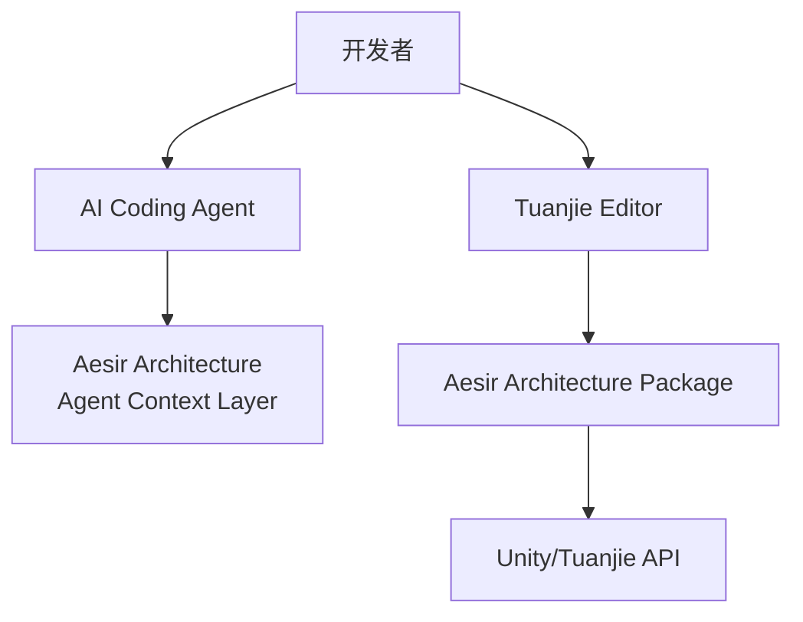
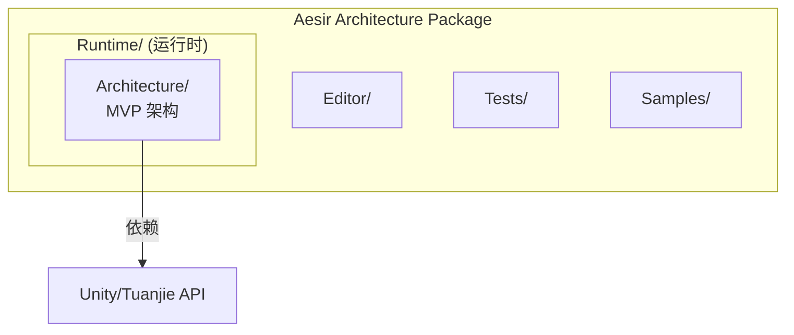
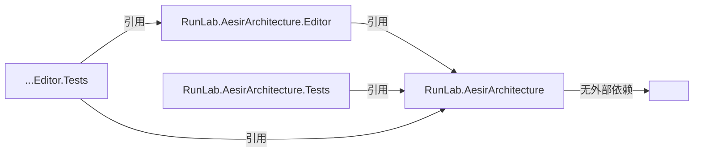
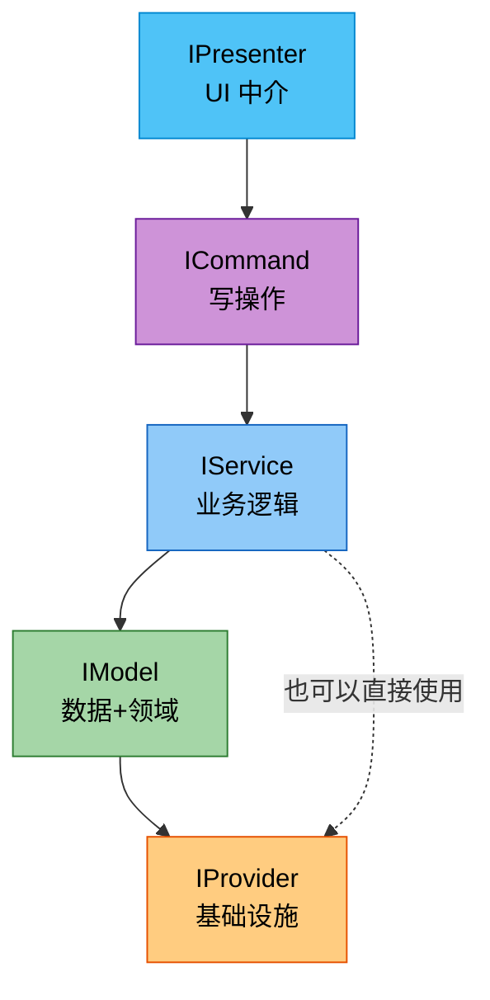
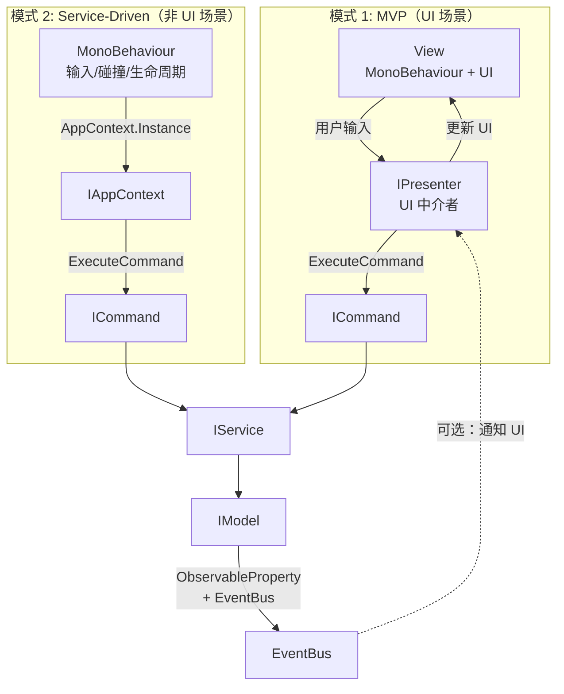

# Architecture

> Aesir Architecture 系统架构文档。基于 C4 模型，面向 AI Agent 设计。

## C1 — System Context



**外部系统**：

| 系统 | 关系 | 说明 |
|------|------|------|
| Tuanjie Editor | 运行平台 | Unity 2022.3 分支，场景文件 `.scene` |
| AI Coding Agents | 消费者 | 读取 AGENTS.md + Docs~/ 获取项目上下文 |

## C2 — Container



**程序集依赖图**：



## C3 — Component

### Runtime/ — MVP 架构

| 组件 | 文件 | 职责 |
|------|------|------|
| `IAppContext` | `IAppContext.cs` | 组合根接口：依赖注册、事件总线、命令执行 |
| `AppContext<T>` | `AppContext.cs` | 泛型单例组合根实现 |
| `IContainerAccess` | `IContainerAccess.cs` | 容器访问契约（Context 属性 + SetContext 方法） |
| `IInitializable` | `IContainerAccess.cs` | 生命周期契约（Init/Deinit） |
| `IPresenter` | `IPresenter.cs` | UI 中介者接口 |
| `PresenterExtensions` | `IPresenter.cs` | Presenter 便捷扩展方法 |
| `IModel` / `ModelBase` | `IModel.cs` | 数据+领域逻辑层 |
| `IService` / `ServiceBase` | `IService.cs` | 业务逻辑层 |
| `IProvider` | `IProvider.cs` | 基础设施抽象层 |
| `ICommand` / `CommandBase` | `ICommand.cs` | 无状态写操作 |
| `ServiceContainer` | `ServiceContainer.cs` | 最小 IoC 容器 |
| `EventBus` | `EventBus.cs` | 类型事件总线 |
| `ISubscription` | `ISubscription.cs` | 订阅句柄 + 集合 |
| `ObservableProperty<T>` | `ObservableProperty.cs` | 响应式属性 |
| `Event` / `Event<T>` | `Event.cs` | 事件类 + 事件集合 |
| `IEventCallback<T>` | `IEventCallback.cs` | 事件回调接口 |
| `SubscriptionExtensions` | `SubscriptionExtensions.cs` | Unity 生命周期自动注销 |

## MVP 依赖层级



## MVP 数据流

```mermaid
sequenceDiagram
    participant V as View (MonoBehaviour)
    participant P as IPresenter
    participant Cmd as Command
    participant Svc as Service
    participant Mdl as Model
    participant OP as ObservableProperty
    participant Bus as EventBus

    V->>P: 用户输入回调
    P->>Cmd: ExecuteCommand(new HurtCommand(10))
    Cmd->>Svc: GetService&lt;ICombatService&gt;().ApplyDamage(10)
    Svc->>Mdl: HP.Value -= 10
    Mdl->>OP: 值变更 → Trigger
    OP-->>P: AddListener 回调
    P->>V: 更新 UI 显示
```

## 双模式架构


