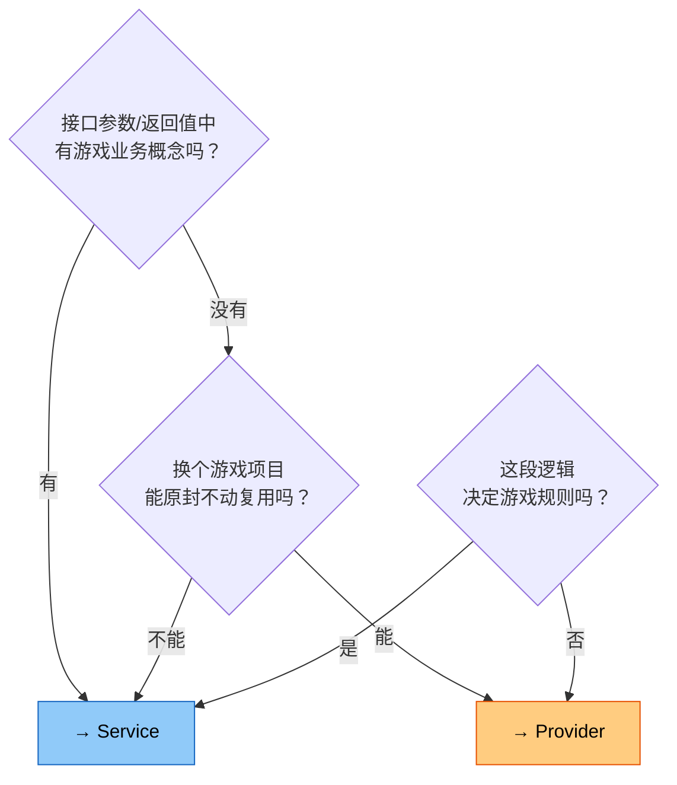

# Conventions

> Aesir Architecture 代码风格与命名规范。本文件为 AI Agent 提供完整的编码约定参考。

---

## 命名

| 标识符 | 规则 | 示例 |
|---|---|---|
| 类、接口、方法 | `PascalCase`，接口 `I` 前缀 | `AppContext`, `IModel` |
| 私有非序列化字段 | `m` 前缀 + `PascalCase` | `mContext`, `mInited` |
| 序列化字段 `[SerializeField]` | `camelCase`（无前缀） | `moveSpeed` |
| 常量 / 静态只读 | `PascalCase` | `MaxScore` |
| 事件结构体 | `PascalCase`，无 `On` 前缀 | `PlayerDeadEvent` |

## 枚举

- 普通：含 `None = 0`，显式赋值。
  ```csharp
  public enum GameState { None = 0, Menu = 1, Playing = 2, Paused = 3 }
  ```
- Flags：必须 `[Flags]`，值为 `1 << n`。

## Unity 禁忌

- **严禁**对 `UnityEngine.Object` 派生类使用 `?.` / `??`（绕过 Unity 生命周期检查）。
- **严禁**在 `Update` 中调用 `GetComponent`、`Find`、字符串拼接、LINQ。

## 事件命名

| 角色 | 命名 | 示例 |
|---|---|---|
| 事件结构体 | 无 `On` 前缀 | `PlayerDeadEvent` |
| 订阅方法 | `On` + 事件名 | `OnPlayerDead` |
| 多订阅方法 | `On` + 事件名 + 动作描述 | `OnPlayerDeadUpdateUI` |
| 触发方法 | `Invoke` | `Invoke(new PlayerDeadEvent())` |

**对齐 UnityEvent**：使用 `AddListener` / `RemoveListener` / `Invoke`，不用 `Subscribe` / `Publish`。

## 架构命名对照

| QFramework (旧) | Aesir Architecture (新) | 规则 |
|---|---|---|
| `Architecture<T>` | `AppContext<T>` | "Context" 表达应用执行上下文 |
| `IArchitecture` | `IAppContext` | 与类名一致 |
| `IController` | `IPresenter` | MVP 标准术语 |
| `ISystem` / `AbstractSystem` | `IService` / `ServiceBase` | `*Base` 后缀对齐 .NET BCL |
| `IUtility` | `IProvider` | .NET Provider 模式命名 |
| `SendCommand()` | `ExecuteCommand()` | Command 是被执行的 |
| `SendEvent()` | `Invoke()` | 对齐 UnityEvent.Invoke() |
| `RegisterEvent()` | `AddListener()` | 对齐 UnityEvent.AddListener() |
| `IUnRegister` | `ISubscription : IDisposable` | .NET 资源管理惯例 |
| `BindableProperty<T>` | `ObservableProperty<T>` | 对齐 IObservable 模式 |

## Service vs Provider 决策



| 问题 | Provider | Service |
|------|----------|---------|
| 接口里有业务概念？ | ❌ | ✅ |
| 换项目能复用？ | ✅ | ❌ |
| 决定游戏规则？ | ❌ | ✅ |

## 注释

- 公共类型**必须**具备 `/// <summary>`。
- 公共方法、属性：仅在用途不直观时添加。
- XML 仅保留 `<summary>`，移除 `<param>` / `<returns>`。

## 依赖层级规则

- **Provider**: 不实现 `IContainerAccess`，零框架依赖，无生命周期
- **Model**: 实现 `IContainerAccess`，可访问 Provider + Events，**不可**访问 Service
- **Service**: 实现 `IContainerAccess`，可访问 Model + Service + Provider + Events
- **Command**: 实现 `IContainerAccess`，可访问 Service + Model + Provider + Events
- **Presenter**: 实现 `IContainerAccess`（通过 `IPresenter`），可访问所有层

## 方法

- 对应公开方法的私有实现加 `Internal_` 前缀。

## ObservableProperty 使用

- 数据持续存在 → `ObservableProperty<T>`（HP、分数、位置）
- 瞬时事件 → `EventBus`（玩家死亡、关卡完成）
- 不确定 → 订阅者需要当前值吗？需要 → `ObservableProperty`
