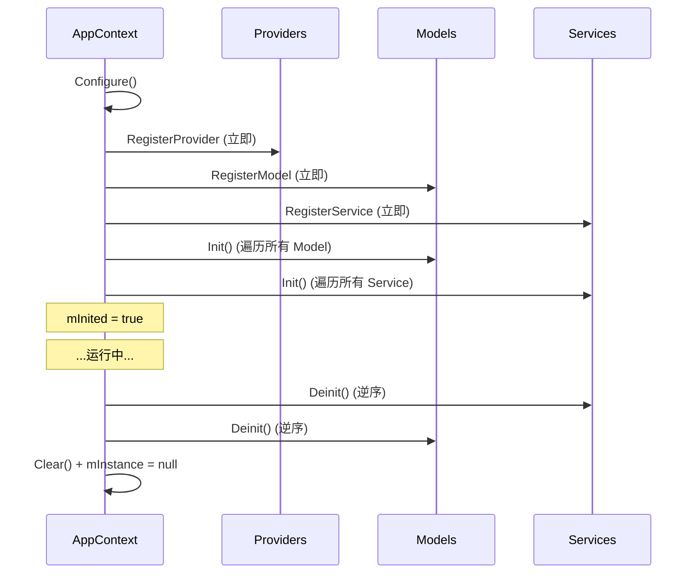

# Skill: 配置 AppContext 组合根

> 当需要为游戏或子系统创建入口点时，按此指南操作。

## 前置条件

- 确认需要的 Model、Service、Provider 类型
- 确认依赖注册顺序（Provider 无依赖，可先注册）

## 步骤

### 1. 定义 AppContext 派生类

```csharp
using RunLab.AesirArchitecture;

public class GameApp : AppContext<GameApp>
{
    protected override void Configure()
    {
        // 1. 注册 Provider（无依赖，最底层）
        RegisterProvider<IStorageProvider>(new PlayerPrefsStorageProvider());
        RegisterProvider<ICombatFormulaProvider>(new DefaultCombatFormulaProvider());
        RegisterProvider<IAudioProvider>(new UnityAudioProvider());

        // 2. 注册 Model（依赖 Provider）
        RegisterModel<IPlayerModel>(new PlayerModel());
        RegisterModel<IEnemyModel>(new EnemyModel());

        // 3. 注册 Service（依赖 Model + Provider）
        RegisterService<ICombatService>(new CombatService());
        RegisterService<ISaveGameService>(new SaveGameService());
    }
}
```

### 2. 初始化

```csharp
// 在游戏启动时调用（如 Loading 场景、RuntimeInitializeOnLoadMethod 等）
GameApp.Init();
```

### 3. 访问

```csharp
// 静态入口（推荐）
var model = GameApp.Instance.GetModel<IPlayerModel>();

// 通过接口（适合依赖注入场景）
IAppContext context = GameApp.Instance;
var service = context.GetService<ICombatService>();
```

### 4. 销毁

```csharp
// 场景切换或应用退出时
GameApp.Instance.Deinit();
```

Deinit 顺序：
1. 调用 `OnDeinit()`（自定义清理）
2. 按注册逆序 Deinit 所有 Service
3. 按注册逆序 Deinit 所有 Model
4. 清空 IoC 容器
5. 置空单例引用

### 5. OnRegisterPatch（可选）

在 `Init()` 之后注入额外依赖，常用于测试或模块化加载：

```csharp
GameApp.OnRegisterPatch = ctx =>
{
    ctx.RegisterProvider<ITestProvider>(new MockTestProvider());
};
GameApp.Init();
```

## 生命周期



## 约束

| 规则 | 说明 |
|------|------|
| Configure 中只注册 | 不在 Configure 中调用 Model/Service 方法 |
| 注册顺序 | Provider → Model → Service |
| 单例 | 每个 `AppContext<T>` 派生类只有一个实例 |
| Init 后注册 | mInited 后注册的 Model/Service 会立即 Init |

## 验证

1. `GameApp.Init()` 不抛异常
2. `GameApp.Instance` 非 null
3. 所有注册的类型可正常获取
4. `GameApp.Instance.Deinit()` 后所有获取返回 null
